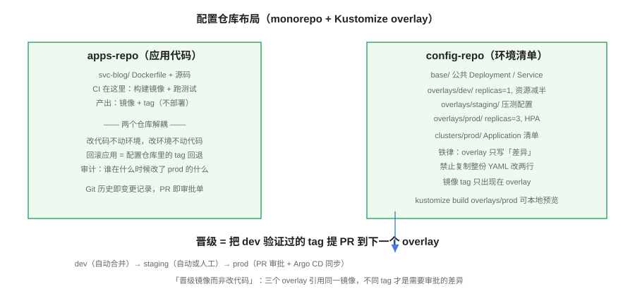

# 配置仓库设计与多环境管理



GitOps 落地失败的原因里，「工具没装好」很少，「**仓库结构烂尾**」最多。本页给出经过验证的仓库布局、多环境差异表达方式与晋级流程，以及 ApplicationSet 如何用一份模板管理任意数量的环境与集群。

## 两类仓库，先分清

| 仓库 | 内容 | 谁写 | 事实源含义 |
| --- | --- | --- | --- |
| 应用代码仓（apps-repo） | 源码、Dockerfile、单元测试 | 业务开发者 | 「这个版本的应用代码长什么样」 |
| 配置仓（config-repo） | Kustomize/Helm 清单、环境差异 | 平台组 + CI 机器人 | 「**每个环境应该跑什么**」 |

::: danger 为什么必须分仓
混在一个仓库里，改一行业务代码和改一行 prod 副本数在历史上无法区分，审计与回滚都变成考古。分仓后：应用仓的提交不触发部署（只触发构建），配置仓的提交**就是部署**——「合并到 main = 上线」的语义才成立。
:::

## 配置仓库布局

```text
config-repo/
├─ base/                        # 所有环境共享的清单
│  ├─ deployment.yaml
│  ├─ service.yaml
│  └─ kustomization.yaml
├─ overlays/
│  ├─ dev/
│  │  ├─ kustomization.yaml     # 引用 base + dev 差异
│  │  ├─ replica-patch.yaml     # replicas: 1
│  │  └─ image-patch.yaml       # tag: main-a1b2c3
│  ├─ staging/
│  │  └─ ...
│  └─ prod/
│     ├─ replica-patch.yaml     # replicas: 3 + HPA
│     └─ image-patch.yaml
└─ clusters/
   ├─ dev/                      # Argo CD Application / Flux Kustomization
   └─ prod/
```

三条铁律：

1. **overlay 只写差异**：环境间共享的部分进 `base`，overlay 里只允许出现 patch 与参数。复制整份 YAML 改两行的做法，三个月后必然漂移出没人能解释的差异。
2. **镜像 tag 只出现在 overlay**：`base` 里永远写占位 tag（如 `main`），具体 tag 由晋级流程写入对应 overlay。
3. **本地可渲染**：`kustomize build overlays/prod` 必须能出完整清单——渲染不了就无法在 PR 里 review，等于把审批空转。

## 多环境差异的三种表达

| 方式 | 适用 | 代价 |
| --- | --- | --- |
| Kustomize overlay | 环境间是「同一清单的小幅差异」 | 学习 patch 语法；推荐默认选择 |
| Helm values 分文件 | 交付物本身是 chart、参数差异大 | 模板复杂度上升；`values-{env}.yaml` 分层 |
| 每环境独立目录 | 环境差异大到不像同一个应用 | 复制粘贴漂移风险最高；尽量不选 |

## ApplicationSet：环境与集群的规模化

环境超过三个后，手写 Application 会重复到失控。ApplicationSet 用「生成器 + 模板」批量产出 Application：

```yaml [applicationset-envs.yaml]
apiVersion: argoproj.io/v1alpha1
kind: ApplicationSet
metadata:
  name: blog-envs
  namespace: argocd
spec:
  goTemplate: true
  generators:
    - list:
        elements:
          - env: dev
            autoSync: "true"
          - env: prod
            autoSync: "false"
  template:
    metadata:
      name: 'blog-{{.env}}'
    spec:
      project: blog
      source:
        repoURL: https://github.com/example/blog-config.git
        targetRevision: main
        path: 'overlays/{{.env}}'
      destination:
        server: https://kubernetes.default.svc
        namespace: 'blog-{{.env}}'
      syncPolicy:
        automated: {}   # automated 参数按 env 由 policy 决定，见下
```

生成器不止 `list`：`git` 生成器按目录生成（一个 overlay 目录 = 一个 Application）、`cluster` 生成器按注册集群生成（**多集群分发的落点**，与[多集群](../../MultiCluster/index.md)专题衔接）、`pull request` 生成器为每个 PR 生成临时预览环境（合并即销毁）。

::: danger 模板变量是生产事故高发区
模板变量拼错一个字母，dev 的 Application 就可能同步到 prod 路径。防护三件套：`goTemplate: true` 开启后用模板校验拒绝非法组合（模板里可以直接 `fail`）；ApplicationSet 的 `syncPolicy` 加 `preserveResourcesOnDeletion: true`（生成器误删时资源不陪葬）；**所有环境变更先在一个隔离的「沙箱集群」试跑**。
:::

## 晋级流程（Promotion）

晋级回答「dev 验证过的东西怎么到 prod」——答案是**把 tag 推进下一个 overlay，而不是重新构建**：

```shell
# dev 通过后，把 dev 的镜像 tag 晋级到 staging（由 CI 机器人提交 PR）
cd overlays/staging
kustomize edit set image ghcr.io/example/blog=ghcr.io/example/blog:main-a1b2c3
git checkout -b promote-staging-a1b2c3
git commit -am "chore: promote blog main-a1b2c3 to staging"
git push origin promote-staging-a1b2c3
# 开 PR → 审批 → 合并 → 控制器自动同步
```

- **dev → staging**：CI 自动开 PR，自动合并；
- **staging → prod**：自动开 PR，**人工审批**——PR diff 就是「这次上线改了什么」的最终答案；
- 回滚就是**反向晋级**：把 tag 改回上一个版本再合并（详见[渐进发布与回滚](../ProgressiveDelivery/index.md)）。

## 易错点与最佳实践

::: danger 五个结构级坑
1. **环境差异散落各处**：副本数一半在 patch、一半在 values、一半靠人改集群。先做一轮「差异盘点」，全部收进 overlay。
2. **配置仓允许 force push**：事实源的历史被改写等于篡改审计记录。分支保护 + 禁 force push 是底线。
3. **prod overlay 无人审批**：CI 机器人直推 main，GitOps 沦为「自动部署脚本」。prod 目录必须挂分支保护 + CODEOWNERS。
4. **临时环境忘了清理**：PR 预览环境（pull request 生成器）合并后自动删除，否则集群里全是「test-PR-1234」。
5. **一个 Application 塞下整个系统**：数据库迁移、缓存、应用、入口混在一个目录，Wave 编排无从谈起。按「一次发布要一起动的单元」拆 Application。
:::

::: tip 最佳实践
- 配置仓引入 CI 检查：`kustomize build` 全 overlay 渲染 + `kubeconform` 校验，渲染不过的 PR 不能合并；
- 用 `clusters/` 目录管理「控制器自身的配置」，实现 Argo CD/Flux 自举（自管）；
- 环境数量 = Application 数量的预期先写下来，超过 20 个还不引入 ApplicationSet/目录生成器，维护成本会指数上升。
:::

## 验证方式

```shell
# 渲染验证：每个 overlay 都能本地出完整清单
kustomize build overlays/dev  | head -20
kustomize build overlays/prod | head -20

# 差异验证：dev 与 prod 的 diff 必须只包含「刻意表达的差异」
diff <(kustomize build overlays/dev) <(kustomize build overlays/prod) | head -40

# 控制器视角：ApplicationSet 生成的 Application 与预期环境一一对应
argocd appset get blog-envs
argocd app list | grep blog-
# 期望：blog-dev 与 blog-prod 两个 Application，目标命名空间分别为 blog-dev / blog-prod
```

## 相关页面

- 差异里最敏感的部分——密钥：[密钥管理](../Secrets/index.md)
- 晋级的特殊形态——发布与回滚：[渐进发布与回滚](../ProgressiveDelivery/index.md)

## 参考资料

- ApplicationSet 文档：<https://argo-cd.readthedocs.io/en/stable/operator-manual/applicationset/>
- Kustomize 官方文档：<https://kubectl.docs.kubernetes.io/>
- Argo CD 最佳实践：<https://argo-cd.readthedocs.io/en/stable/user-guide/best_practices/>
