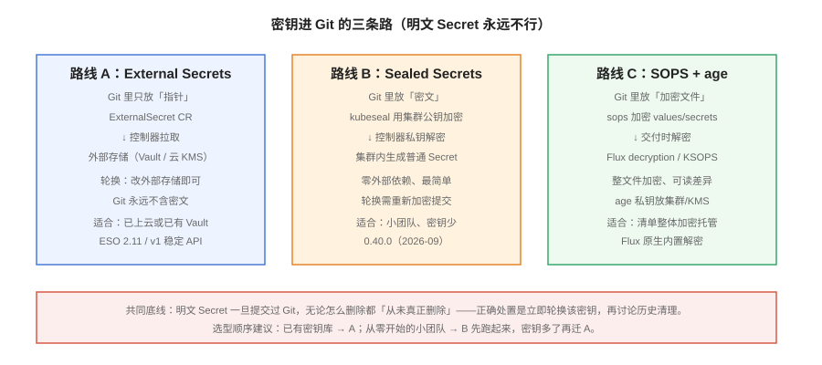

# 密钥管理



GitOps 的第一个原则碰撞：所有状态进 Git，但**明文 Secret 永远不能进 Git**。本页讲三条经过生产验证的路线——External Secrets Operator、Sealed Secrets、SOPS+age——的原理、取舍与选型判据，并给出选错之后的迁移路径。

## 先记住一条底线

::: danger base64 不是加密
Kubernetes Secret 的 `data` 字段只是 base64 编码，`echo <value> | base64 -d` 五秒还原。**任何形式的明文（含 base64）提交过 Git，无论之后怎么删除，都视为已泄露**——Git 历史、fork、缓存让它「从未真正删除」。正确处置顺序：**立即轮换该密钥 → 再讨论历史清理**（`git filter-repo` 只是辅助，轮换才是根治）。
:::

## 三条路线对比

| 维度 | A：External Secrets Operator | B：Sealed Secrets | C：SOPS + age |
| --- | --- | --- | --- |
| Git 里放什么 | **指针**（ExternalSecret CR） | **密文**（SealedSecret CR） | **加密文件**（整文件密文） |
| 解密发生在哪 | 控制器从外部存储拉取 | 集群内控制器用私钥解 | 交付时用 age 私钥解 |
| 轮换 | 改外部存储，自动同步 | 重新 `kubeseal` 并提交 | 重新 `sops` 加密并提交 |
| 外部依赖 | 需要一个密钥库（Vault/云 KMS） | 无（控制器自带密钥） | 无（私钥文件需安全保管） |
| 多集群 | 指针随仓库走，天然一致 | 每集群一套密钥，密文不通用 | 私钥按集群分发 |
| 当前版本 | **2.11.0**（2026-09-18，v1 稳定 API） | **0.40.0**（2026-09-10） | SOPS 3.x + age（以官方发布页为准） |

## 路线 A：External Secrets Operator（推荐主线）

ESO 把「密钥的值」彻底留在集群外：Git 里只有**指向外部密钥库的引用**，控制器按 `refreshInterval` 定期拉取并生成原生 Secret。

```yaml [external-secret.yaml]
apiVersion: external-secrets.io/v1
kind: ExternalSecret
metadata:
  name: blog-db
  namespace: blog-prod
spec:
  refreshInterval: 1h
  secretStoreRef:
    name: prod-secrets          # ClusterSecretStore / SecretStore
    kind: ClusterSecretStore
  target:
    name: blog-db               # 生成的原生 Secret 名
    creationPolicy: Owner
  data:
    - secretKey: password       # Secret 里的 key
      remoteRef:
        key: prod/blog/db       # 外部存储里的路径
        property: password
```

```shell
# 安装（Chart 2.11.0 对应 ESO 2.11.0）
helm repo add external-secrets https://charts.external-secrets.io
helm install external-secrets external-secrets/external-secrets \
  -n external-secrets --create-namespace

# 验证：Secret 已由控制器生成且带所有权标注
kubectl -n blog-prod get secret blog-db -o jsonpath='{.metadata.ownerReferences}'
kubectl -n blog-prod get externalsecret blog-db
# 期望：SecretSynced True
```

ESO 当前支持约 **41 个 Provider**（Vault、OpenBao、AWS Secrets Manager、Azure Key Vault、GCP Secret Manager、1Password 等），CNCF 项目，`external-secrets.io/v1` 已是稳定 API。

## 路线 B：Sealed Secrets（小团队最快起步）

`kubeseal` 用**集群侧控制器的公钥**把普通 Secret 加密成 SealedSecret，密文可安全提交；集群内控制器用私钥解密生成原生 Secret。

```shell
# 安装控制器（0.40.0 修复了 /v1/rotate 解密预言机问题，务必 ≥ 0.40.0）
kubectl apply -f https://github.com/bitnami/sealed-secrets/releases/download/v0.40.0/controller.yaml

# 加密：-o yaml 直接产出可提交的清单
kubectl create secret generic blog-db \
  --from-literal=password='s3cr3t' \
  --dry-run=client -o yaml | \
  kubeseal --controller-namespace kube-system -o yaml > sealed-blog-db.yaml
git add sealed-blog-db.yaml && git commit -m "chore: add blog-db sealed secret"
```

注意两点：**私钥备份**（控制器密钥丢失后所有密文作废，`kubectl get secret -n kube-system sealed-secrets-key -o yaml` 导出存到密钥库）；**scope 默认 strict**（改名/换命名空间即失效，跨环境复用需显式 `--scope namespace-wide` 并理解代价）。

## 路线 C：SOPS + age（整文件加密）

SOPS 加密**整个 YAML/ENV 文件**的值字段，Flux 原生内置解密（Kustomization 的 `decryption`），Argo CD 生态用 KSOPS 插件。

```shell
# 生成 age 密钥对
age-keygen -o key.txt          # 公钥以 age1 开头

# 加密并提交
sops --encrypt --age age1xxxx --in-place overlays/prod/secrets.enc.yaml
git add overlays/prod/secrets.enc.yaml
```

```yaml [kustomization-decrypt.yaml]   # Flux 侧声明解密
apiVersion: kustomize.toolkit.fluxcd.io/v1
kind: Kustomization
metadata:
  name: blog-prod
  namespace: flux-system
spec:
  path: ./overlays/prod
  decryption:
    provider: sops
    secretRef:
      name: sops-age             # 私钥以 Secret 形式注入集群
```

## 选型判据

```text
已经有 Vault / 云 KMS？            → 路线 A（ESO），Git 保持零密文
从零开始、密钥少于 20 个？         → 路线 B（Sealed Secrets）先跑起来
密钥多到轮换变日常工作？           → 迁到路线 A
想让整份环境配置（含密钥）托管？   → 路线 C（Flux 用户优先）
```

::: tip 从 B 迁到 A 的顺序
两条路线可以共存过渡：先用 ESO 接管**新密钥**，SealedSecret 原样保留；逐个把旧密钥写入外部存储、ExternalSecret 替换 SealedSecret、应用不重启验证 Secret 内容一致，最后删除密文。**不要一刀切换**——密钥迁移事故的成本远大于共存期的心智负担。
:::

## 与其他专题的分工

- Secret 的**静态治理**（扫描、轮换制度、泄露响应）见 [安全加固 · 密钥与凭据治理](../../../Ops/SecurityHardening/SecretGovernance/index.md)；本页只解决「密钥如何安全地参与 GitOps 交付」。
- 集群启用 etcd 加密与 Secret 的 RBAC 属于集群基线，见 [Kubernetes · ConfigMap 与 Secret](../../../Ops/Kubernetes/ConfigMapSecret/index.md)。

## 易错点与最佳实践

::: danger 五个高频坑
1. **`stringData` 与 `data` 混用**：`stringData` 是明文便捷写法，kubeseal/SOPS 处理后统一为 `data`；diff 工具对两种写法的比较结果不一致，review 时容易漏。
2. **Sealed Secrets 只备份不演练**：私钥丢了密文全废。把「用备份私钥在新集群解一份密文」写进年度演练。
3. **ESO 的 `refreshInterval` 设得过长**：轮换后的密钥要等 1h 才进集群。轮换窗口要求高的密钥单独设短间隔或用 Push Secret。
4. **把 kubeseal 的加密当端到端加密**：解密后的明文仍进 etcd 与 API，集群侧防护（etcd 加密、RBAC）不可省。
5. **环境间共享同一份密文**：strict 模式下密文绑定命名空间，硬拷贝到其他环境会静默失败；每个环境独立加密并独立 review。
:::

## 验证方式

```shell
# 路线 A：指针生效、值与外部存储一致
kubectl -n blog-prod get externalsecret blog-db
# 期望：SecretSynced True
kubectl -n blog-prod get secret blog-db -o jsonpath='{.data.password}' | base64 -d
# 期望：与外部密钥库中的值一致

# 路线 B：密文入库后集群侧解密成功
kubectl -n blog-prod get sealedsecret sealed-blog-db
kubectl -n blog-prod get secret blog-db

# 通用：Git 里全库扫一遍明文痕迹（0 输出为合格）
grep -rn "stringData" --include="*.yaml" . | grep -v "enc" || echo "clean"
```

## 相关页面

- 谁来消费这些 Secret：[Argo CD：安装与核心对象](../ArgoCD/index.md)、[Flux：另一条主线](../FluxCD/index.md)
- 仓库组织：[配置仓库设计与多环境](../RepoStructure/index.md)

## 参考资料

- External Secrets Operator：<https://external-secrets.io/>
- Sealed Secrets：<https://github.com/bitnami/sealed-secrets>
- SOPS：<https://github.com/getsops/sops>
- Flux SOPS 解密：<https://fluxcd.io/flux/guides/mozilla-sops/>
