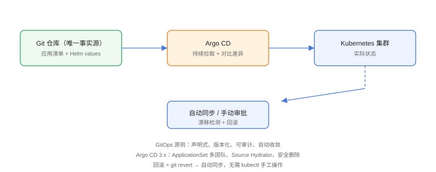

# GitOps：Argo CD 声明式交付

GitOps 是**以 Git 为唯一事实来源（Single Source of Truth）**的交付模式：所有环境状态都写成代码放进 Git 仓库，由控制器（如 Argo CD）持续把集群状态同步到 Git 声明的状态。本页基于 **Argo CD 3.5**（2026-08 GA）编写，覆盖核心概念、ApplicationSet、漂移检测与回滚。

## 核心概念与工作原理



| 概念 | 英文 | 说明 |
| --- | --- | --- |
| 声明式清单 | Declarative Manifest | 用 YAML 描述「集群应该长什么样」 |
| 事实来源 | Source of Truth | Git 仓库中的清单是唯一权威 |
| 同步 | Sync | 控制器把集群状态对齐到 Git 声明的状态 |
| 漂移检测 | Drift Detection | 对比「期望（Git）」与「实际（集群）」 |
| 自愈 | Self-Heal | 检测到漂移后自动把集群改回期望状态 |
| 回滚 | Rollback | 把集群恢复到历史同步版本 |

工作原理：Argo CD 通过 `Application` 声明「从哪个仓库、哪个路径、同步到哪个集群」→ 定期（默认 3 分钟）对比 Git 与集群差异 → 按 `syncPolicy` 自动或手动同步 → 把 `Sync Status` 与 `Health Status` 展示在 UI/CLI。

## 版本现状

::: info 版本说明
Argo CD 3.5（2026-08 GA）带来 **ApplicationSet 增强、Source Hydrator、安全删除（Secure Delete）** 等能力。1.x/2.x 的旧概念（Application、Project、Repository）保持兼容，升级主要关注 CLI 与插件迁移。
:::

## 安装 Argo CD

```shell
# 使用官方 Helm Chart
helm repo add argo https://argoproj.github.io/argo-helm
helm repo update
kubectl create ns argocd
helm install argocd argo/argo-cd \
  --namespace argocd \
  --set server.service.type=LoadBalancer \
  --set configs.params."server\.insecure"=true

# 获取初始密码
kubectl -n argocd get secret argocd-initial-admin-secret \
  -o jsonpath="{.data.password}" | base64 -d

# 安装 CLI 并登录
curl -sSL -o argocd-linux-amd64 https://github.com/argoproj/argo-cd/releases/latest/download/argocd-linux-amd64
sudo install -m 555 argocd-linux-amd64 /usr/local/bin/argocd
argocd login <SERVER-ADDRESS> --insecure
argocd account update-password
```

## 第一个 Application

```yaml [application.yaml]
apiVersion: argoproj.io/v1alpha1
kind: Application
metadata:
  name: web
  namespace: argocd
spec:
  project: default
  source:
    repoURL: https://github.com/example/app-manifests.git
    targetRevision: main
    path: environments/prod
  destination:
    server: https://kubernetes.default.svc
    namespace: web
  syncPolicy:
    automated:
      prune: true        # 删除 Git 中已移除的资源
      selfHeal: true     # 漂移后自动恢复
      allowEmpty: false
    syncOptions:
      - CreateNamespace=true
      - ServerSideApply=true
```

```shell
kubectl apply -f application.yaml
argocd app get web
```

## 漂移检测与自愈

### 演示漂移

```shell
# 手动篡改集群中的副本数（模拟有人直接 kubectl edit）
kubectl -n web scale deploy/web --replicas=9

# 观察 Argo CD 检测到 OutOfSync
argocd app get web
# STATUS: OutOfSync

# selfHeal 开启后，控制器会在 3 分钟内改回 Git 声明的副本数
kubectl -n web get deploy web -o jsonpath='{.spec.replicas}'
```

### 关闭自动同步时的操作

```yaml [application-manual.yaml]
syncPolicy: {}   # 不自动同步
```

```shell
argocd app sync web
argocd app sync web --prune
argocd app sync web --revision <commit-hash>   # 同步到指定提交
```

## ApplicationSet：多环境/多集群声明

```yaml [applicationset-envs.yaml]
apiVersion: argoproj.io/v1alpha1
kind: ApplicationSet
metadata:
  name: web-envs
spec:
  goTemplate: true
  generators:
    - list:
        elements:
          - env: dev
          - env: prod
  template:
    metadata:
      name: 'web-{{.env}}'
    spec:
      project: default
      source:
        repoURL: https://github.com/example/app-manifests.git
        targetRevision: main
        path: 'environments/{{.env}}'
      destination:
        server: https://kubernetes.default.svc
        namespace: 'web-{{.env}}'
      syncPolicy:
        automated: {prune: true, selfHeal: true}
        syncOptions: [CreateNamespace=true]
```

```shell
kubectl apply -f applicationset-envs.yaml
argocd app list | grep web-
```

新增环境只需在 `list` 里加一行，Argo CD 自动生成对应的 Application——这就是「用代码管理交付」。

## 回滚

```shell
# 查看历史
argocd app history web

# 回滚到第 3 个修订
argocd app rollback web 3

# 或直接同步到旧提交（更符合 GitOps 语义）
git revert HEAD --no-edit
git push origin main
argocd app sync web
```

::: tip 提示
GitOps 语义下**优先用 Git revert**：把仓库改回旧提交，让所有环境跟随 Git 回滚；`argocd app rollback` 适合临时快速止血，但会让集群状态与 Git 不一致，事后必须补一次同步。
:::

## 与 CI 的分工

| 阶段 | 工具 | 产物 |
| --- | --- | --- |
| CI：构建 | GitHub Actions / GitLab CI | 应用镜像、测试报告 |
| CI：更新清单 | 构建脚本 `kustomize set image` / `helm upgrade` 提交 | Git 新提交 |
| CD：同步 | Argo CD | 集群状态对齐 Git |

```yaml [.github/workflows/ci.yaml]
name: CI
on:
  push:
    branches: [main]
jobs:
  build-and-update:
    runs-on: ubuntu-latest
    steps:
      - uses: actions/checkout@v4
      - uses: docker/setup-buildx-action@v3
      - uses: docker/login-action@v3
        with:
          registry: ghcr.io
          username: ${{ github.actor }}
          password: ${{ secrets.GITHUB_TOKEN }}
      - run: |
          docker build -t ghcr.io/example/web:${{ github.sha }} .
          docker push ghcr.io/example/web:${{ github.sha }}
      - name: Update manifests
        run: |
          cd manifests
          kustomize edit set image ghcr.io/example/web:${{ github.sha }}
          git config user.name "CI"
          git config user.email "ci@example.com"
          git commit -am "chore: update web image to ${{ github.sha }}"
          git push
```

CI 只负责「构建 + 提交新清单」，**部署动作完全由 Argo CD 完成**——这是 GitOps 与「CI 直接 kubectl apply」的本质区别。

## 易错点与最佳实践

::: danger 常见问题
1. **`prune: false` 导致资源残留**：Git 里删掉的清单不会清理，测试环境越滚越乱。生产开启 `prune: true`，但先在小环境验证。
2. **Self-Heal 与手工运维冲突**：有人直接 `kubectl scale`，3 分钟后被改回——这不是 bug，是 GitOps 的约定。所有变更走 Git。
3. **Secret 进 Git**：明文 Secret 提交后从没真正“删除”，需轮换密钥。用 sealed-secrets、external-secrets 或 SOPS 加密。
4. **多环境路径写错**：ApplicationSet 模板变量拼错导致 dev 同步到了 prod 路径。加 `goTemplate` 校验与 dry-run。
5. **忘记给 Argo CD RBAC**：跨项目越权访问。用 Project 的 `sourceRepos`/`destinations` 限定边界。
:::

::: tip 最佳实践
- 仓库按 `environments/<env>` 分层，用 Kustomize overlay 或 Helm values 区分环境，避免复制粘贴。
- 开启 `selfHeal` 的团队必须约定「集群只读、变更只走 Git」，否则会出现拉锯战。
- 用 **ApplicationSet** 管理多环境/多集群，新增环境只改清单不加配置。
- 把 `argocd app sync` 与回滚记录进审计日志，配合 Slack/飞书通知。
- 定期用 `argocd app list` + `argocd app get` 巡检全部应用，避免失管 Application。
:::

## 实战：GitOps 交付 + 回滚闭环

```shell
# 1. 准备清单仓库（environments/prod/deployment.yaml）
#    git init && 提交 deployment.yaml 与 service.yaml

# 2. 创建 Application（见上文 application.yaml）
kubectl apply -f application.yaml

# 3. 等待首次同步
argocd app wait web --health

# 4. 修改清单副本数为 5，提交推送
#    Argo CD 自动同步，观察副本数变化
kubectl -n web get deploy web -o jsonpath='{.spec.replicas}'

# 5. 回滚：git revert + push，观察自动回到 2 副本

# 6. 演练漂移自愈：kubectl scale 到 9，3 分钟后回到 Git 声明值
kubectl -n web scale deploy/web --replicas=9
sleep 200
kubectl -n web get deploy web -o jsonpath='{.spec.replicas}'
```

## 验证方式

```shell
# 应用状态
argocd app list
argocd app get web
argocd app history web

# UI
argocd appset get web-envs

# 健康检查
kubectl -n argocd get applications,applicationsets
kubectl -n argocd get pods -l app.kubernetes.io/name=argocd-server
```

预期：`Sync Status: Synced`、`Health Status: Healthy`；手动漂移在自愈窗口内被纠正；UI 中可以清楚看到「期望 vs 实际」差异视图。

## 参考资料

- Argo CD 官方文档：<https://argo-cd.readthedocs.io/>
- ApplicationSet 文档：<https://argo-cd.readthedocs.io/en/stable/operator-manual/applicationset/>
- Argo CD 3.5 发布说明：<https://github.com/argoproj/argo-cd/releases>
- GitOps 原则（CNCF）：<https://opengitops.dev/>
