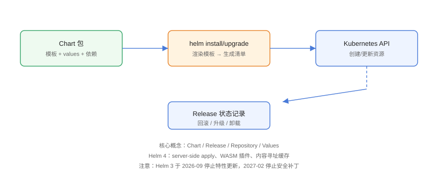

# Helm：Kubernetes 应用包管理

Helm 是 Kubernetes 的**应用包管理器**，把一组 YAML 清单打包成可复用、可配置、可版本回滚的 **Chart**，解决「部署一套复杂应用要粘贴十几个 YAML」的问题。本页基于当前主线 **Helm 4** 编写，并说明与 Helm 3 的差异。

## 核心概念与工作原理



| 概念 | 英文 | 说明 |
| --- | --- | --- |
| Chart | Chart | 应用包的目录结构，包含模板、默认值、依赖与元信息 |
| Release | Release | 一次「Chart 实例化」：同一个 Chart 可以安装出多个 Release |
| Repository | Repository | 存放 Chart 的 HTTP 仓库，类似 `npm registry` |
| Values | Values | 安装时注入的配置，覆盖 Chart 里的默认值 |
| Template | Template | 基于 Go template 的清单模板，用 Values 渲染出最终 YAML |

工作流程：`helm install` 读取 Chart → 结合 Values 渲染模板 → 把生成的清单交给 Kubernetes API 创建资源 → 在集群里保存 Release 状态（含历史版本），从而支持升级与回滚。

## 版本现状

::: info 版本说明
Helm 4 是当前主线（截至 2026 年）：默认采用 **server-side apply** 管理资源、支持 **WASM 插件**与**内容寻址缓存**。Helm 3 已于 2026-09 停止特性更新，计划 2027-02 停止安全补丁，新项目直接使用 Helm 4。
:::

Helm 4 主要变化：

1. 默认使用 server-side apply（SSA），资源字段冲突处理更友好。
2. 插件体系支持 WASM，`helm plugin` 生态扩展能力更强。
3. 缓存按内容寻址，重复拉取相同 Chart 不会产生冗余存储。
4. 保留 `helm create` / `helm template` / `helm install` / `helm upgrade` 等常用命令，迁移成本低。

## 安装 Helm

### macOS / Linux

```shell
curl -fsSL -o get_helm.sh https://raw.githubusercontent.com/helm/helm/main/scripts/get-helm-3
chmod 700 get_helm.sh
./get_helm.sh
```

### Windows（PowerShell）

```powershell
winget install Helm.Helm
# 或使用 Chocolatey
choco install kubernetes-helm
```

### 验证

```shell
helm version
# 输出类似：version.BuildInfo{Version:"v4.x.y", ...}
helm repo add stable https://charts.helm.sh/stable
helm repo update
```

## Chart 目录结构

```text
myapp/
├─ Chart.yaml          # Chart 元信息（名称、版本、依赖）
├─ values.yaml         # 默认配置
├─ values.schema.json  # values 的 JSON Schema 校验（可选）
├─ charts/             # 子 Chart 依赖
└─ templates/          # 模板文件
   ├─ deployment.yaml
   ├─ service.yaml
   ├─ _helpers.tpl     # 可复用的模板辅助函数
   └─ NOTES.txt        # 安装成功后的提示信息
```

```yaml [Chart.yaml]
apiVersion: v2
name: myapp
description: 一个示例应用
version: 0.1.0
appVersion: "1.16.0"
dependencies:
  - name: redis
    version: "19.x.x"
    repository: "https://charts.bitnami.com/bitnami"
```

## 常用命令清单

| 命令 | 作用 |
| --- | --- |
| `helm create myapp` | 生成 Chart 脚手架 |
| `helm template myapp ./myapp` | 本地渲染模板（不安装） |
| `helm install myapp ./myapp` | 安装 Release |
| `helm install myapp ./myapp -f prod-values.yaml` | 使用自定义 values 安装 |
| `helm upgrade myapp ./myapp --set image.tag=v2` | 升级并覆盖单个配置 |
| `helm list` | 查看已安装 Release |
| `helm history myapp` | 查看升级历史 |
| `helm rollback myapp 1` | 回滚到修订版本 1 |
| `helm uninstall myapp` | 卸载 Release |
| `helm search repo redis` | 搜索仓库中的 Chart |
| `helm pull bitnami/redis` | 下载 Chart 到本地 |
| `helm lint ./myapp` | 检查 Chart 语法与规范 |

## values 优先级与模板语法

### 优先级（从低到高）

1. `values.yaml` 默认值
2. `-f` 指定的 values 文件（多个文件后者覆盖前者）
3. `--set` 命令行参数（最高）

### 模板渲染示例

```yaml [templates/deployment.yaml]
apiVersion: apps/v1
kind: Deployment
metadata:
  name: {{ include "myapp.fullname" . }}
  labels:
    app: {{ include "myapp.name" . }}
spec:
  replicas: {{ .Values.replicaCount }}
  selector:
    matchLabels:
      app: {{ include "myapp.name" . }}
  template:
    metadata:
      labels:
        app: {{ include "myapp.name" . }}
    spec:
      containers:
        - name: {{ .Chart.Name }}
          image: "{{ .Values.image.repository }}:{{ .Values.image.tag }}"
          ports:
            - containerPort: {{ .Values.service.port }}
          resources:
            {{- toYaml .Values.resources | nindent 12 }}
```

```yaml [values.yaml]
replicaCount: 2
image:
  repository: nginx
  tag: "1.27"
service:
  type: ClusterIP
  port: 80
resources:
  limits:
    cpu: 500m
    memory: 512Mi
```

```shell
# 本地渲染预览
helm template myapp ./myapp --set image.tag=1.27.3

# 安装到 default 命名空间
kubectl create ns demo
helm install myapp ./myapp --namespace demo -f prod-values.yaml
```

## 升级与回滚

```shell
# 升级（--atomic：失败自动回滚）
helm upgrade myapp ./myapp --namespace demo --set image.tag=1.28 --atomic

# 查看历史
helm history myapp --namespace demo

# 回滚到修订版本 2
helm rollback myapp 2 --namespace demo

# 卸载
helm uninstall myapp --namespace demo
```

## 发布到 Chart 仓库

```shell
# 打包
helm package ./myapp --destination ./dist

# 用 ChartMuseum / Harbor / OCI Registry 托管
# 推送 OCI 格式（Helm 4 推荐）
helm push dist/myapp-0.1.0.tgz oci://registry.example.com/charts
```

```yaml [.github/workflows/release.yaml]
name: Release Chart
on:
  push:
    tags: ["chart-*"]
jobs:
  publish:
    runs-on: ubuntu-latest
    steps:
      - uses: actions/checkout@v4
      - uses: azure/setup-helm@v4
      - run: helm package ./myapp --destination ./dist
      - run: helm push dist/*.tgz oci://registry.example.com/charts
```

## 常见用法与技巧

### 用条件块控制资源

```yaml [templates/ingress.yaml]
{{- if .Values.ingress.enabled }}
apiVersion: networking.k8s.io/v1
kind: Ingress
metadata:
  name: {{ include "myapp.fullname" . }}
spec:
  rules:
    - host: {{ .Values.ingress.host }}
      http:
        paths:
          - path: /
            pathType: Prefix
            backend:
              service:
                name: {{ include "myapp.fullname" . }}
                port:
                  number: {{ .Values.service.port }}
{{- end }}
```

### 复用辅助函数

```yaml [templates/_helpers.tpl]
{{- define "myapp.name" -}}
{{- default .Chart.Name .Values.nameOverride | trunc 63 | trimSuffix "-" }}
{{- end }}

{{- define "myapp.fullname" -}}
{{- printf "%s-%s" .Release.Name (include "myapp.name" .) | trunc 63 | trimSuffix "-" }}
{{- end }}
```

### 多环境 values 管理

```text
values.yaml          # 公共默认值
values-dev.yaml      # 开发环境
values-prod.yaml     # 生产环境
```

```shell
helm upgrade myapp ./myapp -n demo -f values.yaml -f values-prod.yaml --atomic
```

## 易错点与最佳实践

::: danger 常见问题
1. **忘记 `--namespace`**：Release 与资源会被装进默认命名空间，不同环境互相覆盖。正确做法是每个环境显式指定命名空间。
2. **直接改集群内资源**：Helm 管理的资源被手动修改后，下次 `upgrade` 会用模板覆盖，排查半天才发现是「改错位置」。应在 values 中修改后重新升级。
3. **升级失败留下半成品**：`upgrade` 不加 `--atomic`，中途失败不会自动回滚。生产环境务必加 `--atomic --timeout 5m`。
4. **Secret 明文写进模板**：values 里写明文密码会随仓库泄露。用 `existingSecret` 引用外部 Secret 或配合外部密钥管理。
5. **未先 `helm template` 预览**：语法错误直接推到集群，浪费一次部署。先本地渲染并 `helm lint`。
:::

::: tip 最佳实践
- 模板里所有资源名统一走 `_helpers.tpl`，避免命名散乱。
- 用 `values.schema.json` 校验必填项，防止漏配。
- 把 Chart 版本与 `appVersion` 分开管理，`appVersion` 跟随应用镜像版本。
- 上线前执行 `helm lint` 与 `helm template`，CI 里再加一层 `helm unittest`（插件）。
- 使用 `kubectl get all -n demo -l app.kubernetes.io/name=myapp` 验证安装结果。
:::

## 实战：发布并回滚一个应用

```shell
# 1. 创建 Chart 与命名空间
helm create demo-app
kubectl create ns demo

# 2. 修改 values.yaml 的 image.tag 为 v1
helm install demo-app ./demo-app --namespace demo --set image.tag=v1

# 3. 验证
kubectl -n demo get pods,svc
helm list -n demo

# 4. 升级到 v2
helm upgrade demo-app ./demo-app --namespace demo --set image.tag=v2 --atomic

# 5. 发现问题，回滚到 v1
helm rollback demo-app 1 --namespace demo
kubectl -n demo rollout status deployment/demo-app
```

## 验证方式

```shell
# Release 状态正常
helm list -n demo
helm status demo-app -n demo

# 资源就绪
kubectl -n demo get deploy,rs,pods
kubectl -n demo rollout status deployment/demo-app

# 访问测试
kubectl -n demo port-forward svc/demo-app 8080:80
curl -I http://localhost:8080/
```

预期：`helm status` 显示 `STATUS: deployed`，Pod 全部 `Running/Ready`，`curl` 返回 HTTP 200。

## 参考资料

- Helm 官方文档：<https://helm.sh/docs/>
- Helm 4 升级指南：<https://helm.sh/docs/topics/kubernetes_apis/>
- Artifact Hub（Chart 搜索）：<https://artifacthub.io/>
