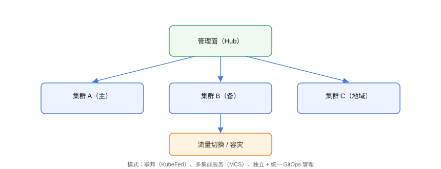

# 多集群：联邦、MCS 与容灾

多集群（Multi-Cluster）指用**多个 Kubernetes 集群**承载同一套业务，目标是：**高可用容灾**（一个集群挂了流量切走）、**区域就近访问**（降低延迟）、**环境隔离与合规**（生产/测试/不同云厂商分开）。本页介绍常见架构模型、Kubernetes 原生 API（MCS）与流量切换实践。

## 为什么需要多集群

| 诉求 | 单集群痛点 | 多集群方案 |
| --- | --- | --- |
| 容灾 | 集群故障=业务中断 | 多集群 + 流量切换 |
| 地域就近 | 跨区域延迟高 | 每区域一个集群 |
| 多环境隔离 | 生产测试互相影响 | 环境级集群 |
| 云厂商锁定 | 单一云不可控 | 多云/混合云部署 |
| 规模上限 | 单集群万级节点受限 | 分集群横向扩展 |

## 架构模型



### 1. Hub/Spoke（中心辐射）

一个 **Hub 集群**统一管理多个 **Spoke 集群**的策略下发与状态聚合，Spoke 各自运行工作负载。适合策略统一、环境众多的企业：

```text
Hub（控制面：Argo CD / KubeFed / 策略）
├─ Spoke：生产-华东
├─ Spoke：生产-华北
└─ Spoke：预发
```

### 2. Federation（联邦）

用 **KubeFed（Kubernetes Federation）** 把同一份 Deployment/Service 声明同步到多个成员集群，成员集群各自执行：

```yaml [federated-deployment.yaml]
apiVersion: types.kubefed.io/v1beta1
kind: FederatedDeployment
metadata:
  name: web
  namespace: default
spec:
  template:
    spec:
      replicas: 3
      selector:
        matchLabels: {app: web}
      template:
        metadata:
          labels: {app: web}
        spec:
          containers:
            - name: web
              image: nginx:1.27
  placement:
    clusters:
      - name: cluster-a
      - name: cluster-b
```

### 3. 多集群 Service（MCS）

Kubernetes 原生 **Multi-Cluster Service（MCS）API** 把服务暴露到其他集群，`ServiceExport` 声明导出、`ServiceImport` 声明导入，配合 `kube-proxy`/服务网格实现跨集群访问：

```yaml [service-export.yaml]
apiVersion: multicluster.x-k8s.io/v1alpha1
kind: ServiceExport
metadata:
  name: web
  namespace: default
```

```yaml [service-import.yaml]
apiVersion: multicluster.x-k8s.io/v1alpha1
kind: ServiceImport
metadata:
  name: web
  namespace: default
spec:
  type: ClusterSetIP
  ports:
    - port: 80
      protocol: TCP
```

## 多集群 GitOps：一套清单多集群交付

Argo CD 支持把同一个 ApplicationSet 下发到多个集群，是当前最主流的多集群交付方式：

```yaml [applicationset-multi.yaml]
apiVersion: argoproj.io/v1alpha1
kind: ApplicationSet
metadata:
  name: multi-cluster-app
spec:
  generators:
    - clusters: {}   # 自动枚举 Argo CD 已注册集群
  template:
    metadata:
      name: '{{name}}-web'
    spec:
      project: default
      source:
        repoURL: https://github.com/example/app-manifests.git
        targetRevision: HEAD
        path: overlays/{{name}}
      destination:
        server: '{{server}}'
        namespace: default
      syncPolicy:
        automated:
          prune: true
          selfHeal: true
```

```shell
argocd cluster add cluster-a
argocd cluster add cluster-b
kubectl apply -f applicationset-multi.yaml

# 查看两个集群中的应用状态
argocd app list
```

## 容灾与流量切换

### DNS/全局负载均衡切换

利用云厂商 GSLB（如阿里云全局流量管理、AWS Route 53）按健康检查自动切换：

```text
用户 → GSLB（健康检查）
        ├─ 主集群 Ingress（华东）
        └─ 备集群 Ingress（华南）→ 主集群故障时接管
```

### 服务网格多集群路由

Istio 多主模式中，两个集群共享控制面，`VirtualService` 可以按地域权重路由：

```yaml [virtualservice-multicluster.yaml]
apiVersion: networking.istio.io/v1
kind: VirtualService
metadata:
  name: web
spec:
  hosts:
    - web.global
  http:
    - route:
        - destination:
            host: web.global
            subset: primary
          weight: 100
        - destination:
            host: web.global
            subset: backup
          weight: 0
```

切换时把权重从 `100/0` 改为 `0/100`，实现**无感知容灾切换**。

## 数据一致性：多集群的最大挑战

::: warning 说明
多集群最难的不是「部署」，而是**数据**：数据库跨集群同步延迟、Session 共享、对象存储一致性。常见策略：
1. 无状态应用（Web/API）跨集群漂移，有状态数据留在主区域；
2. 数据库用主从/双活（如 MySQL Group Replication、云厂商全球数据库）；
3. 缓存与 Session 用跨区域同步或就近写入 + 异步复制；
4. 涉及强一致性的写入，优先「单写多读」避免脑裂。
:::

## 工具选型对比

| 工具 | 定位 | 适合场景 |
| --- | --- | --- |
| KubeFed | 声明同步（旧方案） | 简单资源联邦，生态趋冷 |
| Argo CD + ApplicationSet | GitOps 多集群 | 当前主流，推荐 |
| Istio 多集群 | 流量与安全网格 | 跨集群路由、mTLS |
| MCS API | 原生服务发现 | 与云厂商/网格配套 |
| Karmada / Clusternet | 开放多集群管理平台 | 需要策略调度、故障迁移 |
| Rancher Fleet | 多集群 GitOps | Rancher 生态 |

## 易错点与最佳实践

::: danger 常见问题
1. **多集群却共享一个 Service VIP**：集群间网络不互通时，Service 的 ClusterIP 各自独立，跨集群访问必须走 MCS/网格/Ingress，不能想当然直连。
2. **配置漂移**：两套集群手工各改一份配置，很快不一致。所有清单必须由 GitOps 单一来源下发。
3. **切换后数据未就绪**：容灾演练只切流量不切数据，用户访问到空库。先做数据同步演练，再做流量切换。
4. **证书与密钥没同步**：集群 A 更新了 Secret，集群 B 还是旧的，业务一半失败。密钥也要纳入统一管理。
5. **脑裂风险**：双活写同一份数据库且无仲裁机制，网络分区时两边同时写导致数据冲突。生产用「单写 + 异步读」或带仲裁的双活方案。
:::

::: tip 最佳实践
- 先把**无状态应用**多集群化，跑通流量切换后，再逐步引入有状态数据同步。
- 用 Argo CD ApplicationSet 的 `clusters` 生成器管理集群清单，新集群注册即自动下发。
- 每季度做一次**真实的容灾演练**：断掉主集群，验证备集群在 15 分钟内接管。
- 用 `kubectl --context` 明确操作目标集群，避免「改错集群」这种低级事故。
- 记录各集群的版本、区域、用途，纳入文档库与监控标签，防止集群“失管”。
:::

## 实战：两个集群 + Argo CD 多集群下发

```shell
# 1. 准备两个集群 context
kubectl config get-contexts
# 假设 cluster-a、cluster-b 已存在于 kubeconfig

# 2. 安装 Argo CD 到 Hub 集群
kubectl create ns argocd
kubectl apply -n argocd -f https://raw.githubusercontent.com/argoproj/argo-cd/stable/manifests/install.yaml

# 3. 注册成员集群
argocd cluster add cluster-a --name cluster-a
argocd cluster add cluster-b --name cluster-b

# 4. 应用 ApplicationSet（见上文）
kubectl apply -f applicationset-multi.yaml

# 5. 验证两个集群都收到应用
argocd app list
kubectl --context cluster-a get deploy -n default
kubectl --context cluster-b get deploy -n default
```

## 验证方式

```shell
# 集群健康
kubectl --context cluster-a get nodes
kubectl --context cluster-b get nodes

# Argo CD 同步状态
argocd app get web-cluster-a
argocd app get web-cluster-b

# 流量切换演练：修改 VirtualService 权重后观察
kubectl -n istio-system get pods

# 容灾演练：暂停主集群 Ingress，验证 GSLB 切换到备集群
curl -I https://app.example.com/
```

预期：两个集群中的应用版本一致（同一 Git 提交），主集群故障后访问仍返回 200，监控无业务错误率飙升。

## 参考资料

- Multi-Cluster Service API：<https://github.com/kubernetes-sigs/mcs-api>
- Argo CD ApplicationSet：<https://argo-cd.readthedocs.io/en/stable/operator-manual/applicationset/>
- Istio 多集群部署：<https://istio.io/latest/docs/setup/install/multicluster/>
- Karmada：<https://karmada.io/>
