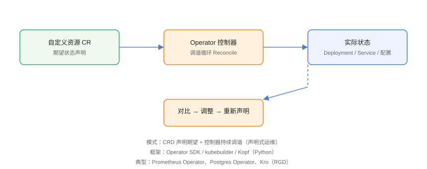

# Operator：把运维经验变成代码

Operator 是一种**用控制器（Controller）自动化运维应用**的模式：把「人工怎么部署、扩缩、备份、恢复」的经验翻译成代码，让 Kubernetes 持续地把**期望状态**调整到**实际状态**。典型代表是 Prometheus Operator、PostgreSQL Operator，以及新一代轻量框架 **Kro（Resource Graph Definition）**。

## 核心概念与工作原理



| 概念 | 英文 | 说明 |
| --- | --- | --- |
| 自定义资源定义 | CRD（CustomResourceDefinition） | 扩展 Kubernetes API，声明一种新的资源类型 |
| 自定义资源 | CR（CustomResource） | CRD 的具体实例，即用户声明的期望状态 |
| 控制器 | Controller | 监听 CR 变化，执行调谐循环（Reconcile） |
| 调谐 | Reconcile | 对比期望与实际状态，通过增删改资源收敛差异 |
| Operator | Operator | CRD + Controller + 配套 RBAC/Webhook 的完整解决方案 |

工作流程：用户提交 CR（如 `Postgres` 实例声明）→ API Server 持久化 → Controller 收到事件 → 调谐函数读取 CR 与当前集群状态 → 创建/更新 Deployment、Service、备份任务等子资源 → 把状态写回 CR 的 `status` 字段。

## 为什么需要 Operator

1. **应用本身有生命周期**：数据库扩副本、备份、故障切换不是简单「起个 Pod」，需要按顺序执行多个步骤。
2. **人工操作不可复制**：把专家的操作步骤固化成代码，新人也能交付同样质量。
3. **自愈与自治**：控制器持续对比状态，节点挂了自动重建、容量不够自动扩容。
4. **与 K8s 原生体验一致**：用户用 `kubectl get postgres` 就能管理数据库，不需要登录机器执行命令。

## 开发框架选型

| 框架 | 语言 | 特点 | 适用场景 |
| --- | --- | --- | --- |
| Operator SDK | Go | Red Hat 维护，基于 controller-runtime | 生产级 Go Operator |
| kubebuilder | Go | Kubernetes 官方社区脚手架 | 与 Operator SDK 同源，推荐新项目 |
| Kopf | Python | 轻量、开发快 | 原型与中小规模控制器 |
| Java Operator SDK | Java | 面向 Java 技术栈 | 已有 Java 团队的团队 |
| Kro | 声明式（RGD） | 不写 Go，用 YAML 组合子资源 | 快速编排多个 K8s 资源 |

## 最小可运行示例：Kro（RGD）

Kro 的 **ResourceGraphDefinition（RGD）** 允许你用 YAML 声明「一个 CR 由哪些子资源组成」，官方托管控制器会把 CR 实例渲染成完整资源图，适合大部分「组合部署」场景。

```yaml [rgd.yaml]
apiVersion: kro.run/v1alpha1
kind: ResourceGraphDefinition
metadata:
  name: myapp
spec:
  schema:
    apiVersion: v1alpha1
    kind: MyApp
    spec:
      name: string
      replicas: integer | default=2
      image: string
    status:
      availableReplicas: integer
  resources:
    - id: deployment
      template:
        apiVersion: apps/v1
        kind: Deployment
        metadata:
          name: ${schema.spec.name}-deploy
        spec:
          replicas: ${schema.spec.replicas}
          selector:
            matchLabels:
              app: ${schema.spec.name}
          template:
            metadata:
              labels:
                app: ${schema.spec.name}
            spec:
              containers:
                - name: app
                  image: ${schema.spec.image}
    - id: service
      template:
        apiVersion: v1
        kind: Service
        metadata:
          name: ${schema.spec.name}-svc
        spec:
          selector:
            app: ${schema.spec.name}
          ports:
            - port: 80
              targetPort: 8080
```

```shell
# 安装 Kro 控制器
helm repo add kro https://kro.run/helm
helm repo update
kubectl create ns kro
helm install kro kro/kro -n kro

# 应用 RGD
kubectl apply -f rgd.yaml

# 创建 CR 实例
cat <<'EOF' | kubectl apply -f -
apiVersion: v1alpha1
kind: MyApp
metadata:
  name: demo
spec:
  name: demo
  replicas: 3
  image: nginx:1.27
EOF

# 查看自动创建的 Deployment 与 Service
kubectl get deployment,service -l app=demo
```

## 用 kubebuilder 开发 Go Operator

### 初始化项目

```shell
go install sigs.k8s.io/controller-tools/cmd/controller-gen@latest
go install sigs.k8s.io/kubebuilder/v4@latest

mkdir -p my-operator && cd my-operator
kubebuilder init --domain example.com --repo example.com/my-operator
kubebuilder create api --group apps --version v1 --kind MyApp --resource --controller
```

### 核心调谐逻辑

```go [internal/controller/myapp_controller.go]
func (r *MyAppReconciler) Reconcile(ctx context.Context, req ctrl.Request) (ctrl.Result, error) {
    log := ctrl.LoggerFrom(ctx)

    var app appsv1alpha1.MyApp
    if err := r.Get(ctx, req.NamespacedName, &app); err != nil {
        return ctrl.Result{}, client.IgnoreNotFound(err)
    }

    // 1. 生成期望的 Deployment
    deploy := r.desiredDeployment(&app)

    // 2. 创建或更新
    if err := r.Patch(ctx, deploy, client.Apply, client.ForceOwnership,
        client.FieldOwner("my-operator")); err != nil {
        return ctrl.Result{}, err
    }

    // 3. 把实际状态写回 status
    app.Status.AvailableReplicas = deploy.Status.AvailableReplicas
    if err := r.Status().Update(ctx, &app); err != nil {
        return ctrl.Result{}, err
    }

    log.Info("reconciled", "app", app.Name)
    return ctrl.Result{}, nil
}
```

### 本地运行与测试

```shell
# 本地启动控制器（连接当前 kubeconfig 集群）
make run

# 单元测试
make test

# 打包镜像并部署
make docker-build docker-push IMG=registry.example.com/my-operator:v1
make deploy IMG=registry.example.com/my-operator:v1
```

## 易错点与最佳实践

::: danger 常见问题
1. **不处理删除事件**：CR 删除后子资源遗留。应注册 `Finalizer`，在删除时执行清理。
2. **调谐不幂等**：每次 Reconcile 必须能安全重入；先 `Get` 判断存在，再创建或更新，不能直接报错。
3. **死循环风暴**：更新子资源又触发自己监听的事件。用 `GenerateName`/`SetControllerReference` 或事件过滤，避免自触发。
4. **没有超时与限速**：一个控制器卡住会拖垮整个 watch。设置 `MaxConcurrentReconciles` 与 `RateLimiter`。
5. **权限过大**：给控制器 `cluster-admin`，一旦漏洞被利用即等于集群失守。RBAC 按最小权限声明。
:::

::: tip 最佳实践
- 先想清楚「哪些操作需要状态机」，从 CRD 的 `spec`/`status` 设计开始，而不是先写控制器。
- 把「组件版本升级」「备份恢复」也建模成 CR 字段，交给控制器执行。
- 大量使用 `conditions`（如 `Ready=True`）表达状态，配合 `kubectl wait --for=condition` 验证。
- 优先评估 Kro 等声明式方案；只有需要复杂状态机时再上 kubebuilder。
- 上线前用 `kubectl get crd` 确认 CRD 注册成功，用 `kubectl describe` 查看事件。
:::

## 实战：为 MySQL 添加自动备份能力

```yaml [mysql-backup-cron.yaml]
apiVersion: batch/v1
kind: CronJob
metadata:
  name: mysql-backup
spec:
  schedule: "0 2 * * *"
  jobTemplate:
    spec:
      template:
        spec:
          restartPolicy: OnFailure
          containers:
            - name: backup
              image: mysql:8.4
              command: ["/bin/sh", "-c"]
              args:
                - |
                  mysqldump -h mysql-svc -u root -p"$MYSQL_ROOT_PASSWORD" --all-databases \
                    | gzip > /backup/$(date +%F-%H%M).sql.gz
              envFrom:
                - secretRef:
                    name: mysql-secret
              volumeMounts:
                - name: backup
                  mountPath: /backup
          volumes:
            - name: backup
              persistentVolumeClaim:
                claimName: backup-pvc
```

更成熟的方案是安装 **CloudNativePG / Zalando Postgres Operator**，它自带定时备份、`cluster promote` 与灾难恢复，无需自己写 CronJob：

```shell
helm repo add cnpg https://cloudnative-pg.github.io/charts
helm install cnpg cnpg/cloudnative-pg -n cnpg --create-namespace

kubectl apply -f - <<'EOF'
apiVersion: postgresql.cnpg.io/v1
kind: Cluster
metadata:
  name: pg-cluster
spec:
  instances: 3
  storage:
    size: 20Gi
  backup:
    barmanObjectStore:
      destinationPath: s3://backups/pg
      s3Credentials:
        accessKeyId: {name: pg-secret, key: ACCESS_KEY}
        secretAccessKey: {name: pg-secret, key: SECRET_KEY}
EOF

# 验证
kubectl get cluster -n cnpg
kubectl get pods -n cnpg -l cnpg.io/cluster=pg-cluster
```

## 验证方式

```shell
# CRD 与控制器状态
kubectl get crd | grep -E "kro|postgresql"
kubectl get pods -n kro -l app.kubernetes.io/name=kro

# 调谐结果
kubectl get myapp demo -o yaml | grep -A3 status
kubectl wait --for=condition=Ready myapp/demo --timeout=120s

# 故障自愈演练：删除 Pod 观察自动重建
kubectl delete pod -l app=demo
kubectl get pods -l app=demo -w
```

预期：控制器日志输出 `reconciled`，`status.availableReplicas` 与 `spec.replicas` 一致，删除 Pod 后自动重建。

## 参考资料

- Operator 模式官方文档：<https://kubernetes.io/docs/concepts/extend-kubernetes/operator/>
- kubebuilder 文档：<https://book.kubebuilder.io/>
- Kro 官方仓库：<https://github.com/kro-run/kro>
- CloudNativePG 文档：<https://cloudnative-pg.io/documentation/>
