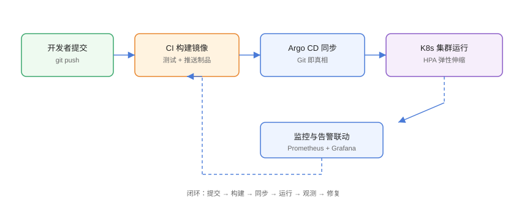

# 实战：GitOps + 弹性伸缩交付闭环

本页把本专题的核心能力串成一条**生产级交付闭环**：Helm 打包应用 → GitOps 声明式下发 → HPA/KEDA 弹性伸缩 → 监控告警联动 → 故障演练与回滚。照此流程，你可以在一个集群里完整复现「提交即交付、异常自愈、流量波动自动伸缩」的云原生工作流。

## 整体流程



```text
开发者 git push
  → CI 构建镜像并提交新清单
    → Argo CD 自动同步到集群
      → HPA/KEDA 按指标伸缩
        → Prometheus/Grafana 观测
          → 异常时告警并回滚
```

## 环境准备

::: info 所需组件与版本
- Kubernetes 1.30+（本机可用 kind/minikube 或云厂商托管集群）
- Helm 4、Argo CD 3.5、Metrics Server、KEDA 2.16+
- 可选：Prometheus + Grafana、Trivy
:::

```shell
# kind 快速起一个集群（已装 docker 时）
kind create cluster --name lab

# 确认组件
kubectl get nodes
helm version
argocd version --client
```

## 第一步：创建应用与 Chart

```shell
mkdir -p lab && cd lab
helm create web

# 修改 values.yaml：副本数、镜像、资源限制
```

```yaml [web/values.yaml]
replicaCount: 2
image:
  repository: nginx
  tag: "1.27"
service:
  type: ClusterIP
  port: 80
resources:
  requests:
    cpu: 200m
    memory: 256Mi
  limits:
    cpu: "1"
    memory: 1Gi
autoscaling:
  enabled: true
  minReplicas: 2
  maxReplicas: 10
  targetCPUUtilizationPercentage: 60
```

```yaml [web/templates/hpa.yaml]
{{- if .Values.autoscaling.enabled }}
apiVersion: autoscaling/v2
kind: HorizontalPodAutoscaler
metadata:
  name: {{ include "web.fullname" . }}
spec:
  scaleTargetRef:
    apiVersion: apps/v1
    kind: Deployment
    name: {{ include "web.fullname" . }}
  minReplicas: {{ .Values.autoscaling.minReplicas }}
  maxReplicas: {{ .Values.autoscaling.maxReplicas }}
  metrics:
    - type: Resource
      resource:
        name: cpu
        target:
          type: Utilization
          averageUtilization: {{ .Values.autoscaling.targetCPUUtilizationPercentage }}
  behavior:
    scaleDown:
      stabilizationWindowSeconds: 300
    scaleUp:
      stabilizationWindowSeconds: 0
{{- end }}
```

```shell
helm lint ./web
helm template web ./web | kubectl apply --dry-run=client -f - >/dev/null && echo OK
```

## 第二步：清单仓库 + Argo CD

```shell
# 1. 把渲染后的清单提交到 manifests 仓库
helm template web ./web --namespace web > manifests/deployment.yaml
git init manifests && cd manifests
git add . && git commit -m "init web manifests"

# 2. 安装 Argo CD
kubectl create ns argocd
kubectl apply -n argocd -f https://raw.githubusercontent.com/argoproj/argo-cd/stable/manifests/install.yaml
kubectl -n argocd wait --for=condition=available deploy/argocd-server --timeout=180s

# 3. 创建 Application
kubectl apply -f - <<'EOF'
apiVersion: argoproj.io/v1alpha1
kind: Application
metadata:
  name: web
  namespace: argocd
spec:
  project: default
  source:
    repoURL: <manifests仓库地址>
    targetRevision: main
    path: .
  destination:
    server: https://kubernetes.default.svc
    namespace: web
  syncPolicy:
    automated:
      prune: true
      selfHeal: true
    syncOptions:
      - CreateNamespace=true
      - ServerSideApply=true
EOF

# 4. 等待同步
argocd app wait web --health
kubectl -n web get pods,svc,hpa
```

## 第三步：联动 HPA 与监控

```shell
# 1. 确认 HPA 已由 Argo CD 同步
kubectl -n web get hpa

# 2. 部署 Prometheus 抓取指标（可选）
helm repo add prometheus-community https://prometheus-community.github.io/helm-charts
helm install prometheus prometheus-community/kube-prometheus-stack \
  -n monitoring --create-namespace

# 3. Grafana 查看 HPA 与 Pod 指标
kubectl -n monitoring port-forward svc/prometheus-grafana 3000:80
# 默认账号 admin / prom-operator
```

## 第四步：压测验证自动伸缩

```shell
# 制造 CPU 压力
kubectl run load --rm -it --image=busybox --restart=Never \
  -- sh -c 'while true; do wget -q -O- http://web > /dev/null; done'

# 观察 HPA 扩容
kubectl -n web get hpa -w
kubectl -n web get pods -l app.kubernetes.io/name=web -w

# 停止压测，等待缩容（约 5 分钟稳定窗口）
```

## 第五步：故障演练与回滚

### 演练 1：漂移自愈

```shell
kubectl -n web scale deploy/web --replicas=9
# 3 分钟后 Argo CD 自愈改回 Git 声明值
watch -n 30 kubectl -n web get deploy web -o jsonpath='{.spec.replicas}'
```

### 演练 2：Git 回滚

```shell
cd manifests
git revert HEAD --no-edit
git push origin main
# Argo CD 自动同步到上一个版本
kubectl -n web get deploy web -o jsonpath='{.spec.replicas}'
```

### 演练 3：镜像扫描门禁

```shell
trivy image --severity CRITICAL nginx:1.27 --exit-code 1
# CRITICAL 漏洞存在时退出码 1，CI 拦截发布
```

## 联动告警：把异常推给值班人

```yaml [alertrule.yaml]
apiVersion: monitoring.coreos.com/v1
kind: PrometheusRule
metadata:
  name: web-alerts
  namespace: web
spec:
  groups:
    - name: web.rules
      rules:
        - alert: WebDown
          expr: kube_deployment_status_replicas_available{deployment="web"} == 0
          for: 5m
          labels:
            severity: critical
          annotations:
            summary: "Web 服务不可用超过 5 分钟"
        - alert: WebHpaMaxReplicas
          expr: kube_horizontalpodautoscaler_spec_max_replicas{namespace="web"} == kube_horizontalpodautoscaler_status_current_replicas{namespace="web"}
          for: 15m
          labels:
            severity: warning
          annotations:
            summary: "HPA 已触顶，需评估扩容或优化"
```

```shell
kubectl apply -f alertrule.yaml
# Alertmanager 配置飞书/钉钉/邮件后即可收到告警
```

## 易错点与最佳实践

::: danger 常见问题
1. **Application 指向的仓库路径与实际不一致**：`path` 写错导致同步空目录或错误环境。用 `argocd app get web` 先看 source 再同步。
2. **CI 提交清单与 Argo CD 抢跑**：镜像还没推送完，Argo CD 已经拉新 tag 拉不到。先 push 镜像再提交清单，或加镜像签名校验。
3. **HPA 与节点容量不匹配**：副本扩到 10 但节点只有 4 个 Pod 的位置，其余一直 Pending。配套 Cluster Autoscaler/Karpenter。
4. **演练把生产当靶场**：故障演练前确认是测试集群，并准备好恢复脚本，避免“演练”变成真实事故。
5. **告警规则无 for 与 repeat**：瞬时抖动疯狂报警。加 `for: 5m`，避免告警疲劳。
:::

::: tip 最佳实践
- 交付顺序固定：**先镜像、后清单、再同步**，全部经过 CI 门禁。
- 把 HPA、NetworkPolicy、告警规则都写进 Chart 模板，随应用一起交付，保证「环境一致性」。
- 演练要有「演练计划 + 时间盒 + 恢复预案」，演练后写复盘记录进文档库。
- 用 `argocd appset` 的 dry-run 与 `helm template` 预览，上线前不直接 apply。
- 每次演练/故障处理完，把结论补进本专题 FAQ，形成组织知识沉淀。
:::

## 验证方式

```shell
# 交付链路
argocd app get web
kubectl -n web get deploy,svc,hpa

# 弹性
kubectl -n web get hpa -o jsonpath='{.status.currentReplicas}'
kubectl -n web top pods

# 安全与监控
trivy image --severity CRITICAL --exit-code 0 web:latest
kubectl -n monitoring get prometheusrule

# 恢复演练后状态
kubectl -n web get pods -l app.kubernetes.io/name=web
```

预期：提交新清单后 3 分钟内集群自动同步；压测时 HPA 自动扩容并回到 2 副本；故障演练后集群状态回到 Git 声明值；告警在服务不可用 5 分钟后触发。

## 参考资料

- Argo CD 快速开始：<https://argo-cd.readthedocs.io/en/stable/getting_started/>
- Kubernetes HPA：<https://kubernetes.io/docs/tasks/run-application/horizontal-pod-autoscale/>
- KEDA：<https://keda.sh/docs/>
- kube-prometheus-stack：<https://github.com/prometheus-community/helm-charts/tree/main/charts/kube-prometheus-stack>
