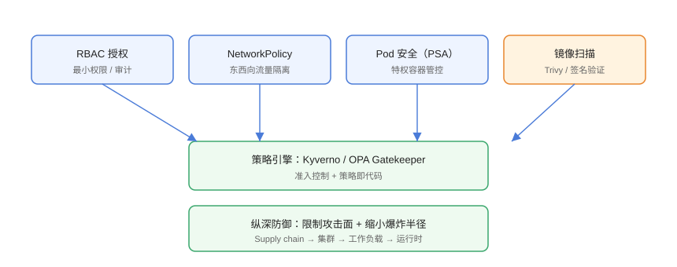

# 容器与集群安全加固

容器与 Kubernetes 安全遵循**纵深防御（Defense in Depth）**：从供应链（镜像）、集群（RBAC/网络）、工作负载（Pod 安全）到运行时逐层设防，把攻击面与爆炸半径压到最小。本页给出可落地的加固清单与策略即代码示例。

## 安全模型



| 层级 | 风险 | 防护手段 |
| --- | --- | --- |
| 供应链 | 恶意镜像、漏洞依赖、投毒 | 镜像扫描、签名、私有仓库、SBOM |
| 集群 API | 越权操作、凭证泄露 | RBAC 最小权限、审计日志 |
| 网络 | 东西向横向移动 | NetworkPolicy、mTLS |
| 工作负载 | 提权容器、危险挂载 | Pod Security Admission、限制 capabilities |
| 运行时 | 逃逸、异常行为 | Falco、运行时检测、只读根文件系统 |

## 1. 供应链安全：镜像扫描与签名

### Trivy 镜像扫描

```shell
# 本地扫描
trivy image --severity HIGH,CRITICAL nginx:1.27

# 输出 JSON 供 CI 门禁
trivy image --severity CRITICAL --exit-code 1 --format json nginx:1.27 > trivy.json
```

```yaml [.github/workflows/scan.yaml]
name: Image Scan
on:
  push:
    branches: [main]
jobs:
  scan:
    runs-on: ubuntu-latest
    steps:
      - uses: actions/checkout@v4
      - name: Build image
        run: docker build -t ghcr.io/example/web:${{ github.sha }} .
      - name: Run Trivy
        uses: aquasecurity/trivy-action@master
        with:
          image-ref: ghcr.io/example/web:${{ github.sha }}
          severity: CRITICAL,HIGH
          exit-code: "1"
          ignore-unfixed: true
```

### 镜像签名（cosign）

```shell
cosign sign ghcr.io/example/web:latest --key cosign.key
cosign verify ghcr.io/example/web:latest --key cosign.pub
```

## 2. RBAC：最小权限

```yaml [rbac.yaml]
apiVersion: rbac.authorization.k8s.io/v1
kind: Role
metadata:
  namespace: web
  name: web-deployer
rules:
  - apiGroups: ["apps"]
    resources: ["deployments"]
    verbs: ["get", "list", "watch", "create", "update"]
  - apiGroups: [""]
    resources: ["pods", "services"]
    verbs: ["get", "list", "watch"]
---
apiVersion: rbac.authorization.k8s.io/v1
kind: RoleBinding
metadata:
  namespace: web
  name: web-deployer
subjects:
  - kind: User
    name: alice
    apiGroup: rbac.authorization.k8s.io
roleRef:
  kind: Role
  name: web-deployer
  apiGroup: rbac.authorization.k8s.io
```

```shell
# 验证权限（以 alice 身份）
kubectl auth can-i create deployments -n web --as alice
# yes
kubectl auth can-i delete secrets -n web --as alice
# no
```

## 3. NetworkPolicy：东西向隔离

```yaml [networkpolicy.yaml]
apiVersion: networking.k8s.io/v1
kind: NetworkPolicy
metadata:
  name: web-allow-only-api
  namespace: web
spec:
  podSelector:
    matchLabels:
      app: web
  policyTypes: [Ingress, Egress]
  ingress:
    - from:
        - podSelector:
            matchLabels:
              app: api
      ports:
        - protocol: TCP
          port: 8080
  egress:
    - to:
        - namespaceSelector: {}
      ports:
        - protocol: TCP
          port: 53
        - protocol: UDP
          port: 53
```

```shell
kubectl apply -f networkpolicy.yaml

# 验证：从 api Pod 访问成功，从其他 Pod 访问被拒
kubectl exec -n web deploy/api -- curl -s http://web:8080/healthz
kubectl exec -n web deploy/other -- curl -s http://web:8080/healthz
```

::: warning 说明
NetworkPolicy 需要 CNI 支持（Calico、Cilium、Antrea 等）。Flannel 默认不支持，需确认集群网络插件。
:::

## 4. Pod 安全：PSA 与限制 capabilities

### Pod Security Admission（PSA）

Kubernetes 内置 **Pod Security Standards**：`privileged`（宽松）、`baseline`（基线）、`restricted`（严格）三档：

```shell
# 命名空间强制 restricted
kubectl label ns web pod-security.kubernetes.io/enforce=restricted
kubectl label ns web pod-security.kubernetes.io/warn=restricted

# 违反策略的 Pod 会被拒绝/告警
kubectl run bad --image=nginx --restart=Never -n web --privileged
# 输出：Error creating: admission webhook ... violates restricted
```

### 安全上下文

```yaml [deployment-secure.yaml]
apiVersion: apps/v1
kind: Deployment
metadata:
  name: web
  namespace: web
spec:
  template:
    spec:
      securityContext:
        runAsNonRoot: true
        seccompProfile:
          type: RuntimeDefault
      containers:
        - name: web
          image: nginx:1.27
          securityContext:
            allowPrivilegeEscalation: false
            readOnlyRootFilesystem: true
            capabilities:
              drop: ["ALL"]
              add: ["NET_BIND_SERVICE"]
```

## 5. 策略即代码：Kyverno

Kyverno 用 Kubernetes 原生资源写准入策略，比 OPA Gatekeeper 的 Rego 门槛低：

```yaml [kyverno-policy.yaml]
apiVersion: kyverno.io/v1
kind: ClusterPolicy
metadata:
  name: require-labels-and-limits
spec:
  validationFailureAction: Enforce
  background: true
  rules:
    - name: require-app-label
      match:
        any:
          - resources:
              kinds: ["Deployment", "StatefulSet"]
      validate:
        message: "所有工作负载必须包含 app 标签"
        pattern:
          metadata:
            labels:
              app: "?*"
    - name: require-resource-limits
      match:
        any:
          - resources:
              kinds: ["Pod"]
      validate:
        message: "容器必须声明 limits"
        pattern:
          spec:
            containers:
              - resources:
                  limits:
                    memory: "?*"
```

```shell
helm repo add kyverno https://kyverno.github.io/kyverno/
helm install kyverno kyverno/kyverno -n kyverno --create-namespace
kubectl apply -f kyverno-policy.yaml

# 违反策略的资源被拒绝
kubectl run no-label --image=nginx --restart=Never -n web
```

## 6. 运行时安全：Falco

```shell
helm repo add falcosecurity https://falcosecurity.github.io/charts
helm install falco falcosecurity/falco \
  --namespace falco --create-namespace \
  --set driver.kind=ebpf

# 触发异常行为（在容器内写 /etc）
kubectl exec -n web deploy/web -- sh -c 'echo test > /etc/test-file'
kubectl logs -n falco daemonset/falco --tail=20 | grep -i "notice"
```

## 安全基线检查清单

| 检查项 | 命令/工具 | 通过标准 |
| --- | --- | --- |
| 镜像漏洞 | trivy | 无 CRITICAL 漏洞 |
| 集群基线 | kube-bench | 高危项全部修复 |
| RBAC 最小权限 | `kubectl auth can-i` | 未授权返回 no |
| 网络隔离 | NetworkPolicy | 默认拒绝 + 显式放行 |
| Pod 安全 | PSA enforce=restricted | 无违规 Pod |
| Secret 加密 | etcd 加密 + 外置密钥 | 无明文 Secret |
| 审计日志 | API Server audit | 敏感操作有记录 |

## 易错点与最佳实践

::: danger 常见问题
1. **`--privileged` 容器裸奔**：等于把宿主机的 root 交给镜像。用 securityContext 精确限制 capabilities，而不是一刀切 privileged。
2. **NetworkPolicy 全放行**：写了 `podSelector: {}` + 空规则等于默认放行，毫无隔离效果。先「默认拒绝」再显式放行。
3. **只扫描不签名**：镜像扫描通过但被篡改，照样上线。CI 里 scan + sign + verify 一条链。
4. **给服务账号绑 cluster-admin**：SDK/脚本图省事全绑 admin，泄露即失守。按命名空间最小授权。
5. **忽略 etcd 加密**：Secret 默认明文存在 etcd，节点磁盘被偷即泄露。开启 `--encryption-provider-config`。
:::

::: tip 最佳实践
- 安全基线「从严格开始再放宽」：先 restricted，确需特权的组件单独豁免并记录。
- 用 Kyverno 把「必须有什么」固化成策略，新资源不满足直接拒绝，比事后巡检有效。
- 关键命名空间开 audit 日志，配合 SIEM 或 Loki 归档 180 天。
- 镜像基础镜像固定 tag + digest，避免 `latest` 漂移。
- 定期用 kube-bench 与 trivy 全库扫描，把报告纳入文档库巡检清单。
:::

## 实战：给业务命名空间套上完整防护

```shell
# 1. 标签与策略
kubectl label ns web pod-security.kubernetes.io/enforce=restricted
kubectl apply -f kyverno-policy.yaml

# 2. 网络默认拒绝
kubectl apply -f - <<'EOF'
apiVersion: networking.k8s.io/v1
kind: NetworkPolicy
metadata:
  name: default-deny
  namespace: web
spec:
  podSelector: {}
  policyTypes: [Ingress, Egress]
EOF

# 3. 部署加固后的应用
kubectl apply -f deployment-secure.yaml

# 4. 验证
kubectl get pods -n web
kubectl describe pod -n web | grep -E "SecurityContext|Capabilities"
kubectl exec -n web deploy/web -- id
# 预期 uid 非 0、无特权
```

## 验证方式

```shell
# 策略与隔离
kubectl get networkpolicy -n web
kubectl get clusterpolicy kyverno.io
kubectl auth can-i delete pods --all-namespaces --as alice

# 镜像与运行时
trivy image --severity CRITICAL nginx:1.27 --exit-code 0
kube-bench run --targets master,node

# 审计（确认敏感操作）
kubectl -n web get events --sort-by=.lastTimestamp | tail -20
```

预期：违规 Pod 无法创建，`auth can-i` 未授权返回 no，Trivy 报告无 CRITICAL，Falco 能捕获异常写入。

## 参考资料

- Kubernetes 安全文档：<https://kubernetes.io/docs/concepts/security/>
- Pod Security Standards：<https://kubernetes.io/docs/concepts/security/pod-security-standards/>
- Trivy：<https://aquasecurity.github.io/trivy/>
- Kyverno：<https://kyverno.io/docs/>
- Falco：<https://falco.org/docs/>
