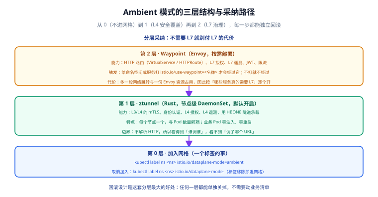

# Ambient 模式：无 Sidecar 的分层网格

一句话定位：Ambient 把网格能力拆成**两层代理**——节点级的 `ztunnel` 负责 L4 安全覆盖（mTLS、身份、L4 授权、L4 遥测），按需部署的 `waypoint` 才负责 L7（HTTP 路由、L7 授权、JWT、L7 遥测）。业务 Pod **零注入、零重启**，采纳节奏由你逐命名空间控制。



## 为什么要有它

Sidecar 模式的代价是「每个 Pod 一个代理」：资源随 Pod 数线性增长，升级要滚动重启业务 Pod，注入还会改变 Pod 的启动与关闭时序（需要 `holdApplicationUntilProxyStarts` 之类的配合）。Ambient 的思路是**把代理从业务 Pod 里搬出来**：

| 维度 | Sidecar 模式 | Ambient 模式 |
| --- | --- | --- |
| 代理位置 | 业务 Pod 内（旁路容器） | ztunnel 在节点上（DaemonSet） |
| 业务侵入 | 注入 + 重启 Pod | 打标签，不动工作负载 |
| 升级影响 | 滚动重启业务 Pod | 只重启 ztunnel / waypoint |
| L4 加密 | 有 | 有（默认开启，**不可关闭**） |
| L7 能力 | 有 | 需要 waypoint |
| 资源开销 | Pod 数 × 单代理开销 | 节点数 + 按需的 waypoint |
| 互通 | 两种模式的 Pod 在同一个网格里可以互相调用 | 同左 |

## 三层结构（每层都能单独回滚）

### 第 0 层：什么都不做

Pod 不在网格内。此时它既没有 mTLS，也没有遥测。

### 第 1 层：加入网格（只有 L4）

```shell
# 装控制面（ambient profile 会一并装 CNI 与 ztunnel）
istioctl install --set profile=ambient --skip-confirmation

# 加入网格：注意标签是 dataplane-mode，不是 istio-injection
kubectl label ns default istio.io/dataplane-mode=ambient

# 退出网格：移除标签即可，业务无感知
kubectl label ns default istio.io/dataplane-mode-
```

`ztunnel`（Zero Trust tunnel）用 Rust 编写，**每个节点一个**，只处理 L3/L4：

- 功能范围：mTLS、工作负载身份认证、L4 授权、L4 遥测。
- **它不终止 HTTP、不解析请求头**——所以它知道「谁调谁」，不知道「调了哪个 URL」。
- 承载方式：节点之间用 **HBONE**（HTTP-Based Overlay Network Encapsulation）隧道，端口 **15008**。

::: warning ztunnel-only 能做什么、不能做什么
能：服务间自动 mTLS、按身份做 L4 授权、连接级指标与遥测、"零信任的网络覆盖"。
不能：HTTP 路由、按路径/方法授权、JWT 校验、灰度权重、HTTP 级指标（如 `response_code` 分维度）。
**判据很简单**：你的策略里出现 `paths` / `methods` / `headers`，就必须有 waypoint。
:::

### 第 2 层：按需加 waypoint（L7）

waypoint 就是一个独立的 Envoy 部署，由 Istio 通过 Gateway API 管理（`GatewayClass: istio-waypoint`）：

```shell
# 只生成 YAML 看看它会创建什么（不部署）
istioctl waypoint generate --for service -n default
```

```yaml [waypoint.yaml]
apiVersion: gateway.networking.k8s.io/v1
kind: Gateway
metadata:
  labels:
    istio.io/waypoint-for: service
  name: waypoint
  namespace: default
spec:
  gatewayClassName: istio-waypoint
  listeners:
    - name: mesh
      port: 15008
      protocol: HBONE
```

```shell
# 部署（--enroll-namespace 会顺手给命名空间打 istio.io/use-waypoint 标签）
istioctl waypoint apply -n default --enroll-namespace

# 只给某个服务挂 waypoint（推荐：按需，而不是整个命名空间）
istioctl waypoint apply -n default --name reviews-svc-waypoint
kubectl label service reviews istio.io/use-waypoint=reviews-svc-waypoint
```

`--for` 决定 waypoint 处理哪类流量：

| `waypoint-for` 取值 | 处理什么 | 说明 |
| --- | --- | --- |
| `service` | K8s Service 流量 | 默认值，最常用 |
| `workload` | Pod IP / VM IP 直连的流量 | 需要显式 `--for workload` |
| `all` | 两者都处理 | 谨慎使用，跳转次数会变多 |
| `none` | 都不处理 | 测试用 |

::: danger waypoint 最容易踩的一点：`use-waypoint` 只是「意图」
如果指定的 waypoint **不存在、没有地址，或流量类型与 waypoint 处理的类型不匹配**（例如给 Pod 打了标签但 waypoint 是 `--for service`），ztunnel 会**直接绕过它**——不报错、不失败，只是策略不生效。

要强制经过，用一条只允许 waypoint 身份的授权策略兜住（waypoint 的 ServiceAccount 与其 `Gateway` 同名）：

```yaml
apiVersion: security.istio.io/v1
kind: AuthorizationPolicy
metadata:
  name: require-waypoint
  namespace: default
spec:
  selector:
    matchLabels:
      app: reviews
  action: ALLOW
  rules:
    - from:
        - source:
            principals:
              - cluster.local/ns/default/sa/reviews-svc-waypoint
```

这条策略用的是工作负载 `selector`（不是 `targetRef`），由 **ztunnel 在 L4 执行**，所以两种绕过场景下都生效。
:::

### 关联优先级

| 场景 | 谁生效 |
| --- | --- |
| 命名空间与服务都打了标签 | **服务级优先**（前提是服务 waypoint 能处理 `service` 或 `all`） |
| Pod 与命名空间都打了标签 | **Pod 级优先** |

跨命名空间使用 waypoint（1.23+）需要两件事：在 `Gateway` 上配置 `allowedRoutes` 允许来源命名空间，并给使用方资源同时打 `istio.io/use-waypoint`（名称）与 `istio.io/use-waypoint-namespace`（命名空间）。

## 1.31 新能力：waypoint 也能灰度

**加权 waypoint 金丝雀**让「改 waypoint 配置」变成可灰度的事：

```shell
# 部署新 waypoint，把 5% 流量导过去
istioctl waypoint apply -n default --name reviews-svc-waypoint-v2
kubectl label service reviews istio.io/use-waypoint-canary=reviews-svc-waypoint-v2
kubectl annotate service reviews istio.io/use-waypoint-canary-weight=5

# 观察无误后提升为正式（promote）
kubectl label service reviews istio.io/use-waypoint=reviews-svc-waypoint-v2 --overwrite
kubectl label service reviews istio.io/use-waypoint-canary-
kubectl annotate service reviews istio.io/use-waypoint-canary-weight-

# 回滚：只删 canary 标签
kubectl label service reviews istio.io/use-waypoint-canary-
```

| 配置项 | 类型 | 作用 |
| --- | --- | --- |
| `istio.io/use-waypoint-canary` | Label | 金丝雀 waypoint 的 `Gateway` 名称 |
| `istio.io/use-waypoint-canary-namespace` | Label | 金丝雀 waypoint 所在命名空间（不同命名空间时必填） |
| `istio.io/use-waypoint-canary-weight` | Annotation | 发给金丝雀的流量比例（0–100 整数，默认 0），主 waypoint 收剩余部分 |

**客户端无需任何改动**——这是它最有价值的地方：切换发生在 ztunnel 的路由决策里。

另有几处 1.31 的 Ambient 改进：**CPU 感知的 ztunnel 工作线程**（`ZTUNNEL_RESOURCE_CPU_LIMIT` / `ZTUNNEL_RESOURCE_CPU_REQUEST` 按真实配额决定线程数）、**多集群稳定性**（凭证轮换不再产生过期快照、修掉多处内存与 goroutine 泄漏、CNI 修掉并发 map 写 panic 与 Pod 删除死锁）。

## 从 Sidecar 迁到 Ambient：先做三项检查

```shell
# ① 备份现有配置（迁移必须能回退）
kubectl get virtualservice,destinationrule,authorizationpolicy,requestauthentication,\
peerauthentication,gateway,httproute,telemetry -A -o yaml > istio-config-backup.yaml
kubectl get namespaces -o yaml > namespace-backup.yaml

# ② 找出需要 waypoint 的 L7 策略
kubectl get authorizationpolicy -A --no-headers | while read ns name rest; do
  if kubectl get authorizationpolicy "$name" -n "$ns" -o yaml \
    | grep -qE "(methods:|paths:|headers:|action: CUSTOM|action: AUDIT)"; then
    echo "需要 waypoint: $ns/$name"
  fi
done

# ③ 找出与 Ambient 不兼容的 DISABLE 策略（必须移除或改写）
kubectl get peerauthentication -A -o yaml | grep -A2 "mtls:"
```

迁移完成后的清理：配置了 `STRICT` / `PERMISSIVE` 的 `PeerAuthentication` 会**变得冗余**（ztunnel 已经不依赖它们强制 mTLS），可以安全移除。

## 易错点与最佳实践

::: danger 六个坑
1. **把 waypoint 当成「必须装」**：只做 L4 加密与身份授权的场景，ztunnel 就够了。多一个 waypoint 就多一段跳转、多一份资源。
2. **整个命名空间挂 waypoint**：`--enroll-namespace` 很省事，但会让该命名空间**所有**服务都多一跳。合理做法是**按服务挂**，只给真正需要 L7 的挂。
3. **给了 waypoint 却不验证是否真经过**：`istio.io/use-waypoint` 不生效时是**静默绕过**。验收必须看 waypoint 的指标里有没有该服务的流量。
4. **Ambient 下还去配 `DISABLE`**：不生效。迁移前必须清理。
5. **用 `istio.io/use-waypoint` 做安全边界**：它是「意图」，不保证。安全边界要靠 `AuthorizationPolicy` 限定 waypoint 身份。
6. **忽略 CNI 的权限要求**：ztunnel 要接管节点上的流量，CNI 组件需要相应权限；装完先确认 CNI Pod 是 Running，否则 Pod 会卡在创建阶段。
:::

::: tip 最佳实践
- **按命名空间分批推进**，先把非核心业务切过去，积累一轮告警与看板再扩大。
- **先 L4 后 L7**：先只入网格（拿 mTLS 与 L4 遥测），观察一周，再给需要的服务加 waypoint。
- **waypoint 也要做容量与高可用评估**：它是独立的 Envoy 部署，需要副本数 ≥ 2 与资源下限。
- **用加权金丝雀升 waypoint**：改配置之前先灰度，别一次全量。
:::

## 实战：为一个服务分层上线

```shell
# 1. 命名空间入网格（此时已有 mTLS 与 L4 遥测，无 L7）
kubectl label ns blog istio.io/dataplane-mode=ambient

# 2. 验证 L4 已生效：ztunnel 有该命名空间的工作负载
kubectl -n istio-system exec ds/ztunnel -- curl -s localhost:15020/stats/prometheus | grep -c istio_tcp

# 3. 给需要 HTTP 路由的服务加 waypoint
istioctl waypoint apply -n blog --name web-waypoint
kubectl label service blog-web istio.io/use-waypoint=web-waypoint

# 4. 验证流量确实经过 waypoint（看 waypoint 自己的指标）
istioctl waypoint list
kubectl -n blog exec deploy/web-waypoint-istio -- \
  curl -s localhost:15020/stats/prometheus | grep -c istio_requests_total

# 5. 清理：不需要时先摘标签，再删 waypoint
kubectl label service blog-web istio.io/use-waypoint-
istioctl waypoint delete --all -n blog
```

预期：第 2 步计数大于 0（ztunnel 在工作）；第 4 步 waypoint 的 `istio_requests_total` 计数随流量增长（证明流量真的穿过了 waypoint，而不是被静默绕过）。

## 验证方式

```shell
# 命名空间是否在网格内
kubectl get ns -L istio.io/dataplane-mode

# ztunnel 与 CNI 是否就绪
kubectl -n istio-system get pods -l app=ztunnel
kubectl -n istio-system get pods -l k8s-app=istio-cni-node

# waypoint 清单与关联关系
istioctl waypoint list
kubectl get gateway -A -l istio.io/waypoint-for
kubectl get service -A -l istio.io/use-waypoint

# 关联状态（关注 istio.io/WaypointBound 条件）
kubectl get service blog-web -o jsonpath='{.status.conditions}'
```

## 参考资料

- Ambient 模式总览：<https://istio.io/latest/docs/ambient/overview/>
- 快速上手：<https://istio.io/latest/docs/ambient/getting-started/>
- Waypoint 使用指南：<https://istio.io/latest/docs/ambient/usage/waypoint/>
- HBONE 协议：<https://istio.io/latest/docs/ambient/architecture/hbone/>
- 从 Sidecar 迁移：<https://istio.io/latest/docs/ambient/migrate/before-you-begin/>
- 相关子页：[架构原理](../Architecture/index.md)、[安全：mTLS、身份与授权](../Security/index.md)
