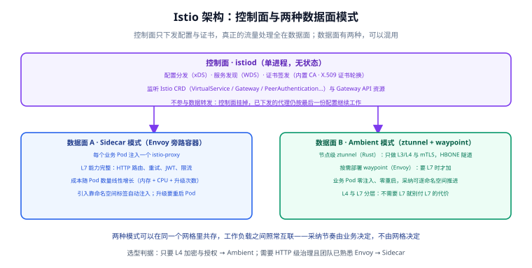

# 架构原理：控制面、数据面与两种模式

一句话定位：Istio 由**一个控制面**和**若干种数据面代理**组成——控制面只下发配置与证书，从不碰业务流量；业务流量全部由数据面代理转发。理解这条分界，后面所有排障都有方向。



## 控制面：istiod 做三件事

`istiod` 是一个无状态进程（Istio 1.5 起把 Pilot、Citadel、Galley 合并成一个二进制），它只做三件事：

| 职责 | 说明 | 对应协议 |
| --- | --- | --- |
| 配置分发 | 把 Istio CRD 与 Gateway API 资源翻译成代理能执行的配置 | xDS（CDS / EDS / LDS / RDS） |
| 服务发现 | 把 K8s Service、Endpoints、WorkloadEntry 的变化推给代理 | WDS（Workload Discovery Service） |
| 证书签发 | 内置 CA 为每个工作负载签发 X.509 证书并自动轮换 | SDS（Secret Discovery Service） |

```shell
# 看控制面自身状态
kubectl -n istio-system get deploy istiod
kubectl -n istio-system logs deploy/istiod --tail=50

# 看某个代理与控制面的同步状态
istioctl proxy-status
```

::: tip 为什么控制面可以随便重启
因为配置已经下发给代理，且代理本地有缓存。**控制面短暂不可用不会中断已建立的通信**，只影响新配置的下发与新证书的签发。所以升级控制面比升级数据面安全得多——这也是「先升控制面、再滚动升数据面」这一顺序的依据。
:::

## 数据面：两种模式的本质差别

| 维度 | Sidecar 模式 | Ambient 模式 |
| --- | --- | --- |
| 代理形态 | 每个业务 Pod 注入一个 Envoy | 节点级 ztunnel（Rust）+ 按需 waypoint（Envoy） |
| 业务侵入 | 需要注入、需要重启 Pod | 零注入、零重启，打标签即入网格 |
| L4 能力 | 有 | 有（ztunnel，默认开启） |
| L7 能力 | 有 | 需部署 waypoint 才有 |
| 资源成本 | 随 Pod 数线性增长 | ztunnel 与节点数相关；waypoint 按需 |
| 升级影响 | 要滚动重启业务 Pod | 升级 ztunnel / waypoint 不动业务 Pod |
| 成熟度 | 多年生产验证 | 1.29 起生产就绪，1.31 继续补多集群稳定性 |

两种模式**可以在同一个网格里共存**：同一个命名空间里既有注入 Sidecar 的 Pod，也有走 ztunnel 的 Pod，它们之间照常互相调用。这让「逐步迁移」成为现实选项——迁移前需要先做兼容性检查（见 [Ambient 模式](../AmbientMesh/index.md)）。

## Sidecar 是怎么被注入与劫持的

```shell
# 方式一：命名空间级自动注入
kubectl label namespace default istio-injection=enabled

# 方式二：按 revision 注入（做金丝雀升级时用）
kubectl label namespace default istio.io/rev=1-31-1

# 方式三：单个 Pod 手动加注解
# sidecar.istio.io/inject: "true"
```

注入之后，Pod 里多一个 `istio-proxy` 容器。流量劫持靠 **istio-cni + iptables 规则**完成（Sidecar 模式下的规则写在 Pod 网络命名空间里）：

| 端口 | 用途 |
| --- | --- |
| 15001 | 出站流量重定向到 Envoy |
| 15006 | 入站流量重定向到 Envoy |
| 15000 | Envoy 管理端口（`istioctl proxy-config` 即通过它读取） |
| 15020 | 合并后的 Prometheus 抓取端口 |
| 15021 | 健康检查端口 |
| 15090 | Envoy 自身的指标端口 |

```shell
# 看某个 Pod 实际被劫持成什么样
istioctl proxy-config listener deploy/productpage-v1
istioctl proxy-config cluster deploy/productpage-v1
```

::: warning 注入不等于入网格
`istio-injection=enabled` 只是「自动注入」，Pod 重启后才会带上代理。**已经运行的 Pod 不会自动获得 Sidecar**——必须重建（`kubectl rollout restart`）才会生效。这是「我打了标签但什么都没变」的最常见原因。
:::

## Ambient 模式的三层结构

Ambient 把功能拆成两层代理，形成一个「可分层采纳」的阶梯：

```shell
# 第 0 层：什么都不做，Pod 不在网格内
# 第 1 层：加入网格，只有 L4（mTLS + L4 授权 + L4 遥测）
kubectl label ns default istio.io/dataplane-mode=ambient

# 第 2 层：给需要 L7 的服务加 waypoint
istioctl waypoint apply -n default --name reviews-svc-waypoint
kubectl label service reviews istio.io/use-waypoint=reviews-svc-waypoint
```

- **ztunnel**（Zero Trust tunnel）：用 Rust 写的节点级 DaemonSet，只处理 L3/L4——mTLS、身份认证、L4 授权、L4 遥测。它**不终止 HTTP、不解析请求头**，所以看得到「谁调谁」，看不到「调了哪个 URL」。
- **HBONE**：ztunnel 之间用一个基于 HTTP CONNECT 的隧道协议承载流量，端口 **15008**。加密在隧道里完成，业务容器无感。
- **waypoint**：一个独立的 Envoy 部署（`GatewayClass: istio-waypoint`），提供 HTTP 路由、L7 授权、JWT、L7 遥测。**不打 `istio.io/use-waypoint` 标签就不会经过它**。

::: danger 三个必须记住的差异
1. **Ambient 下 `PeerAuthentication` 的 `DISABLE` 模式不生效**：因为网格内流量一律走 HBONE，mTLS 是强制的、关不掉。迁移前必须把带 `mode: DISABLE` 的策略清理掉，否则它是「写了但没用」。
2. **L7 类策略需要 waypoint**：`AuthorizationPolicy` 里用了 `methods` / `paths` / `headers`，或者 `action: CUSTOM` / `AUDIT`，在只有 ztunnel 时不会生效——它们需要 waypoint 解析 HTTP 才能判断。
3. **`istio.io/use-waypoint` 只是「意图」**：指定的 waypoint 不存在、没有地址，或者流量类型与 waypoint 处理的类型不匹配（`service` / `workload` / `all` / `none`）时，ztunnel 会**直接绕过**它而不是报错。要强制经过，得再用一条只允许 waypoint 身份的 `AuthorizationPolicy` 兜住。
:::

## 部署拓扑：单集群与多集群

| 模式 | 控制面 | 说明 |
| --- | --- | --- |
| 单集群 | 一套 istiod | 最常见，够用就先别折腾 |
| 多主（Multi-Primary） | 每个集群各一套 istiod | 各集群自主，互相同步端点，无单点 |
| 主从（Primary-Remote） | 只有主集群有 istiod | 从集群只有数据面，控制面共用（省成本，但主集群是依赖） |

```shell
# 把第二个集群加入网格（primary-remote）
istioctl x create-remote-secret --context=cluster2 --name=cluster2 \
  | kubectl apply --context=cluster1 -f -
```

跨集群流量需要**东西向网关**或共享网络，具体选择取决于集群之间是否二层可达；集群本身的联邦与容灾方案见 [多集群](../../MultiCluster/index.md)，本页只界定「网格在多集群里怎么摆」。

## 版本偏差（skew）规则

- **控制面可以比数据面新一个 minor，反之不行**。所以升级顺序永远是「先升控制面」。
- 数据面之间目前完全兼容（1.31 口径），但官方明确说这条**未来可能变化**，不要依赖。
- 做零风险升级用 **revision**：装一套新版本控制面（`istioctl install --set revision=1-31-1`），把命名空间标签指过去，逐个滚动——不满意就把标签改回来。

```shell
# 以 revision 方式安装第二套控制面并灰度切流
istioctl install --set revision=1-31-1 --set profile=default -y
kubectl label ns default istio.io/rev=1-31-1 --overwrite
kubectl rollout restart deploy -n default
```

## 易错点与最佳实践

::: danger 常见坑
1. **把「配置写对了」当成「生效了」**：`kubectl get` 看到的是你的**意图**，`istioctl proxy-config` 才是**代理里真实生效的东西**。两者不一致时先跑 `istioctl analyze`。
2. **Sidecar 抓取全集群配置导致内存暴涨**：默认 Sidecar 能看到整个网格的服务，规模上来后每个 Sidecar 的内存与推送量都会失控。用 `Sidecar` 资源收敛 `egress.hosts`（1.31 起支持 `~` 前缀做**排除**：`*/*` 加 `~ns1/*` 表示「除 ns1 之外全部」）。
3. **控制面规模上限被 gRPC 消息大小卡住**：1.31 起 ztunnel 重连时会回报每个工作负载的**名称与版本**，请求体积更大——约 4 万个工作负载就可能撞上 istiod 默认 4 MiB 的接收上限，表现为 ztunnel 反复重连并报 `ResourceExhausted`。按「每 1 万资源约 1 MiB」调大 `ISTIO_GPRC_MAXRECVMSGSIZE`。
4. **升级只升了控制面就以为升完了**：Sidecar 必须重启才会换代理版本（`kubectl rollout restart`），Ambient 则需要重启 ztunnel / waypoint。
5. **跨大版本直接覆盖升级**：跨两个及以上 minor 要逐级升，升之前先跑 `istioctl x precheck`。
:::

::: tip 最佳实践
- **新项目先评估 Ambient**：业务 Pod 零注入，采纳与回滚都是打标签的事；只有确实需要 L7 治理的服务才加 waypoint。
- **把 `Sidecar` 资源当默认配置下发**：收敛可见范围是控制面规模化的第一手段。
- **控制面与数据面升级分开排期**：先升控制面（无感），观察一天再滚动数据面。
- **网格配置进 Git**：VirtualService / DestinationRule / 策略全部走 GitOps，回滚就是 revert。
- **把 `istioctl analyze` 放进 CI**：坏配置在合并前就拦住，比上线后查 Kiali 便宜得多。
:::

## 验证方式

```shell
# ① 控制面与代理的同步状态：全部 SYNCED
istioctl proxy-status

# ② 配置静态检查：不应有 error
istioctl analyze

# ③ Sidecar 是否真的注入（列表里应有 istio-proxy 容器）
kubectl get pod -o jsonpath='{.spec.containers[*].name}' deploy/productpage-v1

# ④ Ambient：命名空间是否入网格、ztunnel 是否就绪
kubectl get ns -L istio.io/dataplane-mode
kubectl get pods -n istio-system -l app=ztunnel
istioctl waypoint list
```

预期：`proxy-status` 无 `NOT SENT` / `STALE`；`analyze` 输出 `No validation issues found` 或仅有已知 warning；`kubectl get ns -L istio.io/dataplane-mode` 的目标命名空间显示 `ambient`。

## 参考资料

- Istio 架构概念：<https://istio.io/latest/docs/ops/deployment/architecture/>
- Sidecar 注入：<https://istio.io/latest/docs/setup/additional-setup/sidecar-injection/>
- Ambient 数据面架构：<https://istio.io/latest/docs/ambient/architecture/data-plane/>
- HBONE 协议说明：<https://istio.io/latest/docs/ambient/architecture/hbone/>
- 多集群安装：<https://istio.io/latest/docs/setup/install/multicluster/>
