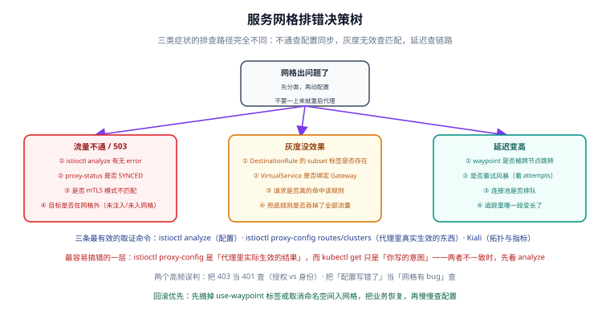

# 常见问题与排错

一句话定位：网格问题有一个共同的排查前提——**「你以为的配置」和「代理里真实生效的配置」是两件事**。先建立这条认知，绝大多数问题都能在三条命令内定位。



## 排错工具箱（先记这三条）

| 命令 | 回答什么问题 | 什么时候用 |
| --- | --- | --- |
| `istioctl analyze` | 我写的配置本身有没有问题 | 第一步，永远先跑 |
| `istioctl proxy-config <routes\|clusters\|listeners\|secret>` | 代理里**实际**是什么样 | 配置看着对但行为不对 |
| Kiali 拓扑 / Prometheus | 流量实际怎么走、结果如何 | 需要证据而不是猜测 |

```shell
# 常用四连
istioctl analyze -n <ns>
istioctl proxy-status
istioctl proxy-config routes deploy/<app> -n <ns> -o json
kubectl -n <ns> logs deploy/<app> -c istio-proxy --tail=100
```

::: tip 最容易被忽略的一条
`kubectl get virtualservice` 看到的是**你的意图**；`istioctl proxy-config routes` 才是**下发给代理的结果**。两者不一致时，原因通常是：命名空间没被选中、`hosts` 写错导致规则没绑上服务、或者控制面没把配置推下去（`proxy-status` 不是 `SYNCED`）。
:::

## 一、接不进来 / 没生效

### Q1：给命名空间打了注入标签，Pod 里却没有 `istio-proxy`

**原因**：注入只对**新建的 Pod** 生效，已经在跑的 Pod 不会被补上代理。

```shell
# 确认标签打对了
kubectl get ns <ns> -L istio-injection

# 重建工作负载
kubectl rollout restart deploy -n <ns>
```

另外两个检查点：Pod 上是否有 `sidecar.istio.io/inject: "false"` 注解（会覆盖命名空间标签）；`istiod` 是否在用**同名 rev**（用 `istio.io/rev` 标签时，值必须与实际安装的 revision 一致）。

### Q2：Ambient 下打了 `dataplane-mode` 标签，还是没有任何变化

**原因**：Ambient 的入网格标签是 `istio.io/dataplane-mode=ambient`，**不是** `istio-injection`。两者作用完全不同：前者让 ztunnel 接管，后者触发 Sidecar 注入。

```shell
kubectl get ns <ns> -L istio.io/dataplane-mode
kubectl get pods -n istio-system -l app=ztunnel      # ztunnel 必须 Running
kubectl get pods -n istio-system -l k8s-app=istio-cni-node
```

**CNI 没起来是最常见的根因**：CNI 负责在节点上准备流量重定向，它不 Ready 时 Pod 会卡在创建阶段。

### Q3：`istioctl analyze` 报「no matching workload found」类错误

**原因**：`selector.matchLabels` 或 `subsets[].labels` 与工作负载的标签对不上。

```shell
kubectl get pods -n <ns> --show-labels | head
```

策略与 DestinationRule 里的 `selector` 必须先能选中工作负载，否则它要么不生效、要么把整段规则变成死配置。

## 二、流量不通（503 / 504）

### Q4：突然全是 503，怎么定位

**第一步不是看状态码，是看 `response_flags`**——同样是 503，原因完全不同：

| Flag | 含义 | 排查方向 |
| --- | --- | --- |
| `UH` | 没有健康的上游 | 端点为空，或被熔断摘空（看 `maxEjectionPercent`、`minHealthPercent`） |
| `UO` | 连接池溢出 | `connectionPool` 上限太小，或下游真的扛不住 |
| `NR` | 没有匹配的路由 | 路由规则未命中且无兜底规则——**属于变更事故** |
| `UF` | 上游连接失败 | 目标端口不对、目标未入网格、mTLS 模式不匹配 |
| `UC` | 上游连接被终止 | 下游进程中途退出（看下游日志） |
| `UT` | 上游请求超时 | 下游慢，或超时设得太紧 |

```shell
# 直接看某次请求的 flags（Kiali 或日志里都有）
kubectl logs deploy/<app> -c istio-proxy --tail=50 | grep -o 'response_flags=[A-Z-]*' | sort | uniq -c
```

### Q5：集群内直接访问 Pod IP 正常，走 Service 就 503

**原因**：`DestinationRule` 里定义了 subset，但**没有任何 Pod 带对应标签**，导致 subset 的端点为 0。

```shell
istioctl proxy-config cluster deploy/<caller> -n <ns> | grep <target>
# 期望看到 subset 行有 HEALTHY 端点；如果显示 0，去核对 Pod 标签
kubectl get pods -n <ns> -l version=v2 --show-labels
```

### Q6：开了 STRICT mTLS 之后，一部分调用直接连不上

**原因**：这些调用方没在网格内（本地调试、集群外依赖、没注入代理的 Pod、被排除的端口）。

**处置**：立刻回退到 `PERMISSIVE`，然后按 [安全](../Security/index.md) 的顺序推进——先铺 PERMISSIVE，确认 mTLS 覆盖率接近 100%，再切 STRICT。

```shell
kubectl patch peerauthentication default -n <ns> --type=merge \
  -p '{"spec":{"mtls":{"mode":"PERMISSIVE"}}}'
```

::: danger 不要用「排除端口」绕过 mTLS
`portLevelMtls: {8080: {mode: DISABLE}}` 看起来能快速解决，但它等于在服务上开了个明文口子，且**Ambient 模式下不支持**。正确做法是把调用方纳入网格，而不是把端口从加密里摘出来。
:::

## 三、灰度与路由不生效

### Q7：改了权重，流量比例完全没变

按概率从高到低查：

1. **Pod 标签与 subset 不匹配**（配置合法、analyze 不报错，但 subset 是空的）→ `istioctl proxy-config cluster` 看端点。
2. **`hosts` 用了短名且跨命名空间** → 换成 FQDN。
3. **规则被前面的规则截胡** → 路由自上而下匹配，**第一条命中即生效**，兜底规则必须放最后。
4. **请求根本没走这条路径** → 确认 `gateways` 字段：不写表示只对网格内部生效，入口流量不会命中。
5. **客户端有长连接或连接复用** → gRPC / HTTP2 长连接下，权重只在**新建连接**时生效，已有连接不会重新分配。

::: tip 快速自证
用 `istioctl proxy-config route deploy/<caller> -o json` 直接看代理里那条路由的 `weightedClusters`，看权重是不是你写的那组。如果权重对但比例不对，问题在客户端连接行为，不在配置。
:::

### Q8：灰度时写接口被一起带到了新版本

**原因**：只按 `uri` 前缀匹配，没限定 `method`。POST / PUT / DELETE 也命中了规则。

```yaml
match:
  - uri:
      prefix: /api/v1/posts
    method:
      exact: GET
```

对有状态写接口，**灰度必须显式限定方法**，或者干脆先不灰写路径。

### Q9：故障注入配了但看不出效果

**原因**：**故障注入不能与同一条 VirtualService 上的重试、超时组合使用**——三者共存时后两者不按预期生效，注入的延迟可能被重试直接吃掉。

**处置**：把故障注入单独放在一条虚拟服务或一条独立规则里，演练完立刻删除。

## 四、性能与规模

### Q10：接了网格之后延迟明显变高

- **正常量级**：多一跳代理通常增加**亚毫秒到几毫秒**。超出一个数量级，一定是别的问题。
- **先看是不是重试风暴**：`upstream_rq_retry` 计数异常增长时，延迟会被重试拖长。
- **看是不是连接池排队**：`UO` 标志出现说明请求在排队而不是在被处理。
- **Ambient 下看 waypoint 是否跨节点**：waypoint 与目标不在同一节点会多一段网络跳转；必要时给 waypoint 加拓扑感知或就近部署。

```shell
kubectl exec deploy/<app> -c istio-proxy -- \
  pilot-agent request GET stats | grep -E "upstream_rq_retry|upstream_rq_timeout|upstream_cx_overflow"
```

### Q11：Sidecar 内存占用很高、控制面推送变慢

**原因**：默认每个 Sidecar 都能看到全网格的服务，规模上来后配置量与内存都会失控。

```yaml [sidecar-scope.yaml]
apiVersion: networking.istio.io/v1
kind: Sidecar
metadata:
  name: default
  namespace: blog
spec:
  egress:
    - hosts:
        - "./*"          # 本命名空间
        - "istio-system/*"
        # 1.31 起支持用 ~ 前缀做排除：*/* 加 ~ns1/* = 除 ns1 之外全部
```

**判据**：收敛后 `istioctl proxy-config cluster` 的条目数明显下降，Sidecar 内存随之回落。

### Q12：大集群里 ztunnel 反复重连，istiod 日志报 `ResourceExhausted`

**原因**：1.31 起 ztunnel 重连时会回报每个工作负载的**名称与版本**，WDS 请求体积增加约三分之一，约 4 万个工作负载就可能超过 istiod 默认 4 MiB 的 gRPC 接收上限。

```shell
# 按「每 1 万资源约 1 MiB」估算，例如给到 32 MiB
istioctl upgrade --set pilot.env.ISTIO_GPRC_MAXRECVMSGSIZE=33554432
```

## 五、升级与变更

### Q13：升级后某些路由消失了

**原因**：1.31 默认开启 `PILOT_ENABLE_STRICT_GATEWAY_MERGING`，Istio `Gateway` CRD 与托管的 Gateway API `Gateway` 代理**不再跨命名空间合并**。如果此前依赖了这个隐式合并，路由会少一批。

**处置**：把这些路由显式迁到 Gateway API 的 `HTTPRoute` 上并用 `parentRefs` 绑定，比关掉这个开关更可持续。

### Q14：升级后发现流量打到了已知不健康的实例

**原因**：**1.31 起默认发送不健康端点**，除非在 `Service` 上配置了 `OutlierDetection.minHealthPercent`。

**处置**：配置 `minHealthPercent`（推荐），或临时设 `PILOT_AUTO_SEND_UNHEALTHY_ENDPOINTS=false` 恢复旧行为。

### Q15：升级 1.31 后，之前注册的 `WorkloadEntry` 走了明文

**原因**：HBONE 隧道标签（`networking.istio.io/tunnel=http`）只在 `WorkloadEntry` **自动创建时**打上。升级前注册的工作负载会继续走明文。

**处置**：让它重新注册（实例重连），或手工给已有 `WorkloadEntry` 补上该标签。

## 快速自查表

| 症状 | 首先怀疑 | 第一条命令 |
| --- | --- | --- |
| 没注入代理 | 标签类型错 / Pod 没重建 | `kubectl get ns <ns> -L istio-injection` |
| 503 `NR` | 路由未命中、缺兜底 | `istioctl proxy-config routes` |
| 503 `UH` | subset 端点为空 / 被摘空 | `istioctl proxy-config cluster` |
| 503 `UF` | mTLS 不匹配 / 目标未入网格 | `kubectl get peerauthentication -A -o yaml` |
| 灰度无效 | 标签不匹配 / 规则被截胡 | `kubectl get pods --show-labels` |
| 延迟变高 | 重试风暴 / 连接池排队 | `pilot-agent request GET stats` |
| waypoint 不生效 | `use-waypoint` 只是意图、静默绕过 | `istioctl waypoint list` |
| 升级后行为变了 | 1.31 的四条破坏性变更 | 本文第五节的四项 |

## 验证方式

```shell
# 一次把「配置层」的问题全部扫掉
istioctl analyze --all-namespaces

# 一次把「同步层」的问题全部扫掉
istioctl proxy-status | grep -v "SYNCED" | grep -v "^NAME"

# 一次把「运行层」的异常标志汇总
kubectl logs -n blog -l app=blog-api -c istio-proxy --tail=500 \
  | grep -o 'response_flags=[A-Z-]*' | sort | uniq -c | sort -rn
```

三条命令都没有输出或只有预期结果，说明配置、同步、运行三层都健康——**这时再谈「网格有没有 bug」才有意义**。

## 参考资料

- 常见问题（网络）：<https://istio.io/latest/docs/ops/common-problems/network-issues/>
- 常见问题（安全）：<https://istio.io/latest/docs/ops/common-problems/security-issues/>
- 流量管理排查：<https://istio.io/latest/docs/ops/common-problems/validation/>
- 1.31 升级说明：<https://istio.io/latest/news/releases/1.31.x/announcing-1.31/upgrade-notes/>
- 相关子页：[流量管理](../TrafficManagement/index.md)、[韧性设计](../Resilience/index.md)、[安全](../Security/index.md)
