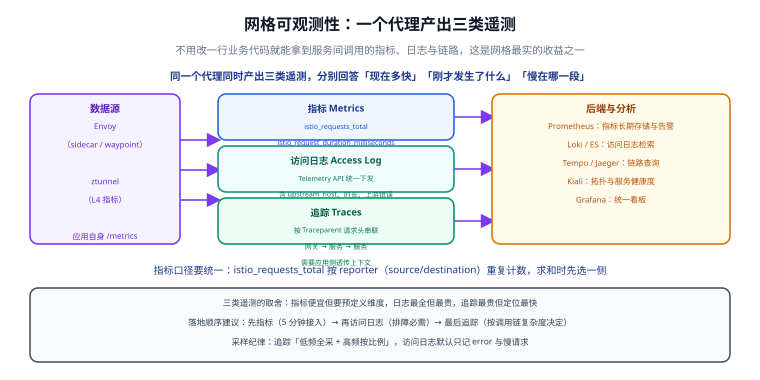

# 可观测性：指标、日志与追踪

一句话定位：**一个代理同时产出三类遥测**，分别回答三个不同的问题——指标回答「现在怎么样」，访问日志回答「刚才那次到底发生了什么」，追踪回答「慢在哪一段」。三者都来自代理，**业务代码零改动**（追踪需要应用透传上下文，这是唯一的例外）。



## 三类遥测对照

| 维度 | 指标（Metrics） | 访问日志（Access Log） | 追踪（Traces） |
| --- | --- | --- | --- |
| 回答什么问题 | 整体水位与趋势 | 单次请求的完整细节 | 一次调用跨了哪些服务、慢在哪 |
| 成本 | 低（预聚合） | 高（每次请求一条） | 最高（每个 span 都要存） |
| 维度固定？ | 是，维度在采集时就定了 | 否，字段都在 | 否 |
| 落地顺序 | 第一步（5 分钟接入） | 第二步（排障必需） | 第三步（按调用链复杂度决定） |
| 副作用 | 高基数会拖垮 Prometheus | 日志量可能远超业务日志 | 采样率设错会放大成本 |

::: tip 采样纪律
追踪用「**低频路径全采 + 高频路径按比例采**」；访问日志**默认只记 error 与慢请求**，需要排障时临时调比例——全量落盘是成本事故的常见起点。
:::

## 指标：先搞清口径，再看数字

网格产出的核心指标（Prometheus 格式）：

| 指标 | 类型 | 说明 |
| --- | --- | --- |
| `istio_requests_total` | Counter | 请求总数，含 `response_code`、`response_flags` 等维度 |
| `istio_request_duration_milliseconds` | Histogram | 请求时长，算 P95 / P99 用这个 |
| `istio_request_bytes` / `istio_response_bytes` | Histogram | 请求与响应体大小 |
| `istio_tcp_connections_opened_total` / `_closed_total` | Counter | TCP 连接数（非 HTTP 协议才有） |
| `istio_tcp_sent_bytes_total` / `_received_bytes_total` | Counter | TCP 吞吐 |

常用维度包括 `source_workload`、`source_workload_namespace`、`destination_service`、`destination_workload`、`request_protocol`、`response_code`、`response_flags`、`connection_security_policy`（是否 mTLS）等。

::: danger 三个会让结论出错的口径问题
1. **`reporter` 维度导致重复计数**：同一个请求会同时被**调用方代理**（`reporter="source"`）和**被调用方代理**（`reporter="destination"`）各记一次。直接 `sum(istio_requests_total)` 得到的是**两倍**。要么按一侧过滤，要么明确说明「按下游视角统计」。
2. **`response_code` 用 `4xx` / `5xx` 而不是 `404` 时才是聚合口径**，写死具体状态码的看板会在业务改状态码后静默失真。
3. **高基数维度不能进指标**：把 `request_id`、`user_id` 这类维度加进指标标签，Prometheus 的序列数会爆炸。这类信息属于日志与追踪，不属于指标。
:::

### `response_flags`：比状态码更具体的原因

`response_code` 只告诉你「失败了」，`response_flags` 告诉你**为什么失败**：

| Flag | 含义 | 通常对应什么 |
| --- | --- | --- |
| `UF` | 上游连接失败 | 目标 Pod 不可达 / 目标端口不对 |
| `UH` | 没有健康的上游 | 熔断把实例摘空了，或端点为空 |
| `NR` | 没有匹配的路由 | 路由规则未命中且没有兜底规则 |
| `UO` | 溢出 | 连接池上限被打满（排队溢出） |
| `UT` | 上游请求超时 | 超时设置生效，或下游真的慢 |
| `UR` | 上游重试次数用尽 | 重试全部失败 |
| `UC` | 上游连接被终止 | 下游进程中途退出 |
| `RL` | 被限流 | 限流策略命中 |
| `DI` / `SI` | 注入延迟 / 流空闲超时 | 混沌演练、或长连接无数据 |

排障时按 flag 分类，比按状态码分类有效得多——`503` 可能是 `UH`（摘空）、可能是 `UO`（溢出）、可能是 `NR`（无路由），三条排查路径完全不同。

## 访问日志：用 Telemetry API 统一下发

Istio 的访问日志默认走 sidecar 的 stdout，可以按需开启、限定范围。**统一用 Telemetry API 配置，不要再去改 sidecar 的启动参数或 EnvoyFilter**：

```yaml [telemetry-accesslog.yaml]
apiVersion: telemetry.istio.io/v1
kind: Telemetry
metadata:
  name: mesh-access-log
  namespace: default
spec:
  # 不写 selector 表示作用于该命名空间全部工作负载
  selector:
    matchLabels:
      app: blog-web
  accessLogging:
    - providers:
        - name: envoy
      # 只记失败的请求：正常请求不落日志
      filter:
        expression: response.code >= 400 || response.duration > 500ms
```

日志里最值得关注的三类字段：

- **`upstream_host`**：请求实际打到了哪个实例——验证负载均衡是否按预期工作。
- **`duration` / `upstream_service_time`**：总时长与上游处理时长，两者之差就是网格自身的开销（通常很小，如果很大说明代理侧有问题）。
- **`response_flags`**：与指标口径一致，见上表。

## 追踪：唯一需要应用配合的一环

代理会自动为请求生成 span，但**跨服务串联需要应用透传上下文**——多数语言的 HTTP 客户端库已内置 `traceparent`（W3C Trace Context）支持，没透传时表现为「追踪里每个服务都是孤立的一段」。

```yaml [telemetry-tracing.yaml]
apiVersion: telemetry.istio.io/v1
kind: Telemetry
metadata:
  name: mesh-tracing
spec:
  tracing:
    - providers:
        - name: zipkin   # 或 jaeger / otel，取决于安装的是哪个 provider
      randomSamplingPercentage: 1.0
```

| 参数 | 说明 |
| --- | --- |
| `randomSamplingPercentage` | 采样比例，别用 100——生产环境 100% 追踪会显著放大存储与代理开销 |
| `customTags` | 追加自定义标签，如业务租户 ID |
| `disableSpanReporting` | 临时关掉上报，用于对比 |

## 可视化：Kiali 与 Grafana

```shell
# Kiali（Istio 1.31 的 addon 版本为 v2.26.0）
kubectl apply -f samples/addons/kiali.yaml
istioctl dashboard kiali

# Grafana：官方自带若干网格看板
kubectl apply -f samples/addons/grafana.yaml
istioctl dashboard grafana

# Prometheus：直接查指标
kubectl -n istio-system port-forward svc/prometheus 9090:9090
curl -s "http://localhost:9090/api/v1/query?query=istio_requests_total" | head -c 400
```

**Kiali 最实用的三个视图**：

1. **拓扑图**：服务之间的真实调用关系与流量比例（验证灰度权重是否符合预期）。
2. **服务健康度**：错误率、延迟、mTLS 状态一屏看完，是判断「接入网格后有没有变差」的首选。
3. **配置校验**：把 `istioctl analyze` 的结果可视化，并标出受影响的工作负载。

## 1.31 带来的两处可观测性增强

| 新特性 | 解决什么问题 |
| --- | --- |
| Pod 注解 `prometheus.istio.io/scrape-targets` | 一个 Pod 有多个应用指标端点时（逗号分隔的 `port:path` 列表），pilot-agent 并发抓取并合并输出，不必再自己改抓取配置 |
| `ENVOY_SECURE_METRICS_PORT` / `ENVOY_SECURE_MERGED_METRICS_PORT` | 暴露受 mTLS 保护的抓取端点，解决「指标端口无鉴权、内网谁都能抓」的合规问题 |

另有 `PILOT_AGENT_MERGE_ENVOY_STATS=false` 可关闭「把 Envoy 指标合并进 agent 端点」的行为——如果你的抓取链路已经独立处理，关掉能省一分开销。

## 与 Prometheus 体系的衔接

| 环节 | 要做的事 |
| --- | --- |
| 抓取 | 抓 `15020/stats/prometheus`（合并端口）或 1.31 的安全端口；别去抓 15090 |
| 标签 | 在 Prometheus 侧用 relabel 补齐 `cluster` / `env` 等网格不产出的维度 |
| 告警 | 基于 `response_flags` 而不是仅基于 5xx 总数，见下 |
| 看板 | 金指标（流量 / 错误 / 延迟 / 饱和度）四张图先有，再谈细节 |

::: tip 三条值得直接抄走的告警规则
1. **`UH` 出现即告警**：出现了「没有健康的上游」说明熔断已经把实例摘空，业务正在整体失败。
2. **`NR` 出现即告警**：无路由命中意味着配置推出去了但规则不对，属于**变更事故**而不是容量问题。
3. **mTLS 覆盖率下降告警**：`connection_security_policy != "mutual_tls"` 的请求比例上升，说明有工作负载掉出了网格。
:::

## 实战：从 0 到一张能用的看板

```shell
# 1. 起三件套
kubectl apply -f samples/addons/prometheus.yaml
kubectl apply -f samples/addons/kiali.yaml
kubectl apply -f samples/addons/grafana.yaml

# 2. 确认指标在采（等了 1 分钟再查）
kubectl -n istio-system port-forward svc/prometheus 9090:9090
curl -s "http://localhost:9090/api/v1/query?query=count(istio_requests_total)" | head -c 200

# 3. 打开 Kiali 拓扑，确认服务间有连线与流量数字
istioctl dashboard kiali
```

```text
# 错误率（按被调用方视角，避免 reporter 重复计数）
sum(rate(istio_requests_total{reporter="destination", response_code=~"5.*"}[5m]))
  /
sum(rate(istio_requests_total{reporter="destination"}[5m]))

# P99 延迟
histogram_quantile(0.99,
  sum(rate(istio_request_duration_milliseconds_bucket{reporter="destination"}[5m])) by (le))
```

## 验证方式

```shell
# ① 代理是否在产出指标
kubectl exec deploy/productpage-v1 -c istio-proxy -- \
  curl -s localhost:15020/stats/prometheus | grep -c istio_requests_total

# ② 访问日志是否按配置输出
kubectl logs deploy/productpage-v1 -c istio-proxy --tail=5

# ③ 追踪链路是否串起来（Kiali 或 Jaeger 里应看到多段 span）
istioctl dashboard jaeger
```

预期：`grep -c` 返回大于 0（说明指标已产出）；访问日志只出现 error 与慢请求；追踪页面上能看到 `gateway → blog-web → blog-data` 这样的完整链路，而不是互相孤立的一段。

## 参考资料

- Istio 可观测性总览：<https://istio.io/latest/docs/tasks/observability/>
- 指标参考（维度与含义）：<https://istio.io/latest/docs/reference/config/metrics/>
- Telemetry API：<https://istio.io/latest/docs/tasks/observability/telemetry/>
- 分布式追踪：<https://istio.io/latest/docs/tasks/observability/distributed-tracing/>
- 与库内专题的衔接：[监控告警](../../../Monitoring/index.md)、[日志体系](../../../LogSystem/index.md)
