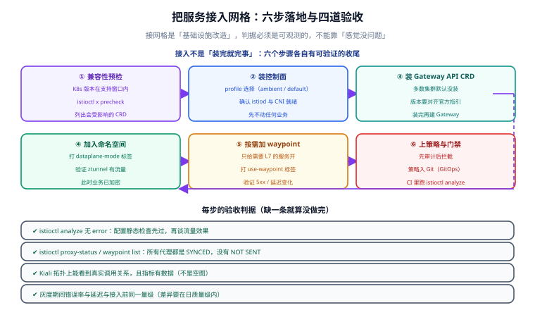

# 实战：为博客平台接入网格

一句话定位：本节把前面各页的能力串成一次**完整的接入演练**——以一个「前台 SSR + 后台 SPA + 后端服务 + MySQL/Redis」的真实拓扑为目标，从预检到灰度放量到回滚预案，给出可照抄的命令与**每步的验收判据**。



::: info 场景说明
目标拓扑取自本库周期 4 的项目《全栈博客平台》（[项目首页](../../../../../project/Complete/BlogPlatform/index.md)）：`blog-web`（Nuxt SSR 前台）、`blog-admin`（Vue3 后台）、`blog-api`（Spring Boot 后端）、`blog-search`（检索适配层）。**该项目当前用 Docker Compose 交付，尚未引入网格**——本节就是「要把它推上生产时，网格这一层该怎么加」的演练脚本，所有命令与判据可直接套用到同类拓扑。
:::

## 目标与判据

| 目标 | 验收判据 |
| --- | --- |
| 服务间通信全部加密 | `connection_security_policy="mutual_tls"` 的请求占比接近 100% |
| 后台管理接口只对可信来源开放 | 未经授权的 Pod 调用 `/api/v1/admin/*` 返回 403 |
| 灰度不发版也能放量 | 改权重后 30 秒内生效，无需重启任何 Pod |
| 慢下游不拖垮上游 | 注入 7 秒延迟后，上游 P95 不随之线性抬升（超时 + 熔断生效） |
| 出问题 5 分钟内回退 | 摘标签 / 权重回退两条路径在 5 分钟内恢复业务 |

## 第 1 步：兼容性预检（不动任何业务）

```shell
# 集群版本是否在 Istio 1.31 的支持窗口内（1.32 ~ 1.36）
kubectl version --short | grep Server

# 跨版本升级才需要 precheck；首次接入主要看 CRD 冲突
istioctl x precheck

# 盘点已有入口：Ingress 与 Gateway 并存会让规则来源分裂
kubectl get ingress,gateway -A
```

::: danger 这一步最容易被跳过，代价最大
预检要回答三个问题：**集群版本在不在支持窗口**、**要不要走 revision 并存**、**现有入口由谁负责**。跳过预检直接装，最常见的结果是「本地测试集群没问题，生产集群的网络插件与 CNI 打架」。
:::

## 第 2 步：装控制面（先不碰业务）

```shell
curl -L https://istio.io/downloadIstio | ISTIO_VERSION=1.31.1 sh -
cd istio-1.31.1 && export PATH=$PWD/bin:$PATH

# 演练环境用 demo profile 图省事；生产用 minimal / default + 自定义 values
istioctl install --set profile=demo -y

# 验收：控制面就绪、配置检查无 error
kubectl -n istio-system get pods
istioctl analyze
```

**判据**：`istiod` 为 `Running` 且 Ready；`istioctl analyze` 在没有任何业务接入时只应有「没有网格工作负载」这类提示，不应有 error。

## 第 3 步：装 Gateway API CRD 与入口

```shell
# 多数集群默认不带 Gateway API CRD
kubectl get crd gateways.gateway.networking.k8s.io &> /dev/null || \
  kubectl apply --server-side -f \
  https://github.com/kubernetes-sigs/gateway-api/releases/download/v1.6.0/experimental-install.yaml

# 入口网关 + 路由
kubectl apply -f - <<'EOF'
apiVersion: networking.istio.io/v1
kind: Gateway
metadata:
  name: blog-gateway
  namespace: blog
spec:
  selector:
    istio: ingressgateway
  servers:
    - port:
        number: 80
        name: http
        protocol: HTTP
      hosts:
        - blog.example.com
---
apiVersion: networking.istio.io/v1
kind: VirtualService
metadata:
  name: blog-web
  namespace: blog
spec:
  hosts:
    - blog.example.com
  gateways:
    - blog-gateway
  http:
    - route:
        - destination:
            host: blog-web
            port:
              number: 8080
EOF
```

**判据**：`kubectl get gateway -n blog` 的 `PROGRAMMED` 为 True；`curl -H "Host: blog.example.com" http://<ingress-ip>/` 返回前台首页。

## 第 4 步：接入命名空间（拿 mTLS 与 L4 遥测）

```shell
# 演练用 Sidecar 模式；若走 Ambient 则改用 istio.io/dataplane-mode=ambient
kubectl label namespace blog istio-injection=enabled

# 必须重建 Pod 才会注入（已运行的 Pod 不会自动获得代理）
kubectl rollout restart deploy -n blog
kubectl rollout status deploy -n blog --timeout=180s
```

```shell
# 验收三连
istioctl proxy-status                            # 期望：全部 SYNCED
kubectl get pod -n blog -o jsonpath='{.items[0].spec.containers[*].name}'   # 期望含 istio-proxy
kubectl -n blog get pod -l app=blog-web -o yaml | grep -c istio-proxy
```

**判据**：`proxy-status` 无 `NOT SENT` / `STALE`；Pod 里出现 `istio-proxy` 容器。**注意**：注入是「重建才生效」，所以这一步的验收必须发生在 `rollout` 之后。

## 第 5 步：mTLS 渐进收敛

```shell
# 先 PERMISSIVE：明文与 mTLS 都收，不阻断任何现有调用方
kubectl apply -f - <<'EOF'
apiVersion: security.istio.io/v1
kind: PeerAuthentication
metadata:
  name: default
  namespace: blog
spec:
  mtls:
    mode: PERMISSIVE
EOF

# 观察一天，确认 mTLS 覆盖率
# 覆盖率接近 100% 后再切 STRICT
kubectl patch peerauthentication default -n blog --type=merge \
  -p '{"spec":{"mtls":{"mode":"STRICT"}}}'
```

**判据**：切 STRICT 之前，`connection_security_policy="mutual_tls"` 的请求占比应接近 100%；切完之后如果出现大量 `UF`（上游连接失败），说明还有调用方没入网格，**立刻回退到 PERMISSIVE**。

## 第 6 步：灰度、限流与可观测

### 用网格做一次无发版灰度

```yaml [blog-api-canary.yaml]
apiVersion: networking.istio.io/v1
kind: DestinationRule
metadata:
  name: blog-api
  namespace: blog
spec:
  host: blog-api
  trafficPolicy:
    connectionPool:
      tcp:
        maxConnections: 100
      http:
        http1MaxPendingRequests: 50
    outlierDetection:
      consecutive5xxErrors: 3
      interval: 10s
      baseEjectionTime: 30s
      maxEjectionPercent: 30
  subsets:
    - name: stable
      labels:
        version: stable
    - name: canary
      labels:
        version: canary
---
apiVersion: networking.istio.io/v1
kind: VirtualService
metadata:
  name: blog-api
  namespace: blog
spec:
  hosts:
    - blog-api
  http:
    - route:
        - destination:
            host: blog-api
            subset: stable
          weight: 90
        - destination:
            host: blog-api
            subset: canary
          weight: 10
```

**判据**：连续打 100 次请求，`canary` 版本的处理数落在 5~15 之间（10% ± 采样波动）；`istioctl proxy-config cluster deploy/blog-api -n blog | grep blog-api` 能看到两个 subset 都有 `HEALTHY` 端点。

### 后台管理接口的访问控制

```yaml [blog-admin-policy.yaml]
apiVersion: security.istio.io/v1
kind: AuthorizationPolicy
metadata:
  name: blog-admin-guard
  namespace: blog
spec:
  selector:
    matchLabels:
      app: blog-api
  action: ALLOW
  rules:
    - to:
        - operation:
            methods: ["GET"]
            paths: ["/api/v1/posts", "/api/v1/posts/*", "/api/v1/search"]
    - from:
        - source:
            principals: ["cluster.local/ns/blog/sa/blog-admin"]
      to:
        - operation:
            methods: ["POST", "PUT", "DELETE"]
            paths: ["/api/v1/admin/*"]
```

::: danger 上策略前必须先 AUDIT
第一次上线时把 `action` 写成 `AUDIT`，观察 2~3 天日志，确认没有误伤定时任务、健康检查、运维脚本这类「你没想到的调用方」，再改成 `ALLOW`。直接上 `ALLOW` 的典型事故是**深夜某个批处理被拦掉，第二天才发现数据没同步**。
:::

### 接入可观测

```shell
kubectl apply -f samples/addons/prometheus.yaml
kubectl apply -f samples/addons/kiali.yaml
kubectl apply -f samples/addons/grafana.yaml

# 只记失败与慢请求，避免访问日志把磁盘打满
kubectl apply -f - <<'EOF'
apiVersion: telemetry.istio.io/v1
kind: Telemetry
metadata:
  name: blog-access-log
  namespace: blog
spec:
  selector:
    matchLabels:
      app: blog-api
  accessLogging:
    - providers:
        - name: envoy
      filter:
        expression: response.code >= 400 || response.duration > 500ms
EOF
```

**判据**：Kiali 拓扑上能看到 `blog-gateway → blog-web → blog-api` 的连线与流量数字；Prometheus 里 `istio_requests_total` 有数据；访问日志只出现失败与慢请求。

## 回滚预案（必须提前写好）

| 故障 | 回滚动作 | 预计恢复时间 |
| --- | --- | --- |
| 灰度版本异常 | 把权重改回 `stable: 100` | < 30 秒（配置生效，无需重启） |
| 授权策略误伤 | 把 `action` 改回 `AUDIT`，或删除该策略 | < 30 秒 |
| mTLS 切 STRICT 后大量连不上 | `PeerAuthentication` 改回 `PERMISSIVE` | < 1 分钟 |
| 网格整体故障 | 移除命名空间注入标签 + `rollout restart` 去掉代理 | 1~5 分钟（要重建 Pod） |

::: tip 回滚优先级
**先恢复业务，再排查原因**。上面四条里前三条都是「改配置」，秒级生效；只有最后一条需要重建 Pod。所以设计接入方案时，**把「能改配置解决」作为默认路径**，把「改清单重建」当作最后手段。
:::

## 验收清单

```text
□ istioctl analyze 无 error
□ istioctl proxy-status 全部 SYNCED
□ 命名空间内 Pod 均已注入代理（重建过）
□ mTLS 覆盖率接近 100%
□ 入口 Gateway PROGRAMMED=True，外部可访问
□ 灰度权重改动 30 秒内生效，比例符合预期
□ 后台管理接口对未授权来源返回 403
□ Kiali 拓扑有真实连线，Prometheus 有指标
□ 注入延迟后上游 P95 不线性抬升
□ 四条回滚路径均演练过一次
```

## 验证方式

```shell
# 一次性回归：把上面所有判据串成一条命令
istioctl analyze -n blog \
  && istioctl proxy-status | grep -c SYNCED \
  && kubectl get gateway -n blog -o jsonpath='{.items[*].status.conditions[?(@.type=="Programmed")].status}'

# 灰度比例抽样
for i in $(seq 1 100); do curl -s -o /dev/null -w "%{http_code}\n" \
  -H "Host: blog.example.com" http://<ingress-ip>/api/v1/posts; done | sort | uniq -c
```

## 参考资料

- Istio 任务库（Traffic / Security / Observability）：<https://istio.io/latest/docs/tasks/>
- 灰度发布任务：<https://istio.io/latest/docs/tasks/traffic-management/traffic-shifting/>
- 入口网关任务：<https://istio.io/latest/docs/tasks/traffic-management/ingress/>
- 库内方法论：[完整项目交付](../../../../Others/ProjectDelivery/index.md) 的验收与回滚章节
- 库内相邻专题：[容器编排进阶](../../index.md)、[GitOps](../../GitOps/index.md)（把网格配置纳入声明式交付）
