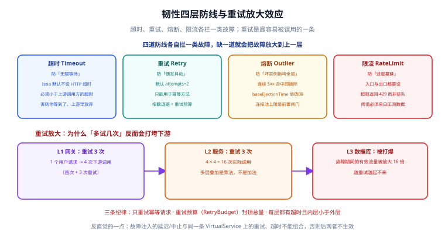

# 韧性设计：超时、重试、熔断与限流

一句话定位：网格提供的四道防线各拦一类故障——**超时**拦「无限等待」，**重试**拦「偶发抖动」，**熔断**拦「坏实例拖垮全局」，**限流**拦「过载蔓延」。四道都要有，缺一道就会把故障放大到上一层。



## 四道防线对照

| 防线 | 配置位置 | 默认行为 | 拦住的故障 |
| --- | --- | --- | --- |
| 超时 | `VirtualService.http[].timeout` | **HTTP 超时默认禁用** | 上游挂起导致的请求堆积 |
| 重试 | `VirtualService.http[].retries` | 官方口径：HTTP 默认重试 2 次 | 单次网络抖动、可重试的状态码 |
| 熔断 | `DestinationRule.trafficPolicy`（连接池 + `outlierDetection`） | 不主动摘除坏实例 | 少数实例持续 5xx / 连接打满 |
| 限流 | 入口 / waypoint 上的限流配置（本地或全局） | 不限流 | 流量洪峰把下游打穿 |

```yaml [virtualservice-resilience.yaml]
apiVersion: networking.istio.io/v1
kind: VirtualService
metadata:
  name: ratings
spec:
  hosts:
    - ratings
  http:
    - timeout: 2s          # 整体超时：这一个请求最多等 2 秒
      retries:
        attempts: 3        # 首次失败后最多再试 3 次
        perTryTimeout: 500ms
        # 只重试幂等失败；不要把 5xx 无差别重试
        retryOn: 5xx,connect-failure,reset,retriable-status-codes
      route:
        - destination:
            host: ratings
```

## 超时：唯一一条硬纪律是「内层小于外层」

调用链是 `网关(10s) → 服务 A(5s) → 服务 B(2s)`。如果 B 的超时比 A 大，会出现最难查的一类现象：**A 已经放弃并返回了错误，B 还在继续干活**——你以为请求失败了，实际上下游还在写入。

| 规则 | 说明 |
| --- | --- |
| 内层超时 < 外层超时 | 否则外层先超时，内层的工作白做，且日志里只看到外层报错 |
| 应用自身超时 ≤ 网格超时 | 应用自己的超时先触发时，Envoy 的超时与重试**不会生效**（请求已经被应用结束了） |
| 超时要基于实测 | 用 P99 而不是平均数做基准，留 2~3 倍余量 |

::: danger 超时相关的三个坑
1. **不设超时等于无限等**：Istio 的 HTTP 超时默认是**禁用**的。上游服务不响应也不关闭连接时，请求会一直占着连接池槽位，最终表现为「连接池满了，新的请求排队」——查起来像下游慢，其实是自己没设超时。
2. **网格超时与应用超时打架**：应用层设了 2s、网格设了 3s + 1 次重试，结果是**应用先超时返回**，网格的重试机制根本没机会介入。
3. **网关层不设超时**：入口没有超时，一个慢请求可以在网关侧挂很久，占掉入口连接，外部感知为「整站变慢」。
:::

## 重试：最容易用错的一道防线

```yaml
retries:
  attempts: 3               # 首次 + 最多 3 次重试 = 最多 4 次实际调用
  perTryTimeout: 500ms      # 每次重试自己的超时（必须 < 整体 timeout）
  retryOn: 5xx,reset,connect-failure
  retryIgnorePreviousHosts: true   # 换一个实例重试，而不是死磕同一个
  retryRemoteLocalities: true      # 允许重试到其他可用区的实例
```

默认的 `retryOn` 只覆盖连接类失败（连接失败、流被拒、上游不可用等）——**这是刻意的**：连接失败通常可安全重试，而 5xx 可能对应对端已经产生的副作用。要重试 5xx 必须显式写出来，并同时确认接口幂等。

### 重试放大：为什么「多试几次」会打垮下游

重试次数在多层之间是**乘法**：

| 层 | 重试策略 | 有效放大倍数 |
| --- | --- | --- |
| 网关 → 服务 A | 3 次重试 | ×4 |
| 服务 A → 服务 B | 3 次重试 | ×4 |
| 合计 | — | **×16** |

故障期间本来已经过载的下游，会被放大的流量再压一轮，于是「越重试越起不来」。

::: tip 三条控住重试放大的做法
1. **只重试幂等请求**：GET / HEAD / PUT（幂等语义）可以，POST 慎用，支付类接口一律不重试。
2. **用重试预算封顶总量**：`RetryBudget`（1.31 新增 `budget_interval` 字段）按比例限制重试请求占总请求数的上限，避免故障期间的级联放大。
3. **只重试「能恢复的错」**：连接类失败与 503 值得重试，4xx 与业务错误码重试一万次也一样。
:::

### 熔断：先看连接池，再看摘除

熔断在 Istio 里分成两半，**很多人只配了后一半**：

```yaml [destinationrule-circuit.yaml]
apiVersion: networking.istio.io/v1
kind: DestinationRule
metadata:
  name: ratings
spec:
  host: ratings
  trafficPolicy:
    # 前半：连接池上限 —— 防止「把对端连满」
    connectionPool:
      tcp:
        maxConnections: 100
        connectTimeout: 1s
      http:
        http1MaxPendingRequests: 50
        http2MaxRequests: 100
        maxRequestsPerConnection: 10
    # 后半：异常实例摘除 —— 防止「被坏实例反复拖慢」
    outlierDetection:
      consecutive5xxErrors: 3    # 连续 3 次 5xx 就摘
      interval: 10s              # 统计窗口
      baseEjectionTime: 30s      # 摘除时长（多摘几次会按倍数延长）
      maxEjectionPercent: 30     # 最多摘掉 30%，防止把整个服务摘空
      minHealthPercent: 40       # 健康实例低于 40% 时停止摘除
```

| 参数 | 作用 | 不配的后果 |
| --- | --- | --- |
| `maxConnections` / `http1MaxPendingRequests` | 限制并发连接与排队请求数 | 连接不设上限时，一个慢下游能把调用方的连接与线程全部占住 |
| `consecutive5xxErrors` | 连续多少次失败后摘除 | 不设时坏实例会被一直轮询到 |
| `baseEjectionTime` | 摘除多久后放回 | 太短会反复来回摘放，太长会损失容量 |
| `maxEjectionPercent` | 摘除比例上限 | 不设上限时，全部实例被判坏会导致整个服务不可用 |
| `minHealthPercent` | 健康比例低于阈值时停止摘除 | 与「1.31 默认发送不健康端点」的行为直接相关，见下 |

::: danger 1.31 的一处行为变更
**1.31 起，Istio 默认会把不健康端点也发给调用方**，除非在 `Service` 上配置了 `OutlierDetection.minHealthPercent`。要恢复旧行为可设 `PILOT_AUTO_SEND_UNHEALTHY_ENDPOINTS=false` 或使用兼容 profile。升级后如果发现「流量打到了已知不健康的实例上」，先查这里。
:::

::: warning 制造 503 的最短配置（用来验证熔断确实生效）
`maxConnections: 1` + `http1MaxPendingRequests: 1` + `maxRequestsPerConnection: 1`，再用并发工具打几十个请求，就会出现 `upstream_reset_before_response_started{overflow}` 类的 503。**故意造出 503 是验证熔断配置生效的标准做法**——只看 YAML 无法确认它真的在拦流量。
:::

## 限流：入口与出口都要设

| 层次 | 做法 | 超限的表现 |
| --- | --- | --- |
| 入口限流 | 在网关 / waypoint 上按路由限流（本地令牌桶或接外部限流服务） | 直接返回 429 |
| 服务间限流 | 调用方一侧按目标服务设上限 | 快速失败，避免把压力传导下去 |
| 连接池兜底 | `connectionPool` 上限 | 请求排队，超时后 503 |

::: tip 限流的三条纪律
1. **阈值必须来自压测**，不能拍脑袋。没测过的阈值等于没有阈值。
2. **本地限流优先**：单实例令牌桶零外部依赖，适合绝大多数场景；需要「全集群统一配额」时才引入外部限流服务（多一跳、多一个故障点）。
3. **超限要快速失败（429）而不是排队**：排队的请求最终还是会超时，而且期间占着连接资源。
:::

## 与业务框架的韧性叠加

这一条最容易被忽略：**Spring Cloud / Dubbo / gRPC 自带的重试与熔断和网格的是两套独立机制，会叠加**。

| 叠加方式 | 结果 |
| --- | --- |
| 框架重试 3 次 + 网格重试 3 次 | 实际放大 16 倍（乘法） |
| 框架熔断阈值与网格熔断阈值不一致 | 谁先触发说不清，排障时两边日志都对不上 |
| 框架超时 1s + 网格超时 3s | 框架先超时，网格的机制形同虚设 |

**约定一个归属**：要么「把重试与熔断交给网格，框架里关掉」，要么「框架负责、网格只做超时兜底」。混着用一定要在文档里写清谁负责哪一层。

## 实战：给 reviews 服务加完整韧性

```shell
# 1. 给 v2 注入延迟，制造「慢实例」
kubectl apply -f - <<'EOF'
apiVersion: networking.istio.io/v1
kind: VirtualService
metadata:
  name: reviews
spec:
  hosts: ["reviews"]
  http:
    - match:
        - headers:
            end-user:
              exact: jason
      fault:
        delay:
          percentage:
            value: 100.0
          fixedDelay: 7s
      route:
        - destination:
            host: reviews
            subset: v2
    - route:
        - destination:
            host: reviews
            subset: v1
EOF

# 2. 打流量，观察：超时是否生效、是否触发了重试与摘除
for i in $(seq 1 30); do curl -s -o /dev/null -w "%{http_code} " -H "Cookie: session=jason" http://localhost:8080/productpage; done

# 3. 看熔断统计
kubectl exec deploy/productpage-v1 -c istio-proxy -- \
  pilot-agent request GET stats | grep -E "outlier|upstream_rq_retry"
```

预期：出现 504 / 503（超时与摘除生效）；`upstream_rq_retry` 计数大于 0（重试确实发生）；`outlier` 相关统计中出现被摘除的主机。

## 验证方式

```shell
# ① 代理里真实生效的超时与重试（不是你的 YAML）
istioctl proxy-config route deploy/productpage-v1 -o json | grep -E '"timeout"|"retryPolicy"' -A4

# ② 集群的熔断参数
istioctl proxy-config cluster deploy/productpage-v1 -o json | grep -E '"circuitBreakers"|"outlierDetection"' -A6

# ③ 运行期统计
kubectl exec deploy/productpage-v1 -c istio-proxy -- pilot-agent request GET stats | grep -E "upstream_rq_retry|upstream_rq_timeout|ejections"
```

## 参考资料

- 流量管理概念（超时、重试、熔断）：<https://istio.io/latest/docs/concepts/traffic-management/>
- HTTPRetry 参考：<https://istio.io/latest/docs/reference/config/networking/virtual-service/#HTTPRetry>
- DestinationRule 熔断参数：<https://istio.io/latest/docs/reference/config/networking/destination-rule/#OutlierDetection>
- 流量管理常见问题：<https://istio.io/latest/docs/ops/common-problems/network-issues/>
- 与库内专题的衔接：[微服务 · 熔断限流](../../../../Backend/Microservices/index.md)、[高并发系统设计](../../../../Backend/index.md)
