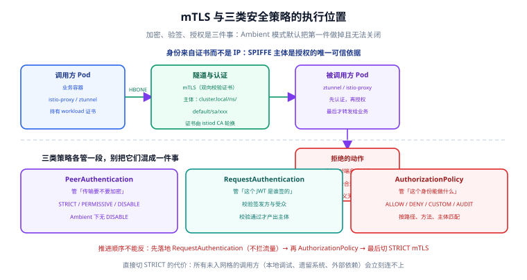

# 安全：mTLS、身份与授权

一句话定位：网格的安全模型建立在**「身份来自证书，而不是 IP」**这一点上——调用方拿到一个可验证的 SPIFFE 身份，被调用方基于这个身份决定放行还是拒绝。加密、验签、授权是三件不同的事，分别由三类策略负责。



## 身份：SPIFFE 主体长什么样

Istio 为每个工作负载签发 X.509 证书，证书里的身份格式是：

```text
spiffe://<trust-domain>/ns/<namespace>/sa/<service-account>
```

默认信任域是 `cluster.local`，在策略里写主体时用去掉 `spiffe://` 的短形式：

```text
cluster.local/ns/default/sa/blog-web
```

| 要素 | 说明 |
| --- | --- |
| trust domain | 由 `meshConfig.trustDomain` 决定；多集群共享信任时用它做联合 |
| namespace + service account | 身份的粒度是 **ServiceAccount**，不是 Pod 名。同 SA 的 Pod 互相冒充在身份上是「一回事」 |
| 签发者 | `istiod` 内置 CA；生产环境通常外接自建 CA（`cacerts` Secret 换掉默认自签根） |
| 轮换 | 工作负载证书有 TTL，由 istiod 自动轮换；根证书轮换要按「先加新根、再换工作负载、最后删旧根」的顺序做 |

```shell
# 看某个工作负载当前持有的证书（要求已经注入代理）
istioctl proxy-config secret deploy/blog-web
```

::: danger 身份粒度选错的后果
**同一个命名空间的所有 Pod 若共用 `default` ServiceAccount，授权就退化成「命名空间级」**——任何能调度到该命名空间的 Pod 都自动获得同样的权限。真正做到「按服务授权」，就得为每个服务单独建 ServiceAccount，并在 Deployment 里显式 `serviceAccountName`。
:::

## 三类策略各管一段

| 策略 | 资源 | 管什么 | 不生效的典型原因 |
| --- | --- | --- | --- |
| 传输加密 | `PeerAuthentication` | 入向连接要不要走 mTLS | Ambient 模式下 `DISABLE` 无效 |
| 身份验签 | `RequestAuthentication` | 这个 JWT 是谁签的、有没有过期 | 只校验「带了令牌的请求」，不带令牌的照常放行 |
| 访问授权 | `AuthorizationPolicy` | 这个身份能访问哪些路径/方法 | 用了 L7 字段但流量没经过 waypoint |

### PeerAuthentication：三种模式

```yaml [peer-authentication.yaml]
apiVersion: security.istio.io/v1
kind: PeerAuthentication
metadata:
  name: default
  namespace: default
spec:
  mtls:
    mode: STRICT
```

| 模式 | 含义 | 适用阶段 |
| --- | --- | --- |
| `STRICT` | 只接受 mTLS 连接 | 目标态 |
| `PERMISSIVE` | 明文与 mTLS 都接受 | **迁移期**：让未入网格的调用方继续可用 |
| `DISABLE` | 明文，不做隧道 | Sidecar 模式下的特例；**Ambient 不支持** |
| `UNSET` | 继承上层（命名空间 → 网格），没有上层时按 `PERMISSIVE` | 只想覆盖某个端口时用 |

两个作用域规则必须记住：

- **策略放在根命名空间（`istio-system`）时，`selector` 会被忽略**，相当于对全网格生效。
- **`portLevelMtls` 必须配合 `selector` 使用**（CRD 校验会直接拒绝没有 selector 的 `portLevelMtls`）；其中的端口指的是**工作负载端口**，不是 Service 端口。

### RequestAuthentication：只负责验签

```yaml [request-authentication.yaml]
apiVersion: security.istio.io/v1
kind: RequestAuthentication
metadata:
  name: blog-jwt
  namespace: default
spec:
  selector:
    matchLabels:
      app: blog-web
  jwtRules:
    - issuer: "https://auth.example.com"
      jwksUri: "https://auth.example.com/.well-known/jwks.json"
      audiences:
        - "blog-api"
      forwardOriginalToken: true
```

::: warning RequestAuthentication 不等于「强制登录」
它只做一件事：**如果请求带了 JWT，就校验它**。不带令牌的请求会**照常通过**。要真正拦住匿名请求，必须再配一条 `AuthorizationPolicy` 要求 `requestPrincipals` 存在：

```yaml
rules:
  - from:
      - source:
          requestPrincipals: ["https://auth.example.com/*"]
```
:::

### AuthorizationPolicy：默认拒绝 + 显式放行

```yaml [authorization-policy.yaml]
apiVersion: security.istio.io/v1
kind: AuthorizationPolicy
metadata:
  name: blog-web-policy
  namespace: default
spec:
  selector:
    matchLabels:
      app: blog-web
  action: ALLOW
  rules:
    # 读者端：任何人可读文章列表
    - to:
        - operation:
            methods: ["GET"]
            paths: ["/api/v1/posts", "/api/v1/posts/*"]
    # 管理端：只允许后台服务账号
    - from:
        - source:
            principals: ["cluster.local/ns/default/sa/blog-admin"]
      to:
        - operation:
            methods: ["POST", "PUT", "DELETE"]
            paths: ["/api/v1/admin/*"]
```

判定规则（记三条就够）：

1. **只要该工作负载上存在任意一条 `ALLOW` 策略，未命中的请求就被拒**——即自动进入「默认拒绝」。
2. **`DENY` 先于 `ALLOW` 评估**：先看有没有 DENY 命中，命中即拒；否则再看 ALLOW。
3. **`action` 另有 `CUSTOM`（交给外部授权服务）与 `AUDIT`（只记录不拦截）**。`AUDIT` 是灰度上策略的标准姿势：先只记录，看几天日志确认不会误伤，再改成 `ALLOW`。

::: tip 上策略的正确顺序
**先 `AUDIT` 观察 → 再 `ALLOW` 收敛 → 最后才考虑 `DENY` 兜底**。直接上 `ALLOW` 的常见事故是：某条你没意识到的调用路径（定时任务、运维脚本、健康检查、另一个命名空间的批处理）被一起拦掉，业务在深夜挂掉。
:::

## 1.31 的两处安全增强

| 新特性 | 用在哪 |
| --- | --- |
| `AuthorizationPolicy` 的 `trustDomains` / `notTrustDomains` | 按对端证书的信任域做匹配或排除。多集群 / 并购场景下，比按 `principals` 逐个列举简洁得多 |
| `COMPLIANCE_POLICY=fips-140-3` | 强制 TLS 1.2+ 与 FIPS 合规套件、P-256/P-384 曲线；Go 组件需 Go 1.24+ 且 `GOFIPS140=v1.0.0` 构建。金融 / 政企合规场景可能直接把它列为硬性要求 |

## Ambient 模式下的三点差异

| 差异 | 说明 |
| --- | --- |
| `DISABLE` 模式无效 | Ambient 下网格内流量一律走 HBONE 隧道，mTLS 是强制的。**迁移前必须清理 `mode: DISABLE` 的 PeerAuthentication**，否则它是「写了但没用」 |
| `STRICT` / `PERMISSIVE` 变得冗余 | ztunnel 已经强制加密，这两类策略在迁移完成后可以安全移除 |
| L7 策略需要 waypoint | `AuthorizationPolicy` 里用了 `methods` / `paths` / `headers`，或 `action: CUSTOM` / `AUDIT` 时，**必须让对应流量经过 waypoint**，否则策略不生效。迁移前的检查办法是扫一遍策略，把所有带 L7 字段的列出来 |

```shell
# 检查现存的 L7 策略（这些需要 waypoint）
kubectl get authorizationpolicy -A --no-headers | while read ns name rest; do
  if kubectl get authorizationpolicy "$name" -n "$ns" -o yaml \
    | grep -qE "(methods:|paths:|headers:|action: CUSTOM|action: AUDIT)"; then
    echo "$ns/$name"
  fi
done

# 检查会阻碍 Ambient 迁移的 DISABLE 策略
kubectl get peerauthentication -A -o yaml | grep -A2 "mtls:"
```

## 易错点与最佳实践

::: danger 六个高频坑
1. **直接切 STRICT**：所有未入网格的调用方（本地调试、遗留系统、集群外依赖、运维脚本）会立刻连不上。正确顺序是 `PERMISSIVE` 全量铺开 → 确认 `connection_security_policy="mutual_tls"` 覆盖到位 → 再逐个命名空间切 `STRICT`。
2. **把 401 和 403 混为一谈**：401 是「对端身份缺失或无效」，403 是「身份合法但没权限」。查错方向完全不同。
3. **500 与 403 分不清**：`AuthorizationPolicy` 命中拒绝返回 403，但如果策略里写了不存在的 `principals` 格式，可能表现为全部拒绝——先用 `AUDIT` 验证再上 `ALLOW`。
4. **健康检查被拦**：K8s 的 `livenessProbe` 走 kubelet 直连，**不经过网格**，通常不受策略影响；但如果探针走的是 HTTP 且经过代理，就要在策略里显式放行探针路径。
5. **共用 ServiceAccount 导致授权形同虚设**：见上文「身份粒度」。
6. **忘了 `RequestAuthentication` 本身不拦截**：只配它等于「验了但没拦」，必须补 `AuthorizationPolicy`。
:::

::: tip 最佳实践
- **按服务建 ServiceAccount**，这是「细粒度授权」的前置条件，不是可选项。
- **策略全部进 Git**：授权规则是安全边界，必须有评审与可回滚的记录。
- **打开 mTLS 覆盖率监控**：用 `connection_security_policy` 维度做看板，任何人掉出网格立刻可见。
- **根证书外接自有 CA**：默认自签根适合验证，不适合生产。
- **用 `AUDIT` 做灰度**：把「策略上线」变成两阶段变更。
:::

## 实战：为博客平台做零信任收敛

```shell
# 第 1 步：全命名空间 PERMISSIVE，先不拦任何流量
kubectl apply -f - <<'EOF'
apiVersion: security.istio.io/v1
kind: PeerAuthentication
metadata:
  name: default
  namespace: default
spec:
  mtls:
    mode: PERMISSIVE
EOF

# 第 2 步：验证 mTLS 覆盖率（应接近 100%，剩下的说明有东西没入网格）
kubectl -n istio-system port-forward svc/prometheus 9090:9090
curl -s 'http://localhost:9090/api/v1/query?query=sum(rate(istio_requests_total%7Bconnection_security_policy%3D%22mutual_tls%22%7D%5B5m%5D))
  /sum(rate(istio_requests_total%5B5m%5D))' | head -c 400

# 第 3 步：先 AUDIT 观察授权策略是否会误伤
# 把 AuthorizationPolicy 的 action 设为 AUDIT，观察 3 天日志再改 ALLOW

# 第 4 步：切 STRICT
kubectl patch peerauthentication default -n default --type=merge \
  -p '{"spec":{"mtls":{"mode":"STRICT"}}}'

# 第 5 步：确认未入网格的调用方被拒（预期 503 / 连接失败）
kubectl run curl-test --rm -it --image=curlimages/curl --restart=Never -- \
  curl -s -o /dev/null -w "%{http_code}\n" http://blog-web.default:8080/api/v1/posts
```

预期：第 2 步覆盖率接近 100%；第 5 步从未注入代理的 Pod 发出的请求被拒绝（这正是 STRICT 生效的证据）。

## 验证方式

```shell
# ① 证书是否正常持有与轮换
istioctl proxy-config secret deploy/blog-web

# ② 代理里真实的 mTLS 与授权配置
istioctl proxy-config listener deploy/blog-web -o json | grep -i "transport_socket" | head -5
istioctl proxy-config route deploy/blog-web -o json | head -20

# ③ 配置校验
istioctl analyze

# ④ 运行时统计：被拒的请求数
kubectl exec deploy/blog-web -c istio-proxy -- \
  pilot-agent request GET stats | grep -E "rbac|denied"
```

## 参考资料

- 安全概念与身份模型：<https://istio.io/latest/docs/concepts/security/>
- PeerAuthentication 参考：<https://istio.io/latest/docs/reference/config/security/peer_authentication/>
- AuthorizationPolicy 参考：<https://istio.io/latest/docs/reference/config/security/authorization-policy/>
- 认证（JWT）：<https://istio.io/latest/docs/tasks/security/authentication/authn-policy/>
- Ambient 迁移前的安全检查：<https://istio.io/latest/docs/ambient/migrate/before-you-begin/>
- 与库内专题的衔接：[安全加固](../../../SecurityHardening/index.md)、[认证与授权](../../../../Backend/Auth/index.md)
