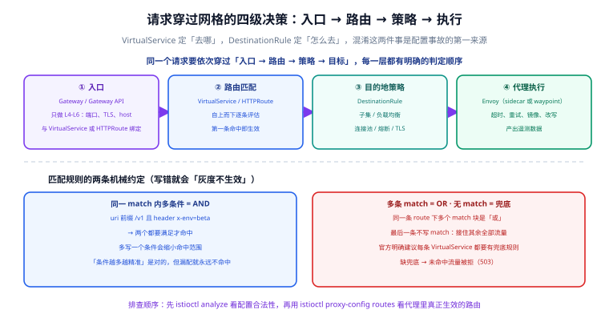

# 流量管理：匹配、路由与灰度

一句话定位：网格的流量管理只回答两个问题——**「这个请求去哪」由 VirtualService 决定，「到了那边怎么连」由 DestinationRule 决定**。把这两件事混在一起，是配置事故的第一来源。



## 四级决策链

一个请求从进入网格到落到某个 Pod，依次经过四层判定，**顺序不可调换**：

| 层 | 资源 | 回答的问题 |
| --- | --- | --- |
| ① 入口 | `Gateway` / Gateway API `Gateway` | 哪个端口、什么 TLS、哪些 host 允许进来（只做 L4–L6） |
| ② 路由 | `VirtualService` / `HTTPRoute` | 命中哪条规则、去哪个 subset、权重多少 |
| ③ 目的地策略 | `DestinationRule` | 怎么连：负载均衡、连接池、熔断、目标侧 TLS |
| ④ 代理执行 | Envoy（sidecar / waypoint） | 超时、重试、镜像、改写，并产出遥测 |

::: warning 一个必须先记住的前提
**`VirtualService` 路由规则的顺序是「自上而下、第一条命中即生效」**。官方概念文档原话是「the first rule in the virtual service definition being given highest priority」。所以「规则写得越靠前越强」，也意味着**把兜底规则写在最前面会让后面所有规则失效**。
:::

## 匹配：AND、OR 与兜底

```yaml [virtualservice-match.yaml]
apiVersion: networking.istio.io/v1
kind: VirtualService
metadata:
  name: reviews
spec:
  hosts:
    - reviews
  http:
    # ① 一条规则里可以有多个 match 块 —— 块之间是「或」
    - match:
        - headers:
            end-user:
              exact: jason
        - uri:
            prefix: /beta
      route:
        - destination:
            host: reviews
            subset: v2
    # ② 兜底规则：不写 match，接住其余全部流量
    #    官方明确建议：每个 VirtualService 的最后一条规则都应该是兜底
    - route:
        - destination:
            host: reviews
            subset: v1
          weight: 90
        - destination:
            host: reviews
            subset: v2
          weight: 10
```

两条机械约定：

- **同一个 `match` 块内的多个字段是 AND**（`uri` 前缀 `/v1` **且** header `x-env=beta` 才命中），多写一个条件只会让命中范围更小。
- **同一 `route` 下多个 `match` 块是 OR**。

常用匹配字段：

| 字段 | 说明 | 注意 |
| --- | --- | --- |
| `uri` | `exact` / `prefix` / `regex` | 正则匹配成本最高，且容易写出意料之外的命中 |
| `headers` | 按请求头匹配（另有 `withoutHeaders` 表示「不包含」） | 值匹配是大小写敏感的 |
| `method` | HTTP 方法 | 灰度到写接口时非常有用 |
| `queryParams` | 查询参数 | 适合按 `?debug=1` 这类开关路由 |
| `port` | 按端口匹配 | 多端口服务必写，否则容易误伤 |
| `sourceLabels` | 按调用方 Pod 标签匹配 | 做「内部流量走新版本」这类隔离很顺手 |
| `gateways` | 该规则作用于哪个入口 | 不写时默认作用于网格内部（`mesh`） |

::: danger 匹配相关的高频坑
1. **缺兜底规则**：未命中任何规则的流量**不会被「放行到默认目标」**，而是被拒（表现为 503）。写完灰度规则一定补一条无 `match` 的兜底。
2. **`hosts` 用短名**：短名只在与 VirtualService **同命名空间**时有效；跨命名空间或从网关进入时，短名会解析不到。**生产统一写 FQDN**。
3. **`gateways` 不写**：默认只对网格内部生效。给入口网关配的规则忘了写 `gateways: [my-gateway]`，表现为「集群内 curl 生效、外网访问没效果」。
4. **`method` 漏写导致写接口被灰度**：只按 `uri` 前缀灰度时，POST / PUT / DELETE 会被一起带到新版本——对无状态读接口无所谓，对有状态写接口很危险。
:::

## 灰度发布：三种手段与适用场景

| 手段 | 配置位置 | 适用场景 | 缺点 |
| --- | --- | --- | --- |
| 权重路由 | `VirtualService` route 的 `weight` | 按比例放量，最常用 | 需要足够的请求量才有统计意义 |
| 请求头路由 | `match.headers` | 内部同学先验、按用户分桶 | 需要能控制入口请求头 |
| 流量镜像 | `mirror` + `mirrorPercentage` | **上线前**把真实流量复制一份给新版本 | 只读验证；镜像请求产生的写入会污染数据 |

```yaml [virtualservice-mirror.yaml]
apiVersion: networking.istio.io/v1
kind: VirtualService
metadata:
  name: reviews
spec:
  hosts:
    - reviews
  http:
    - route:
        - destination:
            host: reviews
            subset: v1
      # 把一部分真实流量的副本发给 v2，v2 的响应被丢弃
      mirror:
        host: reviews
        subset: v2
      mirrorPercentage:
        value: 20.0
```

### 完整的放量节奏

```shell
# 0. 前置：镜像验证（v2 的日志与错误率，不影响真实响应）
kubectl apply -f virtualservice-mirror.yaml

# 1. 1% 放量，观察 15 分钟
kubectl patch virtualservice reviews --type=merge -p \
  '{"spec":{"http":[{"route":[{"destination":{"host":"reviews","subset":"v1"},"weight":99},
   {"destination":{"host":"reviews","subset":"v2"},"weight":1}]}]}}'

# 2. 10% → 50% → 100%，每一档都要看三件事
#    - 错误率（istio_requests_total 的 response_code 维度）
#    - 延迟（istio_request_duration_milliseconds 的 P95/P99）
#    - 新旧版本的实例资源水位
istioctl analyze
```

::: tip 放量的判据
不要用「看起来没报错」当判据。写进流程的三条：**新版本错误率不高于旧版本**、**P99 不高于旧版本 10%**、**观察窗口内没有新的告警类型**。任何一条不满足就回退权重，而不是「再观察观察」。
:::

## DestinationRule：子集与目的地策略

```yaml [destinationrule-reviews.yaml]
apiVersion: networking.istio.io/v1
kind: DestinationRule
metadata:
  name: reviews
spec:
  host: reviews
  # 默认策略：作用于该服务下所有子集
  trafficPolicy:
    loadBalancer:
      simple: LEAST_REQUEST
    connectionPool:
      tcp:
        maxConnections: 100
      http:
        http1MaxPendingRequests: 50
        maxRequestsPerConnection: 10
  subsets:
    - name: v1
      labels:
        version: v1
    - name: v2
      labels:
        version: v2
      # 子集级策略覆盖默认策略
      trafficPolicy:
        loadBalancer:
          simple: ROUND_ROBIN
```

要点：

- **`subsets` 靠 `labels` 选实例**，所以 Pod 上**必须有对应标签**（`version: v2`）。标签写错是「灰度不生效」的头号原因，且配置本身完全合法——`istioctl analyze` 也不会报错。
- **`trafficPolicy` 有层级**：写在 `subsets` 之上是「该 host 的默认策略」，写在某个 subset 内是「覆盖」；`portLevelSettings` 还能再按端口细分。
- **负载均衡模型**：默认是 `LEAST_REQUEST`（随两个候选里挑活跃请求少的那个），另有 `ROUND_ROBIN`、`RANDOM`、`PASSTHROUGH` 与三种一致性哈希（`consistentHash` 的 ring hash / maglev 等，做软会话亲和时用）。
- **1.31 起可以设网格级默认策略**：`MeshConfig.defaultTrafficPolicy` 定义全网格的连接池与熔断基线，`DestinationRule` 只写其中一块就只覆盖那一块，**未写的字段继承网格基线**而不是 Istio 内置默认值。这让「全网格统一一份熔断参数」不再需要逐个服务抄。

## 入口：Istio Gateway 与 Gateway API

| 维度 | Istio `Gateway` + `VirtualService` | Gateway API（`Gateway` + `HTTPRoute`） |
| --- | --- | --- |
| 归属 | Istio 自有 CRD | K8s SIG-Network 标准，Istio 实现其控制器 |
| 分层 | Gateway 管 L4–L6，VirtualService 绑过去管 L7 | Gateway 管入口，HTTPRoute 管路由，职责更清晰 |
| 角色分离 | 需要用 `gateways` 字段手动绑定 | `parentRefs` 显式引用，天然支持「基础设施团队管 Gateway、业务团队管 HTTPRoute」 |
| 现状 | 仍然完全可用 | 官方主推方向；需先装 Gateway API CRD |

```yaml [gateway-and-binding.yaml]
apiVersion: networking.istio.io/v1
kind: Gateway
metadata:
  name: ext-host-gwy
spec:
  selector:
    istio: ingressgateway
  servers:
    - port:
        number: 443
        name: https
        protocol: HTTPS
      hosts:
        - blog.example.com
      tls:
        mode: SIMPLE
        credentialName: blog-example-cert
---
apiVersion: networking.istio.io/v1
kind: VirtualService
metadata:
  name: blog
spec:
  hosts:
    - blog.example.com
  # 绑定到网关：不写这个字段，规则只对网格内部生效
  gateways:
    - ext-host-gwy
  http:
    - route:
        - destination:
            host: blog-web
```

::: tip 从 Istio Gateway 迁到 Gateway API 的策略
不要一次性全迁。合理路径是：**新业务直接用 Gateway API，老业务保持不动**，等入口规则自然收敛。1.31 默认开启了严格网关合并（`PILOT_ENABLE_STRICT_GATEWAY_MERGING`），Istio `Gateway` CRD 与托管的 Gateway API `Gateway` 代理**不会再跨命名空间合并**——这消除了一类容易踩的隐式共享，但如果你此前恰好依赖了那个行为，升级后会表现为「某些路由消失」。
:::

## 其他常用动作

| 动作 | 字段 | 用途 |
| --- | --- | --- |
| 请求/响应头改写 | `headers.request.set` / `remove` | 透传调用方身份、本地调试标记 |
| URL 改写 | `rewrite.uri` | 网关路径 `/api/v1/*` → 后端 `/` |
| 重定向 | `redirect`（1.31 起支持 `prefix_rewrite`） | 域名跳转、HTTPS 强制 |
| 故障注入 | `fault.delay` / `fault.abort` | 演练超时与降级逻辑 |
| 超时 / 重试 | `timeout` / `retries` | 见 [韧性设计](../Resilience/index.md) |

::: danger 故障注入的一个硬限制
**注入的故障不能与同一条 VirtualService 上的重试、超时组合使用**——三者共存时重试与超时不会按预期生效。做混沌演练时，故障注入要单独放在一条虚拟服务或单独的规则里，别和正常的超时重试配置混在一起。熔断、重试、超时配好之后「是否真的生效」，用故障注入实验来验证：见[混沌工程](../../../ChaosEngineering/index.md)的实验设计与实战页。
:::

## 验证方式

```shell
# ① 配置静态检查
istioctl analyze -n default

# ② 代理里「真实生效」的路由（不是你的意图）
istioctl proxy-config routes deploy/productpage-v1 -o json | head -60

# ③ 子集与端点：确认 subset 找到了实例，否则 503
istioctl proxy-config cluster deploy/productpage-v1 | grep reviews

# ④ 实际权重分布（连续打 100 次，数响应里的版本标记）
for i in $(seq 1 100); do curl -s http://localhost:8080/productpage | grep -o 'reviews-v[0-9]'; done | sort | uniq -c
```

预期：`analyze` 无 error；`proxy-config routes` 能看到带权重的路由条目；`proxy-config cluster` 中 `reviews` 的各 subset 都有 `HEALTHY` 端点；100 次请求的版本分布接近设定权重（样本越小偏差越大，别用 10 次下结论）。

## 参考资料

- 流量管理概念：<https://istio.io/latest/docs/concepts/traffic-management/>
- VirtualService 参考：<https://istio.io/latest/docs/reference/config/networking/virtual-service/>
- DestinationRule 参考：<https://istio.io/latest/docs/reference/config/networking/destination-rule/>
- Gateway API 与 Istio：<https://istio.io/latest/docs/tasks/traffic-management/ingress/gateway-api/>
- 流量管理故障排查：<https://istio.io/latest/docs/ops/common-problems/network-issues/>
