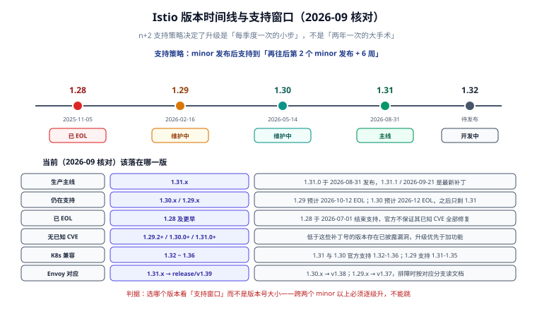

# 版本演进与升级策略

一句话定位：Istio 的支持窗口是 **n+2**（当前 minor 加上前两个），**大约每季度一个 minor**。这意味着升级不是「两年一次的大手术」，而是「每季度一次的小步」——把它排进常规节奏，比攒到不得不升时再来一次要便宜得多。



## 支持策略：n+2 与 6 周尾巴

官方口径（[Supported Releases](https://istio.io/latest/docs/releases/supported-releases/)）写得很明确：

- **minor 发行**：约每季度一次，经过额外测试与发布认证。
- **支持期限**：一个 minor 会一直支持到**它的后第 2 个 minor 发布之后 6 周**。例如 1.29 的支持期在 1.31 发布后 6 周结束。
- **补丁**：同一 minor 的补丁版本**不含向后不兼容的改动**；同 minor 内升级永远是安全的。
- **安全补丁**：与普通补丁同级，但官方**强烈建议**发布即升。

## 版本状态（2026-09 核对）

| 版本 | 是否支持 | 发布日期 | 预计 EOL | 官方支持的 K8s | 对应 Envoy 分支 |
| --- | --- | --- | --- | --- | --- |
| **1.31** | ✅ 主线 | 2026-08-31 | 约 2027-02 | 1.32 ~ 1.36 | release/v1.39 |
| 1.30 | ✅ 维护中 | 2026-05-14 | 约 2026-12 | 1.32 ~ 1.36 | release/v1.38 |
| 1.29 | ✅ 维护中 | 2026-02-16 | 约 2026-10-12 | 1.31 ~ 1.35 | release/v1.37 |
| 1.28 | ❌ 已 EOL | 2025-11-05 | 2026-07-01 | 1.30 ~ 1.34 | — |
| 1.27 及更早 | ❌ 已 EOL | — | — | — | — |

| 版本线 | 无已知 CVE 的补丁起点 |
| --- | --- |
| 1.31.x | 1.31.0+ |
| 1.30.x | 1.30.0+ |
| 1.29.x | **1.29.2+** |
| 1.28.x | 1.28.6+ |

::: warning 时间敏感表述
「最新版本」是会过期的表述。本文的版本号按 **2026-09 核对**，实际选版请以官方 Supported Releases 页为准；命令里的版本号（`istio-1.31.1`、`ISTIO_VERSION=1.31.1`）同理，不要照抄后就长期不再复核。
:::

::: danger 两个具体的坑
1. **1.29.0 / 1.29.1 有已知 CVE**，1.29 线的安全起点是 **1.29.2**。历史上出现过影响面较大的 Envoy 侧漏洞（如 `ISTIO-SECURITY-2026-004` / `CVE-2026-47774`，CVSS 7.5，影响 1.30.0、1.29.0–1.29.3、1.28.0–1.28.7），修复方式就是升补丁。
2. **EOL 之后偶尔仍会发补丁，但那不代表它回到支持窗口**。例如 1.28 于 2026-07-01 EOL，2026-09-09 仍发布了 1.28.9；官方明确不保证 EOL 版本「已知 CVE 全部修复」。不要用「它还在发补丁」当作不升级的理由。
:::

## Istio 1.31 带来了什么

### Ambient 模式继续补强（1.31 的主线）

- **加权 waypoint 金丝雀**：服务或命名空间可以同时引用主 waypoint 与金丝雀 waypoint（`istio.io/use-waypoint-canary`、`istio.io/use-waypoint-canary-namespace` 标签 + `istio.io/use-waypoint-canary-weight` 注解），按比例分流，**客户端无需任何改动**。这让「改 waypoint 配置」也能灰度。
- **多集群稳定性**：凭证轮换不再产生过期快照或丢失端点分片；修掉多处内存与 goroutine 泄漏；CNI 节点代理修掉并发 map 写 panic、文件描述符泄漏与 Pod 删除死锁。
- **CPU 感知的 ztunnel 工作线程**：通过 `ZTUNNEL_RESOURCE_CPU_LIMIT` / `ZTUNNEL_RESOURCE_CPU_REQUEST` 让 ztunnel 按真实配额决定线程数。

### 流量管理新增能力

| 新特性 | 解决什么问题 |
| --- | --- |
| `zoneAwareLbSetting`（DestinationRule / MeshConfig） | 同可用区优先路由，本地容量不足才溢出到其他区；与 `localityLbSetting` 的区别是**由 Envoy 自动判断**，不用写死百分比 |
| `MeshConfig.defaultTrafficPolicy` | 网格级默认 `connectionPool` 与 `outlierDetection`：所有出站集群继承；`DestinationRule` 只写其中一块就覆盖那一块，**未写的字段继承网格基线而不是 Istio 内置默认值** |
| `ALLOW_ANY_DYNAMIC_DNS` 出站策略 | 用 Envoy 动态正向代理在请求时按 `Host` 头解析域名，**不必再为每个外部目标写 ServiceEntry** |
| `Sidecar` 出站排除（`~` 前缀） | `*/*` 加 `~ns1/*` = 除 ns1 之外全部，大网格不必再写长白名单 |
| `RetryBudget.budget_interval` | 重试预算的统计窗口可配，进一步压住重试放大 |
| `HTTPRedirect.prefix_rewrite` | 重定向也能做前缀感知的路径改写 |

### 安全与合规

- **FIPS 140-3 合规策略**：`COMPLIANCE_POLICY=fips-140-3` 强制 TLS 1.2+ 与 FIPS 合规套件、P-256/P-384 曲线；Go 组件需用 Go 1.24+ 且 `GOFIPS140=v1.0.0` 构建。
- **`AuthorizationPolicy` 支持 `trustDomains` / `notTrustDomains`**：按对端证书里的信任域做匹配或排除。
- **严格的网关合并**：`PILOT_ENABLE_STRICT_GATEWAY_MERGING` 默认启用，阻止 Istio `Gateway` CRD 与托管的 Gateway API `Gateway` 代理**跨命名空间合并**——这类合并曾导致规则被意外共享。
- **xDS `api` generator 需要控制面身份**：非系统命名空间的自定义 MCP 消费方会被拒绝（可临时用 `ENABLE_XDS_API_GENERATOR_AUTH=false` 关掉）。

### 安装与运维

- **Kiali addon 升级到 v2.26.0**。
- `istioctl manifest generate -o <file>` 可直接把清单写入文件，不用重定向。
- `global.readerServiceAccount` 允许把 `istio-reader` 的 `ClusterRole` 绑到自定义 ServiceAccount。

### 可观测性

- **多目标 Prometheus 抓取**：Pod 注解 `prometheus.istio.io/scrape-targets` 可声明多个应用指标端点（逗号分隔的 `port:path`），pilot-agent 并发抓取并合并输出。
- **安全指标端口**：`ENVOY_SECURE_METRICS_PORT` / `ENVOY_SECURE_MERGED_METRICS_PORT` 暴露受 mTLS 保护的抓取端点。
- `PILOT_AGENT_MERGE_ENVOY_STATS=false` 可关闭把 Envoy 指标合并进 agent 端点。

## 升级到 1.31 的注意事项

这些是官方升级说明里**会违背直觉**的几处，逐条都要看：

::: danger 升级前必须确认的五件事
1. **不健康端点默认开始被发送**：除非在 `Service` 上配置了 `OutlierDetection.minHealthPercent`，Istio 现在**会把不健康端点也发出去**。要恢复旧行为，设 `PILOT_AUTO_SEND_UNHEALTHY_ENDPOINTS=false`，或使用兼容 profile。
2. **自动注册的 `WorkloadEntry` 需要重新注册或手工补标签**：HBONE 隧道标签只在 `WorkloadEntry` **自动创建时**打上。升级前注册的工作负载会继续走明文，直到重新注册（实例重连）或给已有 `WorkloadEntry` 加上 `networking.istio.io/tunnel=http`。
3. **`PILOT_SPAWN_UPSTREAM_SPAN_FOR_GATEWAY` 已移除**：它控制的行为（用 Telemetry API 时为网关的每个上游请求生成独立追踪 span）现在**始终开启**；曾把它设为 `false` 来关闭的人要注意这个开关没了。
4. **大网格的 WDS 重连消息变大**：ztunnel 重连时会回报每个工作负载的名字与版本，请求体积增加约三分之一，触发点从约 5.5 万降到约 **4 万**个工作负载。接近这个规模就按「每 1 万资源约 1 MiB」调大 istiod 的 `ISTIO_GPRC_MAXRECVMSGSIZE`（如 `--set pilot.env.ISTIO_GPRC_MAXRECVMSGSIZE=33554432`），并在升级后盯 istiod 日志里的 `ResourceExhausted`。
5. **制品仓库换了地方**：1.31 起不再往 `gcr.io/istio-release`、`registry.istio.io`、`istio-release.storage.googleapis.com` 发布。镜像在 Docker Hub，Helm chart 在 `blob.istio.io/istio-release/charts` 与 OCI 仓库 `ghcr.io/istio/release/charts`。如果你的流水线里写死了前三个地址，**升级前先改**——官方还安排了若干次「尖叫测试」（2026-09-15、10-13、11-17、12-08 起）在这些地址上故意中断服务。
:::

## 升级操作：revision 金丝雀四步

```shell
# ① 预检：列出会被影响的资源与不兼容项
istioctl x precheck

# ② 装一套新控制面（不改现有数据面）
istioctl install --set revision=1-31-1 --set profile=default -y

# ③ 逐个命名空间切过去（先挑一个非核心业务试）
kubectl label ns staging istio.io/rev=1-31-1 --overwrite
kubectl rollout restart deploy -n staging

# ④ 观察无误后扩大范围；确认全部迁完再删旧控制面
istioctl uninstall --revision=1-30-1 -y
```

```shell
# 升级过程中的两个观测点
kubectl -n istio-system get pods -l istio.io/rev=1-31-1
istioctl proxy-status | grep -v SYNCED   # 期望无输出
```

::: tip 回滚怎么做
把命名空间标签改回旧 revision、再 `rollout restart` 即可——**旧控制面还在**，这是 revision 方案的核心理由。如果图省事直接原地覆盖升级（`istioctl upgrade`），就没有这条退路，只能靠回装旧版本。
:::

## 验证方式

```shell
# 版本一致性：控制面 / istioctl / 数据面的三处版本
istioctl version
kubectl -n istio-system get pods -o jsonpath='{.items[*].spec.containers[*].image}' | tr ' ' '\n' | sort -u

# 代理版本（Sidecar 必须重启过才会变）
istioctl proxy-status | awk '{print $2}' | sort -u

# 配置兼容性
istioctl analyze --all-namespaces
```

预期：`istioctl version` 的 client / control plane / data plane 三行都指向目标版本；`proxy-status` 的 VERSION 列全部一致；`analyze --all-namespaces` 无 error。

## 参考资料

- 支持策略与版本状态：<https://istio.io/latest/docs/releases/supported-releases/>
- 1.31 发布说明：<https://istio.io/latest/news/releases/1.31.x/announcing-1.31/>
- 1.31 升级说明：<https://istio.io/latest/news/releases/1.31.x/announcing-1.31/upgrade-notes/>
- 金丝雀升级（revision）：<https://istio.io/latest/docs/setup/upgrade/canary/>
- GCP 制品退役说明：<https://istio.io/latest/blog/2026/retirement-of-gcp/>
