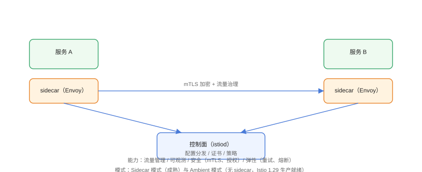

# 服务网格：Istio 流量与安全治理

服务网格（Service Mesh）把**流量控制、可观测性、安全策略**从业务代码中抽离到基础设施层：业务只关心业务逻辑，网格通过数据面代理统一处理熔断、重试、灰度、mTLS 与指标。本页基于 **Istio 1.29**（2026-02 发布）编写，覆盖 Sidecar 与 Ambient 两种数据面模式。

## 核心概念与工作原理



| 概念 | 英文 | 说明 |
| --- | --- | --- |
| 控制面 | Control Plane | 下发配置、管理证书，Istio 中即 `istiod` |
| 数据面 | Data Plane | 实际转发流量的代理（Envoy Sidecar 或 Ambient 的 ztunnel） |
| Sidecar | Sidecar | 以业务 Pod 旁路容器运行的 Envoy 代理 |
| Ambient Mesh | Ambient Mesh | 无需注入 Sidecar，节点级 ztunnel + 按需 waypoint |
| 虚拟服务 | VirtualService | 定义路由规则（灰度、超时、重试） |
| 目标规则 | DestinationRule | 定义负载均衡、连接池、熔断与 TLS 策略 |
| Gateway | Gateway | 南北向入口，管理外部流量进入集群 |
| mTLS | Mutual TLS | 服务间双向证书认证 + 加密 |

工作原理：istiod 监听集群资源（VirtualService 等）→ 生成 Envoy 配置 → 下发给每个 Sidecar/ztunnel → 代理按配置完成路由、重试、熔断与遥测。业务容器不感知网格，应用代码零改动即可获得流量治理能力。

## 版本现状

::: info 版本说明
Istio 1.29 于 2026-02 发布：**Ambient Mesh 达到生产就绪**，支持多集群与 Gateway API；`istioctl` 仍是最常用的管理工具。1.24 之前版本已停止支持，新部署直接使用 1.29+。
:::

## 安装 Istio

```shell
# 下载并安装 istioctl
curl -L https://istio.io/downloadIstio | ISTIO_VERSION=1.29.1 sh -
cd istio-1.29.1
export PATH=$PWD/bin:$PATH

# 安装到集群（profile: demo 便于学习）
istioctl install --set profile=demo -y

# 给命名空间打标签，自动注入 Sidecar
kubectl label namespace default istio-injection=enabled

# 验证
istioctl version
kubectl get pods -n istio-system
```

### 启用 Ambient Mesh（无需 Sidecar）

```shell
# 安装并启用 ambient profile
istioctl install --set profile=ambient -y

# 把命名空间加入网格
kubectl label namespace default istio.io/dataplane-mode=ambient

# 验证 ztunnel
kubectl get pods -n istio-system -l app=ztunnel
```

## 部署示例应用

```shell
kubectl apply -f samples/bookinfo/platform/kube/bookinfo.yaml
kubectl apply -f samples/bookinfo/networking/bookinfo-gateway.yaml

# 等所有 Pod Ready
kubectl wait --for=condition=Ready pod -l app=productpage --timeout=120s

# 设置外部访问
kubectl port-forward svc/productpage 8080:9080
```

浏览器访问 `http://localhost:8080/productpage`，反复刷新会看到不同版本的图书评分（v1/v2/v3 随机负载均衡）。

## 流量管理

### 权重灰度（金丝雀发布）

```yaml [virtualservice-canary.yaml]
apiVersion: networking.istio.io/v1
kind: VirtualService
metadata:
  name: reviews
spec:
  hosts:
    - reviews
  http:
    - route:
        - destination:
            host: reviews
            subset: v1
          weight: 90
        - destination:
            host: reviews
            subset: v2
          weight: 10
---
apiVersion: networking.istio.io/v1
kind: DestinationRule
metadata:
  name: reviews
spec:
  host: reviews
  subsets:
    - name: v1
      labels:
        version: v1
    - name: v2
      labels:
        version: v2
```

```shell
kubectl apply -f virtualservice-canary.yaml
# 反复刷新页面，约 10% 请求进入 v2
```

### 超时与重试

```yaml [virtualservice-retry.yaml]
apiVersion: networking.istio.io/v1
kind: VirtualService
metadata:
  name: ratings
spec:
  hosts:
    - ratings
  http:
    - timeout: 2s
      retries:
        attempts: 3
        perTryTimeout: 500ms
      route:
        - destination:
            host: ratings
```

### 熔断

```yaml [destinationrule-circuit.yaml]
apiVersion: networking.istio.io/v1
kind: DestinationRule
metadata:
  name: ratings
spec:
  host: ratings
  trafficPolicy:
    connectionPool:
      tcp:
        maxConnections: 10
      http:
        http1MaxPendingRequests: 5
        maxRequestsPerConnection: 1
    outlierDetection:
      consecutive5xxErrors: 3
      interval: 10s
      baseEjectionTime: 30s
```

## 安全：mTLS 与授权

### 开启严格 mTLS

```yaml [peer-authentication.yaml]
apiVersion: security.istio.io/v1
kind: PeerAuthentication
metadata:
  name: default
  namespace: default
spec:
  mtls:
    mode: STRICT
```

### 基于来源的授权

```yaml [authorization-policy.yaml]
apiVersion: security.istio.io/v1
kind: AuthorizationPolicy
metadata:
  name: productpage-viewer
spec:
  selector:
    matchLabels:
      app: productpage
  action: ALLOW
  rules:
    - from:
        - source:
            principals: ["cluster.local/ns/default/sa/bookinfo-productpage"]
```

```shell
kubectl apply -f peer-authentication.yaml -f authorization-policy.yaml

# 未授权的来源访问会被拒绝
curl -s http://localhost:8080/productpage | head -1
```

## 可观测性

```shell
# 指标仪表盘
kubectl apply -f samples/addons/kiali.yaml
kubectl -n istio-system port-forward svc/kiali 20001:20001
# 打开 http://localhost:20001 查看服务拓扑

# 访问日志
istioctl dashboard jaeger
kubectl logs deploy/productpage-v1 -c istio-proxy --tail=50
```

## 多集群支持

Istio 1.29 支持**多主（Multi-Primary）与主从（Primary-Remote）**两种部署模型，配合 `ServiceEntry` 与 `DestinationRule` 的 `exportTo` 实现跨集群流量：

```shell
# 第二个集群加入网格（primary-remote 模式）
istioctl x create-remote-secret --context=cluster2 --name=cluster2 \
  | kubectl apply --context=cluster1 -f -
```

## 易错点与最佳实践

::: danger 常见问题
1. **网格外访问被 mTLS 拒绝**：开启 STRICT 后，未注入 Sidecar 的 Pod 无法通信。先逐步把命名空间加入网格，再切 STRICT。
2. **灰度流量看不到效果**：只建了 DestinationRule 没建 VirtualService，或 subset 标签写错。用 `istioctl analyze` 检查配置。
3. **Sidecar 资源占用被忽视**：默认 Sidecar 抓取全集群配置，规模大时内存暴涨。按命名空间收敛 SidecarScope。
4. **Ingress/Gateway 混用**：既有 Ingress 又有 Gateway，双入口规则不一致。逐步统一到 Gateway API。
5. **升级前不检查兼容性**：跨大版本升级需先看 `istioctl x precheck`，直接覆盖升级可能损坏配置。
:::

::: tip 最佳实践
- 新项目优先评估 **Ambient Mesh**：无 Sidecar 注入，节点级 ztunnel，资源开销小，1.29 已生产就绪。
- 灰度遵循「1% → 10% → 50% → 100%」渐进放量，配合 Kiali 观察错误率。
- 用 `istioctl analyze` 在 CI 中做静态检查，避免坏配置上线。
- mTLS 与 AuthorizationPolicy 双管齐下：加密解决窃听，授权解决越权。
- 把网格策略写进 Git，纳入 GitOps 管理，方便审计与回滚。
:::

## 实战：金丝雀发布 + 熔断演练

```shell
# 1. 注入 10% v2 流量（见上文 virtualservice-canary.yaml）
kubectl apply -f virtualservice-canary.yaml

# 2. 制造故障：给 v2 添加延迟
kubectl apply -f - <<'EOF'
apiVersion: networking.istio.io/v1
kind: VirtualService
metadata:
  name: reviews
spec:
  hosts: ["reviews"]
  http:
    - match:
        - headers:
            end-user:
              exact: jason
      fault:
        delay:
          percentage:
            value: 100.0
          fixedDelay: 7s
      route:
        - destination:
            host: reviews
            subset: v2
    - route:
        - destination:
            host: reviews
            subset: v1
          weight: 90
        - destination:
            host: reviews
            subset: v2
          weight: 10
EOF

# 3. 以 jason 登录触发故障注入，观察超时/重试表现
curl -s -H "Cookie: session=jason" http://localhost:8080/productpage

# 4. 故障恢复：删除故障注入后观察 Kiali 错误率归零
kubectl delete virtualservice reviews
```

## 验证方式

```shell
# 网格配置健康
istioctl analyze

# 代理与证书状态
istioctl proxy-status
istioctl proxy-config secret deploy/productpage-v1

# 流量拓扑
istioctl dashboard kiali

# 指标
kubectl -n istio-system port-forward svc/prometheus 9090:9090
curl "http://localhost:9090/api/v1/query?query=istio_requests_total"
```

预期：`proxy-status` 无 `NOT FOUND` 条目，Kiali 图形中 reviews v1/v2 流量比例符合权重，mTLS 开启后未注入代理的来源被拒。

## 参考资料

- Istio 官方文档：<https://istio.io/latest/docs/>
- Istio 1.29 发布说明：<https://istio.io/latest/news/releases/1.29.x/>
- Gateway API 文档：<https://gateway-api.sigs.k8s.io/>
- Ambient Mesh 指南：<https://istio.io/latest/docs/ambient/>
