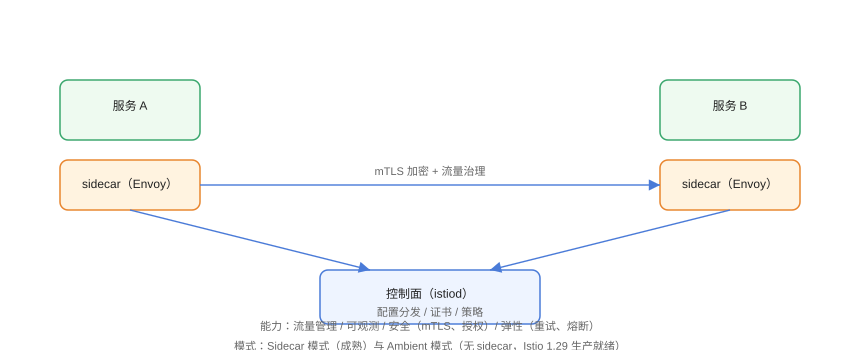

# 服务网格：Istio 流量与安全治理

<p style="text-align:center;"></p>

服务网格（Service Mesh）把**流量控制、可观测性、安全策略**从业务代码里抽出来，统一放到基础设施层：业务只管业务逻辑，网格通过数据面代理完成熔断、重试、灰度、mTLS 与遥测。本页是主题入口，讲清**定位、核心概念、版本现状与 10 分钟快速上手**；架构原理、流量治理、韧性设计、可观测、安全、Ambient 模式、实战与排错分别在下方子页展开。

本主题的版本口径统一按 **Istio 1.31（2026-08-31 发布，2026-09-21 发布 1.31.1）**核对，覆盖 Sidecar 与 Ambient 两种数据面模式。



## 专题导航

### 基础

- [架构原理：控制面、数据面与两种模式](Architecture/index.md)
- [版本演进与升级策略](Version/index.md)

### 流量治理

- [流量管理：匹配、路由与灰度](TrafficManagement/index.md)
- [韧性设计：超时、重试、熔断与限流](Resilience/index.md)

### 运行与安全

- [可观测性：指标、日志与追踪](Observability/index.md)
- [安全：mTLS、身份与授权](Security/index.md)
- [Ambient 模式：无 Sidecar 的分层网格](AmbientMesh/index.md)

### 落地

- [实战：为博客平台接入网格](Practice/index.md)
- [常见问题与排错](FAQ/index.md)

## 一句话定位

**网格解决的是「服务之间的那一段」**——不是网关（南北向入口）、不是注册中心（谁在哪里）、也不是服务框架（业务怎么调）。

| 相邻概念 | 它解决什么 | 与网格的分工 |
| --- | --- | --- |
| 入口网关（Nginx / Ingress） | 外部流量怎么进集群 | 网格管**服务间**（东西向）流量；入口仍可由网关承担，也可换成 Istio Gateway |
| 注册中心（Nacos / Eureka） | 服务实例在哪、健康与否 | 网格从 K8s Service / Endpoints 直接拿地址，通常不需要额外注册中心 |
| 服务框架（Spring Cloud / Dubbo） | 应用内部的调用、熔断、重试 | 网格把这些能力**下沉到代理**；框架内的熔断与网格的熔断会**叠加**，需要明确谁负责 |
| API 网关 | 对外 API 的鉴权、限流、聚合 | 网关是**南北向**且面向「产品 API」，网格是**东西向**且面向「服务调用」 |

::: tip 一句话理解
网格的收益不是「多了几个功能」，而是**这些能力不再由每个业务团队各自实现一遍**；代价是多了一层代理，以及一套新的配置语言要学。
:::

## 核心概念

| 概念 | 英文 | 说明 |
| --- | --- | --- |
| 控制面 | Control Plane | 下发配置、管理证书，Istio 中即 `istiod` |
| 数据面 | Data Plane | 实际转发流量的代理：Envoy Sidecar、ztunnel、waypoint |
| Sidecar | Sidecar | 以业务 Pod 旁路容器运行的 Envoy 代理（一个 Pod 一个） |
| Ambient Mesh | Ambient Mesh | 无需注入 Sidecar：节点级 ztunnel（L4）+ 按需 waypoint（L7） |
| 虚拟服务 | VirtualService | 定义**去哪**：路由、灰度权重、重定向、故障注入 |
| 目标规则 | DestinationRule | 定义**怎么去**：子集、负载均衡、连接池、熔断、TLS |
| 网关 | Gateway | 南北向入口（Istio Gateway 或 Gateway API 的 `Gateway`） |
| mTLS | Mutual TLS | 服务间双向证书认证 + 加密，由 ztunnel / Envoy 自动完成 |
| HBONE | HTTP-Based Overlay Network Encapsulation | Ambient 模式承载 L4 流量的隧道协议 |

工作原理：`istiod` 监听集群资源 → 生成 Envoy / ztunnel 配置（xDS）→ 下发给每个代理 → 代理按配置完成路由、重试、熔断与遥测。**业务容器不感知网格**，应用代码零改动即可获得流量治理能力。

## 版本现状

::: info 版本说明（2026-09 核对）
当前主线为 **Istio 1.31**（1.31.0 / 2026-08-31，最新补丁 1.31.1 / 2026-09-21），官方支持 Kubernetes **1.32 ~ 1.36**。支持策略是 **n+2**：1.29、1.30、1.31 三个 minor 在支持窗口内，**1.28 及更早已 EOL**（1.28 于 2026-07-01 结束支持）。完整时间线与升级路径见 [版本演进与升级策略](Version/index.md)。
:::

## 快速上手

### 安装 Sidecar 模式（default profile）

```shell
# 下载 istioctl
curl -L https://istio.io/downloadIstio | sh -
cd istio-1.31.1
export PATH=$PWD/bin:$PATH

# 安装到集群（profile: demo 便于学习；生产用 default + 自定义 values）
istioctl install --set profile=demo -y

# 给命名空间打标签，自动注入 Sidecar
kubectl label namespace default istio-injection=enabled

# 验证
istioctl version
kubectl get pods -n istio-system
```

### 安装 Ambient 模式（ambient profile）

```shell
# 1. 装控制面（ambient profile 会一并安装 CNI 与 ztunnel）
istioctl install --set profile=ambient --skip-confirmation

# 2. 装 Gateway API CRD（多数集群默认不带，waypoint 与入口都依赖它）
kubectl get crd gateways.gateway.networking.k8s.io &> /dev/null || \
  kubectl apply --server-side -f \
  https://github.com/kubernetes-sigs/gateway-api/releases/download/v1.6.0/experimental-install.yaml

# 3. 把命名空间加入网格（注意：不是 istio-injection，而是 dataplane-mode）
kubectl label namespace default istio.io/dataplane-mode=ambient

# 4. 验证 ztunnel
kubectl get pods -n istio-system -l app=ztunnel
```

### 部署示例应用并验证

```shell
kubectl apply -f samples/bookinfo/platform/kube/bookinfo.yaml
kubectl apply -f samples/bookinfo/networking/bookinfo-gateway.yaml

# 等所有 Pod Ready
kubectl wait --for=condition=Ready pod -l app=productpage --timeout=120s

# 访问入口
kubectl port-forward svc/productpage 8080:9080
```

浏览器访问 <http://localhost:8080/productpage>，反复刷新会看到不同版本的图书评分（v1/v2/v3 随机负载均衡），说明网格已接管服务间流量。

```shell
# 网格自检三件套
istioctl analyze                                   # 配置静态检查，error 必须为 0
istioctl proxy-status                              # 所有代理应为 SYNCED，不能有 NOT SENT
istioctl proxy-config routes deploy/productpage-v1  # 看代理里真实生效的路由
```

## 与库内相邻专题的分工

| 相邻专题 | 分工边界 |
| --- | --- |
| [容器编排进阶](../index.md) | 讲 Helm / Operator / 弹性伸缩 / GitOps 的**整体交付面**；本主题只讲网格这一层 |
| [Kubernetes](../../Kubernetes/index.md) | 讲 K8s 本身的 Service / Ingress / 资源模型；网格是**建立在 Service 之上**的一层 |
| [微服务](../../../Backend/Microservices/index.md) | 讲服务拆分、注册发现、熔断限流、链路追踪的**原理与选型**；本主题讲**用网格怎么落地** |
| [安全加固](../../SecurityHardening/index.md) | 讲基线、漏洞、供应链、密钥的**跨层治理**；本主题的 mTLS 是其中「服务间零信任」这一格的实现 |
| [监控告警](../../Monitoring/index.md) | 讲 Prometheus / Grafana / 告警规则的**体系**；本主题讲网格**产出哪些指标**以及口径怎么对 |

## 参考资料

- Istio 官方文档：<https://istio.io/latest/docs/>
- Istio 支持策略与版本状态：<https://istio.io/latest/docs/releases/supported-releases/>
- Istio 1.31 发布说明：<https://istio.io/latest/news/releases/1.31.x/>
- Ambient 模式总览：<https://istio.io/latest/docs/ambient/overview/>
- Gateway API 文档：<https://gateway-api.sigs.k8s.io/>
