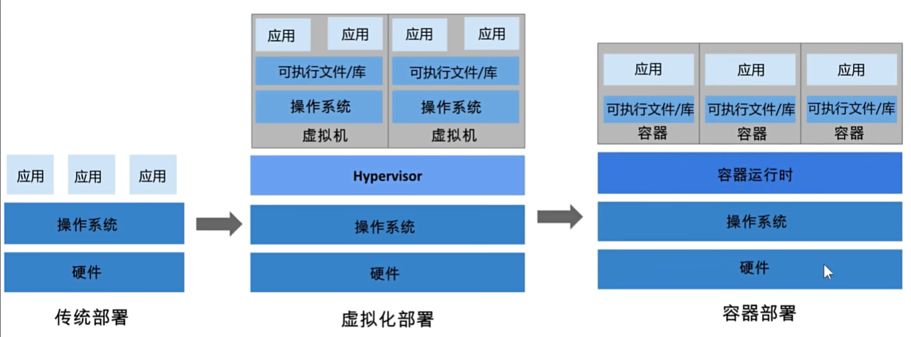

# Docker 容器与沙盒

## 沙盒

沙盒也叫沙箱 (sandbox)。在计算机领域指一种虚拟技术，而且多用于计算机安全技术。安全软件可以让它在沙盒中运行，如果含有恶意行为，则禁止程序的进一步运行，而这不会对系统造成任何危害。

## 容器

容器是完全使用沙箱机制，相互之间不会有任何接口（类似 iPhone 的 app）,更重要的是容器性能开销极低。不依赖于任何语言、框架或者包装系统。

## 容器与沙盒的关系

沙盒是一种「隔离执行环境」的思路，容器则是这种思路在操作系统层面的工程实现。它们的关系可以这样理解：

| 概念 | 说明 |
| --- | --- |
| 沙盒（Sandbox） | 限制程序访问范围的安全机制，核心是「进程看不到、碰不到不该碰的东西」 |
| 容器（Container） | 基于 Linux 命名空间与 cgroups 实现的轻量级沙盒，运行的是完整应用 |

与虚拟机相比，容器不虚拟化整台机器，而是直接复用宿主机内核，因此启动快、开销低；隔离性则由内核机制保证，而不是硬件虚拟化。

## 容器用到的隔离技术

Docker 容器主要依赖三类 Linux 内核机制：

1. **命名空间（Namespace）**：隔离进程树（PID）、网络（NET）、文件系统挂载点（MNT）、用户（USER）、主机名（UTS）、进程间通信（IPC）等，让容器内的进程「以为」自己独占一台机器。
2. **控制组（cgroups）**：限制和统计容器使用的 CPU、内存、磁盘 IO、网络带宽，防止单个容器拖垮宿主机。
3. **联合文件系统（UnionFS）**：把镜像的多个只读层与容器可写层叠加，实现镜像共享与写时复制。

::: tip 一句话理解
容器 = 命名空间做「看不见」+ cgroups 做「用不多」+ UnionFS 做「省空间」。
:::

## 容器的边界与限制

容器隔离的是「资源视图」和「资源配额」，但不是完整的安全边界：

- 容器与宿主机共享内核，内核漏洞可能影响所有容器。
- 默认情况下，容器内 root 与宿主机 root 是同一个内核用户，需要配合非 root 运行、capabilities 裁剪、seccomp 等加固（见「安全加固」）。
- 数据持久化、网络端口映射需要显式配置（见「数据卷与挂载最佳实践」「网络模式深入」）。

## 容器、沙盒与虚拟机对比

| 维度 | 沙盒 | 容器 | 虚拟机 |
| --- | --- | --- | --- |
| 隔离级别 | 进程级策略 | 内核命名空间 + cgroups | 硬件虚拟化 |
| 共享内核 | 是 | 是 | 否（独立 Guest OS） |
| 启动速度 | 极快 | 秒级 | 分钟级 |
| 资源开销 | 极低 | 低 | 高 |
| 安全边界 | 视实现而定 | 中等（依赖加固） | 较强 |

::: danger 常见误解
1. 「容器就是轻量虚拟机」：容器共享宿主机内核，没有自己的内核，隔离边界和虚拟机完全不同。
2. 「容器内 root 就是普通用户」：默认配置下容器内 root 映射到宿主机 root，必须通过 `USER`、capabilities、seccomp 等手段降权。
3. 「沙盒能防住一切」：沙盒只是提高攻击成本，内核漏洞、错误挂载（如 docker.sock）都可能突破边界。
:::

## 验证方式

1. 启动一个容器并查看进程：`docker run -d --name demo nginx:stable-alpine`，然后 `docker top demo`。
2. 在容器内执行 `ps -ef`，只能看到容器自己的进程，看不到宿主机进程（PID 命名空间隔离）。
3. 用 `docker stats demo` 查看该容器的资源占用。
4. 对比宿主机 `ps -ef`，确认容器进程只是宿主机上的普通进程，这就是「共享内核」的直接证据。

## 参考资料

- Docker 底层技术（官方博客）：https://www.docker.com/blog/containers-101/
- Linux Namespaces：https://man7.org/linux/man-pages/man7/namespaces.7.html
- cgroups 简介：https://docs.kernel.org/admin-guide/cgroup-v2.html
