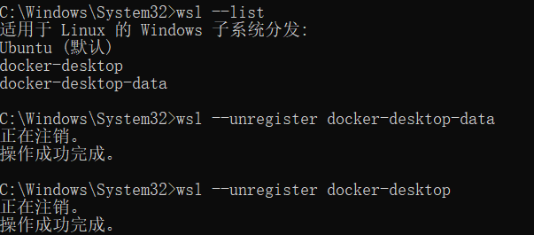

# Docker 常见错误

## Windows / WSL2 问题

> deploying WSL2 distributions provisioning docker WSL distros: ensuring main distro is deployed: checking if main distro is up to date: checking main distro bootstrap version: getting main distro bootstrap version: exit code: 4294967295: running WSL command wsl.exe C:\WINDOWS\System32\wsl.exe -d docker-desktop -u root -e wsl-bootstrap version: 无法将磁盘“ HOME \AppData\Local\Docker\wsl\distro\ext4.vhdx”附加到 WSL2： 系统找不到指定的路径。 Error code: Wsl/Service/CreateInstance/MountVhd/HCS/ERROR_PATH_NOT_FOUND : exit status 0xffffffff checking if isocache exists: CreateFile \\wsl$\docker-desktop-data\isocache\: The network name cannot be found.

解决方法

1. 打开管理员终端，运行`wsl --list`命令获取所有wsl分发：

   ```shell
   wsl --list
   ```

2. 运行`wsl --unregister docker-desktop-data`命令：

   ```shell
   wsl --unregister docker-desktop-data
   ```

3. 运行`wsl --unregister docker-desktop`命令：

   ```shell
   wsl --unregister docker-desktop
   ```

4. 重启docker-desktop即可



## Linux 与通用问题

### 1. Cannot connect to the Docker daemon

```text
Cannot connect to the Docker daemon at unix:///var/run/docker.sock. Is the docker daemon running?
```

依次排查：

```shell
sudo systemctl status docker
sudo systemctl start docker
sudo systemctl enable docker
```

如果是权限问题（提示 permission denied），把用户加入 docker 组后重新登录；生产环境建议用 rootless 模式。

### 2. port is already allocated

```text
Error response from daemon: driver failed programming external connectivity on endpoint xxx: Bind for 0.0.0.0:8080 failed: port is already allocated
```

原因：宿主机端口被其他容器或进程占用。

```shell
docker ps -a | grep 8080
sudo lsof -i :8080
```

解决：换端口，或先停掉占用端口的容器/进程。

### 3. no space left on device

容器日志、镜像、数据卷占满磁盘时常见。先看占用再清理：

```shell
docker system df
docker system prune
```

日志轮转建议在 `daemon.json` 全局配置，避免反复出现：

```json [daemon.json]
{
  "log-driver": "json-file",
  "log-opts": {
    "max-size": "10m",
    "max-file": "3"
  }
}
```

### 4. 删除镜像提示 conflict

```text
Error response from daemon: conflict: unable to delete xxx (must be forced) - image is being used by stopped container
```

镜像正被容器引用。先删除引用它的容器，再删镜像：

```shell
docker ps -a --filter ancestor=<镜像名或ID>
docker rm <容器ID>
docker rmi <镜像ID>
```

确认容器不再需要后再删除，不要无脑 `-f`。

### 5. 拉取镜像超时或 DNS 解析失败

```text
Get "https://registry-1.docker.io/v2/": dial tcp: lookup registry-1.docker.io: no such host
```

排查顺序：

1. 宿主机 DNS 是否正常：`ping registry-1.docker.io`。
2. 是否配置了 registry mirror（`docker info` 查看 Registry Mirrors）。
3. 是否使用了内网代理，代理是否可达。
4. 需要凭据的私有仓库先 `docker login`。

## 验证方式

1. 处理完错误后执行 `docker ps` 无报错。
2. 对应容器 `docker logs` 无新增异常。
3. `docker system df` 磁盘占用回到合理区间。
4. 重启 Docker 服务后业务容器按重启策略自动拉起。

更多高频问题与生产自查清单见「常见问题与最佳实践」。
