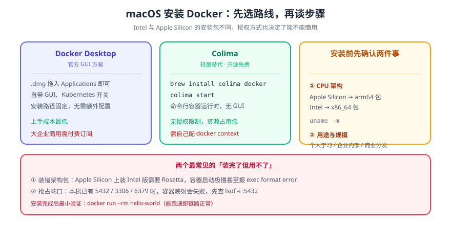

# MacOS 安装 Docker

> macOS 上跑 Docker 的路线只有两条：**官方的 Docker Desktop**（一个 .app 把引擎、CLI、Compose 全带上），或者**轻量替代**（Colima / OrbStack，用命令行管一个 Linux 虚拟机）。本页讲前者，并给出可核对的版本与许可边界。



## 一句话定位

macOS 没有 Linux 内核，所以「在 Mac 上装 Docker」本质上是**装一个 Linux 虚拟机 + 一个把 CLI 命令转发进去的守护进程**。理解这一点，后面所有限制（内存上限、磁盘镜像文件越来越大、文件挂载性能）都能解释。

## 一、系统要求（2026-10 核对）

| 项 | 官方要求 | 说明 |
| --- | --- | --- |
| macOS 版本 | **当前版本 + 前两个大版本**（2026 年为 macOS 15 / 14 / 13） | 官方策略是「新大版本发布即淘汰最旧一个」，升级系统前先确认还在支持窗口内 |
| 芯片 | Apple silicon 或 Intel | 两种构建产物不同，下载时别选错 |
| 内存 | ≥ **4 GB** | 这是「能跑」的下限；跑起 Compose 多服务建议 8 GB 起 |
| 磁盘 | 安装包约 600 MB | 之后虚拟机磁盘文件会持续增长，建议预留 20 GB 以上 |
| Rosetta 2 | Apple silicon 上**已非强制** | 少数命令行工具（Darwin/AMD64 构建）仍需要，可用 `softwareupdate --install-rosetta` 补装 |

::: warning 许可边界不是小事
Docker Desktop 对**大企业商用**需要付费订阅：员工数少于 250 **且** 年收入低于 1000 万美元的小企业、个人使用、教育与非商业开源项目免费；政府实体一律需要订阅。团队落地前先确认自己落在哪一档——换成 Colima / OrbStack 加 Docker CLI 是常见的合规替代路径。
:::

## 二、安装步骤（两种方式，选一种）

### 方式 A：图形界面（推荐给第一次装）

1. 从 Docker 官网下载与芯片匹配的 `Docker.dmg`；
2. 双击打开，把 Docker 图标**拖进 Applications 文件夹**；
3. 在「应用程序」里双击 `Docker.app` 启动；
4. 首次启动会要求输入密码以安装特权辅助工具（`Install Helper`）——**这一步必须同意**，否则守护进程起不来；
5. 菜单栏出现小鲸鱼图标，等到它从动画变静止、菜单显示 `Docker Desktop is running`。

::: danger 两个常见卡点
1. **不要从第三方站点下载 dmg**：非官方构建可能被 macOS 判定为「已损坏」。正确做法是官网下载；若仍报错，见官方「Docker.app is damaged on macOS」修复说明。
2. **安装前退出会调用 Docker 的工具**（VS Code、终端、agent 类应用）：官方明确要求更新前先退出，否则安装/更新会失败或留下半安装状态。
:::

### 方式 B：命令行安装

```shell
# 下载 Docker.dmg 之后（安装到 /Applications，首次运行需几分钟做安全校验）
sudo hdiutil attach Docker.dmg
sudo /Volumes/Docker/Docker.app/Contents/MacOS/install --accept-license
sudo hdiutil detach /Volumes/Docker
```

`install` 支持的常用参数：

| 参数 | 作用 |
| --- | --- |
| `--accept-license` | 安装时即接受订阅协议，避免首次启动再弹一次 |
| `--user=<用户名>` | 安装时一次完成特权配置，之后首次运行不再要 root |
| `--allowed-org=<组织>` | 要求使用者登录并属于指定 Docker Hub 组织（团队统一管控用） |

### 方式 C：轻量替代（无桌面应用）

```shell
# Colima：用 Homebrew 装一个 CLI 驱动的 Linux 虚拟机，再接入 Docker CLI
brew install colima docker docker-compose
colima start --cpu 4 --memory 8        # 按机器规格调整
```

适合「只要 CLI、不要桌面 App」的场景，内存占用通常低于 Docker Desktop；代价是没有 GUI（镜像列表、卷管理都得命令行看）。

## 三、启动与验证

```shell
# ① 启停都可用 CLI（Docker Desktop 4.x 起）
docker desktop start
docker desktop status                 # 期望：Docker Desktop is running

# ② 客户端与引擎都要在——只有 Client 没有 Server，说明引擎还没起来
docker version
# 期望：Client 与 Server 两段都有，Server 段含 Engine 版本号

# ③ 跑一次 hello-world：能拉镜像 + 能起容器 = 端到端通了
docker run --rm hello-world
# 期望：输出 "Hello from Docker!"，随后容器被 --rm 清掉

# ④ Compose v2 是随 Desktop 一起装的插件，不是独立二进制
docker compose version
# 期望：Docker Compose version v2.x
```

::: tip 验证顺序有讲究
先 `docker version` 看两段，再 `docker run` 走端到端。跳过后面的直接跑 `docker build`，遇到报错时你分不清是**引擎没起**还是**构建脚本有问题**。
:::

## 四、装完之后第一件事：调资源上限

虚拟机默认的 CPU / 内存 / 磁盘分配通常是「保守值」，而 Compose 拉起五个服务很容易顶到上限。在 `Settings → Resources` 里显式设置：

| 项 | 建议 | 为什么 |
| --- | --- | --- |
| CPUs | 宿主核数的一半以上 | 构建镜像时并行度直接受它限制 |
| Memory | 8 GB 起（宿主 16 GB） | 多服务 + MySQL + Redis 的真实占用 |
| Disk image | 60 GB 起 | 镜像层只增不减，空间不足时报错难懂 |

```shell
# 看实际分配与磁盘占用
docker info | grep -E 'CPUs|Total Memory|Docker Root Dir'
docker system df                      # 四类占用：镜像 / 容器 / 卷 / 构建缓存
```

## 五、卸载

见 [MacOS 卸载 Docker](../MacOSUninstall/index.md)——卸载要清的不只是 `/Applications/Docker.app`，还有虚拟机磁盘镜像与配置目录，漏了会残留几十 GB。

## 六、问题排查

| 现象 | 原因 | 处置 |
| --- | --- | --- |
| 卡在 `Docker Desktop is starting` | 首次启动的特权辅助工具未授权 | 退出 App，重新启动并同意安装 Helper |
| `Cannot connect to the Docker daemon` | 引擎未启动 | `docker desktop start`，或看菜单栏图标状态 |
| `docker version` 只有 Client | 同上（CLI 与引擎是两件事） | 启动引擎后重试 |
| 拉镜像一直失败 | 网络 / 镜像源问题 | 在 `Settings → Docker Engine` 配 registry mirrors |
| 磁盘突然不够 | 镜像层与构建缓存堆积 | `docker system prune -a`（**会删未使用的镜像与卷，先确认**） |

## 七、深入阅读

- [Docker 安装/卸载总览](../index.md) ｜ [Windows 安装](../WindowsInstall/index.md) ｜ [Linux 安装](../LinuxInstall/index.md)
- [MacOS 卸载 Docker](../MacOSUninstall/index.md)
- Docker 官方文档 · Install Docker Desktop on Mac：[docs.docker.com/desktop/setup/install/mac-install](https://docs.docker.com/desktop/setup/install/mac-install/)
