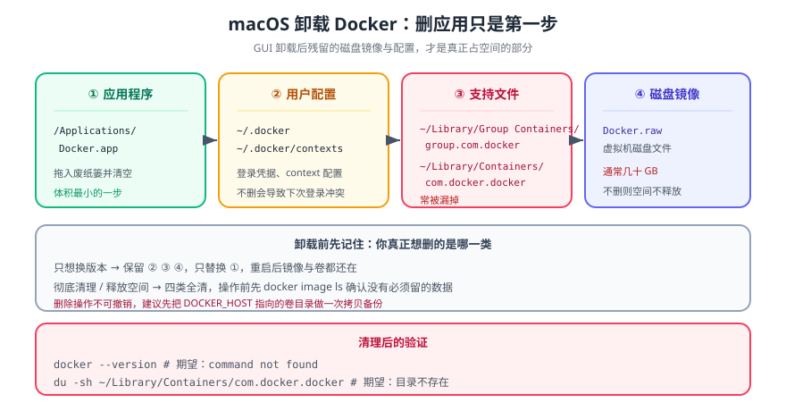

# MacOS 卸载 Docker

> 卸载分两步：**先跑官方卸载器**（会带着你清特权辅助工具与自启动项），**再手工清残留**。只删 `/Applications/Docker.app` 是最常见的错——那会留下几十 GB 的虚拟机磁盘镜像和一堆配置目录。



## 一句话定位

macOS 上的 Docker 数据不在一个地方：应用在 `/Applications`、虚拟机磁盘在 `~/Library/Containers`、CLI 配置在 `~/.docker`、符号链接在 `/usr/local/bin`。**卸载 = 这四处都清**，顺序是先官方卸载器、后手工补刀。

## 一、卸载前：把要留的东西先拿走

```shell
# ① 列出所有容器与卷，确认没有还要的数据
docker ps -a
docker volume ls

# ② 需要留的镜像先导出（导出后即使卸载也能再导入）
docker save -o ~/backup/my-image.tar my-image:latest

# ③ 需要留的卷数据先拷出来（卷不能直接导出为 tar，用临时容器挂载拷）
docker run --rm -v my-volume:/data -v "$HOME/backup:/out" alpine \
  tar czf /out/my-volume.tar.gz -C /data .
```

::: danger 卸载会丢掉全部镜像、容器与卷
官方卸载器会删除虚拟机磁盘镜像，**里面的镜像、容器、命名卷、构建缓存一起没了**。第 ①~③ 步不是可选项——先备份，再卸载，顺序反了就只能重拉。
:::

## 二、第一步：官方卸载器

1. 启动 Docker Desktop；
2. 点菜单栏鲸鱼图标 → **Troubleshoot**（疑难解答）；
3. 点 **Uninstall**（卸载），确认后它会：
   - 停止并移除特权辅助工具与后台服务；
   - 删除自启动项；
   - 退出应用。

```shell
# 卸载器跑完之后确认没有残留进程
pgrep -fl -i docker | grep -v grep || echo "no docker process"
```

## 三、第二步：手工清理残留

```shell
# ① 应用本体与 CLI 符号链接
sudo rm -rf /Applications/Docker.app
sudo rm -f /usr/local/bin/docker /usr/local/bin/docker-compose \
           /usr/local/bin/docker-credential-desktop
# 注意：Compose v2 是 Desktop 的插件，不需要单独删二进制；
# 如果你另外用 Homebrew 装过 docker CLI，那是另一个来源，别一起删。

# ② 配置与凭据（含登录令牌，建议删）
rm -rf ~/.docker

# ③ 虚拟机磁盘镜像与设置（占用最大的一处）
rm -rf ~/Library/Containers/com.docker.docker
rm -rf ~/Library/Group\ Containers/group.com.docker
rm -rf ~/Library/Application\ Support/Docker\ Desktop
rm -rf ~/Library/Logs/Docker\ Desktop

# ④ 辅助工具与插件残留（存在才删）
sudo rm -rf /Library/PrivilegedHelperTools/com.docker.vmnetd
sudo rm -f  /Library/LaunchDaemons/com.docker.vmnetd.plist
```

::: warning `~/Library/Containers/com.docker.docker` 里是什么
它是 Docker Desktop 的**虚拟机磁盘镜像**——镜像、容器、卷全在里面。这也解释了为什么「删了 App 磁盘还是满的」：占空间的从来是它，不是 App。
:::

## 四、第三步：验证清干净

```shell
# ① 命令不在了
which docker || echo "docker CLI removed"        # 期望：docker CLI removed
which docker-compose || echo "compose removed"   # 期望：compose removed

# ② 目录不在了（四条都应输出 "gone"）
for d in "/Applications/Docker.app" "$HOME/.docker" \
         "$HOME/Library/Containers/com.docker.docker" \
         "$HOME/Library/Group Containers/group.com.docker"; do
  [ -e "$d" ] && echo "STILL THERE: $d" || echo "gone: $d"
done

# ③ 没有进程在跑
pgrep -fl -i docker | grep -v grep || echo "no docker process"

# ④ 拿回磁盘空间（对比卸载前 df 输出）
df -h / | tail -1
```

四条都符合预期，才算卸载完成。**③ 是判据里最容易被跳过的一条**——进程还在时删目录不会立刻报错，但重启后又会出现残留服务。

## 五、只想「停掉」而不是卸载

| 目标 | 做法 |
| --- | --- |
| 临时停引擎（释放内存） | `docker desktop stop` |
| 释放磁盘但不丢数据 | `docker system prune` / `docker builder prune`（**先确认 `docker system df`**） |
| 换用轻量运行时 | 卸载 Desktop 后装 Colima / OrbStack，`docker` CLI 可继续用 |
| 只想取消自启动 | `Settings → General` → 取消 `Start Docker Desktop when you sign in` |

## 六、深入阅读

- [Docker 安装/卸载总览](index.md) ｜ [MacOS 安装 Docker](MacOSInstall/index.md)
- [Linux 卸载 Docker](LinuxUninstall/index.md)（存储目录与 systemd 侧的清理口径）
- Docker 官方文档 · Docker Desktop for Mac：[docs.docker.com/desktop/setup/install/mac-install](https://docs.docker.com/desktop/setup/install/mac-install/)
