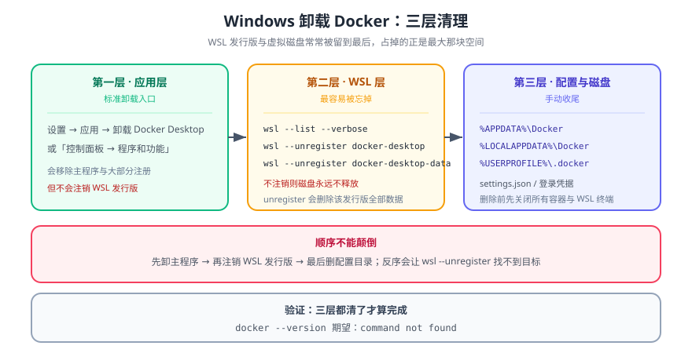

# Windows 卸载 Docker

> Windows 上的 Docker 由三层组成：**Docker Desktop 应用**、**WSL2 里的两个发行版**（`docker-desktop`、`docker-desktop-data`）、以及**主机上的数据目录**。只从「应用和功能」里卸载，WSL 侧会留下一个几 GB 的发行版。



## 一句话定位

卸载顺序必须是「**先退应用 → 再卸程序 → 最后清 WSL 发行版与数据目录**」。顺序反了会出问题：WSL 发行版还在被 Docker Desktop 占用时 `wsl --unregister` 会静默失败，于是你以为什么都清了，磁盘却没变。

## 一、卸载前：确认没有要留的数据

```powershell
# ① 容器、卷、镜像清单
docker ps -a
docker volume ls
docker images

# ② 需要留的镜像导出为 tar
docker save -o $HOME\backup\my-image.tar my-image:latest

# ③ 需要留的卷数据拷出来
docker run --rm -v my-volume:/data -v ${HOME}/backup:/out alpine `
  tar czf /out/my-volume.tar.gz -C /data .
```

::: danger 卸载会清掉 WSL 发行版里的全部数据
`docker-desktop-data` 这个 WSL 发行版承载着**镜像、容器与卷**。`wsl --unregister` 之后数据不可恢复。第 ①~③ 步要先做完。
:::

## 二、第一步：退出 Docker Desktop

```powershell
# 从托盘退出（不要只在任务管理器里结束进程——缩略图、后台服务会残留）
# 也可以用 CLI（Docker Desktop 4.x 起）
docker desktop stop
docker desktop status        # 期望：Docker Desktop is stopped

# 确认没有残留进程
Get-Process | Where-Object { $_.ProcessName -like '*docker*' } | Select-Object ProcessName
# 期望：无输出
```

## 三、第二步：卸载应用

1. 打开 **设置 → 应用 → 已安装的应用**；
2. 找到 **Docker Desktop** → 更多（`...`）→ **卸载**；
3. 走完卸载向导（会移除服务、自启动项与 `com.docker.service`）。

```powershell
# 也可以用 winget 卸载（自动匹配已安装的包）
winget uninstall Docker.DockerDesktop
```

## 四、第三步：清 WSL 发行版（最容易被漏掉的一步）

```powershell
# ① 看还有哪些发行版（应能看到 docker-desktop 与 docker-desktop-data）
wsl --list --verbose

# ② 逐个注销（顺序：先 data 后 desktop 也行，但两个都必须做）
wsl --unregister docker-desktop-data
wsl --unregister docker-desktop

# ③ 确认列表里已经没有了
wsl --list --verbose
# 期望：docker-desktop / docker-desktop-data 都不再出现（其他发行版如 Ubuntu 保留）

# ④ 顺手回收虚拟磁盘（WSL2 的 vhdx 不会自动缩小）
wsl --shutdown
```

::: warning 别把别的发行版一起注销
`wsl --unregister` 是**逐个**注销，且**不确认就执行**。上面写的是明确的两个名字；如果你的开发环境用的是 `Ubuntu`，千万不要顺手把 `Ubuntu` 也注销掉。
:::

## 五、第四步：清主机数据目录

```powershell
# 配置、日志、缓存（都确认存在才删）
Remove-Item -Recurse -Force "$env:APPDATA\Docker"            -ErrorAction SilentlyContinue
Remove-Item -Recurse -Force "$env:LOCALAPPDATA\Docker"       -ErrorAction SilentlyContinue
Remove-Item -Recurse -Force "$env:ProgramData\DockerDesktop" -ErrorAction SilentlyContinue

# 凭据（登录令牌）在 Windows 凭据管理器里，GUI 路径：
#   控制面板 → 用户帐户 → 凭据管理器 → Windows 凭据 → 删除 Docker 相关条目
```

## 六、第五步：验证清干净

```powershell
# ① CLI 不在了
Get-Command docker -ErrorAction SilentlyContinue    # 期望：无输出
Get-Command docker-compose -ErrorAction SilentlyContinue  # 期望：无输出

# ② 进程与服务的痕迹都没了
Get-Process -Name '*docker*' -ErrorAction SilentlyContinue      # 期望：无输出
Get-Service -Name '*docker*' -ErrorAction SilentlyContinue      # 期望：无输出

# ③ WSL 发行版已清（只剩你自己的发行版）
wsl --list --verbose

# ④ 目录已清（五条都应打印 gone）
foreach ($d in @("$env:APPDATA\Docker","$env:LOCALAPPDATA\Docker","$env:ProgramData\DockerDesktop")) {
  if (Test-Path $d) { Write-Host "STILL THERE: $d" } else { Write-Host "gone: $d" }
}
```

## 七、只想「停掉」而不是卸载

| 目标 | 做法 |
| --- | --- |
| 释放内存 | 托盘图标 → 退出 Docker Desktop（引擎停，数据留着） |
| 释放磁盘但保留数据 | `docker system prune` / `docker builder prune`（**先 `docker system df` 看清楚**） |
| 取消自启动 | 设置 → General → 取消 `Start Docker Desktop when you sign in` |
| 改用 WSL 内原生 Docker | 卸载 Desktop，改在 WSL 发行版里直接装 Docker Engine（无 GUI，`docker` 走 Unix socket） |

## 八、深入阅读

- [Docker 安装/卸载总览](../index.md) ｜ [Windows 安装](../WindowsInstall/index.md)
- [Linux 卸载 Docker](../LinuxUninstall/index.md) ｜ [MacOS 卸载 Docker](../MacOSUninstall/index.md)
- Docker 官方文档 · Install Docker Desktop on Windows：[docs.docker.com/desktop/setup/install/windows-install](https://docs.docker.com/desktop/setup/install/windows-install/)
