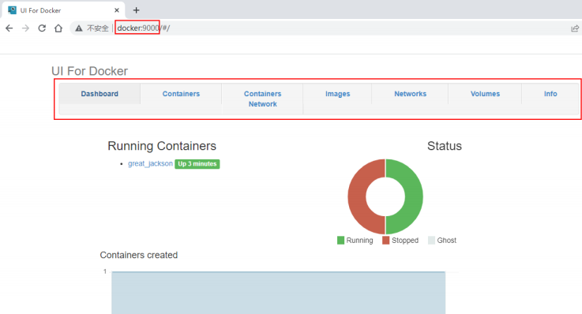

# Docker 管理平台

::: info 版本现状
Portainer 社区版镜像为 `portainer/portainer-ce:latest`，版本持续迭代；管理平台入口务必加鉴权，避免直接暴露公网。运行安全相关建议参见「安全加固」。
:::

当 Docker引擎中管理的镜像、容器、网络等对象数量变得越来越多时，通过简单的 docker命令来管理已经显得使人力不从心了。于是就出现了很多的 Docker 可视化管理平台。

## Docker UI

DockerUI 是一个开源的基于 Docker API 的 web 应用程序，提供等同 Docker 命令行的大部分功能，支持 container 管理，image 管理。它最值得称道的是它华丽的设计和用来运行和管理 docker 的简洁的操作界面。

其支持容器的批量操作，支持镜像管理。但不支持多集群管理。

**安装**：

1. **拉取镜像**：

   ```shell
   docker pull uifd/ui-for-docker
   ```

2. **启动容器**：

   ```shell
   docker run -d -p 9000:9000 -v /var/run/docker.sock:/var/run/docker.sock uifd/ui-for-docker
   ```

3. **访问**：在浏览器中通过 docker 主机的 IP 及 9000 端口号可以打开 docker 管理平台。在管理平台中，通过导航栏可打开相关 docker 对象的的管理页面。

   

## Portainer

Portainer 是一个可视化的容器镜像的图形管理工具，利用 Portainer 可以轻松构建，管理和维护 Docker 环境。 而且完全免费，基于容器化的安装方式，方便高效部署。

官网：https://www.portainer.io/

**安装**：

1. **拉取镜像**：

   ```shell
   docker pull portainer/portainer-ce
   ```

2. **新建数据卷**：

   ```shell
   docker volume create port
   ```

3. **启动容器**：为了使用http协议新增了9000端口

   ```shell
   docker run -d -p 8000:8000 -p 9443:9443 -p 9000:9000 \
   --name portainer \
   --restart=always \
   -v /var/run/docker.sock:/var/run/docker.sock \
   -v portainer_data:/data \
   portainer/portainer-ce:latest
   ```

4. **访问**：

   - 通过 http 协议访问9000端口
   - 通过 https 协议访问9443端口
