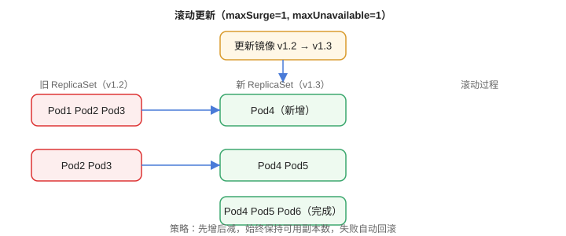

# Deployment 与工作负载

Deployment 是**无状态应用**的标准工作负载对象：它管理 ReplicaSet，负责副本数、滚动更新、回滚和自愈。这一篇还对比 StatefulSet、DaemonSet、Job 等场景。

## Deployment 的作用

```text
Deployment
└── ReplicaSet（版本快照）
    └── Pod × N（模板一致）
```

1. 保证指定数量的副本始终运行。
2. 更新镜像时执行滚动更新。
3. 更新失败自动回滚。

## 示例

```yaml [deployment.yaml]
apiVersion: apps/v1
kind: Deployment
metadata:
  name: web
spec:
  replicas: 3
  selector:
    matchLabels:
      app: web
  strategy:
    type: RollingUpdate
    rollingUpdate:
      maxUnavailable: 1
      maxSurge: 1
  template:
    metadata:
      labels:
        app: web
    spec:
      containers:
        - name: web
          image: myapp:1.2
          ports:
            - containerPort: 8080
```



## 滚动更新策略

| 参数 | 含义 | 建议 |
| --- | --- | --- |
| `maxUnavailable` | 更新期间允许不可用的最大副本数 | 默认 25%，可配 1 |
| `maxSurge` | 更新期间允许超出期望副本的最大数 | 默认 25%，可配 1 |

```shell
# 更新镜像
kubectl set image deployment/web web=myapp:1.3

# 查看滚动状态
kubectl rollout status deployment/web

# 回滚
kubectl rollout undo deployment/web

# 查看历史版本
kubectl rollout history deployment/web
```

## 扩缩容

```shell
# 手动
kubectl scale deployment/web --replicas=5

# 自动（需要 Metrics Server）
kubectl autoscale deployment/web --min=2 --max=10 --cpu-percent=70
```

## 其他工作负载

| 对象 | 场景 | 特点 |
| --- | --- | --- |
| StatefulSet | 数据库、有状态服务 | 稳定网络标识、有序部署、配合 PVC |
| DaemonSet | 每个节点跑一个（日志、监控） | 节点增删自动跟随 |
| Job | 一次性任务 | 执行完退出 |
| CronJob | 定时任务 | 按 Cron 表达式触发 Job |

## 易错点

::: danger 常见错误
1. `selector` 与模板 labels 不一致：Deployment 报错或无法匹配 Pod。
2. 更新后 Pod 一直 CrashLoop：readiness 探针失败导致滚动更新卡住，先看 describe。
3. 无状态应用用 StatefulSet：过度设计，默认用 Deployment。
4. 数据库用 Deployment：数据会丢，用 StatefulSet + PVC。
5. 滚动更新太快/太慢：`maxUnavailable` 与 `maxSurge` 未按业务调整。
6. 回滚前不看历史：`rollout undo` 回退到上一个版本，确认版本顺序。
:::

## 验证方式

1. `kubectl apply -f deployment.yaml && kubectl get deployment`。
2. `kubectl rollout status deployment/web` 看到 `successfully rolled out`。
3. `kubectl get rs` 观察新旧 ReplicaSet 并存，滚动完成后旧的缩为 0。

## 参考资料

- Deployment 文档：https://kubernetes.io/zh-cn/docs/concepts/workloads/controllers/deployment/
- 滚动更新：https://kubernetes.io/zh-cn/docs/concepts/workloads/controllers/deployment/#updating-a-deployment
- StatefulSet：https://kubernetes.io/zh-cn/docs/concepts/workloads/controllers/statefulset/
