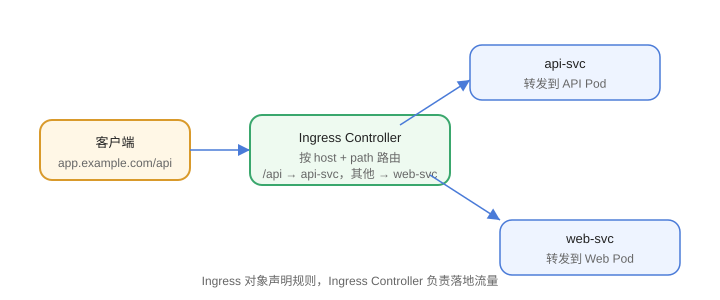

# Ingress 入口

Service 解决“集群内/节点级”访问，Ingress 解决“按域名和路径路由到 Service”的**七层入口**问题。Ingress 只是规则，真正干活的是 **Ingress Controller**。



## Ingress 与 Ingress Controller

| 组件 | 作用 |
| --- | --- |
| Ingress（对象） | 声明路由规则（域名、路径 → Service） |
| Ingress Controller | 实际部署的入口代理（Nginx、Traefik、ALB 等） |

只创建 Ingress 对象不会生效，必须先安装 Ingress Controller。

## 安装 Nginx Ingress Controller

```shell
kubectl apply -f https://raw.githubusercontent.com/kubernetes/ingress-nginx/controller-v1.12.1/deploy/static/provider/cloud/deploy.yaml
kubectl get pods -n ingress-nginx
```

## Ingress 规则示例

```yaml [ingress.yaml]
apiVersion: networking.k8s.io/v1
kind: Ingress
metadata:
  name: web-ingress
  annotations:
    nginx.ingress.kubernetes.io/rewrite-target: /
spec:
  ingressClassName: nginx
  rules:
    - host: app.example.com
      http:
        paths:
          - path: /api
            pathType: Prefix
            backend:
              service:
                name: api-svc
                port:
                  number: 80
          - path: /
            pathType: Prefix
            backend:
              service:
                name: web-svc
                port:
                  number: 80
```

## 常见注解

| 注解 | 作用 |
| --- | --- |
| `nginx.ingress.kubernetes.io/rewrite-target` | 路径重写 |
| `nginx.ingress.kubernetes.io/ssl-redirect` | 强制 HTTPS |
| `nginx.ingress.kubernetes.io/proxy-body-size` | 请求体大小限制 |
| `nginx.ingress.kubernetes.io/limit-rps` | 限流 |

## HTTPS

```yaml [ingress-tls.yaml]
spec:
  tls:
    - hosts:
        - app.example.com
      secretName: app-tls
```

证书放在同命名空间的 Secret 中（类型 `kubernetes.io/tls`）。配合 cert-manager 可自动签发 Let's Encrypt 证书。

## 易错点

::: danger 常见错误
1. 没装 Ingress Controller：Ingress 对象创建成功但没有任何流量进入。
2. `ingressClassName` 与控制器不匹配：规则不生效。
3. `pathType` 写错：Exact 与 Prefix 语义不同，路径匹配结果不符合预期。
4. 后端 Service 的 Endpoints 为空：Ingress 转发 502/404。
5. 多个 Ingress 的 host 冲突：同名 host 规则合并/覆盖，难排查。
6. 忘记 DNS：域名要解析到 Ingress Controller 的 LoadBalancer 地址。
:::

## 验证方式

1. `kubectl get ingress` 确认 ADDRESS 不为空。
2. `curl -H "Host: app.example.com" http://<controller-ip>/api` 验证路由。
3. `kubectl describe ingress web-ingress` 查看规则详情。

## 相关专题

- [服务网格](../../ContainerOrchestration/ServiceMesh/index.md)：用 Istio Gateway/VirtualService 做更精细的流量治理与灰度
- [容器编排进阶](../../ContainerOrchestration/index.md)：生产环境多入口统一治理

## 参考资料

- Ingress 文档：https://kubernetes.io/zh-cn/docs/concepts/services-networking/ingress/
- ingress-nginx：https://kubernetes.github.io/ingress-nginx/
- cert-manager：https://cert-manager.io/docs/
