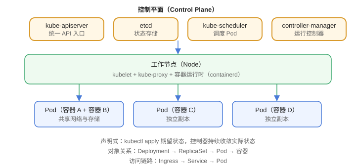

# 核心概念与架构

Kubernetes（简称 K8s）是**容器编排平台**：你告诉它“我要跑 3 个 Nginx”，它负责调度、拉起、监控、故障自愈和滚动更新。它是 CNCF 毕业项目，也是云原生事实标准。

::: info 版本现状（2026-08 核对）
Kubernetes 当前最新稳定版为 **v1.37（Garhwal）**，2026-08-26 发布；上一版为 v1.36（2026-04）。官方同时维护最近 3 个次要版本（v1.35 / v1.36 / v1.37）。
:::

## 能解决什么问题

1. **调度**：自动把容器调度到合适的节点。
2. **自愈**：容器挂了自动重启、节点挂了自动迁移。
3. **扩缩容**：按指标自动增加/减少副本。
4. **滚动更新**：发布新版本不中断服务，失败自动回滚。
5. **服务发现**：Service + DNS 让服务互相访问。

## 集群架构



### 控制平面（Control Plane）

| 组件 | 作用 |
| --- | --- |
| kube-apiserver | 所有操作的唯一入口（REST API） |
| etcd | 集群状态存储（键值数据库） |
| kube-scheduler | 决定 Pod 调度到哪个节点 |
| kube-controller-manager | 运行各类控制器（Deployment、Node 等） |

### 工作节点（Node）

| 组件 | 作用 |
| --- | --- |
| kubelet | 节点代理，负责 Pod 生命周期 |
| kube-proxy | 实现 Service 的网络转发 |
| 容器运行时 | containerd / CRI-O（Docker 已不再直接支持） |

## 核心对象

| 对象 | 作用 | 层级 |
| --- | --- | --- |
| Pod | 最小调度单元，一个或多个容器 | 底层 |
| Deployment | 管理无状态应用副本与滚动更新 | 工作负载 |
| Service | 稳定的访问入口与负载均衡 | 网络 |
| Ingress | 域名/路径路由到 Service | 入口 |
| ConfigMap / Secret | 配置与敏感信息 | 配置 |
| PersistentVolumeClaim | 存储申请 | 存储 |
| Namespace | 逻辑隔离 | 组织 |

## 声明式管理

K8s 的核心理念是**声明式（Declarative）**：用 YAML 描述“期望状态”，控制器持续把“实际状态”收敛到期望状态。

```yaml [deployment.yaml]
apiVersion: apps/v1
kind: Deployment
metadata:
  name: nginx-demo
spec:
  replicas: 3
  selector:
    matchLabels:
      app: nginx
  template:
    metadata:
      labels:
        app: nginx
    spec:
      containers:
        - name: nginx
          image: nginx:1.28
          ports:
            - containerPort: 80
```

应用：

```shell
kubectl apply -f deployment.yaml
```

## 对象关系

```text
Namespace
└── Deployment → ReplicaSet → Pod（含容器）
        │
        └── Service（选择器选中 Pod）→ Ingress（对外入口）
```

## 易错点

::: danger 常见错误
1. 把 Pod 当“容器”：Pod 是最小调度单元，一个 Pod 可以包含多个容器（共享网络与存储）。
2. 直接创建 Pod 而不是 Deployment：Pod 没有自愈与滚动更新能力，生产用工作负载对象。
3. 忘写 `selector.matchLabels`：Deployment 无法关联副本，升级/扩缩容异常。
4. 镜像不带版本标签：`nginx` 默认 latest，滚动更新不可控。
5. 把状态存在 Pod 本地：Pod 重建即丢失，需要 PV/PVC。
6. 生产使用不维护的版本：至少使用官方仍在维护的 v1.35+。
:::

## 验证方式

1. `kubectl version --client` 确认客户端版本。
2. `kubectl get nodes` 查看节点状态 Ready。
3. `kubectl apply -f deployment.yaml && kubectl get pods` 观察 Pod 进入 Running。

## 相关专题

- [容器编排进阶](../../ContainerOrchestration/index.md)：Helm 打包、Operator、服务网格、弹性伸缩、GitOps 与多集群

## 参考资料

- Kubernetes 官方文档：https://kubernetes.io/zh-cn/docs/
- v1.37 发布说明：https://kubernetes.io/blog/2026/08/26/kubernetes-v1-37-release/
- 概念总览：https://kubernetes.io/zh-cn/docs/concepts/overview/
