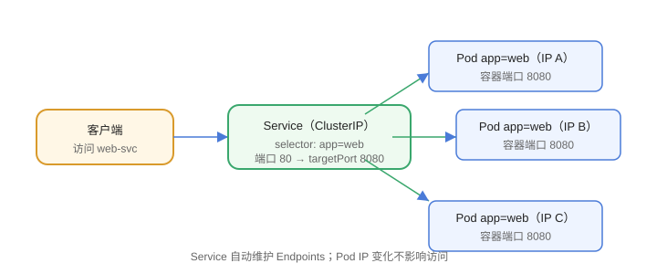

# Service 与网络

Pod 的 IP 是临时的（重建即变），Service 提供**稳定的访问入口**，并通过标签选择器把流量转发到一组 Pod。它是 K8s 服务发现的基石。



## Service 的作用

1. 稳定 IP + 端口（ClusterIP）。
2. 负载均衡到多个 Pod 副本。
3. DNS 服务发现：`服务名.命名空间.svc.cluster.local`。

## 示例

```yaml [service.yaml]
apiVersion: v1
kind: Service
metadata:
  name: web-svc
spec:
  selector:
    app: web
  ports:
    - port: 80          # Service 端口
      targetPort: 8080  # Pod 容器端口
  type: ClusterIP
```

```shell
kubectl apply -f service.yaml
kubectl get svc web-svc
```

## Service 类型

| 类型 | 访问方式 | 适用 |
| --- | --- | --- |
| ClusterIP（默认） | 集群内部访问 | 服务间调用 |
| NodePort | 每个节点 `IP:端口` 暴露 | 测试、简单暴露 |
| LoadBalancer | 云厂商负载均衡器 | 公网服务（云上） |
| ExternalName | 映射外部域名 | 代理外部服务 |

## 选择器与 Endpoints

```shell
kubectl get endpoints web-svc
```

Service 通过 `selector` 匹配 Pod labels，自动维护 Endpoints 列表。Pod 就绪（readinessProbe 通过）才会被加入。

## DNS 服务发现

```text
web-svc.default.svc.cluster.local
```

同命名空间内可直接用服务名 `web-svc` 访问；跨命名空间用 `web-svc.other-ns.svc.cluster.local`。

## 无头服务（Headless）

```yaml
spec:
  clusterIP: None   # 不分配集群 IP，DNS 返回所有 Pod IP
```

适合 StatefulSet 等需要直连 Pod 的场景（如数据库主从）。

## kube-proxy 与转发模式

- `iptables` 模式：默认，规则多时性能下降。
- `ipvs` 模式：性能更好，支持更多负载均衡算法。

## 易错点

::: danger 常见错误
1. selector 写错或 Pod 未就绪：Endpoints 为空，访问不通。
2. `targetPort` 写错：流量到了但容器端口对不上。
3. NodePort 端口范围：默认 30000-32767，超范围创建失败。
4. 从集群外访问 ClusterIP：需要 NodePort/LoadBalancer/Ingress。
5. 忘记命名空间隔离：跨命名空间要用完整 DNS 名。
6. Pod 重启后 IP 变化但客户端缓存旧 IP：客户端应通过 Service DNS 访问。
:::

## 验证方式

1. `kubectl get svc,endpoints` 确认 Endpoints 非空。
2. `kubectl run test --image=busybox -it --rm -- sh` 进入测试容器，`wget web-svc` 验证。
3. `kubectl describe svc web-svc` 查看 Endpoints 与端口映射。

## 参考资料

- Service 文档：https://kubernetes.io/zh-cn/docs/concepts/services-networking/service/
- 服务发现与 DNS：https://kubernetes.io/zh-cn/docs/concepts/services-networking/dns-pod-service/
- 无头服务：https://kubernetes.io/zh-cn/docs/concepts/services-networking/service/#headless-services
