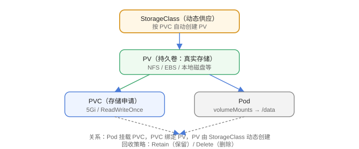

# 存储与 PV/PVC

容器文件系统在 Pod 重建后消失，持久化数据需要**卷（Volume）**。K8s 通过 **PV（PersistentVolume）与 PVC（PersistentVolumeClaim）** 解耦“存储资源”和“存储申请”。



## Volume 类型

| 类型 | 说明 |
| --- | --- |
| emptyDir | 临时目录，Pod 生命周期内有效 |
| hostPath | 宿主机目录（仅测试/单节点） |
| configMap / secret | 配置注入 |
| PV/PVC | 持久化存储 |

## PV / PVC / StorageClass 关系

```text
StorageClass（动态供应模板）
        │ 自动创建
        ▼
PV（持久卷：真实存储）
        │ 绑定
        ▼
PVC（存储申请）→ 挂载到 Pod
```

## 示例：PVC 申请存储

```yaml [pvc.yaml]
apiVersion: v1
kind: PersistentVolumeClaim
metadata:
  name: data-pvc
spec:
  accessModes:
    - ReadWriteOnce
  resources:
    requests:
      storage: 5Gi
  storageClassName: standard
```

```yaml [pod-pvc.yaml]
spec:
  containers:
    - name: app
      volumeMounts:
        - name: data
          mountPath: /data
  volumes:
    - name: data
      persistentVolumeClaim:
        claimName: data-pvc
```

## 访问模式

| 模式 | 含义 |
| --- | --- |
| ReadWriteOnce（RWO） | 单节点读写 |
| ReadOnlyMany（ROX） | 多节点只读 |
| ReadWriteMany（RWX） | 多节点读写（NFS 等） |

## StorageClass

```yaml [storageclass.yaml]
apiVersion: storage.k8s.io/v1
kind: StorageClass
metadata:
  name: standard
provisioner: kubernetes.io/aws-ebs
parameters:
  type: gp3
```

常见 provisioner：

- 云厂商：aws-ebs、azure-disk、gce-pd
- 自建：NFS（nfs.csi.k8s.io）、Rook Ceph、local-path

## 生命周期

| 阶段 | 含义 |
| --- | --- |
| Available | PV 空闲可绑定 |
| Bound | 已绑定 PVC |
| Released | PVC 删除后待回收 |
| Failed | 回收失败 |

回收策略：`Retain`（保留数据）、`Delete`（删除存储）、`Recycle`（已弃用）。

## 易错点

::: danger 常见错误
1. 有状态应用不声明 PVC：Pod 重建数据丢失。
2. `accessModes` 不匹配：PVC 无法绑定到 PV。
3. 多副本共享写：默认 RWO 不支持多节点同时写，需要 RWX 存储。
4. 删除 PVC 导致数据被删：取决于回收策略 `Delete`，重要数据用 `Retain` 或先备份。
5. 本地磁盘误当持久化：hostPath 只在单节点测试可用。
6. StatefulSet 的 PVC 模板写错：每个副本的卷无法正确创建。
:::

## 验证方式

1. `kubectl get pvc` 确认 STATUS 为 Bound。
2. 在 Pod 中写入文件，删除 Pod 后重建，确认数据仍在。
3. `kubectl describe pvc data-pvc` 查看绑定详情。

## 参考资料

- 卷：https://kubernetes.io/zh-cn/docs/concepts/storage/volumes/
- PV/PVC：https://kubernetes.io/zh-cn/docs/concepts/storage/persistent-volumes/
- StorageClass：https://kubernetes.io/zh-cn/docs/concepts/storage/storage-classes/
