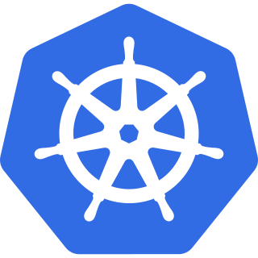

# Kubernetes

Kubernetes（K8s）是容器编排平台的事实标准，负责容器的部署、扩缩容、服务发现与自愈，是云原生架构的核心。

- [核心概念与架构](Overview/index.md)
- [安装与集群搭建](Install/index.md)
- [Pod 详解](Pod/index.md)
- [Deployment 与工作负载](Deployment/index.md)
- [Service 与网络](Service/index.md)
- [Ingress 入口](Ingress/index.md)
- [ConfigMap 与 Secret](ConfigMapSecret/index.md)
- [存储与 PV/PVC](Storage/index.md)
- [监控与运维](Monitoring/index.md)
- [常见问题与最佳实践](FAQ/index.md)
