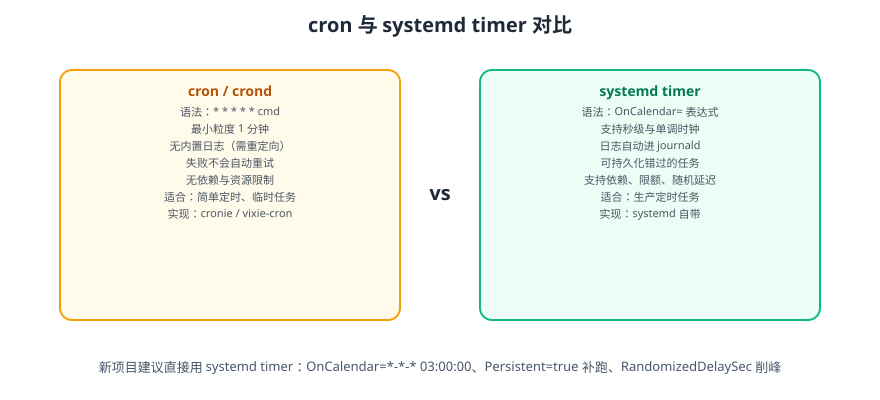

# 定时任务

定时任务是服务器自动化的骨架：备份、日志清理、证书续期、数据同步、健康巡检都靠它。Linux 上两条主流路线是**传统的 cron** 与**现代的 systemd timer**，本篇把两者讲清并给出迁移与选型建议。



::: tip 一句话理解
cron 是「到点就跑一条命令」，systemd timer 是「到点就跑一个服务」——后者自带日志、依赖、资源限制、补跑机制，所以**新任务优先用 timer**。
:::

## 一、怎么选：三句话决策

| 判断 | 选择 |
| --- | --- |
| 临时性、一次性、验证脚本用 | cron 更快更直接 |
| 生产环境的周期性任务（备份、清理、对账） | **systemd timer** |
| 需要「错过的任务补跑」「随机延迟削峰」「资源限额」 | **systemd timer**（cron 都做不到） |
| 存量系统已经一堆 cron，且运行良好 | 保留，但新增任务按新规走 |

::: warning 需要注意
`cron` 本身没有「错过补偿」：机器在 03:00 关机，任务就永远不执行。对备份这类**必须执行**的任务，这是不可接受的。
`systemd timer` 加 `Persistent=true` 后会在开机时补跑错过的任务。
:::

## 二、cron 基础

### 2.1 五个字段

```text
┌───────────── 分钟 (0-59)
│ ┌─────────── 小时 (0-23)
│ │ ┌───────── 日 (1-31)
│ │ │ ┌─────── 月 (1-12 或 JAN-DEC)
│ │ │ │ ┌───── 星期 (0-7，0 和 7 都是周日；或 SUN-SAT)
│ │ │ │ │
* * * * * 要执行的命令
```

| 符号 | 含义 | 示例 |
| --- | --- | --- |
| `*` | 任意值 | `* * * * *` 每分钟 |
| `,` | 枚举 | `0,30 * * * *` 每小时的 0 分和 30 分 |
| `-` | 范围 | `0 9-18 * * *` 9 点到 18 点整点 |
| `/` | 步长 | `*/5 * * * *` 每 5 分钟 |
| `@daily` 等 | 别名 | `@reboot`、`@daily`、`@weekly`、`@monthly`、`@yearly` |

```text
# 每天凌晨 3:30 执行备份
30 3 * * * /opt/scripts/backup.sh >> /var/log/backup.log 2>&1

# 工作日 9 点到 18 点，每 15 分钟
*/15 9-18 * * 1-5 /opt/scripts/sync.sh

# 每月 1 号和 15 号凌晨 2:00
0 2 1,15 * * /opt/scripts/report.sh

# 每 5 分钟，仅在 6 月
*/5 * * 6 * /opt/scripts/check.sh
```

::: danger 「日」和「星期」同时指定时是「或」不是「与」
```text
# 本意可能是「每月 1 号且是周一」，实际含义是「每月的 1 号，或者每个周一」
0 0 1 * 1 /opt/scripts/task.sh
```
需要「且」的逻辑必须在脚本内部判断日期。这是最容易被忽略的 cron 语义。
:::

### 2.2 cron 文件放哪

| 位置 | 粒度 | 是否需要用户名字段 | 说明 |
| --- | --- | --- | --- |
| `crontab -e` | 当前用户 | ❌ 不需要 | 最常用，存在 `/var/spool/cron/crontabs/<user>` |
| `/etc/crontab` | 系统级 | ✅ 需要（第 6 列） | 手工编辑，格式多一列 |
| `/etc/cron.d/*` | 系统级 | ✅ 需要（第 6 列） | 按应用分包，推荐给软件包用 |
| `/etc/cron.{hourly,daily,weekly,monthly}/` | 目录 | ❌ 不需要 | 放可执行脚本，由 run-parts 调度 |

```properties
# /etc/cron.d/order-backup —— 注意多一列用户名字段
SHELL=/bin/bash
PATH=/usr/local/sbin:/usr/local/bin:/usr/sbin:/usr/bin:/sbin:/bin
MAILTO=ops@example.com
30 3 * * * appuser /opt/scripts/backup.sh
```

### 2.3 权限控制

| 文件 | 作用 |
| --- | --- |
| `/etc/cron.allow` | 白名单，**存在时只有列出的用户能用 cron** |
| `/etc/cron.deny` | 黑名单，`allow` 不存在时才生效 |
| `/etc/cron.d/` 文件权限 | 必须 root 所有且不可组/其他写，否则被忽略 |
| `crontab -u <user> -l` | root 查看指定用户的 crontab |

::: tip `crontab -e` 的默认编辑器
Ubuntu/Debian 默认可能是 `nano`。想换成 vim：
```shell
sudo update-alternatives --config editor     # 交互选择
export EDITOR=vim                            # 或临时指定
crontab -e
```
:::

## 三、cron 的七个经典坑

::: danger 逐条对照，几乎每条都真实踩过
1. **环境变量极简**：cron 的 `PATH` 通常只有 `/usr/bin:/bin`，`SHELL` 是 `/bin/sh`。
   - 写法：脚本内部自己设置 `PATH`，或命令写绝对路径。
   ```text
   # /etc/cron.d/xxx 顶部统一声明
   SHELL=/bin/bash
   PATH=/usr/local/bin:/usr/bin:/bin
   ```
2. **`%` 是特殊字符**：cron 把 `%` 当换行，`date +%Y%m%d` 必须转义成 `date +\%Y\%m\%d`。
   - 更好的做法：把逻辑写进脚本文件，cron 只负责调用脚本。
3. **没有输出就等于没有日志**：cron 把 stdout/stderr 通过邮件发给 `MAILTO`，本机没配邮件就等于丢弃。
   - 写法：显式重定向，如 `>> /var/log/backup.log 2>&1`。
4. **任务重叠执行**：上一个还在跑，下一个又启动了（尤其数据量大时）。
   - 写法：脚本内用 `flock -n` 加锁。
5. **`@reboot` 不保证网络可用**：机器刚起来时网络可能还没通。
   - 写法：任务自身带重试，或改用 `systemd` 服务 + `network-online.target`。
6. **时区与夏令时**：cron 用的是系统时区；在有 DST 的地区，凌晨的「不存在的时间」可能被跳过或执行两次。
   - 检查：`timedatectl status`，服务器统一设为 `UTC` 或 `Asia/Shanghai`，并配置 NTP。
7. **脚本没有执行权限或 shebang 写错**：`Permission denied` / `bad interpreter: ^M`（Windows 换行）。
   - 检查：`chmod +x`、`file script.sh` 确认无 CRLF。
:::

## 四、cron 的日志

```shell
# Ubuntu 26.04 起默认由 journald 接管（也可装 rsyslog 写 /var/log/syslog）
journalctl -u cron --since today
journalctl -u cron -f                    # 实时看任务触发

# 确认 cron 服务在跑
systemctl status cron
```

::: warning 默认看不到「任务实际输出」
`journalctl -u cron` 只记录「CRON (user) CMD (命令)」这一行，任务本身的输出要看你重定向到哪。
**约定**：所有定时任务脚本统一把输出写到 `/var/log/cron/<任务名>.log`，日志体系再统一采集。
:::

## 五、systemd timer：现代做法

### 5.1 两个文件：`.service` + `.timer`

```ini
# /etc/systemd/system/backup-db.service —— 只描述「做什么」
[Unit]
Description=Database backup job

[Service]
Type=oneshot
User=appuser
WorkingDirectory=/opt/scripts
ExecStart=/opt/scripts/backup-db.sh
Nice=10
IOSchedulingClass=best-effort
IOSchedulingPriority=7
```

```ini
# /etc/systemd/system/backup-db.timer —— 只描述「什么时候做」
[Unit]
Description=Run database backup daily

[Timer]
OnCalendar=*-*-* 03:30:00
Persistent=true
RandomizedDelaySec=300
AccuracySec=1min
Unit=backup-db.service

[Install]
WantedBy=timers.target
```

```shell
sudo systemctl daemon-reload
sudo systemctl enable --now backup-db.timer
```

::: tip `Unit=` 可以省略
若 timer 与 service 同名（`backup-db.timer` ↔ `backup-db.service`），`Unit=` 可省略。
显式写出更利于阅读，尤其是「一对多」时。
:::

### 5.2 `[Timer]` 关键指令

| 指令 | 作用 | 示例 |
| --- | --- | --- |
| `OnCalendar=` | 按日历时间触发（最常用） | `*-*-* 03:30:00` |
| `OnBootSec=` | 开机后多久触发一次 | `OnBootSec=15min` |
| `OnUnitActiveSec=` | 上次运行后隔多久再触发 | `OnUnitActiveSec=1h` |
| `OnUnitInactiveSec=` | 上次结束后隔多久再触发 | 适合「任务耗时不定」 |
| `Persistent=true` | **记录上次触发时间，错过的下次开机补跑** | 备份场景必开 |
| `RandomizedDelaySec=` | 随机延迟，避免整点惊群 | `300`（最多随机 5 分钟） |
| `AccuracySec=` | 精度窗口，设大一点更省电 | `1min` |
| `Unit=` | 指定要触发的服务 | 同名可省 |

::: danger 三种时间基准别混用
1. **实时时钟（realtime）**：`OnCalendar=` 基于墙上时钟。**`Persistent=true` 只对 `OnCalendar` 有效。**
2. **单调时钟（monotonic）**：`OnBootSec` / `OnUnitActiveSec` 基于「已运行多久」，不受改时间/夏令时影响。
3. **两者可以叠加**：`OnBootSec=15min` + `OnUnitActiveSec=1h` 表示「开机 15 分钟后先跑一次，之后每小时一次」。
:::

### 5.3 `OnCalendar` 表达式

格式：`星期 年-月-日 时:分:秒`

| 表达式 | 含义 |
| --- | --- |
| `*-*-* 03:30:00` | 每天 03:30 |
| `Mon..Fri *-*-* 09:00:00` | 工作日 9 点 |
| `*-*-01 02:00:00` | 每月 1 号 2 点 |
| `*-*-* 00/2:00:00` | 每 2 小时 |
| `*-*-* *:00/15:00` | 每 15 分钟 |
| `weekly` | 等价于 `Mon *-*-* 00:00:00` |
| `daily` | 等价于 `*-*-* 00:00:00` |
| `hourly` | 等价于 `*-*-* *:00:00` |
| `minutely` | 每分钟 |

```shell
# 表达式验证（强烈建议写完就测）
systemd-analyze calendar "*-*-* 03:30:00"
# 预期输出包含 Next elapse: 与 UTC 时间
systemd-analyze calendar --iterations=5 "Mon..Fri *-*-* 09:00:00"
```

### 5.4 常用管理命令

```shell
systemctl list-timers --all                 # 所有定时器与下次触发时间
systemctl start backup-db.timer             # 启用定时器（不会立刻执行）
systemctl start backup-db.service           # 立刻手动执行一次（测试用，推荐）
systemctl status backup-db.timer
journalctl -u backup-db.service --since today
systemctl edit backup-db.timer              # drop-in 覆盖
```

## 六、迁移对照表：cron → systemd timer

| cron 写法 | systemd timer 写法 |
| --- | --- |
| `30 3 * * * /opt/s.sh` | `OnCalendar=*-*-* 03:30:00` |
| `*/15 * * * * /opt/s.sh` | `OnCalendar=*-*-* *:00/15:00` |
| `0 2 1 * * /opt/s.sh` | `OnCalendar=*-*-01 02:00:00` |
| `0 9 * * 1-5 /opt/s.sh` | `OnCalendar=Mon..Fri *-*-* 09:00:00` |
| `MAILTO=...` | 由监控/告警体系接管（推荐 `OnFailure=`） |
| 输出重定向到文件 | `journalctl -u xxx.service` 自动收集 |
| 靠 `flock` 防重叠 | systemd 天然不并发启动同一 service |
| 无法补跑 | `Persistent=true` |
| 无法限资源 | `MemoryMax` / `CPUQuota` / `IOSchedulingClass` |
| `@reboot` | `OnBootSec=1min` |

::: tip 失败自动告警：`OnFailure`
```ini
# /etc/systemd/system/backup-db.service
[Unit]
OnFailure=notify-ops@%n.service      # 失败时触发另一个 unit
```
再写一个 `notify-ops@.service` 模板，用 `ExecStart` 调 webhook 即可。这是弥补「cron 任务静默失败」的关键一环。
:::

## 七、实战：用 systemd timer 做每日数据库备份

### 第一步：写备份脚本（幂等 + 加锁 + 保留策略）

```bash
#!/usr/bin/env bash
# /opt/scripts/backup-db.sh
set -euo pipefail
IFS=$'\n\t'

readonly BACKUP_DIR=/data/backup/mysql
readonly KEEP_DAYS=14
readonly DB_HOST=127.0.0.1
readonly DB_NAME=order_db

log() { printf '[%s] %s\n' "$(date '+%F %T')" "$*"; }

# 单实例锁：防止与手工执行重叠
exec 200>/var/lock/backup-db.lock
flock -n 200 || { log "已有备份在运行，跳过"; exit 0; }

mkdir -p "$BACKUP_DIR"
stamp="$(date +%Y%m%d-%H%M%S)"
out="${BACKUP_DIR}/${DB_NAME}-${stamp}.sql.gz"

log "开始备份 ${DB_NAME} → ${out}"
# 优先用 MySQL 8.0+ 的 mysqlpump / 8.4 的 mysqldump（示例用环境变量传密码，避免明文）
mysqldump --single-transaction --routines --triggers \
  -h "$DB_HOST" -u "$MYSQL_USER" -p"$MYSQL_PASSWORD" "$DB_NAME" | gzip -6 > "$out"

# 校验非空，避免留下 0 字节的「假备份」
[[ -s "$out" ]] || { log "备份文件为空，失败"; rm -f "$out"; exit 1; }
log "备份完成，大小 $(du -h "$out" | cut -f1)"

# 清理过期备份
find "$BACKUP_DIR" -name "${DB_NAME}-*.sql.gz" -mtime "+${KEEP_DAYS}" -print -delete | while read -r f; do
  log "已清理 ${f}"
done
```

### 第二步：写 service 与 timer

```ini
# /etc/systemd/system/backup-db.service
[Unit]
Description=Daily MySQL backup
OnFailure=notify-ops@%n.service

[Service]
Type=oneshot
User=appuser
Group=appuser
EnvironmentFile=-/etc/backup-db/env
ExecStart=/opt/scripts/backup-db.sh
IOSchedulingClass=best-effort
IOSchedulingPriority=7
MemoryMax=512M
```

```properties
# /etc/backup-db/env   （chmod 600）
MYSQL_USER=backup
MYSQL_PASSWORD=change_me
```

```ini
# /etc/systemd/system/backup-db.timer
[Unit]
Description=Trigger daily MySQL backup

[Timer]
OnCalendar=*-*-* 03:30:00
Persistent=true
RandomizedDelaySec=300

[Install]
WantedBy=timers.target
```

### 第三步：启用与验证

```shell
sudo systemctl daemon-reload
sudo systemd-analyze calendar "*-*-* 03:30:00"       # 先验证表达式
sudo systemctl enable --now backup-db.timer
```

### 验证方式

```shell
# 1. 定时器已挂载且下次触发时间正确
systemctl list-timers backup-db.timer --no-pager
# 预期：NEXT 列显示「明天 03:30:00」附近（含随机延迟）

# 2. 手动触发一次（不等到 03:30）
sudo systemctl start backup-db.service
systemctl status backup-db.service --no-pager
# 预期：Active: inactive (dead) 且状态为「成功」；oneshot 跑完即结束

# 3. 备份文件确实生成且非空
ls -lh /data/backup/mysql/ | tail -5
# 预期：存在 order_db-<日期>-<时间>.sql.gz，大小不为 0

# 4. 日志可查
journalctl -u backup-db.service --since "10 min ago" --no-pager
# 预期：包含「开始备份」「备份完成」「已清理」

# 5. 验证幂等与锁（并发执行第二个实例应直接跳过）
sudo systemctl start backup-db.service & sudo systemctl start backup-db.service
journalctl -u backup-db.service --since "1 min ago" | grep -c "跳过" || true
# 预期：可能出现「跳过」日志（视时序而定，至少不会产生损坏文件）

# 6. 恢复验证（最重要，别跳过）
zcat /data/backup/mysql/order_db-*.sql.gz | head -20
# 预期：能看到 CREATE TABLE / INSERT 语句
```

::: danger 定时任务最危险的错觉
**「脚本跑了」不等于「备份可用」**。定期做一次**恢复演练**，把备份灌进一台临时库并跑通业务查询——否则你拥有的只是「一堆看起来像备份的文件」。
:::

## 八、易错点汇总

::: danger 逐条对照
1. **cron 里写 `%` 不转义**：`date +%F` 直接写会截断命令。改用 `date +\%F` 或把逻辑放进脚本。
2. **cron 命令用相对路径**：`PATH` 极简，必须要绝对路径或自己声明 `PATH`。
3. **依赖交互式环境**（`~/.bashrc` 里的 alias、`nvm` 的 node）：cron/timer 都不加载，需显式指定解释器绝对路径。
4. **任务重叠**：用 `flock -n` 或 systemd 的 oneshot 互斥。
5. **误以为 `OnCalendar` 会补跑**：不写 `Persistent=true` 就不补跑。
6. **`RandomizedDelaySec` 设成 0**：整点大量任务同时触发会打满 IO/CPU。
7. **`Type=oneshot` 忘记写**：默认 `simple` 会让 `systemctl start` 立刻返回「成功」，实际脚本还在跑。
8. **备份后从不验证**：写 `[[ -s "$out" ]]` 断言并定期做恢复演练。
9. **时区混乱**：服务器统一时区 + NTP，`timedatectl status` 确认。
10. **用 `@reboot` 代替服务**：需要「常驻」就用 `.service` + `Restart=on-failure`，`@reboot` 只适合一次性初始化。
:::

## 参考资料

- `crontab(5)` 手册：https://man7.org/linux/man-pages/man5/crontab.5.html
- `systemd.timer` 手册：https://www.freedesktop.org/software/systemd/man/latest/systemd.timer.html
- `systemd.time`（时间表达式语法）：https://www.freedesktop.org/software/systemd/man/latest/systemd.time.html
- `systemd-analyze`（calendar 校验）：https://www.freedesktop.org/software/systemd/man/latest/systemd-analyze.html
- 本专题其余章节：[Linux 进阶导览](../index.md)、[systemd 服务管理](../Systemd/index.md)
