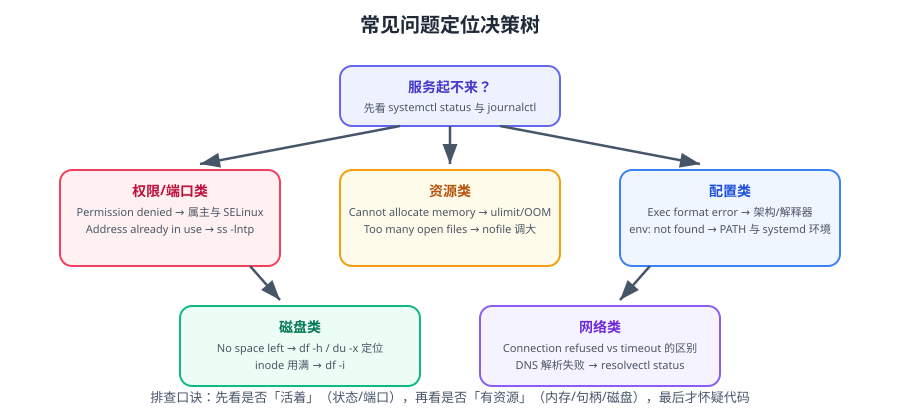

# 常见问题与最佳实践

本篇汇总 Linux 进阶场景下最高频的实际问题，按「现象 → 原因 → 处理」组织，并给出可直接套用的最佳实践清单。定位思路见下图的决策树。



::: tip 使用方式
按「你看到的报错关键字」检索：`Permission denied`、`Too many open files`、`No space left on device`、`Cannot allocate memory`、`Connection refused`、`Exec format error`。
:::

## 一、服务与进程

### 1.1 服务启动后立刻退出

```shell
systemctl status <svc> --no-pager -l
journalctl -u <svc> -n 100 --no-pager
systemctl show <svc> -p Type -p Restart -p ExecStart
```

| 现象 | 原因 | 处理 |
| --- | --- | --- |
| `inactive (dead)`，日志显示程序已正常结束 | `Type` 选错（程序是后台进程却用了 `simple`） | 改 `Type=forking`，或让程序前台运行 |
| `activating (auto-restart)` 循环 | 程序启动即崩溃 | 查程序自身日志；临时设 `Restart=no` 观察 |
| `status=203/EXEC` | `ExecStart` 无法执行 | 用绝对路径；`chmod +x`；确认 shebang 解释器存在 |
| `status=1/FAILURE` | 配置或端口冲突 | `ss -lntp` 看端口；检查配置文件语法 |
| `code=killed, signal=KILL` | 被强杀（OOM 或超时） | `dmesg -T \| grep -i oom`；调大 `TimeoutStopSec` |

::: danger `Exec format error` 的三种真实原因
1. **架构不匹配**：在 x86 机器上跑了 ARM 的二进制（或反过来）。`file <二进制>` 确认架构。
2. **脚本缺 shebang**：文件第一行不是 `#!/usr/bin/env bash`，内核不知道用什么解释器。
3. **CRLF 换行**：Windows 编辑过的脚本，shebang 变成 `#!/bin/bash\r`,解释器路径不存在。用 `file script.sh` 检查，`sed -i 's/\r$//'` 修复。
:::

### 1.2 端口被占用

```shell
ss -lntp | grep ':8080'
sudo fuser -v 8080/tcp
sudo lsof -nP -iTCP:8080 -sTCP:LISTEN
```

```shell
# 确认占用进程后，优先优雅停止
sudo systemctl stop <占用服务>
# 实在需要时（谨慎）：先 TERM 再 KILL
sudo kill -TERM <PID> && sleep 3 && sudo kill -KILL <PID> 2>/dev/null || true
```

::: warning `Address already in use` 有时是 TIME_WAIT
如果 `ss -lntp` 找不到占用者，但绑定仍然失败，可能是残留的 `TIME_WAIT` 或端口被 `SO_REUSEADDR` 未开启导致。
应用侧应开启 `SO_REUSEADDR`；内核侧可以考虑 `net.ipv4.tcp_tw_reuse = 1`（仅对主动连接方有效）。
:::

### 1.3 僵尸进程

```shell
ps -eo pid,ppid,stat,cmd | awk '$3 ~ /Z/'
```

| `STAT` | 含义 |
| --- | --- |
| `Z` | 僵尸：进程已退出但父进程没回收 |
| `D` | 不可中断睡眠（通常在等 IO） |
| `R` | 运行中或可运行 |
| `S` | 可中断睡眠 |
| `T` | 已停止 |

::: tip 僵尸进程的处理
僵尸本身**不占 CPU/内存**，只占一个 PID 表项。真正要处理的是**父进程**：
- 正常做法：让父进程 `wait()` 回收（应用侧修 bug）。
- 应急：重启父进程（僵尸随之消失）。
- **不要去 kill 僵尸进程本身**，它已经死了，kill 无效。
:::

## 二、权限与访问控制

### 2.1 `Permission denied`

```shell
# 三层检查：文件权限 → 目录权限 → 强制访问控制
ls -ld /path/to/dir /path/to/file
namei -l /path/to/file              # 逐级打印每一层的权限（非常好用）
id <用户>
sudo -u <用户> test -r /path/to/file && echo readable

getenforce 2>/dev/null || sudo aa-status | head -5
sudo ausearch -m avc -ts recent 2>/dev/null | tail -20
```

::: danger 目录权限比文件权限更常出错
要读 `/data/app/logs/x.log`，需要**每一级目录都有 `x`（执行/进入）权限**。
`namei -l` 就是为此而生：

```shell
namei -l /data/app/logs/x.log
# f: /data/app/logs/x.log
# drwxr-xr-x root  root  /
# drwx------ root  root  data      ← 这里缺 o+x，appuser 进不去
```
:::

### 2.2 `sudo: command not allowed` / sudo 配置错误

```shell
sudo visudo -c                        # 检查语法
sudo -l -U deploy                     # 查看某用户被允许的命令
journalctl -u sudo --since today      # 看 sudo 拒绝记录
```

::: danger 改坏 `/etc/sudoers` 的抢救
1. 如果还能 `su -`（root 密码可用）：`su -` 登录后 `visudo` 修复。
2. 如果不能：从单用户模式（GRUB 加 `single`）或救援控制台修复。
3. **预防**：永远只用 `visudo`；优先写到 `/etc/sudoers.d/` 独立文件；改完先 `visudo -c`。
:::

## 三、资源与限额

### 3.1 `Too many open files`

```shell
ulimit -n                                  # 当前 shell
cat /proc/<PID>/limits | grep 'open files' # 具体进程
ls /proc/<PID>/fd | wc -l                  # 已用句柄数
sudo lsof -p <PID> | wc -l
sudo lsof -p <PID> | awk '{print $5}' | sort | uniq -c | sort -rn | head
```

| 场景 | 修改位置 |
| --- | --- |
| 交互式登录会话 | `/etc/security/limits.conf` + 重新登录 |
| **systemd 服务** | unit 里 `LimitNOFILE=65535` + `daemon-reload` |
| Docker 容器 | `docker run --ulimit nofile=65535:65535`，或 `daemon.json` 的 `default-ulimits` |
| 内核全局上限 | `fs.file-max`（`sysctl`） |

::: danger 「改了不生效」的三种原因
1. **改错位置**：systemd 服务**不读** `limits.conf`。
2. **没重新登录**：`limits.conf` 只对新会话生效。
3. **系统级硬上限太小**：`LimitNOFILE` 是「软限」，硬限在 `/etc/systemd/system.conf` 的 `DefaultLimitNOFILE`，或 `systemctl show -p LimitNOFILE` 看实际值。
:::

### 3.2 `Cannot allocate memory` / `fork: retry`

```shell
free -h; vmstat 1 3
sysctl vm.overcommit_memory vm.max_map_count
cat /proc/sys/kernel/threads-max
ps -eLf | wc -l                     # 当前线程总数
systemctl show <svc> -p TasksMax    # cgroup 任务数上限
```

| 原因 | 处理 |
| --- | --- |
| 内存确实不足 | 降 `-Xmx`；增加内存；排查泄漏 |
| cgroup 任务数上限 | 调 `TasksMax`（systemd 默认可能偏低） |
| `vm.max_map_count` 太小 | Elasticsearch/大内存应用常见，调到 `262144` |
| PID/线程数上限 | `kernel.pid_max`、`kernel.threads-max` |
| `nproc` 限额 | unit 里 `LimitNPROC=` |

### 3.3 OOM Killer 杀了我的进程

```shell
dmesg -T | grep -i -E 'oom|killed process' | tail -20
journalctl -k --since "2 hours ago" | grep -i oom
```

```shell
# 查看 OOM 评分（分越高越容易被杀）
cat /proc/<PID>/oom_score
cat /proc/<PID>/oom_score_adj     # 可调 -1000~1000

# 保护关键进程（不建议在容器里用，容器有自己的 cgroup 限制）
echo -500 | sudo tee /proc/<PID>/oom_score_adj
```

::: tip 比调 OOM 分数更好的做法
用 cgroup 隔离：给关键服务设 `MemoryMax`，让它**在自己被限制时崩溃并重启**，而不是拖垮整台机器的其他服务。
:::

## 四、磁盘与文件系统

### 4.1 `No space left on device` 但 `df` 显示还有空间

**两种可能**：

```shell
df -i | grep -v tmpfs              # ① inode 用满
find / -xdev -type d 2>/dev/null -exec sh -c \
  'c=$(find "$1" -maxdepth 1 -type f | wc -l); [ "$c" -gt 5000 ] && echo "$c $1"' _ {} \; \
  | sort -rn | head -10

sudo lsof -nP +L1 2>/dev/null      # ② 已删除但被进程占用的文件
```

::: danger `df` 满 / `du` 不满 = 句柄占用
日志被 `rm` 掉了但进程还持有句柄，空间不会释放。
**正确做法：重启持有该文件的进程**（如 `systemctl restart order-service`），而不是继续删文件。
:::

### 4.2 文件系统变成只读

```shell
mount | grep ' ro,'
dmesg -T | grep -i -E 'read-only|I/O error|ext4-fs error' | tail -30
```

| 原因 | 处理 |
| --- | --- |
| 磁盘硬件故障 | 立即备份数据，更换磁盘 |
| 文件系统错误自动保护 | 卸载后 `fsck`（务必先卸载/快照） |
| 云盘配额或 IO 限流 | 查云厂商监控，扩容或提额 |

::: warning 只读是「保护」不是「故障本身」
内核检测到严重错误时会把文件系统 remount 为只读，避免数据进一步损坏。此时**不要在挂载状态下强行 `mount -o remount,rw`**，先查 `dmesg` 确认根因。
:::

## 五、网络

### 5.1 `Connection refused` 与 `Connection timed out` 的区别

| 报错 | 含义 | 排查方向 |
| --- | --- | --- |
| `Connection refused` | 包到了目标主机，但对端**没有程序监听**（收到 RST） | 服务是否启动、监听地址是否 `0.0.0.0`、端口是否写对 |
| `Connection timed out` | 包**被静默丢弃** | 防火墙、安全组、路由、网络 ACL |
| `No route to host` | 明确的路由不可达 | `ip route`、网关、VPC 路由表 |
| `Connection reset by peer` | 对端主动断开 | 对端超时/限流/协议不匹配 |

```shell
ss -lntp                             # 服务是否在听、监听在哪个地址
sudo iptables -L -n -v | head -30    # 本地防火墙规则与计数
sudo nft list ruleset | head -40
sudo tcpdump -i any -nn -c 20 "host 10.0.0.5 and port 8080"
```

::: danger 最常见的「本地能通、外部不通」
服务监听在 `127.0.0.1:8080`，而不是 `0.0.0.0:8080`。
看 `ss -lntp` 的 Local Address 列：
- `127.0.0.1:8080` → 只能本机访问
- `0.0.0.0:8080` 或 `*:8080` → 所有网卡

Spring Boot 配置：`server.address=0.0.0.0`（默认就是），Nginx `listen 8080;`（默认所有地址）。
:::

### 5.2 DNS 解析失败

```shell
getent hosts example.com          # 用系统的解析顺序（推荐）
cat /etc/resolv.conf
resolvectl status | head -30      # systemd-resolved
dig +short example.com @8.8.8.8   # 绕过本地解析器
```

::: tip `/etc/resolv.conf` 被覆盖
装了 `systemd-resolved` 或 `NetworkManager` 后，它会把 `/etc/resolv.conf` 替换成软链。
正确改法：
```shell
sudo mkdir -p /etc/systemd/resolved.conf.d
sudo tee /etc/systemd/resolved.conf.d/dns.conf >/dev/null <<'EOF'
[Resolve]
DNS=10.0.0.2 10.0.0.3
FallbackDNS=8.8.8.8
Domains=~.
EOF
sudo systemctl restart systemd-resolved
```
直接手改 `/etc/resolv.conf` 重启后会被覆盖。
:::

### 5.3 TIME_WAIT 太多

```shell
ss -tn state time-wait | wc -l
ss -tn state time-wait | awk 'NR>1{print $4}' | awk -F: '{print $2}' | sort | uniq -c | sort -rn | head
```

| 判断 | 结论 |
| --- | --- |
| 几万条 | 正常（短连接服务的常态） |
| 几十万条且端口耗尽（`Cannot assign requested address`） | 需要连接复用或调端口范围 |
| 集中在少数对端端口 | 检查是否对某个下游短连接过于频繁 |

::: tip 治本优先于调参
1. **开启连接池 / HTTP Keep-Alive**：从「每次新建连接」变成「复用连接」，TIME_WAIT 自然消失。
2. 扩大本地端口范围：`net.ipv4.ip_local_port_range = 10240 65000`。
3. `net.ipv4.tcp_tw_reuse = 1`（**只影响主动发起连接的一方**）。
4. **不要用** `tcp_tw_recycle`——该参数已从内核移除。
:::

## 六、时间与时区

```shell
timedatectl status
timedatectl list-timezones | grep -i shanghai
sudo timedatectl set-timezone Asia/Shanghai
timedatectl show-timesync --all | head -20
```

::: danger 容器与宿主时区不一致
容器默认继承镜像的时区（通常是 UTC），导致日志时间比实际早 8 小时。
统一做法：
```shell
# 挂载宿主时区（最省事）
docker run -v /etc/localtime:/etc/localtime:ro -e TZ=Asia/Shanghai ...
# 或构建镜像时设置
# Dockerfile
ENV TZ=Asia/Shanghai
RUN ln -snf /usr/share/zoneinfo/$TZ /etc/localtime && echo $TZ > /etc/timezone
```
Java 应用推荐用 `-Duser.timezone=Asia/Shanghai` 或环境变量 `TZ`，并在启动日志里打印实际时区以便确认。
:::

## 七、定时任务

| 现象 | 原因 | 处理 |
| --- | --- | --- |
| cron 任务不执行 | 无执行权限 / 路径错 | `chmod +x`，命令写绝对路径 |
| 手工能跑，cron 跑不通 | `PATH` 与登录会话不同 | 脚本内声明 `PATH`，或在 `/etc/cron.d/` 顶部设 `PATH=` |
| 命令被截断 | `%` 未转义 | 写 `\%`，或把逻辑放进脚本 |
| 输出看不到 | 未重定向 | `>> /var/log/xx.log 2>&1` |
| 任务重叠 | 无锁 | `flock -n` 或改用 systemd timer |
| 关机期间的任务丢失 | cron 无补跑 | 改用 `systemd timer` + `Persistent=true` |

```shell
journalctl -u cron --since today | tail -30
systemctl list-timers --all | head -20
```

## 八、Shell 脚本

| 现象 | 原因 | 处理 |
| --- | --- | --- |
| `bad interpreter: No such file or directory` | shebang 指向的解释器不存在，或 CRLF | `sed -i 's/\r$//'`；确认解释器路径 |
| `command not found` 但手工能跑 | `PATH` 不同 | 用绝对路径 |
| 脚本「成功」但没做事 | 未开 `set -e`，中间命令失败被忽略 | 加 `set -euo pipefail` |
| 变量为空导致误删 | 变量未定义 + 未加引号 | `"${var:?必须设置}"` |
| `syntax error near unexpected token` | 用了 bash 扩展但以 `sh` 运行 | shebang 改 `#!/usr/bin/env bash` |
| 循环里文件名被拆开 | `for f in $(ls)` | `for f in ./*` 或 `find -print0 \| xargs -0` |

```shell
shellcheck script.sh          # 静态检查，能挡掉绝大多数问题
bash -n script.sh             # 语法检查
bash -x script.sh             # 逐行跟踪
```

## 九、包管理与依赖

| 现象 | 原因 | 处理 |
| --- | --- | --- |
| `apt-key` 报 command not found（26.04） | APT 3.x 已移除 `apt-key` | 改用 `signed-by` + keyring 文件 |
| `dpkg: error processing` | 包处于半安装状态 | `sudo dpkg --configure -a`，再 `apt -f install` |
| `Unable to locate package` | 源未更新或包名错 | `apt update`；确认发行版版本与包名 |
| 依赖冲突 | 第三方源混用 | `apt policy <包>` 看来源优先级；`/etc/apt/preferences.d/` 固定版本 |
| 升级后服务起不来 | 主要版本变更 | 升级前读发行说明；准备回滚（快照） |

```shell
sudo apt --fix-broken install
sudo dpkg -l | grep -v '^ii' | head -20     # 找状态异常的包
apt policy openssh-server
```

## 十、最佳实践清单

### 10.1 脚本与自动化

- 所有脚本开头 `set -euo pipefail`，并跑 `shellcheck`。
- 变量一律加引号；必填变量用 `${var:?msg}`。
- 需要幂等：`mkdir -p`、`ln -sfn`、先判断再创建。
- 需要互斥：`flock -n` 或 systemd `oneshot`。
- 日志走 stderr，数据走 stdout。
- 临时文件用 `mktemp`，并在 `trap EXIT` 里清理。

### 10.2 服务化

- 用 systemd 而不是 `nohup`；`enable` 之后验证重启能起。
- `Restart=on-failure` 而非 `always`。
- 显式声明 `LimitNOFILE`、`MemoryMax`、`TasksMax`。
- 依赖网络用 `network-online.target`，不是 `network.target`。
- 打开 `NoNewPrivileges` / `ProtectSystem` / `PrivateTmp` 等沙箱选项。

### 10.3 观测与容量

- 每台机器必须有：指标采集、日志留存、磁盘/内存/句柄告警。
- 硬盘告警要**同时看使用率与 inode 使用率**。
- 日志必须轮转（logrotate 或采集器接管），容器日志必须设 `max-size`。
- 关键服务要加「进程数/线程数」「连接池使用率」业务指标。

### 10.4 安全

- 先放行防火墙再启用；改 SSH 前保持一个已登录会话。
- 密钥登录 + 禁 root + fail2ban，三层叠加。
- 加固项写在配置文件里（可复现），且每改一项都验证业务可用。
- 审计日志必须外发，本地日志可被 root 清除。
- 定期从**外部**做一次端口扫描，确认真实暴露面。

### 10.5 变更与复盘

- 变更前：记录当前状态（便于回滚），确认验证方式。
- 变更中：一次只改一项，改完立刻验证。
- 变更后：写进变更记录，含时间、改动、验证结果。
- 故障后：写报告，改进项必须有负责人与截止时间。

::: tip 一句话总结
**所有「经验」都应沉淀成脚本或配置**——理解存在人脑里的运维，是最脆弱的运维。
:::

## 参考资料

- systemd 文档：https://systemd.io/
- Linux `proc` 文件系统说明：https://docs.kernel.org/filesystems/proc.html
- `lsof` 手册：https://man7.org/linux/man-pages/man8/lsof.8.html
- ShellCheck 规则库：https://www.shellcheck.net/wiki/
- Ubuntu Server 指南：https://documentation.ubuntu.com/server/
- 本专题其余章节：[Linux 进阶导览](../index.md)、[故障排查](../Troubleshooting/index.md)、[性能调优](../PerformanceTuning/index.md)、[安全加固](../SecurityHardening/index.md)
