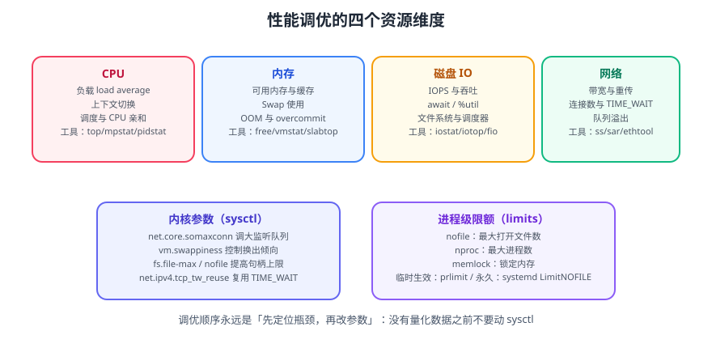

# 性能调优

性能调优不是「背一堆 `sysctl` 参数」，而是**用数据定位瓶颈，再用最小的改动解决它**。本篇给出 Linux 单机的完整取数方法与调优清单，覆盖 CPU、内存、磁盘 IO、网络四个维度。



::: tip 一句话理解
`load` 高不等于 CPU 忙，内存「不够」常常是缓存被误读，IO 慢要看 `await` 而不是 `%util`。**看错指标比不看指标更危险。**
:::

## 一、调优的四步纪律

```text
① 建立基线（正常时是什么样）
        ↓
② 复现问题（能稳定触发才有意义）
        ↓
③ 定位瓶颈（一次只信一个指标族，交叉验证）
        ↓
④ 单变量改动 → 复测 → 保留或回滚
```

| 纪律 | 说明 |
| --- | --- |
| **先测量，后调整** | 没有量化数据之前不要动任何内核参数 |
| **一次只改一个** | 同时改三个参数，你永远不知道是哪个起的作用 |
| **记录前后对比** | 写进变更记录，包含时间、参数、前后指标 |
| **可回滚** | 参数写进配置文件（不要只 `sysctl -w`），并准备回滚值 |
| **优先应用层** | 加索引、改分页、加缓存的收益通常远大于调内核 |

::: warning 关于「调优参数清单」
网上流传的 `sysctl` 大礼包（`tcp_tw_recycle`、`vm.swappiness=0`、`overcommit_memory=1`）大多是十几年前的经验，部分参数在新内核上**已被移除**（如 `tcp_tw_recycle` 在 4.12 引入时即因 NAT 环境问题被移除）。照抄会引入新故障。
**原则：只调你能量化收益的参数。**
:::

## 二、先建立基线

```bash
# 一次性快照：CPU 核数、内存、磁盘、网卡
lscpu | grep -E '^(Model name|CPU\(s\)|Thread|Core|Socket)'
free -h
lsblk -o NAME,SIZE,TYPE,MOUNTPOINT,ROTA
ip -br addr

# 持续采样（每 5 秒一次，共 12 次 = 1 分钟）
sar -u -r -d -n DEV 5 12
```

| 基线项 | 工具 | 记录什么 |
| --- | --- | --- |
| CPU 核数与型号 | `lscpu` | 决定 `load` 的换算基准 |
| 内存总量与 swap | `free -h` | 判断「可用内存」水位 |
| 磁盘类型 | `lsblk -d -o NAME,ROTA` | `ROTA=1` 是机械盘，`0` 是 SSD |
| 网络带宽与网卡 | `ethtool eth0` | `Speed` 显示链路速率 |
| 业务指标 | 应用监控 | QPS、P95/P99 延迟、错误率 |

::: tip 为什么必须记录「正常时的样子」
「`load` 到 8 了，是不是有问题？」——如果这台机器平时就是 6，那 8 只是波动；如果平时是 0.5，那 8 就是事故。
**没有基线，就无法判断异常。**
:::

## 三、CPU

### 3.1 读懂 `load average`

```shell
uptime
# 输出示例： 14:30:12 up 42 days,  3:11,  2 users,  load average: 6.42, 4.80, 3.15
#                                                    1 分钟   5 分钟  15 分钟
```

`load average` 统计的是**处于「可运行」或「不可中断睡眠（D 状态）」的进程数**。

| 现象 | 含义 |
| --- | --- |
| 三个值都低但系统卡 | 瓶颈可能不在 CPU（看 IO 与内存） |
| 1 分钟高、15 分钟低 | 突发流量，通常能自愈 |
| 三个值都高且持续上升 | 持续过载，需要扩容或优化 |
| `load` 高但 CPU `%idle` 也高 | 大量进程卡在 **D 状态**（磁盘/网络等待），是 IO 问题 |
| `load` 高但 CPU 不高、`wa` 高 | 同上，IO 等待 |

**换算基准**：单核机器 `load=1` 表示满载。`n` 核机器的「饱和点」约为 `n`（严格说是 `n × 每核可并发线程数`，但工程上用核数近似）。

```shell
nproc                      # 逻辑 CPU 数
cat /proc/loadavg          # 更精确的 load（含运行中/总进程数/最后创建的 PID）
```

### 3.2 CPU 指标

```shell
top -o %CPU                # 按 CPU 排序
mpstat -P ALL 1 5          # 每个核的使用率（看是否有单核打满）
pidstat -u 1 5             # 按进程看 CPU
perf top                   # 采样热点函数（需要 perf 工具）
```

| `top` 字段 | 含义 | 异常信号 |
| --- | --- | --- |
| `us` | 用户态占比 | 高：应用计算密集 |
| `sy` | 内核态占比 | 持续偏高：系统调用过多、锁竞争 |
| `wa` | 等待 IO 占比 | 高：磁盘/网络瓶颈 |
| `hi` / `si` | 硬/软中断 | 高：网络流量大或中断未分摊 |
| `st` | 被虚拟化抢占 | 高：宿主机超卖，联系云厂商 |
| `id` | 空闲 | 高但系统卡：看 `wa` 与 D 状态进程 |

::: danger 单核打满最容易被忽略
`top` 显示总 CPU 只有 25%（4 核），但某个核是 100%——**单线程瓶颈**。此时加机器无效，要优化那一段串行逻辑。
用 `mpstat -P ALL 1` 看每个核，或 `pidstat -t` 看线程级使用率。
:::

### 3.3 上下文切换与中断

```shell
vmstat 1 5      # cs（上下文切换/秒）、in（中断/秒）、r（运行队列）、b（阻塞）
pidstat -w 1 5  # 按进程看 cswch（自愿）与 nvcswch（非自愿）
```

| 指标 | 正常范围 | 异常处理 |
| --- | --- | --- |
| `r`（运行队列） | 小于等于核数 | 持续大于核数 → CPU 不足 |
| `b`（阻塞进程） | 接近 0 | 持续大于 0 → IO 瓶颈 |
| `cs` | 与 QPS 同量级 | 异常高 → 线程/锁太多，检查线程池 |
| `nvcswch` 高 | — | 线程争抢 CPU 严重，通常伴随锁竞争 |

## 四、内存

### 4.1 正确理解 `free`

```shell
free -h
#               total   used   free   shared  buff/cache   available
# Mem:           31Gi   12Gi  1.2Gi    256Mi        18Gi        18Gi
# Swap:         2.0Gi  0.0Gi  2.0Gi
```

| 字段 | 含义 |
| --- | --- |
| `free` | 完全未使用的内存 |
| `buff/cache` | 内核用作**页缓存与缓冲**的内存 |
| `available` | **真正衡量「还有多少能用」的字段** |
| `used` | `total - free - buff/cache` |

::: danger 三大误读
1. **把 `free` 小当成内存不足**：页缓存会尽量占满空闲内存，这是**设计如此**。判断标准是 `available`。
2. **把 `buff/cache` 当成泄漏**：缓存会在应用需要时被回收。真泄漏要看**进程 RSS 持续增长**。
3. **以为 swap 用了就是坏事**：偶尔换出是正常的；持续换入换出（`si`/`so` 长期非 0）才是问题。
:::

```shell
vmstat 1 5                    # si/so 长期非 0 → 内存压力
cat /proc/meminfo | head -20  # MemAvailable / Dirty / Slab
smem -t -k -c "pid user command pss rss" | head -20   # 按 PSS 看真实占用（需装 smem）
ps -eo pid,rss,pmem,comm --sort=-rss | head -15       # 快速看 RSS 排行
```

### 4.2 OOM 与 overcommit

```shell
dmesg -T | grep -i -E 'oom|killed process'
journalctl -k --since "1 hour ago" | grep -i oom
```

| 参数 | 默认 | 作用与建议 |
| --- | --- | --- |
| `vm.swappiness` | `60` | 换出倾向。数据库/缓存类服务可降到 `10`，**不建议设为 0**（会失去应急换出能力） |
| `vm.overcommit_memory` | `0` | 启发式；`1` 表示总是允许超量分配（Redis 等会建议）。**不要无脑设 1**，会让 OOM 变成随机杀进程 |
| `vm.overcommit_ratio` | `50` | `overcommit_memory=2` 时才生效 |
| `vm.min_free_kbytes` | 自动 | 抬高可缓解「内存碎片导致分配失败」，代价是可用内存变少 |

::: tip 用 cgroup 而不是全局参数做内存隔离
与其调 `swappiness`，不如让关键服务跑在受控 cgroup 里：
```ini
# systemd unit
[Service]
MemoryHigh=1536M
MemoryMax=2G
```
`MemoryHigh` 触发压制回收，`MemoryMax` 才是硬上限。这样即使不调内核参数，也能避免「一个服务吃光全机内存」。
:::

## 五、磁盘与 IO

### 5.1 `iostat` 关键字段

```shell
iostat -xz 1 5
```

| 字段 | 含义 | 判读 |
| --- | --- | --- |
| `r/s` `w/s` | 每秒读写次数（IOPS） | 对照设备规格 |
| `rkB/s` `wkB/s` | 每秒读写吞吐 | |
| `await` | **平均等待时间（毫秒）** | **最关键的指标**；机械盘 > 20ms、SSD > 5ms 需关注 |
| `r_await` / `w_await` | 分读写 | 定位是读慢还是写慢 |
| `aqu-sz` | 平均队列长度 | 持续大于 1 说明有排队 |
| `%util` | 设备忙的时间比例 | 传统指标；**SSD 上 `%util=100%` 也可能不是瓶颈** |
| `rareq-sz` `wareq-sz` | 平均请求大小 | 小 IO 多 → 考虑合并/缓存 |

::: danger 只看 `%util` 会误判
`%util` 表示「设备有多少时间在处理请求」。SSD/NVMe 支持高并发，`%util` 接近 100% 时仍可能有富余能力；反过来，`%util` 只有 40% 也可能是顺序化瓶颈。
**判断 IO 是否是瓶颈，看 `await` 与 `aqu-sz`，并对照应用延迟。**
:::

```shell
iotop -oPa                    # 按进程看实时 IO（需 root）
pidstat -d 1 5                # 按进程看读写
cat /proc/diskstats           # 原始数据
fio --name=randwrite --ioengine=libaio --rw=randwrite --bs=4k \
    --numjobs=4 --size=1G --runtime=30 --group_reporting --directory=/data   # 压测
```

### 5.2 文件系统与挂载

| 优化项 | 做法 | 适用 |
| --- | --- | --- |
| 关闭访问时间记录 | 挂载加 `noatime` | 几乎所有场景 |
| 日志模式 | ext4 用 `data=writeback` 或改用 XFS | 写密集 |
| IO 调度器 | SSD/NVMe 用 `none`，机械盘用 `mq-deadline` | 按设备类型 |
| 预读 | `blockdev --setra 4096 /dev/sda` | 顺序读为主 |
| 大页 | `hugepages`（数据库常用） | Oracle/大内存 Java |

```shell
# 查看/切换 IO 调度器（临时）
cat /sys/block/sda/queue/scheduler
echo none | sudo tee /sys/block/nvme0n1/queue/scheduler

# 持久化：内核启动参数或 udev 规则
# /etc/udev/rules.d/60-ioscheduler.rules
ACTION=="add|change", KERNEL=="nvme[0-9]*", ATTR{queue/scheduler}="none"
```

::: warning 别轻易动 `data=writeback`
它可以提升写性能，但会牺牲崩溃一致性（元数据与数据不同步）。生产只在确有把握且不做关键数据存储时使用。
:::

## 六、网络

```shell
ss -s                        # 连接状态汇总
ss -lntp                     # 监听端口与对应进程
ss -tn state time-wait | wc -l  # TIME_WAIT 数量
sar -n DEV,TCP,ETCP 1 5      # 网卡吞吐、TCP 重传、错误
netstat -s 2>/dev/null | head -40    # 协议栈统计（重传/丢弃）
ethtool -S eth0 | head -30   # 网卡级丢包与队列
```

| 指标 | 含义 | 异常信号 |
| --- | --- | --- |
| `estab` | 已建立连接 | 对照预期并发 |
| `time-wait` | 主动关闭方残留状态 | 数万属正常；数十万要看短连接频率 |
| `retrans` | TCP 重传次数 | 持续非 0 → 网络质量或丢包 |
| `listen overflows` | 全连接队列溢出 | 需调大 `somaxconn` 与 backlog |
| `SYN drop` | 半连接队列溢出 | 需调大 `tcp_max_syn_backlog` 或开启 `syncookies` |

### 6.1 网络相关 `sysctl`

```properties
# /etc/sysctl.d/99-tuning.conf
# —— 只在确有需要时逐项开启，每次一项 ——

# 提高监听队列上限（配合应用 backlog 一起调）
net.core.somaxconn = 4096
net.ipv4.tcp_max_syn_backlog = 8192

# 允许复用 TIME_WAIT 连接（仅对「主动发起连接」的一方有效）
net.ipv4.tcp_tw_reuse = 1
net.ipv4.tcp_fin_timeout = 30

# 扩大会话跟踪表（NAT/容器场景）
net.netfilter.nf_conntrack_max = 262144

# 提高文件句柄上限
fs.file-max = 1000000

# 本地端口范围（大量出向连接时）
net.ipv4.ip_local_port_range = 10240 65000

# 保留最后的应急内存
vm.min_free_kbytes = 262144
```

```shell
sudo sysctl --system                       # 加载 /etc/sysctl.d/*
sysctl -p /etc/sysctl.d/99-tuning.conf     # 加载指定文件
sysctl net.ipv4.tcp_tw_reuse               # 查询单项
```

::: danger 三个已被移除或危险的参数
1. **`net.ipv4.tcp_tw_recycle`**：因 NAT 环境下会丢包，已被内核移除，写了会报错。
2. **`net.ipv4.tcp_max_orphans` 调太小**：会导致正常短连接被强杀。
3. **`kernel.pid_max` 调巨大**：会显著增加内核内存开销，按需调（如 4194304 足够）。
:::

## 七、进程级限额：`ulimit` 与 systemd

```shell
ulimit -a                    # 当前 shell 的限额
ulimit -n                    # 最大打开文件数
prlimit --pid <PID>          # 查看运行中进程的限额
prlimit --nofile=65535 --pid <PID>   # 临时放宽（重启失效）
```

| 限额 | 含义 | 常见故障 |
| --- | --- | --- |
| `nofile` | 打开文件数 | `Too many open files` |
| `nproc` | 进程/线程数 | `Resource temporarily unavailable` |
| `memlock` | 可锁定内存 | Elasticsearch、Redis 大页场景 |
| `nofile`（systemd） | 同上 | **systemd 服务不读 `limits.conf`** |

```ini
# systemd 服务的正确做法
[Service]
LimitNOFILE=65535
TasksMax=8192
```

::: danger `/etc/security/limits.conf` 为什么「改了没用」
它只对**通过 PAM 登录的会话**生效（`sshd`、`login`、`su -`）。
- `systemd` 启动的服务：不经过 PAM，必须在 unit 里写 `LimitNOFILE=`。
- `nohup` 后台进程：继承当前 shell 的限额，受 `limits.conf` 影响但要**重新登录**才生效。
- `docker` 容器：默认继承 dockerd 的限额，需要 `--ulimit nofile=65535:65535`。
:::

## 八、实战：一次「接口变慢」的定位过程

**现象**：订单查询接口 P99 从 80ms 涨到 1.2s，错误率上升，但服务没报异常日志。

### 第一步：确认是 CPU 还是 IO

```shell
uptime
# load average: 2.10, 2.05, 1.98   ← 单机 load 不高
top -bn1 | head -12
# %Cpu(s): 12.3 us,  4.1 sy,  0.0 ni, 41.2 id, 38.6 wa, ...
#                                          ^^^^^^^^  ^^^^^^^
#                                          空闲多     等待 IO 高 → 方向锁定 IO
vmstat 1 5
# procs -----------memory---------- ---swap-- -----io---- -system-- ------cpu-----
#  r  b  swpd   free   buff  cache   si   so    bi    bo   in   cs us sy id wa
#  1  7    0  1203456 234560 8912340   0    0  1024  7890  1200 3400 12  4 41 39
#     ^ b=7 有 7 个进程阻塞在不可中断睡眠 → IO 拥堵
```

### 第二步：定位是哪个设备、哪个进程

```shell
iostat -xz 1 3
# Device   r/s   w/s  rkB/s  wkB/s  await  aqu-sz  %util
# sda      10.0 450.0  120.0 7200.0  128.5    32.1   98.7
#                                  ^^^^^  ^^^^
#                                  await 128ms（机械盘正常 5~15ms）

iotop -oPa -n 3
# TID  PRIO  USER   DISK READ  DISK WRITE  COMMAND
# 8123 be/4 app   0.00 B/s  6.85 M/s     java -jar order-service.jar
```

### 第三步：找到「为什么在写」

```shell
pidstat -d -p 8123 1 5
# 确认是该 Java 进程在疯狂写盘
jstack 8123 > /tmp/jstack.txt
grep -A 20 -E 'BLOCKED|WAITING' /tmp/jstack.txt | head -40
# 发现大量线程阻塞在日志输出上（同步 FileAppender）
```

**根因**：一次线上排查开了 `DEBUG` 级别日志，且 appender 是同步写文件，导致大量请求线程阻塞在磁盘写上。

### 第四步：止损与修复

```shell
# ① 止损：把日志级别调回 INFO（通过配置中心或 actuator 端点）
curl -X POST http://127.0.0.1:8080/actuator/loggers/com.example.order \
  -H 'Content-Type: application/json' -d '{"configuredLevel":"INFO"}'
```

**长期修复**：改用异步 appender，并把日志目录放到独立磁盘，同时把日志采集从「应用写盘」改为「写 stdout + 采集器收」——参考 [日志体系](../../../LogSystem/index.md)。

### 验证方式

```shell
# 1. IO 等待回落
vmstat 1 5 | tail -5
# 预期：wa 从 38 降到 5 以下，b 列接近 0

# 2. 设备 await 恢复正常
iostat -xz 1 3 | grep -E 'sda|Device'
# 预期：await 回落到 15ms 以内

# 3. 接口延迟恢复（用压测或监控看 P99）
curl -o /dev/null -s -w 'time_total=%{time_total}s\n' \
  http://127.0.0.1:8080/api/orders/1
# 预期：time_total 在 0.1s 量级
```

## 九、常用工具速查

| 维度 | 一眼看 | 看趋势 | 看进程 | 看单核/线程 |
| --- | --- | --- | --- | --- |
| CPU | `top` | `sar -u` | `pidstat -u` | `mpstat -P ALL`、`pidstat -t` |
| 内存 | `free -h` | `sar -r` | `ps --sort=-rss` | `smem`、`pmap` |
| 磁盘 | `iostat -xz` | `sar -d` | `iotop -oPa` | `pidstat -d` |
| 网络 | `ss -s` | `sar -n DEV` | `ss -tnp` | `ethtool -S` |
| 综合 | `vmstat` | `sar -A` | `perf top` | `perf record` |

```shell
# 生成一份「一分钟体检报告」
{
  echo "===== 时间 ====="; date
  echo "===== 负载 ====="; uptime
  echo "===== CPU ====="; mpstat 1 2 | tail -3
  echo "===== 内存 ====="; free -h
  echo "===== IO ====="; iostat -xz 1 2 | tail -20
  echo "===== 网络 ====="; ss -s
  echo "===== 磁盘占用 ====="; df -hT | grep -v tmpfs
  echo "===== Top CPU ====="; ps -eo pid,pcpu,pmem,comm --sort=-pcpu | head -8
} | tee /tmp/health-$(date +%F-%H%M).txt
```

## 十、易错点汇总

::: danger 逐条对照
1. **把 `load` 高直接等同于 CPU 忙**：`b` 列或 `wa` 高时，瓶颈在 IO。
2. **把 `free` 小当成内存不足**：要看 `available`。
3. **只凭 `%util` 判断磁盘瓶颈**：SSD 上会误判，看 `await` 与 `aqu-sz`。
4. **`vm.swappiness=0`**：会失去应急换出能力，极端情况下直接 OOM。建议 `10`。
5. **照抄网上 `sysctl` 大礼包**：部分参数已被移除或有害。
6. **改 `/etc/security/limits.conf` 却发现 systemd 服务不生效**：要用 `LimitNOFILE=`。
7. **一次性改多个参数**：无法归因，也无法回滚。
8. **只 `sysctl -w` 不写配置文件**：重启即失效，变更记录缺失。
9. **不做前后对比**：改完不知道有没有变好。
10. **忽略应用层优化**：加索引、加缓存、改分页往往比调内核更有效。
:::

## 参考资料

- Linux 内核 `sysctl` 文档：https://docs.kernel.org/admin-guide/sysctl/
- `iostat` / `sar`（sysstat）手册：https://github.com/sysstat/sysstat
- Brendan Gregg，USE 方法：https://www.brendangregg.com/usemethod.html
- `perf` 教程：https://perf.wiki.kernel.org/
- fio 文档：https://fio.readthedocs.io/
- 本专题其余章节：[Linux 进阶导览](../index.md)、[故障排查](../Troubleshooting/index.md)、服务器指标采集见 [监控告警](../../../Monitoring/index.md)
