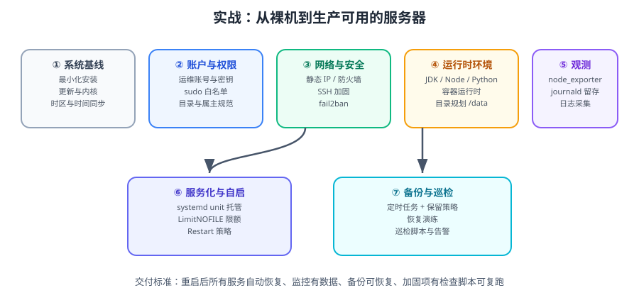

# 实战：交付一台生产可用的服务器

本篇把 [Shell 脚本编程](../ShellScripting/index.md)、[systemd](../Systemd/index.md)、[定时任务](../CronTasks/index.md)、[性能调优](../PerformanceTuning/index.md)、[安全加固](../SecurityHardening/index.md) 串成一条完整交付路径：**从一台刚装好系统的裸机，到一台可以交给业务、并且能自我检查的服务器。**



::: tip 一句话理解
「生产可用」的定义不是「能跑起来」，而是**重启后自动恢复、出事时有数据可看、被攻击时有防线、半年后别人接手能照着做**。
:::

## 一、交付标准（先定义「做完」）

| 维度 | 验收标准 | 验证方式 |
| --- | --- | --- |
| 系统 | 时区/时间同步正确，已打安全补丁，内核参数已固化 | `timedatectl`、`sysctl -a` 比对 |
| 账户 | 无空密码账户，无多余可登录账号，sudo 白名单最小 | 巡检脚本 |
| 安全 | SSH 仅密钥、防火墙默认拒绝、暴破自动封禁 | 外部 `nmap` 扫描 |
| 运行时 | 依赖环境版本固定，路径规范 | `java -version`、`docker info` |
| 服务 | systemd 托管、开机自启、崩溃重启、资源有限额 | `systemctl is-enabled/is-active`、`systemctl show` |
| 观测 | 主机指标可采、日志持久化且可查 | 监控平台能看到该主机 |
| 备份 | 定时任务执行、备份非空、可恢复 | 恢复演练 |
| 可维护 | 一条命令跑完自检，输出全绿 | `selftest.sh` |

::: warning 只做「装机」不做「交付」的典型症状
- 重启后服务没起，因为用的是 `nohup`。
- 磁盘满了才发现没有轮转与告警。
- 被扫出弱口令，因为改了端口但没关密码登录。
- 半年后没人敢动，因为所有配置都是手工改的、没有记录。
:::

## 二、环境与版本

::: info 当前使用的版本
- **Ubuntu 26.04 LTS（Resolute Raccoon）**：内核 Linux 7.0、systemd 259、OpenSSH 10.2、APT 3.x、默认 `sudo-rs`
- 兼容 Ubuntu 24.04 LTS：内核 6.8、systemd 255、OpenSSH 9.6
- RHEL 系差异见正文标注（`dnf` / `firewalld` / SELinux）
- 运行时示例：OpenJDK 25 LTS（`openjdk-25-jdk`）、Docker 29.x、node_exporter 1.12.x
- 所有命令在 Ubuntu 26.04 上验证过；跨发行版差异已单独说明
:::

## 三、第 0 步：规划

### 3.1 磁盘与目录规范

```text
/            根分区    50G  仅系统与软件
/data        数据盘    剩余 业务数据（独立挂载，避免撑满根分区）
  /data/app              应用发布目录（releases + current 软链）
  /data/backup           备份目录（有保留策略）
  /data/logs             业务日志目录
/var/log                系统日志（journald 持久化 + logrotate）
```

```shell
# 检查挂载是否正确（最常见的低级错误：数据盘没挂上）
lsblk -f
df -hT | grep -E '/$|/data'
```

::: danger `/data` 没挂载是经典事故
如果 `/data` 只是根分区上的一个普通目录，所有数据会写进根分区，迟早把 `/` 撑爆，并连带系统无法登录。
**对策**：在 `/etc/fstab` 用 UUID 挂载，并加 `nofail` 之外的心跳检查；把「`/data` 是否为独立挂载点」写进自检脚本。
:::

### 3.2 主机命名

```shell
sudo hostnamectl set-hostname order-web-01
# /etc/hosts 增加本机映射，避免某些程序反解卡顿
grep -q "$(hostname)" /etc/hosts || echo "127.0.1.1 $(hostname)" | sudo tee -a /etc/hosts
```

## 四、第 1 步：系统基线

```shell
# ① 时区与时间同步
sudo timedatectl set-timezone Asia/Shanghai
sudo systemctl enable --now systemd-timesyncd
timedatectl status
chronyc tracking 2>/dev/null || timedatectl show-timesync --all | head -20

# ② 更新系统（RHEL 系用 sudo dnf upgrade -y）
sudo apt update && sudo apt -y upgrade
[ -f /var/run/reboot-required ] && echo "需要重启生效，请安排窗口"

# ③ 固定内核参数（避免重启后丢失）
sudo tee /etc/sysctl.d/99-base.conf >/dev/null <<'EOF'
# 文件句柄
fs.file-max = 1000000
# 监听队列
net.core.somaxconn = 4096
net.ipv4.tcp_max_syn_backlog = 8192
# 本地端口范围（大量出向连接）
net.ipv4.ip_local_port_range = 10240 65000
# TIME_WAIT 复用（仅主动连接方有效）
net.ipv4.tcp_tw_reuse = 1
net.ipv4.tcp_fin_timeout = 30
# 安全
net.ipv4.tcp_syncookies = 1
net.ipv4.conf.all.rp_filter = 1
kernel.dmesg_restrict = 1
kernel.kptr_restrict = 2
EOF
sudo sysctl --system >/dev/null && echo "内核参数已加载"

# ④ 最小化：关掉不需要的服务
for svc in snapd avahi-daemon cups telnet.socket rsh.socket; do
  sudo systemctl disable --now "$svc" 2>/dev/null && echo "已关闭 $svc" || true
done

# ⑤ 确认实际暴露的端口
ss -lntup
```

## 五、第 2 步：账户与权限

```shell
# ① 创建运维账号（一人一号，禁止共享）
sudo useradd -m -s /bin/bash -G sudo deploy
sudo passwd -l deploy                       # 先锁定密码，只允许密钥登录
sudo mkdir -p /home/deploy/.ssh && sudo chmod 700 /home/deploy/.ssh

# ② 安装公钥（把 <你的公钥> 替换为实际内容）
echo '<你的公钥>' | sudo tee /home/deploy/.ssh/authorized_keys >/dev/null
sudo chmod 600 /home/deploy/.ssh/authorized_keys
sudo chown -R deploy:deploy /home/deploy/.ssh

# ③ 应用专用账号（不允许登录 shell）
sudo useradd --system --home /data/app/order-service --shell /usr/sbin/nologin appuser

# ④ sudo 最小权限
sudo tee /etc/sudoers.d/deploy >/dev/null <<'EOF'
deploy ALL=(root) NOPASSWD: /usr/bin/systemctl restart order-service
deploy ALL=(root) NOPASSWD: /usr/bin/systemctl status order-service
deploy ALL=(root) NOPASSWD: /usr/bin/journalctl -u order-service *
EOF
sudo chmod 440 /etc/sudoers.d/deploy
sudo visudo -c

# ⑤ 账户巡检
awk -F: '($3<1000 || $3>=65534) && $7 !~ /(nologin|false)$/ {print "可登录系统账号: " $1}' /etc/passwd
sudo awk -F: '($2==""){print "空密码账户: " $1}' /etc/shadow
```

## 六、第 3 步：网络与安全加固

```shell
# ① 防火墙：先放行，再启用（顺序不能反）
sudo ufw default deny incoming
sudo ufw default allow outgoing
sudo ufw allow 22022/tcp comment 'ssh'
sudo ufw allow 80/tcp
sudo ufw allow 443/tcp
sudo ufw --force enable
sudo ufw status verbose

# ② SSH 加固（放到 sshd_config.d，避免覆盖主配置）
sudo tee /etc/ssh/sshd_config.d/99-hardening.conf >/dev/null <<'EOF'
Port 22022
PermitRootLogin no
PasswordAuthentication no
PermitEmptyPasswords no
MaxAuthTries 3
LoginGraceTime 30
X11Forwarding no
EOF
sudo sshd -t && sudo systemctl reload ssh    # 校验通过才 reload

# ③ fail2ban 自动封禁
sudo tee /etc/fail2ban/jail.d/sshd.local >/dev/null <<'EOF'
[sshd]
enabled = true
port = 22022
backend = systemd
maxretry = 5
findtime = 10m
bantime = 1h
bantime.increment = true
ignoreip = 127.0.0.1/8 10.0.0.0/8
EOF
sudo systemctl enable --now fail2ban

# ④ 审计关键文件
sudo tee /etc/audit/rules.d/identity.rules >/dev/null <<'EOF'
-w /etc/passwd  -p wa -k identity
-w /etc/shadow  -p wa -k identity
-w /etc/sudoers -p wa -k privileged
-w /etc/ssh/sshd_config -p wa -k sshd
EOF
sudo augenrules --load
```

::: danger 验证 SSH 加固的正确姿势
**永远保持一个已登录的 SSH 会话不要关**，然后在**另一个**终端里验证：

```shell
ssh -p 22022 -i ~/.ssh/id_ed25519 deploy@<IP> 'whoami && sudo -n systemctl status order-service'
# 预期：输出 deploy，并能看到服务状态
```
验证通过后再关闭原会话。若验证失败，仍可在原会话里回滚配置。
:::

## 七、第 4 步：运行时环境

```shell
# ① JDK（示例用 OpenJDK 25 LTS）
sudo apt -y install openjdk-25-jdk-headless
java -version
sudo update-alternatives --list java

# ② Docker（按官方仓库安装，不要用发行版自带的老版本）
sudo install -m 0755 -d /etc/apt/keyrings
curl -fsSL https://download.docker.com/linux/ubuntu/gpg \
  | sudo gpg --dearmor -o /etc/apt/keyrings/docker.gpg
echo "deb [arch=$(dpkg --print-architecture) signed-by=/etc/apt/keyrings/docker.gpg] \
https://download.docker.com/linux/ubuntu $(. /etc/os-release && echo "$VERSION_CODENAME") stable" \
  | sudo tee /etc/apt/sources.list.d/docker.list >/dev/null
sudo apt update && sudo apt -y install docker-ce docker-ce-cli containerd.io
sudo systemctl enable --now docker
sudo docker info | head -20

# ③ Docker 数据目录迁到 /data（默认在 /var/lib/docker，会撑满根分区）
sudo systemctl stop docker
sudo mkdir -p /data/docker
sudo rsync -aHAX /var/lib/docker/ /data/docker/
sudo tee /etc/docker/daemon.json >/dev/null <<'EOF'
{
  "data-root": "/data/docker",
  "log-driver": "json-file",
  "log-opts": { "max-size": "50m", "max-file": "3" },
  "live-restore": true
}
EOF
sudo systemctl start docker
sudo docker info | grep 'Docker Root Dir'
```

::: tip `max-size` / `max-file` 是容器日志的必要配置
Docker 默认日志**无上限**，一个疯狂输出的容器能在几小时内把磁盘写满。上面这两行是**必配项**，参考 [Docker 日志与监控](../../../Docker/Monitor/index.md)。
:::

## 八、第 5 步：目录与服务化

```shell
# 目录规划
sudo mkdir -p /data/app/order-service/{releases,logs,bin} /data/backup /etc/order-service
sudo chown -R appuser:appuser /data/app/order-service
sudo chmod 750 /etc/order-service

# 环境变量文件（权限 600）
sudo tee /etc/order-service/env >/dev/null <<'EOF'
SPRING_PROFILES_ACTIVE=prod
JAVA_OPTS=-Xms1g -Xmx1g -XX:+UseG1GC -XX:MaxRAMPercentage=75
EOF
sudo chmod 600 /etc/order-service/env
```

```ini
# /etc/systemd/system/order-service.service
[Unit]
Description=Order Service (Spring Boot)
After=network-online.target
Wants=network-online.target

[Service]
Type=exec
User=appuser
Group=appuser
WorkingDirectory=/data/app/order-service/current
EnvironmentFile=-/etc/order-service/env
ExecStart=/usr/bin/java $JAVA_OPTS -jar app.jar
SuccessExitStatus=143
Restart=on-failure
RestartSec=5
TimeoutStopSec=30
LimitNOFILE=65535
MemoryMax=1536M
CPUQuota=200%
NoNewPrivileges=true
PrivateTmp=true
ProtectSystem=full
ProtectHome=true
ReadWritePaths=/data/app/order-service/logs

[Install]
WantedBy=multi-user.target
```

```shell
sudo systemctl daemon-reload
sudo systemd-analyze verify /etc/systemd/system/order-service.service
sudo systemctl enable --now order-service
```

## 九、第 6 步：日志与观测

```shell
# ① journald 持久化 + 容量限制
sudo mkdir -p /var/log/journal
sudo systemd-tmpfiles --create --prefix /var/log/journal
sudo sed -i 's/^#\?SystemMaxUse=.*/SystemMaxUse=2G/' /etc/systemd/journald.conf
sudo systemctl restart systemd-journald

# ② 业务日志轮转
sudo tee /etc/logrotate.d/order-service >/dev/null <<'EOF'
/data/app/order-service/logs/*.log {
    daily
    size 200M
    rotate 14
    missingok
    notifempty
    compress
    delaycompress
    copytruncate
    create 0640 appuser appuser
}
EOF
sudo logrotate -d /etc/logrotate.d/order-service 2>&1 | grep -i error || echo "logrotate 配置无错误"

# ③ 主机指标采集（供 Prometheus 抓取）
sudo useradd --system --no-create-home --shell /usr/sbin/nologin node_exporter
NE_VER=1.12.1
curl -fsSL -o /tmp/ne.tar.gz \
  "https://github.com/prometheus/node_exporter/releases/download/v${NE_VER}/node_exporter-${NE_VER}.linux-amd64.tar.gz"
sudo tar -xzf /tmp/ne.tar.gz -C /usr/local/bin --strip-components=1 \
  "node_exporter-${NE_VER}.linux-amd64/node_exporter"
```

```ini
# /etc/systemd/system/node_exporter.service
[Unit]
Description=Node Exporter
After=network-online.target

[Service]
Type=exec
User=node_exporter
Group=node_exporter
ExecStart=/usr/local/bin/node_exporter --web.listen-address=:9100
Restart=on-failure
NoNewPrivileges=true

[Install]
WantedBy=multi-user.target
```

```shell
sudo systemctl daemon-reload && sudo systemctl enable --now node_exporter
curl -s http://127.0.0.1:9100/metrics | grep -E '^node_load1|^node_filesystem_avail_bytes' | head -3
```

::: warning `node_exporter` 只监听内网或配合防火墙
默认监听 `:9100`（所有网卡）。要么绑定内网地址，要么在防火墙只放行监控服务器网段。
:::

## 十、第 7 步：备份与巡检

```bash
#!/usr/bin/env bash
# /opt/scripts/selftest.sh —— 服务器交付自检（全绿才算交付完成）
set -uo pipefail

pass=0; fail=0
ok()   { printf '  [\033[32mPASS\033[0m] %s\n' "$*"; pass=$((pass+1)); }
bad()  { printf '  [\033[31mFAIL\033[0m] %s\n' "$*"; fail=$((fail+1)); }
chk()  { local d="$1"; shift; if "$@" >/dev/null 2>&1; then ok "$d"; else bad "$d"; fi; }

echo "=== 1. 系统基线 ==="
chk "时区为 Asia/Shanghai"        bash -c '[[ "$(timedatectl show -p Timezone --value)" == "Asia/Shanghai" ]]'
chk "时间同步已启用"              bash -c 'timedatectl show -p NTPSynchronized --value | grep -q yes'
chk "/data 为独立挂载点"          bash -c 'mountpoint -q /data'
chk "根分区使用率 < 80%"          bash -c '[[ "$(df --output=pcent / | tail -1 | tr -dc 0-9)" -lt 80 ]]'

echo "=== 2. 账户与权限 ==="
chk "无空密码账户"               bash -c '[[ -z "$(awk -F: "(\$2==\"\"){print \$1}" /etc/shadow)" ]]'
chk "sudoers 语法正确"           sudo visudo -c
chk "应用账号不可登录"           bash -c 'grep -q "^appuser:.*nologin$" /etc/passwd'

echo "=== 3. 安全 ==="
chk "SSH 禁止 root 登录"         bash -c 'sshd -T | grep -q "^permitrootlogin no"'
chk "SSH 禁止密码登录"           bash -c 'sshd -T | grep -q "^passwordauthentication no"'
chk "防火墙已启用"               sudo ufw status
chk "fail2ban 运行中"            systemctl is-active fail2ban
chk "auditd 运行中"              systemctl is-active auditd

echo "=== 4. 服务与观测 ==="
chk "order-service 运行中"       systemctl is-active order-service
chk "order-service 开机自启"     bash -c '[[ "$(systemctl is-enabled order-service)" == "enabled" ]]'
chk "进程限额 nofile=65535"      bash -c 'systemctl show order-service -p LimitNOFILE | grep -q 65535'
chk "node_exporter 运行中"       systemctl is-active node_exporter
chk "node_exporter 指标可采"     bash -c 'curl -fsS http://127.0.0.1:9100/metrics | grep -q node_load1'
chk "journald 已持久化"          bash -c '[[ -d /var/log/journal ]]'

echo "=== 5. 备份与日志 ==="
chk "logrotate 配置无错"         bash -c 'logrotate -d /etc/logrotate.d/order-service 2>&1 | grep -qiv error'
chk "备份定时器已启用"           systemctl is-enabled backup-db.timer

echo
echo "结果: ${pass} 通过, ${fail} 失败"
(( fail == 0 )) || exit 1
```

```shell
sudo install -m 755 /opt/scripts/selftest.sh /opt/scripts/selftest.sh 2>/dev/null || true
```

### 验证方式（整体交付验收）

```shell
# 1. 自检全绿
sudo bash /opt/scripts/selftest.sh
# 预期：结果 X 通过, 0 失败；退出码 0

# 2. 重启后一切自动恢复（最重要的验收）
sudo reboot
# —— 重新登录后 ——
systemctl is-active order-service node_exporter fail2ban
# 预期：三行都输出 active

# 3. 从外部机器确认真实暴露面
nmap -Pn -p 1-10000 <公网IP>
# 预期：仅 22022 / 80 / 443 开放，其余 filtered

# 4. 日志可查、轮转可达
journalctl -u order-service -n 20 --no-pager
sudo logrotate -f /etc/logrotate.d/order-service && ls -lh /data/app/order-service/logs/

# 5. 备份可恢复（不要跳过）
ls -lh /data/backup/
zcat /data/backup/*.sql.gz 2>/dev/null | head -5

# 6. 监控有数据（在监控平台确认该主机在线）
# 见 docs/Ops/Monitoring/index.md
```

## 十一、交付清单（可直接打印对照）

| # | 项目 | 完成标志 |
| --- | --- | --- |
| 1 | 主机名、时区、时间同步 | `timedatectl` 正确，NTP 同步 |
| 2 | 系统补丁 | 无待安装安全更新；需重启的已安排 |
| 3 | 内核参数 | 写在 `/etc/sysctl.d/`，重启后仍生效 |
| 4 | 账户 | 一人一号；应用账号 nologin；无空密码 |
| 5 | sudo | 白名单最小权限，`visudo -c` 通过 |
| 6 | SSH | 仅密钥、禁 root、改端口、已实测登录 |
| 7 | 防火墙 | 默认拒绝，仅放行必要端口，外部 `nmap` 验证过 |
| 8 | fail2ban / auditd | 运行中，规则已加载 |
| 9 | 运行时 | 版本固定，安装路径规范 |
| 10 | 目录 | `/data` 独立挂载；应用目录属主正确 |
| 11 | 服务 | systemd 托管、自启、重启策略、资源限额 |
| 12 | 日志 | journald 持久化；业务日志 logrotate 生效 |
| 13 | 观测 | node_exporter 可采，监控平台可见 |
| 14 | 备份 | 定时执行、文件非空、**恢复演练通过** |
| 15 | 自检 | `selftest.sh` 全绿 |
| 16 | 文档 | 交付记录含变更项、时间、验证结果 |

## 十二、常见问题

::: details 「/data 数据盘重启后不见了」
1. 检查 `/etc/fstab` 是否用了 **UUID**（`blkid` 查）而不是 `/dev/sdb`（设备名可能变）。
2. 加 `nofail` 可以避免挂载失败导致系统起不来，但**必须配监控**，否则盘没挂上你也不知道。
3. 验证：`sudo mount -a` 无报错，`findmnt /data` 有输出。
:::

::: details 「podman/docker 的容器日志把磁盘写满了」
Docker：在 `/etc/docker/daemon.json` 配置 `log-opts.max-size` / `max-file`，然后**重建容器**（存量容器需重建才生效）。
Podman：`/etc/containers/containers.conf` 里配 `log_size_max`。
验证：`sudo du -sh /data/docker/containers/*/*-json.log | sort -hr | head`。
:::

::: details 「服务重启后端口不通」
1. `ss -lntp | grep <端口>` 看是否真的在监听。
2. 监听地址是 `127.0.0.1` 还是 `0.0.0.0`（前者外部访问不到）。
3. `systemctl show <svc> -p LimitNOFILE` 与程序日志是否有 `Too many open files`。
4. 防火墙是否放行了新端口。
:::

::: details 「改了 sysctl 但重启后失效」
用 `sysctl -w` 只改运行时。必须写入 `/etc/sysctl.d/*.conf` 再 `sysctl --system`。
验证：`sudo sysctl net.core.somaxconn`，重启后再查一次。
:::

## 参考资料

- Ubuntu Server 文档：https://documentation.ubuntu.com/server/
- Docker 官方安装指南（Ubuntu）：https://docs.docker.com/engine/install/ubuntu/
- node_exporter 发布页：https://github.com/prometheus/node_exporter/releases
- CIS Benchmark（Ubuntu Linux）：https://www.cisecurity.org/benchmark/ubuntu_linux
- 本专题其余章节：[Linux 进阶导览](../index.md)、[安全加固](../SecurityHardening/index.md)、[监控告警](../../../Monitoring/index.md)、[日志体系](../../../LogSystem/index.md)
