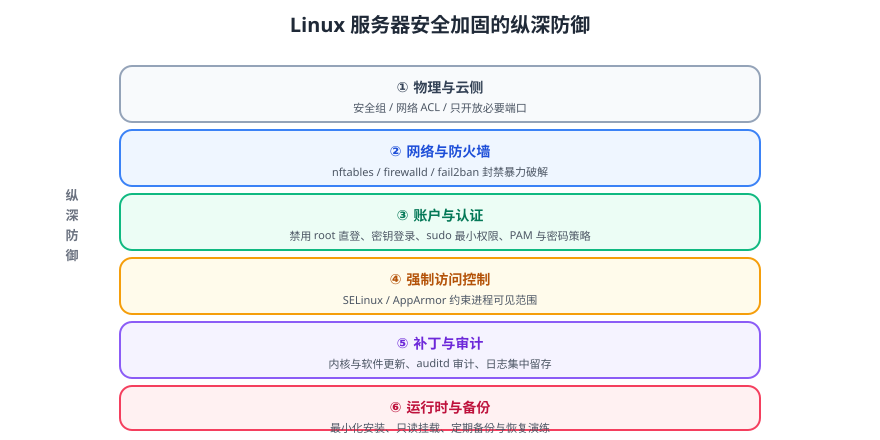

# 安全加固

一台暴露在公网的 Linux 服务器，从上线的第一分钟起就在被扫描。安全加固的目标不是「做到绝对安全」，而是**把攻击成本抬高到攻击者不值得继续**，同时保留完整的可审计痕迹。



::: tip 一句话理解
加固 = 减少暴露面（关掉不用的）+ 提高进入门槛（密钥、防火墙）+ 限制横向移动（最小权限、强制访问控制）+ 留痕（审计）。
:::

## 一、五条基本原则

| 原则 | 含义 | 落地动作 |
| --- | --- | --- |
| **最小暴露面** | 不需要的服务不装、不启动、不开端口 | 最小化安装、`ss -lntp` 逐个确认 |
| **最小权限** | 每件事都用刚好够用的权限 | 禁用 root 直登、应用专用账号、sudo 白名单 |
| **纵深防御** | 单层失效不影响整体 | 安全组 + 防火墙 + PAM + MAC + 审计 |
| **默认拒绝** | 白名单而非黑名单 | 防火墙默认 `drop`，只放行必要端口 |
| **可审计** | 任何变更都有记录 | auditd、集中日志、变更单 |

::: warning 加固的边界
加固措施必须**可解释、可回滚**。一次性套用「硬核脚本」把系统改成自己不熟悉的状态，等于给自己埋雷——真正的风险是「出事时你不知道是哪条规则导致的」。
**做法：每加一条规则，立刻验证一次业务可用性。**
:::

## 二、SSH 加固（收益最高的第一步）

```properties
# /etc/ssh/sshd_config.d/99-hardening.conf
# 说明：Ubuntu 22.04+ 支持 sshd_config.d 目录，避免直接改主配置被升级覆盖

Port 22022                          # 改默认端口只能减少噪音扫描，不是安全手段
Protocol 2

# —— 认证 ——
PermitRootLogin no                  # 禁止 root 直接登录（必须）
PasswordAuthentication no           # 关闭密码登录（前提：密钥已就位并验证通过）
PubkeyAuthentication yes
PermitEmptyPasswords no
MaxAuthTries 3                      # 认证失败次数上限
LoginGraceTime 30                   # 认证超时（秒）
AuthenticationMethods publickey

# —— 限制访问源 ——
AllowUsers deploy ops               # 只允许指定用户登录
# AllowGroups ssh-users

# —— 会话与转发 ——
ClientAliveInterval 300
ClientAliveCountMax 2
X11Forwarding no
AllowTcpForwarding no               # 不需要隧道的机器可以关掉
PermitTunnel no
GatewayPorts no

# —— 降低信息泄露 ——
Banner none
DebianBanner no
```

```shell
sudo sshd -t                        # 语法校验（务必先校验！）
sudo systemctl reload ssh
```

::: danger 三个会把你自己锁在门外的操作
1. **先关密码登录，再确认密钥能用**。正确顺序：
   ```shell
   # ① 先部署公钥并验证能免密登录（另开一个终端保持会话不断）
   ssh -p 22022 -i ~/.ssh/id_ed25519 deploy@server 'echo ok'
   # ② 确认成功后，才把 PasswordAuthentication no 打开
   ```
2. **改端口后忘记放行防火墙**：`sudo ufw allow 22022/tcp` 必须在 `reload` 之前。
3. **`AllowUsers` 写错用户名**：写错等于禁止所有人登录。用 `sshd -t` + 「保持一个已登录会话」双保险。
:::

### fail2ban：自动封禁暴力破解

```ini
# /etc/fail2ban/jail.d/sshd.local
[sshd]
enabled = true
port = 22022
filter = sshd
backend = systemd
maxretry = 5
findtime = 10m
bantime = 1h
bantime.increment = true        # 累犯递增封禁时长
ignoreip = 127.0.0.1/8 10.0.0.0/8
```

```shell
sudo systemctl enable --now fail2ban
sudo fail2ban-client status sshd      # 查看当前封禁列表
```

::: info 版本说明（2026-09 核对）
Ubuntu 26.04 LTS 携带 **OpenSSH 10.2**：
- **已移除 DSA 支持**，主机 DSA 密钥不再生成。升级前若仍在用 DSA 密钥，必须先轮换（`ssh-keygen -t ed25519`）。
- 默认启用**后量子混合密钥交换** `mlkem768x25519-sha256`，现代客户端无需额外配置即可协商。
:::

## 三、账户与权限

### 3.1 账户基线

```shell
# 查出所有可登录账户（UID < 1000 的系统账号不应有 shell）
awk -F: '($3<1000 || $3>=65534) && $7 !~ /(nologin|false)$/ {print $1, $3, $7}' /etc/passwd

# 查出无密码账户（必须为空）
sudo awk -F: '($2 == "" ) {print $1}' /etc/shadow

# 查出可登录的空 shell 账户
grep -E ':/(bin/sh|bin/bash)$' /etc/passwd
```

| 加固项 | 做法 |
| --- | --- |
| 系统账户不允许登录 | `/usr/sbin/nologin` 或 `/bin/false` |
| 禁止空密码 | `PermitEmptyPasswords no` + 定期巡检 `/etc/shadow` |
| 密码策略 | `pam_pwquality`（`/etc/security/pwquality.conf`）设最小长度、复杂度 |
| 登录失败锁定 | `pam_faillock`（`/etc/security/faillock.conf`）设 `deny=5`、`unlock_time=900` |
| 账户有效期 | `chage -M 90 user` 强制密码轮换（按合规要求） |
| 共享账号 | 禁止，一人一号，便于审计 |

### 3.2 sudo 最小权限

```bash
# /etc/sudoers.d/deploy —— 用 visudo 或独立文件，绝不要直接改 /etc/sudoers
# 允许重启特定服务，不允许 sudo su
deploy ALL=(root) NOPASSWD: /usr/bin/systemctl restart order-service
deploy ALL=(root) NOPASSWD: /usr/bin/systemctl status order-service

# 允许查看日志
deploy ALL=(root) NOPASSWD: /usr/bin/journalctl
```

```shell
sudo visudo -f /etc/sudoers.d/deploy     # 语法校验后再保存
sudo visudo -c                           # 检查全部 sudoers 语法
```

::: danger `visudo` 之外不要用别的编辑器
`/etc/sudoers` 语法错误会导致**所有人无法使用 sudo**（包括 root 通过 sudo）。如果已经改坏，需要用单用户模式或 `pkexec` 抢救。
正确做法：只用 `visudo`，且优先写到 `/etc/sudoers.d/` 下的独立文件。
:::

::: info 26.04 的一个变化
Ubuntu 26.04 默认使用 **`sudo-rs`**（用 Rust 重写的内存安全实现），原 C 版 `sudo` 仍作为 `sudo.ws` 保留可用。
`sudo-rs` 对 `/etc/sudoers` 的解析更严格，**旧配置中一些冷门语法可能不被支持**。升级后如果 sudo 报解析错误，检查是否有非标准指令，必要时切回 `sudo.ws` 过渡。
:::

## 四、防火墙

| 工具 | 适用 | 特点 |
| --- | --- | --- |
| `nftables`（`nft`） | 现代默认（Debian/Ubuntu 新版） | 统一替代 iptables，语法更清晰 |
| `iptables` / `ip6tables` | 存量系统、Docker 依赖 | 仍在用，但已是兼容层 |
| `firewalld` | RHEL / Rocky / Alma / CentOS | 区域（zone）模型，动态生效 |
| `ufw` | Ubuntu/Debian 简化封装 | 命令最简单，底层仍是 nftables |

### 4.1 ufw：Ubuntu 上最快上手

```shell
sudo ufw default deny incoming
sudo ufw default allow outgoing
sudo ufw allow 22022/tcp comment 'ssh'
sudo ufw allow 80/tcp
sudo ufw allow 443/tcp
sudo ufw --force enable
sudo ufw status verbose
```

::: danger 先放行 SSH 端口再启用 ufw
`sudo ufw enable` 会立刻生效。如果 SSH 端口没在白名单里，你的当前会话**不会立刻断开**（已建立连接），但下次登录会失败——除非你有控制台（云厂商 VNC）。
**标准顺序：allow → 验证 → enable。**
:::

### 4.2 nftables：更精确的控制

```nft
#!/usr/sbin/nft -f
# /etc/nftables.conf
flush ruleset

table inet filter {
  set ssh_bruteforce {
    type ipv4_addr
    flags dynamic, timeout
    timeout 1h
  }

  chain input {
    type filter hook input priority 0; policy drop;

    ct state established,related accept
    iif lo accept

    # ICMP：放行必要的类型，其余丢弃
    ip protocol icmp icmp type { echo-request, destination-unreachable, time-exceeded } accept

    # SSH：限速，超过则加入黑名单
    tcp dport 22022 ct state new \
      meter ssh_rate { ip saddr limit rate 6/minute burst 4 packets } accept
    tcp dport 22022 add @ssh_bruteforce { ip saddr } drop

    tcp dport { 80, 443 } accept trace
    ip protocol icmp drop
  }

  chain forward { type filter hook forward priority 0; policy drop; }
  chain output  { type filter hook output priority 0; policy accept; }
}
```

```shell
sudo nft -c -f /etc/nftables.conf      # 干跑校验
sudo nft -f /etc/nftables.conf         # 应用
sudo nft list ruleset                  # 查看当前规则
sudo systemctl enable --now nftables   # 开机自启（若使用 nftables.service）
```

::: warning Docker 与防火墙的经典冲突
Docker 会自行插入 `iptables`/`nftables` 规则来放行容器端口，**可能绕过 ufw/firewalld 的默认拒绝策略**——你以为 8080 没开，实际上公网可访问。
两种处理方式：
1. 让容器只绑定 `127.0.0.1`：`-p 127.0.0.1:8080:8080`，由 Nginx 反向代理对外。
2. 在 `DOCKER-USER` 链（iptables）或 `ip filter FORWARD`（nftables）里显式拒绝。
验证必做：
```shell
# 从外部机器执行，确认真实暴露面
nmap -Pn -p 1-10000 <公网IP>
```
:::

## 五、强制访问控制：SELinux / AppArmor

| 系统 | 默认 MAC | 状态查询 |
| --- | --- | --- |
| RHEL / Rocky / Alma / CentOS Stream | SELinux | `getenforce`、`sestatus` |
| Ubuntu / Debian | AppArmor | `aa-status` |
| Ubuntu（SELinux 可选安装） | SELinux | `getenforce` |

```shell
# SELinux
getenforce                 # Enforcing / Permissive / Disabled
sudo ls -Z /var/www/html   # 查看上下文
sudo ausearch -m avc -ts recent   # 查最近的拒绝记录
sudo restorecon -Rv /data  # 恢复默认上下文（文件搬迁后必做）

# AppArmor
sudo aa-status             # 已加载的 profile 与模式
sudo journalctl -k | grep -i apparmor | tail -20
sudo aa-complain /etc/apparmor.d/usr.sbin.nginx   # 临时改为告警模式排障
sudo aa-enforce  /etc/apparmor.d/usr.sbin.nginx   # 恢复强制
```

::: danger 不要用 `setenforce 0` 解决问题
这是**把安全机制关掉**来掩盖配置错误。正确流程：
1. `sudo ausearch -m avc -ts recent` 找到具体的拒绝项（来源、目标、权限）。
2. 判断是「标签错了」还是「真需要额外权限」。
   - 标签错（90% 的情况）：`sudo restorecon -Rv <路径>`。
   - 确实需要：用 `semanage fcontext` + `restorecon` 永久修正标签，或用 `audit2allow` 生成策略（谨慎，需评审）。
3. 从 `Permissive` 验证通过后再切回 `Enforcing`，并**记录到变更单**。
:::

## 六、补丁与更新

```shell
# Ubuntu / Debian：自动安全更新
sudo dpkg-reconfigure --priority=low unattended-upgrades     # 交互开启
cat /etc/apt/apt.conf.d/50unattended-upgrades | grep -v '^//' | grep -v '^$'

# RHEL 系
sudo dnf install -y dnf-automatic
sudo systemctl enable --now dnf-automatic.timer

# 快速盘点「装了但没重启生效」的内核/库更新
sudo needrestart -b          # Debian/Ubuntu，需安装 needrestart
[ -f /var/run/reboot-required ] && cat /var/run/reboot-required.pkgs
```

| 策略 | 做法 |
| --- | --- |
| 安全补丁 | 自动安装（`unattended-upgrades` 只管安全源） |
| 功能更新 | 手工窗口期执行，带变更单与回滚方案 |
| 内核更新 | 更新后**必须规划重启窗口**，否则漏洞仍未修复 |
| 版本基线 | 记录每台机器的发行版与内核版本，定期核对 EOL |

::: info 26.04 上的一个必做动作
Ubuntu 26.04 的 APT 已升级到 3.x，**`apt-key` 命令已被移除**。
任何仍在使用 `apt-key add` 的私有源/镜像脚本都会失败，必须改成：

```shell
curl -fsSL https://example.com/key.gpg \
  | sudo gpg --dearmor -o /usr/share/keyrings/example.gpg
echo "deb [signed-by=/usr/share/keyrings/example.gpg] https://example.com/apt stable main" \
  | sudo tee /etc/apt/sources.list.d/example.list
```
升级前建议先 `grep -rn "apt-key" /etc/apt /usr/local/bin` 摸底。
:::

## 七、审计与完整性

```bash
# /etc/audit/rules.d/hardening.rules
# 监控关键文件的写入与属性变更
-w /etc/passwd  -p wa -k identity
-w /etc/shadow  -p wa -k identity
-w /etc/sudoers -p wa -k privileged
-w /etc/sudoers.d/ -p wa -k privileged
-w /etc/ssh/sshd_config -p wa -k sshd

# 监控提权与权限变更
-a always,exit -F arch=b64 -S execve -F euid=0 -F auid>=1000 -F auid!=-1 -k rootcmd
-a always,exit -F arch=b64 -S chmod,fchmod,fchmodat -F auid>=1000 -F auid!=-1 -k perm_mod

# 监控删除文件
-a always,exit -F arch=b64 -S unlink,unlinkat,rename,renameat -F auid>=1000 -F auid!=-1 -k delete

# 监控挂载
-a always,exit -F arch=b64 -S mount -F auid>=1000 -F auid!=-1 -k export
```

```shell
sudo augenrules --load            # 加载规则
sudo auditctl -l                  # 查看已加载规则
sudo ausearch -k identity -ts today
sudo aureport --summary
```

| 审计项 | 关注什么 |
| --- | --- |
| `identity` | 账户文件被改（新增后门账号） |
| `priv_esc` / `rootcmd` | 提权命令执行 |
| `delete` | 关键目录被删 |
| `perm_mod` | 权限被放宽（`chmod 777`） |

::: tip 审计日志必须外发
本地 auditd 日志被 root 可以清掉。生产环境必须通过 [日志体系](../../../LogSystem/index.md) 把 `audit.log` 与 `auth.log` **实时外发**到独立日志平台，并设置「日志断流」告警。
:::

## 八、内核与挂载加固

```properties
# /etc/sysctl.d/99-security.conf
# 内核信息泄露
kernel.dmesg_restrict = 1
kernel.kptr_restrict = 2
kernel.printk = 3 3 3 3
kernel.unprivileged_bpf_disabled = 1
kernel.yama.ptrace_scope = 1

# 内存保护
kernel.randomize_va_space = 2          # 完整 ASLR
fs.protected_hardlinks = 1
fs.protected_symlinks = 1
fs.suid_dumpable = 0

# 网络
net.ipv4.conf.all.rp_filter = 1        # 反向路径校验，防 IP 欺骗
net.ipv4.conf.all.accept_source_route = 0
net.ipv4.conf.all.accept_redirects = 0
net.ipv4.conf.all.send_redirects = 0
net.ipv4.conf.all.log_martians = 1
net.ipv4.tcp_syncookies = 1            # SYN Flood 防护
net.ipv6.conf.all.accept_ra = 0
net.ipv6.conf.all.accept_redirects = 0
```

```properties
# /etc/fstab 挂载加固
tmpfs   /tmp     tmpfs   defaults,nosuid,nodev,noexec,size=2G   0 0
tmpfs   /dev/shm tmpfs   defaults,nosuid,nodev,noexec,size=1G   0 0
```

::: danger `noexec` 会导致某些程序无法运行
`/tmp` 加 `noexec` 后，任何把可执行文件解压到 `/tmp` 再运行的操作都会失败（部分 Java 安装器、`pip` 编译、`npm` 原生模块构建都受影响）。
如果业务确实需要，改为 `/tmp` 上不加 `noexec`，或改用 `mount` 命名空间隔离。**加之前先在一台机器上跑一遍业务回归。**
:::

## 九、实战：一台公网服务器的加固脚本

```bash
#!/usr/bin/env bash
# /opt/scripts/harden.sh —— 幂等加固脚本，可重复执行
set -euo pipefail
IFS=$'\n\t'

[[ $EUID -eq 0 ]] || { echo "请用 root 执行" >&2; exit 3; }

log() { printf '[%s] %s\n' "$(date '+%F %T')" "$*"; }

readonly SSH_PORT="${SSH_PORT:-22022}"

log "① 检查 SSH 端口与防火墙顺序"
if command -v ufw >/dev/null; then
  ufw allow "${SSH_PORT}/tcp" comment 'ssh' || true
  ufw --force enable || true
fi

log "② SSH 加固配置"
mkdir -p /etc/ssh/sshd_config.d
cat > /etc/ssh/sshd_config.d/99-hardening.conf <<EOF
Port ${SSH_PORT}
PermitRootLogin no
PasswordAuthentication no
PermitEmptyPasswords no
MaxAuthTries 3
LoginGraceTime 30
X11Forwarding no
EOF
sshd -t || { log "sshd 配置校验失败，已回滚"; rm -f /etc/ssh/sshd_config.d/99-hardening.conf; exit 3; }

log "③ 内核安全参数"
cat > /etc/sysctl.d/99-security.conf <<'EOF'
kernel.dmesg_restrict = 1
kernel.kptr_restrict = 2
kernel.yama.ptrace_scope = 1
fs.protected_hardlinks = 1
fs.protected_symlinks = 1
net.ipv4.conf.all.rp_filter = 1
net.ipv4.conf.all.accept_redirects = 0
net.ipv4.tcp_syncookies = 1
EOF
sysctl --system >/dev/null

log "④ 关闭不需要的服务（按需调整）"
for svc in telnet.socket rsh.socket avahi-daemon cups; do
  systemctl disable --now "$svc" 2>/dev/null && log "已关闭 ${svc}" || true
done

log "⑤ 巡检可登录账户"
awk -F: '($3<1000 || $3>=65534) && $7 !~ /(nologin|false)$/ {print "  可疑账户: " $1 " shell=" $7}' /etc/passwd

log "⑥ 检查空密码账户"
awk -F: '($2 == "") {print "  空密码账户: " $1}' /etc/shadow

log "加固完成。请另开终端验证 SSH 免密登录后再断开当前会话。"
```

### 验证方式

```shell
# 1. 脚本语法与静态检查
shellcheck -S warning /opt/scripts/harden.sh && bash -n /opt/scripts/harden.sh

# 2. 幂等：连续执行两次都应成功
sudo /opt/scripts/harden.sh && sudo /opt/scripts/harden.sh

# 3. 关键项生效
sudo sshd -T | grep -E '^(port|permitrootlogin|passwordauthentication)'
# 预期：port 22022 / permitrootlogin no / passwordauthentication no

sudo sysctl kernel.kptr_restrict net.ipv4.tcp_syncookies
# 预期：kernel.kptr_restrict = 2 / net.ipv4.tcp_syncookies = 1

# 4. 从外部机器确认真实暴露面（最重要）
nmap -Pn -p 1-10000 <公网IP>
# 预期：只看到 22022（以及业务必需的 80/443），其余 filtered/closed

# 5. 强制访问控制处于强制模式
getenforce 2>/dev/null || sudo aa-status | head -3
# 预期：Enforcing 或 AppArmor profiles are in enforce mode

# 6. 审计规则已加载
sudo auditctl -l | grep -c identity
# 预期：≥ 1
```

## 十、易错点汇总

::: danger 逐条对照
1. **先关密码登录再备份密钥** → 把自己锁在门外。顺序见第二节。
2. **改 SSH 端口不放行防火墙** → 下次登录失败。
3. **`/etc/sudoers` 用普通编辑器改** → 语法错误导致全站无法 sudo。
4. **`ufw enable` 前没 `allow` SSH** → 失去远程登录。
5. **Docker 绕过 ufw** → 端口实际暴露。必须从外部 `nmap` 验证。
6. **`setenforce 0` 代替排障** → 把安全机制关掉，问题被掩盖。
7. **只装补丁不重启** → 内核漏洞仍未修复。
8. **`/tmp` 加 `noexec` 未做业务回归** → 部分部署/构建流程失败。
9. **`apt-key` 已移除**（26.04）→ 私有源脚本报错，改用 `signed-by`。
10. **DSA 密钥未轮换**（OpenSSH 10.2 已移除 DSA）→ 升级后无法登录。
11. **审计日志只存本地** → root 可清除，等于没有审计。
12. **从不在外部验证暴露面** → 自认为很安全，实际端口大开。
:::

## 参考资料

- CIS Benchmarks（各发行版加固基线）：https://www.cisecurity.org/cis-benchmarks
- OpenSSH `sshd_config` 手册：https://man.openbsd.org/sshd_config
- nftables wiki：https://wiki.nftables.org/
- Ubuntu 安全文档：https://ubuntu.com/security
- SELinux 用户与管理员指南：https://access.redhat.com/documentation/en-us/red_hat_enterprise_linux/
- AppArmor 文档：https://gitlab.com/apparmor/apparmor/-/wikis/Documentation
- auditd 规则参考：https://github.com/linux-audit/audit-documentation/wiki
- 本专题其余章节：[Linux 进阶导览](../index.md)、[容器与集群安全加固](../../../ContainerOrchestration/Security/index.md)、[日志体系](../../../LogSystem/index.md)
