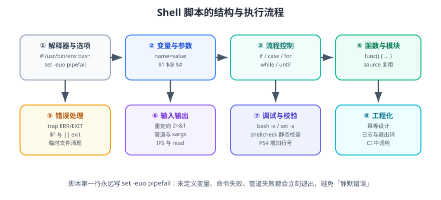

# Shell 脚本编程

Shell 脚本是把「一堆手工命令」固化成「可重复执行的程序」的最短路径：服务器上的部署、备份、巡检、日志清理，绝大多数最终都要落到一个 `.sh` 文件上。本篇讲的是**能上生产的脚本该怎么写**，而不是把所有语法罗列一遍。



::: tip 一句话理解
好的脚本满足三条：**幂等**（跑十遍和跑一遍结果一样）、**失败即停**（出错不继续往下走）、**可读**（三个月后自己还看得懂）。
:::

## 一、什么时候用 Shell，什么时候别用

| 场景 | 推荐 | 原因 |
| --- | --- | --- |
| 调用现成命令做编排（部署、备份、启停） | ✅ Shell | 天然是命令的胶水 |
| 文本过滤、日志切分 | ✅ Shell（awk/sed/grep） | 一行顶十行 |
| 复杂数据结构、JSON 处理 | ⚠️ `jq` 辅助或换语言 | Shell 没有真正的数据结构 |
| 超过 300 行、含业务逻辑 | ❌ 换 Python / Go / Java | 可维护性、可测试性都不够 |
| 需要并发与精细错误处理 | ❌ 换语言 | Shell 的并发与异常模型很弱 |
| 跨平台（Windows） | ❌ 换 PowerShell / 语言 | bash 在 Windows 上不是一等公民 |

::: warning 说明
「用 Shell 写」不等于「只能写 Shell」。生产脚本里最实用的组合是：**Shell 负责流程编排，复杂逻辑交给 `jq`、`python -c` 或独立程序**。
:::

## 二、脚本骨架：这四行必须写

```bash [deploy.sh]
#!/usr/bin/env bash
set -euo pipefail
IFS=$'\n\t'
readonly SCRIPT_DIR="$(cd "$(dirname "${BASH_SOURCE[0]}")" && pwd)"
```

逐行解释：

1. `#!/usr/bin/env bash`：用 `env` 查找 `bash`，比写死 `/bin/bash` 更可移植；也避免了 `/bin/sh`（dash）不支持 `[[ ]]` 等扩展语法的问题。
2. `set -euo pipefail`：三个开关叠加，是 Shell 脚本最重要的安全网。
3. `IFS=$'\n\t'`：把字段分隔符设为「换行 + 制表符」，避免文件名里有空格时被拆成两个参数。
4. `SCRIPT_DIR`：拿到脚本自身所在目录，之后所有相对路径都基于它，脚本就能被任意位置调用。

### `set -euo pipefail` 到底做了什么

| 选项 | 全称 | 作用 | 不写的后果 |
| --- | --- | --- | --- |
| `-e` | errexit | 命令返回非 0 就退出 | 报错后继续执行，把错误越滚越大 |
| `-u` | nounset | 使用未定义变量就报错退出 | 拼错变量名时静默变成空字符串 |
| `-o pipefail` | pipefail | 管道中任一环节失败，整体算失败 | 只看最后一个命令的退出码，前面挂了也不报 |

```bash
# 演示：没有 pipefail 时，前面的命令失败会被吞掉
set +o pipefail
grep -q "不存在的关键字" /etc/hostname | cat
echo "退出码=$?"          # 输出 0，因为 cat 成功了

# 加上 pipefail 后才符合直觉
set -o pipefail
grep -q "不存在的关键字" /etc/hostname | cat || echo "前面的 grep 失败了"
```

::: danger `set -e` 的四个「不生效」场景
1. **命令出现在 `if` / `while` / `&&` / `||` 条件位置时不触发**，因为此时失败是「预期内的」。
   ```bash
   # 这样是安全的：失败只走 else
   if ! grep -q "keyword" "$file"; then echo "未找到"; fi
   ```
2. **管道里除了最后一个命令**（未开 `pipefail`）失败不触发，见上表。
3. **函数内部失败，但函数被调用的位置处于 `if` 等条件中**，整个函数里的命令都不触发 `-e`。
4. **`$(...)` 命令替换里的失败**在部分场景下不传播，建议显式判断：
   ```bash
   # 容易踩坑：赋值失败不会让脚本退出
   value="$(grep -m1 '^NAME=' /etc/os-release || true)"
   ```
:::

## 三、变量：比你想的更强大

### 3.1 赋值与引用的铁律

```bash
name="web-server"          # 等号两侧不能有空格
echo "${name}"             # 引用一定要加双引号
echo "${name}_01"          # 用花括号界定变量边界，输出 web-server_01
```

::: danger 永远给变量加双引号
```bash
# 错误写法：路径含空格或为空时会出问题
rm -rf $target_dir/*

# 正确写法
rm -rf "${target_dir:?target_dir 未设置，拒绝执行}"/*
```
`${var:?message}` 是「必须存在」断言：变量为空或未设置时立即退出并打印 message，这是防误删最有效的一招。
:::

### 3.2 参数展开速查

| 写法 | 含义 | 示例（`v` 未设置时） |
| --- | --- | --- |
| `${v:-default}` | 为空则用默认值（不改变 v） | 输出 `default` |
| `${v:=default}` | 为空则赋默认值（改变 v） | v 变成 `default` |
| `${v:?msg}` | 为空则报错退出 | 退出并打印 msg |
| `${v:+alt}` | 不为空则用 alt | 输出空 |
| `${#v}` | 字符串长度 | `0` |
| `${v:2:3}` | 从下标 2 取 3 个字符 | 空 |
| `${v%.*}` | 从右删最短匹配 | 常用于去扩展名 |
| `${v##*/}` | 从左删最长匹配 | 取文件名（basename） |
| `${v//a/b}` | 全部替换 a 为 b | 空 |
| `${v^^}` / `${v,,}` | 转大写 / 转小写 | 空 |

```bash
file="/var/log/app/order-service.log"
echo "${file##*/}"      # order-service.log      取文件名
echo "${file%/*}"       # /var/log/app           取目录
echo "${file%.log}"     # .../order-service      去扩展名
echo "${file//app/web}" # /var/log/web/order-service.log
```

::: tip `${var:-}` 的高频用途
配合 `set -u` 判断环境变量是否可选：

```bash
LOG_LEVEL="${LOG_LEVEL:-INFO}"     # 有默认值的可选项
REQUIRED_TOKEN="${REQUIRED_TOKEN:?必须提供 REQUIRED_TOKEN}"   # 必填项
```
:::

### 3.3 数组与关联数组

```bash
# 索引数组
hosts=("10.0.0.11" "10.0.0.12" "10.0.0.13")
echo "${hosts[0]}"        # 第一个元素
echo "${#hosts[@]}"       # 元素个数
for h in "${hosts[@]}"; do echo "检查 ${h}"; done

# 关联数组（键值对，bash 4+）
declare -A status
status[web]=running
status[db]=stopped
for key in "${!status[@]}"; do
  echo "${key} => ${status[$key]}"
done
```

::: danger 遍历数组必须用 `"${arr[@]}"`
1. `$arr` 只取第 0 个元素（不是全部）。
2. `${arr[*]}` 会把所有元素拼成一个字符串，遇到空格就散架。
3. `"${arr[@]}"` 才对——加引号保留每个元素，用 `@` 表示全部。
:::

## 四、参数接收：`$@` 与 `getopts`

```bash
#!/usr/bin/env bash
set -euo pipefail

usage() {
  cat <<'EOF'
用法: deploy.sh -e <环境> -v <版本> [-d 试运行]
  -e  环境: dev | staging | prod
  -v  版本号, 如 1.4.2
  -d  试运行, 只打印不执行
EOF
}

dry_run=false
env=""
version=""

while getopts ":e:v:dh" opt; do
  case "$opt" in
    e) env="$OPTARG" ;;
    v) version="$OPTARG" ;;
    d) dry_run=true ;;
    h) usage; exit 0 ;;
    \?) echo "未知选项: -$OPTARG" >&2; usage; exit 2 ;;
    :)  echo "选项 -$OPTARG 缺少参数" >&2; usage; exit 2 ;;
  esac
done
shift $((OPTIND - 1))

[[ -n "$env"     ]] || { echo "缺少 -e" >&2; exit 2; }
[[ -n "$version" ]] || { echo "缺少 -v" >&2; exit 2; }
echo "部署 env=${env} version=${version} dry_run=${dry_run}"
```

| 变量 | 含义 | 注意 |
| --- | --- | --- |
| `$0` | 脚本名 | 用 `${BASH_SOURCE[0]}` 更可靠 |
| `$1`..`$9` | 位置参数 | 第 10 个起必须写 `${10}` |
| `$#` | 参数个数 | 判断「至少传了 N 个」 |
| `"$@"` | 全部参数（保留分组） | **必须加引号** |
| `"$*"` | 全部参数（拼成一个） | 少用 |
| `$?` | 上一条命令退出码 | 赋值后立刻取，别隔语句 |
| `$$` | 当前进程 PID | 写 pid 文件常用 |
| `${LINENO}` | 当前行号 | 调试日志里很有用 |

::: danger `getopts` 的 `:` 前缀
`getopts ":e:v:dh"` 里**开头的冒号表示静默模式**：未知选项走 `\?`，缺参数走 `:`。
若不写开头的冒号（`getopts "e:v:dh"`），bash 会自己往 stderr 打印错误信息，你的 `\?` 分支仍然会走，但提示会重复。
另外 `e:` 的冒号表示「-e 需要参数」，`d` 没有冒号表示它是开关。
:::

## 五、条件判断：`[ ]`、`[[ ]]` 与算术

```bash
# 推荐：[[ ]]（bash 内建，支持正则与模式匹配，不需要引号保护）
if [[ "$env" == "prod" && "$version" =~ ^[0-9]+\.[0-9]+\.[0-9]+$ ]]; then
  echo "生产环境且版本号格式正确"
fi

# 兼容 POSIX sh 时才用 [ ]，此时变量必须加引号
if [ "$env" = "prod" ]; then echo "prod"; fi
```

| 用途 | `[[ ]]` 写法 | 说明 |
| --- | --- | --- |
| 字符串相等 | `[[ "$a" == "$b" ]]` | `=` 也可以 |
| 模式匹配 | `[[ "$f" == *.log ]]` | 右侧不加引号才当通配符 |
| 正则匹配 | `[[ "$v" =~ ^v[0-9]+ ]]` | 匹配结果在 `BASH_REMATCH` |
| 数值比较 | `(( a > b ))` 或 `[[ a -gt b ]]` | 推荐用算术语法 |
| 文件存在 | `[[ -e "$p" ]]` | 见下表 |
| 目录 | `[[ -d "$p" ]]` | |
| 普通文件 | `[[ -f "$p" ]]` | |
| 可读/可写/可执行 | `[[ -r ]]` / `[[ -w ]]` / `[[ -x ]]` | |
| 非空文件 | `[[ -s "$p" ]]` | |
| 符号链接 | `[[ -L "$p" ]]` | |

::: danger 三个经典错误
1. **用 `==` 比较数值**：`[[ "10" == "9" ]]` 是字符串比较，结果为假。数值要用 `(( 10 > 9 ))`。
2. **`[[ ]]` 里写 `-a` / `-o`**：这是 `[ ]` 的旧写法，`[[ ]]` 里应改用 `&&` / `||`。
3. **忘记 `(( ))` 里可以直接用变量名**：`(( count++ ))` 等价于 `count=$((count+1))`，不需要 `$`。
   ```bash
   # 注意：(( count++ )) 在 count 为 0 时返回退出码 1，配合 set -e 会中断！
   (( count++ )) || true     # 或者写成 count=$((count + 1))
   ```
:::

## 六、流程控制与函数

```bash
for ((i = 1; i <= 3; i++)); do echo "第 $i 次"; done
while IFS= read -r line; do echo "行: $line"; done < "/etc/hosts"
case "$env" in
  dev|staging) replicas=1 ;;
  prod)        replicas=3 ;;
  *)           echo "未知环境" >&2; exit 2 ;;
esac
```

```bash
log() { printf '[%s] %s\n' "$(date '+%F %T')" "$*" >&2; }

retry() {
  local -i max=$1; shift
  local -i n=0
  until "$@"; do
    (( n++ ))
    if (( n >= max )); then log "重试 ${max} 次仍失败: $*"; return 1; fi
    log "第 ${n} 次重试: $*"; sleep $((n * 2))
  done
}

retry 3 curl -fsS http://127.0.0.1:8080/actuator/health
```

| 要点 | 写法 | 说明 |
| --- | --- | --- |
| 局部变量 | `local x=1` | 不写 `local` 会污染全局 |
| 返回值 | `return 0/1` | 只能返回 0~255，**数据要靠 stdout 传递** |
| 取函数输出 | `result="$(my_func)"` | 不要在函数里 echo 日志到 stdout |
| 参数 | `local a=$1; shift` | 先存再 shift，避免丢参 |
| 传数组 | 用全局变量或 `"$@"` | Shell 不能直接传数组 |

::: tip 「日志走 stderr、数据走 stdout」是硬规矩
否则 `result="$(func)"` 会把日志一起捕获进来，后面解析必然出错。所有 `log()` 都要 `>&2`。
:::

## 七、重定向、管道与进程替换

| 语法 | 作用 |
| --- | --- |
| `> file` | stdout 覆盖写 |
| `>> file` | stdout 追加 |
| `2> file` | stderr 写入 |
| `> file 2>&1` | stdout+stderr 一起覆盖写（顺序不能反） |
| `&> file` | bash 简写，等价于上面 |
| `<<'EOF' ... EOF` | here-doc，**加引号则不展开变量** |
| `<<< "text"` | here-string，把字符串喂给 stdin |
| `cmd > >(tee -a log) 2>&1` | 进程替换，边写文件边看输出 |

```bash
# 生产脚本的标准日志写法：同时进日志文件和 journal/终端
exec >>"${LOG_FILE}" 2>&1
```

::: danger `2>&1 > file` 是错的
重定向是**从左到右**求值的。`2>&1 >file` 先把 stderr 指向「当前的 stdout」（终端），再把 stdout 指向文件——结果 stderr 还是打到终端。
正确写法只有一种顺序：`>file 2>&1`。
:::

## 八、错误处理：`trap` 与退出码

```bash
#!/usr/bin/env bash
set -euo pipefail

TMP_DIR=""
cleanup() {
  local code=$?
  [[ -n "$TMP_DIR" && -d "$TMP_DIR" ]] && rm -rf "$TMP_DIR"
  if (( code != 0 )); then
    echo "[$(date '+%F %T')] 脚本失败, 退出码=${code}, 行号=${LINENO}" >&2
  fi
  exit "$code"
}
trap cleanup EXIT

on_err() { echo "命令失败: 行 ${1}, 语句: ${2}" >&2; }
trap 'on_err "${LINENO}" "${BASH_COMMAND}"' ERR

TMP_DIR="$(mktemp -d)"
echo "临时目录: ${TMP_DIR}"
```

| 信号 | 触发时机 | 典型用途 |
| --- | --- | --- |
| `EXIT` | 脚本任何方式退出 | 清理临时文件、解锁、写结束日志 |
| `ERR` | 命令失败（受 `set -e` 规则约束） | 打印上下文、上报 |
| `INT` / `TERM` | Ctrl+C / `kill` | 优雅停止、清理子进程 |
| `DEBUG` | 每条命令执行前 | 打印调用栈（谨慎使用，噪音大） |

::: danger `trap` 里的三个坑
1. **`trap` 内不要依赖 `set -e`**：失败时如果不显式 `exit`，脚本会带着原退出码继续走。
2. **`EXIT` trap 会改退出码**：`cleanup` 里最后一条命令若失败，会把退出码覆盖掉。所以先 `local code=$?` 再 `exit "$code"`。
3. **不要用 `trap ... EXIT` 做业务逻辑**：它只适合清理与记录，业务步骤要写在主流程里。
:::

### 退出码约定

| 退出码 | 约定含义 | 用途 |
| --- | --- | --- |
| `0` | 成功 | |
| `1` | 通用错误 | |
| `2` | 用法/参数错误 | 配合 `usage` |
| `3` | 配置或环境不满足 | 前置检查失败 |
| `4` | 依赖服务不可用 | 健康检查失败 |
| `126` / `127` | 无执行权限 / 命令未找到 | 注意 `Exec format error` 也归此类 |

## 九、调试与静态检查

```bash
bash -n script.sh          # 只做语法检查，不执行
bash -x script.sh          # 打印每条执行到的命令
bash -x -v script.sh       # 同时打印原始行（-v）
shellcheck -S warning script.sh   # 静态检查，CI 里必跑
```

```bash
# 让 -x 的输出更可读：加时间戳与行号
export PS4='+[${BASH_SOURCE##*/}:${LINENO}] '
set -x
```

::: tip 把 shellcheck 接进 CI
```yaml
# .github/workflows/lint.yml 片段
- name: ShellCheck
  uses: ludeeus/action-shellcheck@master
  with:
    severity: warning
    scandir: ./scripts
```
ShellCheck 能挡掉「未加引号的变量」「`[ ]` 里忘了引号」「`cd` 没判断是否成功」等绝大多数低级事故。
:::

## 十、生产脚本的五个必备模式

### 10.1 幂等

```bash
# 反例：重复执行会报错或叠加
mkdir /data/app

# 正例
mkdir -p /data/app
ln -sfn /data/app/current-1.4.2 /data/app/current     # -n 覆盖已有软链
```

### 10.2 单实例锁

```bash
LOCK_FILE=/var/lock/deploy.lock
exec 200>"$LOCK_FILE"
flock -n 200 || { echo "已有实例在运行，退出" >&2; exit 3; }
```

### 10.3 超时保护

```bash
if ! timeout 30 curl -fsS http://127.0.0.1:8080/actuator/health >/dev/null; then
  echo "健康检查超时" >&2; exit 4
fi
```

### 10.4 前置检查

```bash
require_cmd() { command -v "$1" >/dev/null 2>&1 || { echo "缺少命令: $1" >&2; exit 3; }; }
require_cmd curl
require_cmd jq
require_cmd systemctl
```

### 10.5 试运行开关

```bash
run() {
  if [[ "$dry_run" == true ]]; then
    printf '[dry-run] %s\n' "$*"
  else
    "$@"
  fi
}
run systemctl restart order-service
```

## 十一、实战：一个可回滚的部署脚本

```bash
#!/usr/bin/env bash
# 文件: scripts/deploy.sh —— 幂等、带锁、失败自动回滚
set -euo pipefail
IFS=$'\n\t'

readonly APP=order-service
readonly BASE=/data/app/${APP}
readonly RELEASE_DIR=${BASE}/releases
readonly KEEP=5
readonly HEALTH_URL=http://127.0.0.1:8080/actuator/health

log()  { printf '[%s] %s\n' "$(date '+%F %T')" "$*" >&2; }
die()  { log "ERROR: $*"; exit 1; }

[[ $# -ge 2 ]] || die "用法: deploy.sh <版本号> <包路径>"
version=$1; pkg=$2
[[ -f "$pkg" ]] || die "安装包不存在: $pkg"
[[ "$version" =~ ^[0-9]+\.[0-9]+\.[0-9]+$ ]] || die "版本号格式非法: $version"

# 单实例锁
exec 200>/var/lock/${APP}.lock
flock -n 200 || die "已有部署在进行中"

target=${RELEASE_DIR}/${version}
previous="$(readlink -f "${BASE}/current" 2>/dev/null || true)"

rollback() {
  [[ -n "$previous" ]] || { log "无可用版本可回滚"; return 1; }
  log "回滚到 ${previous}"
  ln -sfn "$previous" "${BASE}/current"
  systemctl restart "${APP}"
}

cleanup() {
  local code=$?
  if (( code != 0 )) && [[ -d "$target" ]]; then
    rm -rf "$target"
    rollback || true
  fi
  exit "$code"
}
trap cleanup EXIT

log "部署 ${APP} 版本 ${version}"
mkdir -p "$target"
tar -xzf "$pkg" -C "$target"
ln -sfn "$target" "${BASE}/current"

systemctl restart "${APP}"
for i in {1..15}; do
  if curl -fsS --max-time 3 "$HEALTH_URL" >/dev/null 2>&1; then
    log "健康检查通过（第 ${i} 次）"
    log "部署成功: $(readlink -f "${BASE}/current")"
    # 保留最近 KEEP 个版本
    ls -1dt "${RELEASE_DIR}"/*/ | tail -n +$((KEEP + 1)) | xargs -r rm -rf
    exit 0
  fi
  sleep 2
done
die "健康检查失败，触发回滚"
```

### 验证方式

```shell
# 1. 语法与静态检查
shellcheck -S warning scripts/deploy.sh && bash -n scripts/deploy.sh

# 2. 试运行（不真正执行）
./scripts/deploy.sh 1.4.2 ./dist/order-service-1.4.2.tar.gz
# 预期：日志逐行打印，含「健康检查通过」与「部署成功」

# 3. 验证幂等：连续执行两次，第二次也应成功且软链指向同一版本
readlink -f /data/app/order-service/current

# 4. 验证回滚：故意传一个坏包，观察是否回滚到上一版本
systemctl is-active order-service      # 预期：active
```

## 十二、易错点汇总

::: danger 上线前请逐条对照
1. **不写 `set -euo pipefail`**：脚本静默出错，问题延后爆发。正确做法见第二节。
2. **变量不加引号**：路径含空格或为空时行为诡异。统一写 `"${var}"`。
3. **`cd` 不判断成功**：`cd /nope && rm -rf ./*` 中的 `cd` 失败时，`rm` 不会执行（有 `&&` 保护）；但 `cd /nope; rm -rf ./*` 会删当前目录。永远用 `cd ... || exit 1`。
4. **用 `rm -rf $dir/*` 且 `dir` 可能为空**：改成 `rm -rf "${dir:?dir 未设置}"/*`。
5. **`for f in $(ls)`**：文件名含空格即崩。改成 `for f in ./*; do ...; done` 或用 `find -print0 | xargs -0`。
6. **`while read` 没写 `-r`**：反斜杠会被吞掉。统一 `while IFS= read -r line`。
7. **`trap` 里 `exit` 丢失原退出码**：先存 `$?`。
8. **把密码写在脚本里**：改用环境变量、`systemd` 的 `EnvironmentFile`（权限 600）或密钥管理服务。
9. **`echo` 打印带 `-` 开头的字符串**：会被当成选项。改用 `printf '%s\n' "$str"`。
10. **忘记 `exit` 明确退出码**：CI 里脚本「成功但没做事」最难查。
:::

## 参考资料

- GNU Bash 手册：https://www.gnu.org/software/bash/manual/bash.html
- Bash 参数展开详解：https://www.gnu.org/software/bash/manual/bash.html#Shell-Parameter-Expansion
- ShellCheck 规则列表：https://www.shellcheck.net/wiki/
- Google Shell 风格指南：https://google.github.io/styleguide/shellguide.html
- `flock` 手册：https://man7.org/linux/man-pages/man1/flock.1.html
- 本专题其余章节：[Linux 进阶导览](../index.md)
- 脚本写腻了、想改成声明式幂等执行：[Ansible 自动化运维](../../../Ansible/index.md)
