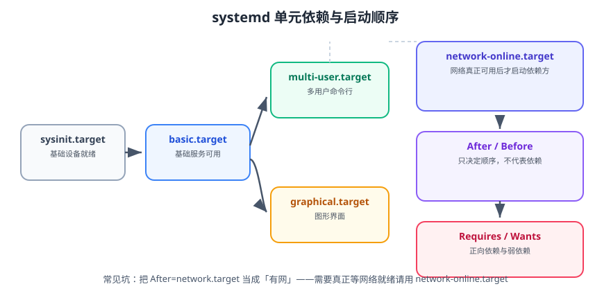

# systemd 服务管理

systemd 是现代 Linux 的**初始化系统与服务管理器**：它作为 PID 1 启动整个用户空间，并用声明式的 unit 文件描述「要启动什么、依赖谁、用多少资源、怎么重启」。把程序托管给 systemd，是「手工 `nohup java -jar`」和「能上生产」之间的分水岭。



::: tip 一句话理解
写一个 unit 文件，等于给程序加了：开机自启、崩溃重启、资源上限、标准日志、依赖编排——这五件事过去要靠 `nohup` + 定时脚本各写一遍。
:::

## 一、systemd 的设计取向

| 特性 | 传统 SysV init | systemd |
| --- | --- | --- |
| 启动方式 | 串行执行脚本 | 依赖驱动，能并行的并行 |
| 服务定义 | 一段 Shell 脚本 | 声明式 unit 文件 |
| 进程追踪 | 靠 pid 文件 | 用 **cgroup** 追踪整个进程树 |
| 日志 | 各自写到文件 | 统一进 journald（`journalctl` 查） |
| 资源限制 | `ulimit` 手工调 | unit 内声明 `MemoryMax` / `CPUQuota` |
| 定时任务 | cron | `*.timer` |
| 依赖关系 | 脚本注释里的伪约定 | `Requires` / `After` 一等公民 |

::: info 版本与兼容（2026-09 核对）
- **Ubuntu 26.04 LTS 携带 systemd 259**：**已彻底移除 cgroup v1**，只支持 cgroup v2 统一层级；System V 服务脚本已被弃用（兼容层仍在，但会产生告警）。
- **Ubuntu 24.04 LTS 携带 systemd 255**，仍兼容 cgroup v1 混合层级，存量环境大量存在。
- 检查当前版本与 cgroup 层级：
  ```shell
  systemctl --version                # 首行显示 systemd 版本
  stat -fc %T /sys/fs/cgroup         # 输出 cgroup2fs 才是纯 v2
  grep -r cgroup /etc/systemd ~/.config 2>/dev/null   # 升级 26.04 前的摸底
  ```
:::

## 二、unit 类型一览

| 后缀 | 类型 | 作用 | 常用命令 |
| --- | --- | --- | --- |
| `.service` | 服务 | 常驻进程或一次性任务 | `systemctl start/stop/status` |
| `.socket` | 套接字 | 按需唤醒服务（惰性启动） | `systemctl start x.socket` |
| `.timer` | 定时器 | 替代 cron | `systemctl list-timers` |
| `.target` | 目标 | 一组 unit 的集合（类似运行级别） | `systemctl isolate multi-user.target` |
| `.path` | 路径 | 文件变动触发 | 监视目录 |
| `.mount` / `.automount` | 挂载 | 声明式挂载 | `systemctl list-units --type=mount` |
| `.slice` | 资源切片 | 分组限制资源 | `systemctl status user.slice` |

```shell
systemctl list-units --type=service --state=running    # 正在运行的服务
systemctl list-unit-files --type=service | head -30    # 已安装的所有服务及启用状态
systemctl list-timers --all                            # 所有定时器及下次触发时间
systemctl get-default                                  # 当前默认 target
```

## 三、unit 文件放在哪、谁优先

| 路径 | 用途 | 优先级 |
| --- | --- | --- |
| `/usr/lib/systemd/system/` | 软件包安装的原始 unit | 最低 |
| `/etc/systemd/system/` | **管理员自定义，推荐放这里** | 最高 |
| `/run/systemd/system/` | 运行时生成（临时） | 中 |
| `~/.config/systemd/user/` | 用户级服务（`systemctl --user`） | 用户级独立体系 |

::: tip 修改软件包自带 unit 的正确姿势
**不要直接改 `/usr/lib/systemd/system/xxx.service`**——包升级会覆盖。
正确做法是写一个 drop-in 覆盖片段：

```shell
systemctl edit nginx        # 自动创建 /etc/systemd/system/nginx.service.d/override.conf
```

```ini
# /etc/systemd/system/nginx.service.d/override.conf
[Service]
LimitNOFILE=65535
```

改完执行 `systemctl daemon-reload` 生效。
:::

## 四、unit 文件三段结构

```ini
# /etc/systemd/system/order-service.service
[Unit]
Description=Order Service (Spring Boot)
Documentation=https://example.com/docs/order-service
After=network-online.target
Wants=network-online.target
Requires=postgresql.service
PartOf=order-stack.target

[Service]
Type=simple
User=appuser
Group=appuser
WorkingDirectory=/data/app/order-service/current
EnvironmentFile=-/etc/order-service/env
ExecStart=/usr/bin/java -Xms512m -Xmx512m -jar app.jar
ExecReload=/bin/kill -HUP $MAINPID
Restart=on-failure
RestartSec=5s
TimeoutStopSec=30s
KillSignal=SIGTERM
LimitNOFILE=65535
MemoryMax=1G
CPUQuota=200%
StandardOutput=journal
StandardError=journal
SyslogIdentifier=order-service

[Install]
WantedBy=multi-user.target
```

### 4.1 `[Unit]`：元信息与依赖

| 指令 | 含义 | 注意 |
| --- | --- | --- |
| `Description` | 人类可读描述 | `status` 里显示 |
| `Documentation` | 文档链接 | 排障时很有用 |
| `Requires=A` | 强依赖：A 停了我也停 | 不保证顺序，要配合 `After` |
| `Wants=A` | 弱依赖：A 失败我照常启动 | 生产更常用 |
| `After=A` | **只定顺序**：在 A 之后启动 | 不代表依赖 |
| `Before=A` | 在 A 之前启动 | |
| `PartOf=A` | A 重启/停止时联动我 | 适合「一组服务」 |
| `BindsTo=A` | 比 `Requires` 更强，A 消失我必停 | 少见 |
| `ConditionPathExists=` | 条件不满足则跳过启动 | 避免无脑失败 |

::: danger `After` 不等于 `Requires`
`After=postgresql.service` 只是「如果两者都要启动，我在它后面启动」。如果 postgresql 根本没被启用，你的服务照样会起——然后连不上数据库。
需要「必须有它」就再补 `Requires=` 或 `Wants=`：

```ini
After=postgresql.service
Wants=postgresql.service      # 顺带把 postgres 拉起来（若未启用则失败但不阻塞）
```
:::

::: danger 最经典的坑：把 `network.target` 当成「有网了」
`network.target` 只表示「网络配置子系统已启动」，此时网卡可能还没拿到 IP。
需要真正能访问外部网络，必须用 **`network-online.target`**：

```ini
[Unit]
After=network-online.target
Wants=network-online.target
```

同时确认等待服务已启用：`systemctl is-enabled systemd-networkd-wait-online.service`（或 NetworkManager 对应服务）。
:::

### 4.2 `[Service]`：进程与资源

**`Type` 决定 systemd 如何判断「启动完成」**：

| Type | 判定「启动完成」的依据 | 适用场景 |
| --- | --- | --- |
| `simple`（默认） | `ExecStart` 一 fork 出进程就算完成 | 前台常驻进程（Java、Go、Node） |
| `exec` | 同 `simple`，但等到 `exec()` 成功 | 更严格，推荐 |
| `forking` | 父进程退出、子进程留在后台才完成 | 老式守护进程（nginx、php-fpm） |
| `notify` | 进程通过 `sd_notify` 主动通知 | 支持 systemd 通知的服务 |
| `oneshot` | 进程退出才算完成 | 一次性任务（脚本、挂载） |
| `dbus` | 拿到 D-Bus 名称才算完成 | D-Bus 服务 |

**重启与停止策略**：

| 指令 | 取值 | 说明 |
| --- | --- | --- |
| `Restart` | `no` / `on-failure` / `always` / `on-abnormal` | **`on-failure` 最常用**；`always` 会让 `systemctl stop` 后自己又起来，慎用 |
| `RestartSec` | 时间 | 重启间隔，太短会刷爆日志 |
| `StartLimitIntervalSec` + `StartLimitBurst` | 次数/窗口 | 防止「疯狂重启」，默认 5 次 / 10 秒 |
| `TimeoutStartSec` / `TimeoutStopSec` | 时间 | 超时就会被强杀（`SIGKILL`） |
| `KillSignal` / `KillMode` | 信号 / 模式 | `KillMode=mixed` 会先杀主进程再杀子进程 |

**资源限制**：

| 指令 | 作用 | 示例 |
| --- | --- | --- |
| `CPUQuota` | CPU 配额（cgroup v2） | `200%` 表示最多吃 2 个核 |
| `CPUWeight` | 相对权重（竞争时按权重分配） | `100`（默认） |
| `MemoryMax` | 内存硬上限，超了触发 OOM | `2G` |
| `MemoryHigh` | 内存软上限，超了先压制回收 | `1536M` |
| `TasksMax` | 最大进程/线程数 | `4096` |
| `LimitNOFILE` | 最大打开文件数 | `65535` |
| `IOWeight` | IO 相对权重 | `100` |

::: danger `LimitNOFILE` 与「Too many open files」
Java / Nginx / 网关类服务在高并发下会撞到文件句柄上限，典型报错 `java.io.IOException: Too many open files`。
1. 只在 `/etc/security/limits.conf` 里改**不够**——systemd 启动的服务不看这个文件。
2. 正确做法是在 unit 里声明：
   ```ini
   [Service]
   LimitNOFILE=65535
   ```
3. 验证：
   ```shell
   systemctl show order-service -p LimitNOFILE
   cat /proc/$(systemctl show -p MainPID --value order-service)/limits | grep 'open files'
   ```
:::

### 4.3 `[Install]`：何时自启

```ini
[Install]
WantedBy=multi-user.target          # 最常见的写法（普通服务）
# WantedBy=default.target           # 用户级服务
# RequiredBy=...
```

`WantedBy` 决定 `systemctl enable` 时把服务挂到哪个 target 下。**写完 unit 不等于自启，必须 `enable`**。

### 4.4 环境变量

```ini
[Service]
Environment="LOG_LEVEL=INFO" "TZ=Asia/Shanghai"
EnvironmentFile=-/etc/order-service/env      # 开头的 - 表示文件不存在也不报错
```

```properties
# /etc/order-service/env  —— 权限必须是 600，因为可能含密码
DB_PASSWORD=change_me
JAVA_OPTS=-XX:MaxRAMPercentage=75
```

::: danger 三个环境变量陷阱
1. **systemd 不读 `~/.bashrc`、不读 `/etc/profile`**：手工在终端能跑、写成服务就 `command not found`，几乎都是 `PATH` 不同导致。用绝对路径写 `ExecStart`。
2. **`EnvironmentFile` 里不能写 `export`**，也不能有引号包裹的复杂值（支持有限）。需要复杂 shell 语义时改用 `ExecStart=/bin/bash -c '...'`。
3. **`$MAINPID`、`${VAR}` 这类变量**：unit 里 `$VAR` 会展开，但要写 `$$` 才能表示字面量 `$`。
:::

## 五、日志：journald 与 journalctl

```ini
[Service]
StandardOutput=journal
StandardError=journal
SyslogIdentifier=order-service
```

```shell
journalctl -u order-service -n 200 --no-pager        # 最近 200 行
journalctl -u order-service -f                       # 实时跟随
journalctl -u order-service --since "10 min ago"     # 时间范围
journalctl -u order-service -p err                   # 只看错误及以上
journalctl -u order-service -o json-pretty           # 结构化输出
journalctl --disk-usage                              # 日志占用
journalctl --vacuum-size=500M                        # 压缩到 500M
```

| 优先级 | 名称 | 说明 |
| --- | --- | --- |
| 0 | emerg | 系统不可用 |
| 1 | alert | 必须立即处理 |
| 2 | crit | 严重 |
| 3 | err | 错误 |
| 4 | warning | 警告 |
| 5 | notice | 正常但重要 |
| 6 | info | 常规信息 |
| 7 | debug | 调试 |

::: warning journald 默认不持久化
Ubuntu/Debian 默认把 journal 放在 `/run/log/journal`（内存），重启即丢。
需要持久保留，创建目录并重启服务：

```shell
sudo mkdir -p /var/log/journal
sudo systemd-tmpfiles --create --prefix /var/log/journal
sudo systemctl restart systemd-journald
# 限制总量（生产建议）
sudo sed -i 's/^#\?SystemMaxUse=.*/SystemMaxUse=2G/' /etc/systemd/journald.conf
sudo systemctl restart systemd-journald
```

**业务日志建议仍写到文件**（便于采集器抓取与长期归档），journald 作为「启动失败现场」的第一手来源。
:::

## 六、排障与自检

```shell
systemctl status order-service --no-pager -l    # 状态 + 最近日志 + 关键字段
systemctl cat order-service                     # 打印生效的 unit（含 drop-in）
systemctl show order-service -p Restart -p MemoryMax   # 查具体属性
systemd-analyze verify /etc/systemd/system/order-service.service   # 语法校验
systemd-analyze blame | head -20                # 启动耗时排行
systemd-analyze critical-chain order-service    # 关键启动链
```

| 现象 | 首要排查 | 常见原因 |
| --- | --- | --- |
| `status=203/EXEC` | `ExecStart` 路径 | 路径写错 / 无执行权限 / shebang 指向的解释器不存在 |
| `status=200/CHDIR` | `WorkingDirectory` | 目录不存在或属主不对 |
| `status=209/STDOUT` | 日志重定向 | 目标文件不可写 |
| 启动后立刻 `inactive (dead)` | `Type` 是否选错 | 用了默认 `simple` 但程序是后台进程 |
| `code=exited, status=1/FAILURE` | `journalctl -u` | 程序自身启动失败（配置、端口占用） |
| 一直在 `activating (auto-restart)` | `Restart` + 程序退出 | 程序反复崩溃，需查程序日志 |
| 报 `Too many open files` | `LimitNOFILE` | unit 未声明或值太小 |

::: tip 手动验证程序的黄金三问
把程序交给 systemd 前，先用 `sudo -u appuser` 以服务用户的身份手动跑一遍：
```shell
sudo -u appuser /usr/bin/java -jar /data/app/order-service/current/app.jar
```
**不要用 root 跑通就认为没问题**——90% 的「手工能跑、服务起不来」都是用户/目录权限或环境变量差异。
:::

## 七、实战：把 Spring Boot Jar 托管成服务

### 第一步：规划目录与用户

```shell
sudo useradd --system --home /data/app/order-service --shell /usr/sbin/nologin appuser
sudo mkdir -p /data/app/order-service/{releases,logs} /etc/order-service
sudo chown -R appuser:appuser /data/app/order-service
sudo chmod 750 /etc/order-service
```

### 第二步：写环境变量文件

```properties
# /etc/order-service/env   （chmod 600）
SPRING_PROFILES_ACTIVE=prod
JAVA_OPTS=-Xms512m -Xmx512m -XX:+UseG1GC -XX:MaxRAMPercentage=75
```

### 第三步：写 unit

```ini
# /etc/systemd/system/order-service.service
[Unit]
Description=Order Service (Spring Boot)
After=network-online.target
Wants=network-online.target

[Service]
Type=exec
User=appuser
Group=appuser
WorkingDirectory=/data/app/order-service/current
EnvironmentFile=-/etc/order-service/env
ExecStart=/usr/bin/java $JAVA_OPTS -jar app.jar
SuccessExitStatus=143
Restart=on-failure
RestartSec=5
TimeoutStopSec=30
KillSignal=SIGTERM
LimitNOFILE=65535
MemoryMax=1G
NoNewPrivileges=true
PrivateTmp=true
ProtectSystem=full
ProtectHome=true
ReadWritePaths=/data/app/order-service/logs

[Install]
WantedBy=multi-user.target
```

::: tip `SuccessExitStatus=143` 是干什么的
`143 = 128 + 15`，即进程被 `SIGTERM` 结束。Java 收到 `SIGTERM` 正常退出时会返回 143，systemd 默认会把它当成「异常退出」，从而触发 `Restart=on-failure`——于是你 `stop` 一下它自己又起来了。
显式声明 143 为成功，可以让「停止」被正确识别。
:::

### 第四步：加载并启用

```shell
sudo systemctl daemon-reload
sudo systemd-analyze verify /etc/systemd/system/order-service.service
sudo systemctl enable --now order-service
```

### 验证方式

```shell
# 1. 服务处于 active (running)
systemctl is-active order-service
# 预期输出：active

# 2. 开机自启已开启
systemctl is-enabled order-service
# 预期输出：enabled

# 3. 以正确的用户与限额运行
systemctl show order-service -p MainPID -p LimitNOFILE -p MemoryMax
cat /proc/$(systemctl show -p MainPID --value order-service)/limits | grep 'open files'
# 预期：open files 的 soft limit 为 65535

# 4. 日志可查
journalctl -u order-service -n 20 --no-pager
# 预期：能看到 Spring Boot 启动横幅与「Started OrderServiceApplication」

# 5. 崩溃自动重启（测试后记得恢复）
sudo systemctl kill -s KILL order-service
sleep 8 && systemctl is-active order-service
# 预期：active（说明 Restart=on-failure 生效）

# 6. 正常停止不再自动拉起
sudo systemctl stop order-service && sleep 8 && systemctl is-active order-service
# 预期：inactive
```

## 八、易错点汇总

::: danger 上线前逐条对照
1. **`ExecStart` 用相对路径**：systemd 的 `PATH` 与登录 shell 不同，必须写绝对路径。
2. **改完 unit 忘记 `daemon-reload`**：不 reload，改动完全不生效。
3. **`Type` 选错**：Java/Go 前台进程用 `simple`/`exec`，Nginx 这类会 fork 的用 `forking`。
4. **`Restart=always`**：会导致手动 `stop` 后自动拉起，误以为「停止失败」。生产用 `on-failure`。
5. **以为是「有网」用了 `network.target`**：应该用 `network-online.target`。
6. **在 `/etc/security/limits.conf` 里调 `nofile` 却不生效**：systemd 服务不读它，要写 `LimitNOFILE`。
7. **unit 文件权限过宽**：含敏感信息时 `chmod 600`，环境变量文件同样。
8. **日志只依赖 journald**：默认不持久化，重启即丢。要么开持久化，要么业务日志落文件。
9. **`EnvironmentFile` 里写 `export VAR=1`**：不合法，直接写 `VAR=1`。
10. **`ExecStart` 里用 shell 特性（管道、重定向、通配符）**：不经过 shell，不会生效。需要时显式 `ExecStart=/bin/bash -c '...'`。
:::

## 参考资料

- systemd 官网：https://systemd.io/
- `systemd.service` 手册：https://www.freedesktop.org/software/systemd/man/latest/systemd.service.html
- `systemd.exec`（资源与沙箱选项）：https://www.freedesktop.org/software/systemd/man/latest/systemd.exec.html
- `systemd.unit`（依赖关系）：https://www.freedesktop.org/software/systemd/man/latest/systemd.unit.html
- `journalctl` 手册：https://www.freedesktop.org/software/systemd/man/latest/journalctl.html
- 本专题其余章节：[Linux 进阶导览](../index.md)、[定时任务](../CronTasks/index.md)
