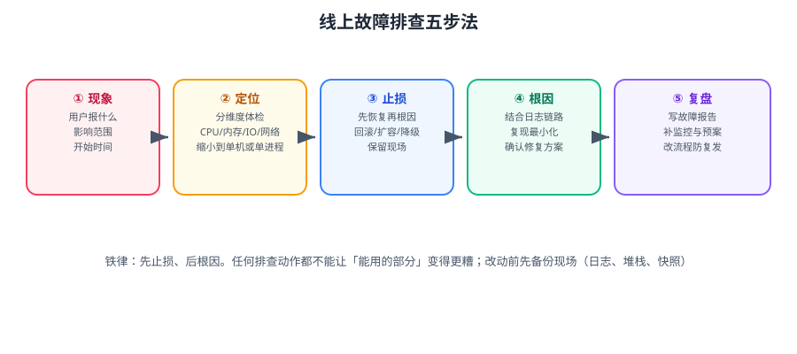

# 故障排查

线上故障的排查能力，是运维与后端工程师真正的分水岭。本篇给出**可复用的排查方法论与命令清单**，让你从「重启试试」变成「能说清是什么、为什么、怎么防」。



::: tip 一句话理解
排查的核心不是「记得住多少命令」，而是**先止损、再定位、最后复盘**的纪律，以及**每次只排除一种可能**的耐心。
:::

## 一、五步法

| 步骤 | 目标 | 关键动作 | 常见错误 |
| --- | --- | --- | --- |
| ① 现象 | 说清「谁在什么时间遇到了什么」 | 收集用户描述、影响范围、开始时间 | 只听一句话就开始改配置 |
| ② 定位 | 缩小到某个层次/某台机器/某个进程 | 分层体检、对比正常与异常 | 全局瞎看，没有假设 |
| ③ 止损 | 先恢复服务 | 回滚、扩容、降级、切流 | 先查根因才恢复，导致故障拉长 |
| ④ 根因 | 找到「为什么」 | 结合日志/链路/监控/复现 | 停在「重启后好了」 |
| ⑤ 复盘 | 防止同类问题复发 | 写故障报告、补监控、改流程 | 只写经过不写改进 |

::: danger 三条铁律
1. **先止损，后根因**。任何排查动作都不能让「能用的部分」变得更糟。
2. **改之前先留现场**。`jstack`、`jmap`、`dmesg`、日志片段、`iostat` 快照——重启之后这些全没了。
3. **一次只改一处**。同时改三个东西，恢复了也不知道是哪个起的作用。
:::

## 二、保留现场：出事后的第一分钟

```bash
# 一键收集现场（建议做成 /opt/scripts/snapshot.sh）
SNAP="/tmp/snapshot-$(date +%F-%H%M%S)"; mkdir -p "$SNAP"

{
  echo "===== 基本信息 ====="; date; uptime; hostname; uname -a
  echo "===== CPU/内存 ====="; vmstat 1 5; free -h; mpstat -P ALL 1 3
  echo "===== 磁盘 ====="; df -hT; df -i; iostat -xz 1 3; lsblk
  echo "===== 网络 ====="; ss -s; ss -lntp; ip -br addr; ip route
  echo "===== 进程 Top ====="; ps -eo pid,ppid,user,pcpu,pmem,rss,stat,etime,cmd --sort=-pcpu | head -25
  echo "===== D 状态进程 ====="; ps -eo pid,stat,wchan:24,cmd | awk '$2 ~ /D/'
  echo "===== 内核日志 ====="; dmesg -T | tail -80
  echo "===== 系统服务异常 ====="; systemctl --failed --no-pager
  echo "===== 最近登录 ====="; last -n 20
} > "$SNAP/system.txt" 2>&1

# Java 进程额外抓取
for pid in $(pgrep -f 'java'); do
  jstack "$pid" > "$SNAP/jstack-$pid.txt" 2>&1 || true
  jcmd "$pid" GC.heap_info > "$SNAP/heap-$pid.txt" 2>&1 || true
done

# 关键服务日志
journalctl --since "30 min ago" -p warning > "$SNAP/journal-warn.txt" 2>&1

echo "现场已保存到 $SNAP"
```

::: tip 现场收集应该脚本化、随叫随到
出事时人是最紧张的，手敲命令必然漏。把这套脚本放到每台机器上（或由配置管理下发），值班同学只需跑一条命令。
:::

## 三、分层排查：从外到内

```text
第 1 层  用户侧     能不能连上？DNS 正常吗？证书有效吗？
   ↓
第 2 层  网络/负载   安全组、防火墙、Nginx、SLB 是否放行与转发正常？
   ↓
第 3 层  主机        机器活着吗？负载、内存、磁盘、句柄是否耗尽？
   ↓
第 4 层  进程/服务   进程在吗？端口在听吗？systemd 状态如何？
   ↓
第 5 层  应用        错误日志、线程栈、GC、连接池、慢查询
   ↓
第 6 层  依赖        数据库、缓存、下游 API、消息队列
```

**排查顺序应该是「从外到内」还是「从内到外」？**
- 明确单机问题时：从第 3 层往下。
- 不确定范围时：先做**对比**——「10 台机器只有 1 台异常」和「10 台都异常」的排查路径完全不同。

| 现象 | 先看哪层 |
| --- | --- |
| 全部用户受影响 | 第 1~2 层（入口）、第 6 层（公共依赖） |
| 部分用户/部分区域受影响 | 第 2 层（网络、负载均衡）、第 3 层（某台机器） |
| 偶发、无规律 | 第 5 层（GC、连接池、超时重试） |
| 特定接口 | 第 5 层（该接口的依赖与 SQL） |
| 刚发布后出现 | **立刻回滚**，再慢慢查 |

## 四、四类资源问题的定位

### 4.1 CPU 高

```shell
uptime                     # load 与核数对比
top -bn1 | head -15        # 找进程
mpstat -P ALL 1 3          # 是否单核打满
pidstat -u -t 1 5          # 线程级
perf top -p <PID>          # 热点函数
```

| 判据 | 结论 |
| --- | --- |
| `load` 高、`us` 高、`wa` 低 | 计算密集，考虑优化算法或扩容 |
| `load` 高、`wa` 高、`b` 列大于 0 | **不是 CPU 问题，是 IO 等待** |
| `sy` 持续高于 30% | 系统调用/锁竞争过多 |
| 单核 100%、总使用率不高 | 串行瓶颈，加机器无用 |

### 4.2 内存高

```shell
free -h                    # 看 available
vmstat 1 5                 # si/so 长期非 0 → 有换页压力
ps -eo pid,rss,pmem,comm --sort=-rss | head -15
dmesg -T | grep -i -E 'oom|killed'
cat /proc/<PID>/status | grep -E 'VmRSS|VmSwap'
```

| 判据 | 结论 |
| --- | --- |
| `available` 充足但 `free` 小 | **正常**，页缓存占用 |
| `si`/`so` 持续非 0 | 内存不足，正在换页 |
| dmesg 有 `Out of memory: Killed process` | OOM Killer 已杀进程，看被杀的是谁 |
| 某进程 RSS 持续单调增长 | 疑似内存泄漏，取两次堆快照对比 |

### 4.3 磁盘满

**排查顺序很重要：先确认是空间还是 inode，再定位到目录。**

```shell
# ① 是空间还是 inode？
df -hT | grep -v tmpfs        # 看 Use%
df -i  | grep -v tmpfs        # 看 IUse%

# ② 空间：找出大目录（注意先看已挂载点，避免统计到其他盘）
du -xhd1 / 2>/dev/null | sort -hr | head -15

# ③ 逐层下钻（每层用 -x 不跨文件系统）
du -xhd1 /var  2>/dev/null | sort -hr | head -15
du -xhd1 /var/log 2>/dev/null | sort -hr | head -15

# ④ 找出大文件（大于 200MB）
find / -xdev -type f -size +200M -exec ls -lh {} + 2>/dev/null | sort -k5 -hr | head -20

# ⑤ inode 满：找出「小文件特别多」的目录
find / -xdev -type d -exec sh -c 'echo "$(find "$1" -maxdepth 1 -type f | wc -l) $1"' _ {} \; 2>/dev/null \
  | sort -rn | head -15

# ⑥ 被删除但被进程占用的文件（df 显示满但 du 找不到）
sudo lsof -nP +L1 2>/dev/null | head -20
# 处理：重启持有该文件的进程，而不是删文件
```

::: danger 三个高频误判
1. **`df` 显示满但 `du` 加起来不够**：典型是「文件已删但被进程占用」。用 `lsof +L1` 定位，重启对应进程即释放。
2. **`/` 满了其实是某个挂载点没挂上**：比如 `/data` 没挂载，数据全写进了根分区的 `/data` 目录。`df` 一看就明白。
3. **只看空间不看 inode**：几十万个小文件（session、临时文件）会把 inode 耗尽，此时 `df -h` 看起来还很空。
:::

### 4.4 网络异常

```shell
# 连通性三段式：DNS → 端口 → 应用
getent hosts example.com              # DNS 是否解析
resolvectl status | head -20          # systemd-resolved 状态
ping -c 3 <IP>                        # ICMP（部分环境被禁）
nc -vz <IP> <PORT>                    # 端口是否可达
curl -v --max-time 5 http://<IP>:<PORT>/health   # 应用层

# 本机监听与连接
ss -lntp                              # 谁在听哪些端口
ss -tnp state established | head -20  # 已建立连接与对应进程
ss -s                                 # 状态汇总

# 抓包（终极手段）
sudo tcpdump -i any -nn -c 100 'tcp port 8080 and host 10.0.0.5'
sudo tcpdump -i any -nn -w /tmp/cap.pcap 'port 8080'   # 存盘后用 Wireshark 看
```

| 报错 | 含义 | 排查方向 |
| --- | --- | --- |
| `Connection refused` | 端口没人听，或被 RST 拒绝 | 服务是否启动、是否监听在 `0.0.0.0` 而非 `127.0.0.1` |
| `Connection timed out` | 包被丢弃 | 防火墙/安全组/路由，不是应用问题 |
| `No route to host` | 路由不可达 | 路由表、网关 |
| `Could not resolve host` | DNS 失败 | `/etc/resolv.conf`、`resolvectl` |
| `SSL certificate problem` | 证书问题 | 过期、链不全、域名不匹配 |
| 时通时不通 | 多实例中有一台坏 | 逐台对比，检查健康检查配置 |

::: tip 网络排查的深入方法
网络分层、DNS、TCP 状态机与抓包分析的完整方法论见 [网络基础 · 网络排查方法论](../../../Network/Troubleshoot/index.md) 与 [抓包分析](../../../Network/Capture/index.md)。
:::

## 五、服务起不来：`systemd` 三板斧

```shell
systemctl status <svc> --no-pager -l     # 状态 + 最近的日志 + 退出码
journalctl -u <svc> -n 200 --no-pager    # 完整日志
systemctl cat <svc>                      # 生效的 unit（含 drop-in）
systemd-analyze verify /etc/systemd/system/<svc>.service
```

| `status=` 退出码 | 含义 | 处理 |
| --- | --- | --- |
| `203/EXEC` | 无法执行 | `ExecStart` 路径错、无执行权限、解释器缺失 |
| `200/CHDIR` | 工作目录不可用 | `WorkingDirectory` 不存在或权限不足 |
| `209/STDOUT` | 日志目标不可写 | 日志目录权限 |
| `226/NAMESPACE` | 命名空间相关 | `PrivateTmp`/`ProtectSystem` 等沙箱选项过严 |
| `1/FAILURE` | 程序自身失败 | 查程序日志（配置、端口、依赖） |
| `137`（=128+9） | 被 `SIGKILL` | 通常是 OOM 或 `TimeoutStopSec` 超时强杀 |
| `143`（=128+15） | 被 `SIGTERM` | 正常停止，需 `SuccessExitStatus=143` |

::: danger 「手工能跑、服务起不来」的三大原因
1. **用户不同**：手工用 root，服务用 `appuser`，目录/文件权限不足。用 `sudo -u appuser <完整命令>` 复现。
2. **环境不同**：systemd 不读 `~/.bashrc`、不读 `/etc/profile`，`PATH`、`JAVA_HOME`、`LANG` 都可能缺失。用绝对路径与 `Environment=` 显式声明。
3. **限额不同**：`nofile`、`nproc`、`MemoryMax` 与登录会话不同。用 `systemctl show <svc> -p LimitNOFILE -p MemoryMax` 核对。
:::

## 六、故障速查表

| 现象 | 首要命令 | 高频根因 |
| --- | --- | --- |
| 服务器卡顿/无响应 | `vmstat 1 5`、`iostat -xz 1 3` | IO 等待、内存换页、单核打满 |
| SSH 连不上 | `ss -lntp \| grep ssh`、`systemctl status ssh` | 端口改错、fail2ban 封禁（`fail2ban-client status sshd`）、磁盘满导致无法登录 |
| 磁盘满 | `df -hT`、`df -i`、`du -xhd1` | 日志暴涨、inode 耗尽、已删文件被占用 |
| 服务起不来 | `systemctl status`、`journalctl -u` | 退出码 + 日志即可定位九成问题 |
| 端口不通 | `ss -lntp`、`nc -vz`、`tcpdump` | 监听地址是 `127.0.0.1`、防火墙、安全组 |
| 时间不对 | `timedatectl`、`chronyc sources` | NTP 未同步、时区设错 |
| 定时任务没执行 | `journalctl -u cron`、`systemctl list-timers` | PATH 差异、`%` 未转义、`Persistent` 未开 |
| 文件句柄耗尽 | `ulimit -n`、`lsof -p <PID> \| wc -l` | `LimitNOFILE` 未设、连接泄漏 |
| 文件系统只读 | `dmesg \| grep -i 'read-only'` | 磁盘故障或文件系统错误，只读保护 |
| 负载很高但 CPU 空闲 | `ps -eo stat,wchan,cmd \| grep '^D'` | 卡在不可中断 IO |

## 七、实战：一次「磁盘满导致服务雪崩」

**现象**：凌晨 2:15 告警，订单服务大量超时，数据库连接报错，日志平台断流。

### 第一步：确认影响面与止损方向

```shell
uptime; df -hT | grep -v tmpfs
# Filesystem      Size  Used Avail Use% Mounted on
# /dev/sda1        99G   99G     0 100% /        ← 根分区 100%
```

**止损**：先腾出空间让服务能写日志与临时文件。

```shell
# 只清理可安全删除的：journal、旧日志、临时文件
sudo journalctl --vacuum-size=200M
sudo find /var/log -name '*.gz' -mtime +3 -delete
sudo find /tmp -type f -atime +2 -delete
df -h / | tail -1
# 预期：Use% 从 100% 降到 80% 左右，服务随即恢复写日志
```

### 第二步：定位「什么吃掉了磁盘」

```shell
du -xhd1 / 2>/dev/null | sort -hr | head -10
# 3.1G /var
# 1.8G /opt
# ...

du -xhd1 /var 2>/dev/null | sort -hr | head -10
# 2.6G /var/log     ← 高度可疑

du -xhd1 /var/log 2>/dev/null | sort -hr | head -10
# 2.4G /var/log/app

ls -lhS /var/log/app | head -10
# -rw-r--r-- 1 app app 2.3G Sep 13 02:14 order-service.log     ← 单个日志文件 2.3G
```

### 第三步：确认为什么没被轮转

```shell
cat /etc/logrotate.d/order-service 2>/dev/null || echo "未配置 logrotate！"
systemctl list-timers logrotate.timer --no-pager
journalctl -u logrotate --since "7 days ago" | tail -20
```

**根因**：新服务上线时漏配 `logrotate`，且 appender 未做大小限制，日志无限增长到 2.3G，加上应用自身写到 `no space left on device`，导致写日志阻塞、请求堆积、连接池耗尽。

### 第四步：修复（止血 + 治本）

```bash
# /etc/logrotate.d/order-service
/var/log/app/*.log {
    daily
    rotate 14
    size 200M          # 达到 200M 就轮转，不等一天
    missingok
    notifempty
    compress
    delaycompress
    copytruncate       # 应用不支持重开文件句柄时使用
    create 0640 appuser appuser
}
```

```shell
sudo logrotate -d /etc/logrotate.d/order-service    # -d 干跑，只看不执行
sudo logrotate -f /etc/logrotate.d/order-service    # -f 强制执行一次
```

**治本**：应用侧把日志改为 **stdout + 采集器**（见 [日志体系](../../../LogSystem/index.md)），并在日志目录加独立告警。

### 验证方式

```shell
# 1. 空间已回收并保持稳定
df -h / | tail -1
# 预期：Use% 稳定在 80% 以下

# 2. logrotate 干跑无报错
sudo logrotate -d /etc/logrotate.d/order-service 2>&1 | grep -iE 'error|considering'
# 预期：无 error，能看到 considering 目标文件

# 3. 轮转真的会发生
sudo logrotate -f /etc/logrotate.d/order-service && ls -lh /var/log/app/
# 预期：出现 order-service.log.1（或 .gz）

# 4. 业务恢复
curl -o /dev/null -s -w '%{http_code} %{time_total}s\n' http://127.0.0.1:8080/api/orders/1
# 预期：200 且 time_total 在 0.1s 量级

# 5. 补上监控：磁盘使用率与 inode 告警
# 见 docs/Ops/Monitoring/Alerting/index.md
```

## 八、故障报告模板

```markdown
# 故障报告：<标题>

## 基本信息
- 影响时间：2026-09-13 02:15 ~ 02:48（33 分钟）
- 影响范围：订单查询接口 P99 > 3s，错误率 12%
- 严重级别：P2
- 处理人：<值班人> / <协作人>

## 时间线（精确到分钟）
| 时间 | 事件 |
| --- | --- |
| 02:15 | 监控告警：接口错误率 > 5% |
| 02:18 | 确认根分区 100%，判定磁盘满 |
| 02:22 | 清理 journal 与旧日志，服务开始恢复 |
| 02:35 | 定位到 order-service.log 单文件 2.3G |
| 02:48 | 补配 logrotate，指标恢复正常 |

## 根因
新服务上线漏配 logrotate，日志无限增长占满根分区，导致应用写日志阻塞、连接池耗尽。

## 改进项
| 改进 | 负责人 | 截止 |
| --- | --- | --- |
| 全部服务补 logrotate 配置并纳入部署模板 | @A | 09-20 |
| 磁盘使用率与 inode 使用率告警 | @B | 09-16 |
| 应用日志改为 stdout + 采集 | @C | 09-30 |
| 上线检查清单增加「日志轮转」项 | @A | 09-15 |
```

::: tip 好的故障报告只看一件事
**改进项是否可验证、有负责人、有截止时间。**「加强监控」「提高意识」这类改进等于没写。
:::

## 九、易错点汇总

::: danger 逐条对照
1. **重启了事**：重启只让现象消失，根因仍在。至少留一次现场。
2. **先查根因再恢复**：故障时长翻倍。顺序是止损优先。
3. **一次改多处**：无法归因，也可能引入新故障。
4. **不记录时间线**：事后写报告时全靠回忆，没法复盘。
5. **`df` 满但 `du` 不够就放弃**：忘了 `lsof +L1` 查已删除文件。
6. **只看空间不看 inode**：小文件耗尽 inode 同样会让服务写失败。
7. **`du -sh /` 不带 `-x`**：统计到其他挂载点，结果毫无意义。
8. **在生产上直接 `kill -9`**：会丢失现场、可能损坏数据。先用 `SIGTERM`。
9. **把 OOM 当成应用 bug**：先看 cgroup 限额与整体内存水位。
10. **没有「一键现场收集」**：紧张时手忙脚乱，关键信息永久丢失。
:::

## 参考资料

- Linux 性能与排障方法论：https://www.brendangregg.com/linuxperf.html
- `journalctl` 手册：https://www.freedesktop.org/software/systemd/man/latest/journalctl.html
- `tcpdump` 手册：https://www.tcpdump.org/manpages/tcpdump.1.html
- Google SRE Book（事故处理与复盘）：https://sre.google/sre-book/postmortem-culture/
- 本专题其余章节：[Linux 进阶导览](../index.md)、[性能调优](../PerformanceTuning/index.md)、[systemd 服务管理](../Systemd/index.md)、[网络基础](../../../Network/index.md)
