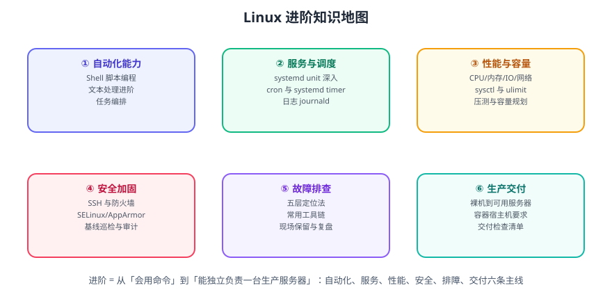

# Linux 进阶

基础篇让你「会用命令」，进阶篇让你「能独立负责一台生产服务器」：写得出可维护的脚本、管得住 systemd 服务、看得懂性能数据、扛得住安全审计、排得清线上故障。



## 进阶与基础的区别

| 维度 | 基础篇 | 进阶篇 |
| --- | --- | --- |
| 使用方式 | 交互式敲命令，一次做完就算 | 写成脚本与 unit，可重复执行、幂等 |
| 关注点 | 命令语法、参数含义 | 失败会怎样、批量会怎样、重启会怎样 |
| 服务管理 | `systemctl start/stop` | 自己写 unit、管依赖、限资源、看 journal |
| 性能 | `top` 看一眼 | 按 CPU/内存/IO/网络分层取数，再改参数 |
| 安全 | 改个密码 | SSH 加固、防火墙、SELinux、审计与基线 |
| 故障 | 重启试试 | 五步法定位、保留现场、复盘防复发 |

::: tip 一句话理解
基础篇解决「这件事怎么做」，进阶篇解决「这件事做错了会怎样、量大了会怎样、半年后别人接手会怎样」。
:::

## 章节导航

1. [Shell 脚本编程](ShellScripting/index.md)：变量、流程控制、函数、错误处理、`shellcheck`、幂等设计。
2. [systemd 服务管理](Systemd/index.md)：unit 文件语法、依赖与顺序、资源限制、日志与排障。
3. [定时任务](CronTasks/index.md)：cron 语法与陷阱、`systemd timer`、错过的任务如何补跑。
4. [性能调优](PerformanceTuning/index.md)：CPU/内存/IO/网络四维取数、`sysctl` 与 `ulimit`、压测方法。
5. [安全加固](SecurityHardening/index.md)：SSH、防火墙、SELinux/AppArmor、审计、基线巡检。
6. [故障排查](Troubleshooting/index.md)：五步法、工具链、现场保留、常见故障速查。
7. [实战：交付一台生产可用的服务器](Practice/index.md)：从裸机到可交付的完整清单。
8. [常见问题与最佳实践](FAQ/index.md)：高频问题定位与经验总结。

## 环境与版本说明

::: info 本文档的版本基线（2026-09 核对）
示例同时给出两类主流发行版的差异：

- **Ubuntu 26.04 LTS（Resolute Raccoon，2026-04-23 发布，支持至 2031-04）**：内核 Linux 7.0，**systemd 259**（已彻底移除 cgroup v1，只支持 cgroup v2），APT 3.x（`apt-key` 已移除），改用 Dracut 生成 initramfs，默认 `sudo-rs`，OpenSSH 10.2（不再生成 DSA 主机密钥），OpenSSL 3.5（支持 ML-KEM / ML-DSA 后量子算法）。
- **Ubuntu 24.04 LTS（部分存量生产环境仍在用）**：内核 6.8，systemd 255，OpenSSH 9.6。
- **RHEL / Rocky / AlmaLinux 系**：命令替换为 `dnf`、防火墙默认 `firewalld`、强制访问控制默认 SELinux。
:::

::: warning 升级到 26.04 前必须检查
1. 任何直接读取 `/sys/fs/cgroup/cpuacct/` 等 **cgroup v1 路径**的脚本、监控 agent、旧版 LXC 都要改（可先跑 `grep -r cgroup /etc/systemd ~/.config` 摸底）。
2. 仍在用 `apt-key add` 的镜像/私有源脚本必须改成 `signed-by` + keyring 文件。
3. 仍在使用 DSA 主机密钥的机器，升级前先轮换密钥。
:::

## 学习路径建议

```text
Shell 脚本编程        → 把重复操作写成脚本（第一优先级，收益最快）
        ↓
systemd + 定时任务    → 让脚本变成「服务」和「计划任务」，开机自启、失败重试
        ↓
性能调优 + 故障排查    → 出问题时能自己定位，而不是重启了事
        ↓
安全加固             → 上线前的最后一道门，也是审计最常问的部分
        ↓
实战交付             → 把上面全部串成一份可复跑的清单
```

## 相关专题

- 基础命令、权限、进程与文本处理：[Linux 基础](../index.md)
- 把本专题的手工步骤固化成可重复执行的剧本：[Ansible 自动化运维](../../Ansible/index.md)
- 网络分层、DNS 与抓包：[网络基础](../../Network/index.md)
- 容器宿主机调优与安全：[Docker 安全加固](../../Docker/Security/index.md)、[Kubernetes 监控与运维](../../Kubernetes/Monitoring/index.md)
- 服务器指标采集与告警：[监控告警](../../Monitoring/index.md)
- 服务器日志采集与留存：[日志体系](../../LogSystem/index.md)
- 定时任务跑备份脚本的落地示例：[数据库客户端实战](../../../Tools/DatabaseClients/DataOps/index.md)

## 参考资料

- systemd 官方文档：https://systemd.io/
- `systemd.exec` 手册（资源限制与安全选项）：https://www.freedesktop.org/software/systemd/man/latest/systemd.exec.html
- Ubuntu 26.04 LTS 发行说明：https://discourse.ubuntu.com/
- Linux 内核文档（sysctl）：https://docs.kernel.org/admin-guide/sysctl/
- ShellCheck 在线检查：https://www.shellcheck.net/
