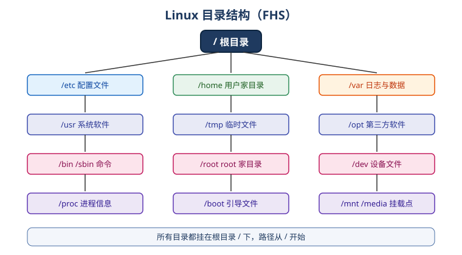

# Linux 目录结构

Linux 使用统一的目录树，所有目录都挂在根目录 `/` 下，遵循 **FHS（Filesystem Hierarchy Standard，文件系统层次结构标准）**。

## 目录树总览



## 关键目录说明

| 目录 | 作用 |
| --- | --- |
| `/` | 根目录，所有目录的起点 |
| `/bin` | 基础命令（ls、cp、cat 等） |
| `/sbin` | 系统管理命令（reboot、fdisk 等），通常需要 root |
| `/etc` | 系统与应用的配置文件 |
| `/home` | 普通用户的家目录，如 `/home/zhangsan` |
| `/root` | root 用户的家目录 |
| `/var` | 变化的数据：日志、缓存、队列 |
| `/tmp` | 临时文件，重启可能被清空 |
| `/usr` | 系统软件与用户程序（含 `/usr/local` 自定义安装目录） |
| `/opt` | 第三方大型软件 |
| `/boot` | 内核与引导文件 |
| `/dev` | 设备文件 |
| `/proc` | 运行时进程与内核信息（虚拟文件系统） |
| `/sys` | 内核与设备信息（虚拟文件系统） |
| `/mnt`、`/media` | 临时挂载点、可移动设备挂载点 |

::: tip
大部分配置都在 `/etc`，日志在 `/var/log`，自编译或手动安装的软件建议放 `/usr/local`。
:::

## 绝对路径与相对路径

```shell
# 绝对路径：从根目录开始
cd /etc/nginx

# 相对路径：从当前目录开始
cd ..            # 上一级
cd ../..         # 上两级
cd ./conf        # 当前目录下的 conf
cd ~             # 当前用户家目录
cd -             # 上一次所在目录
```

特殊符号：

| 符号 | 含义 |
| --- | --- |
| `.` | 当前目录 |
| `..` | 上一级目录 |
| `~` | 当前用户家目录 |
| `-` | 上一次所在目录 |

## 查看目录结构

```shell
pwd              # 当前绝对路径
ls -l            # 详细列表
tree /etc        # 树状结构（需安装 tree）
```

## 常见操作示例

```shell
cd /var/log
ls -lh
cat /etc/os-release          # 查看发行版信息
df -h                        # 查看磁盘挂载与占用
```

::: danger 注意
1. 不要随意删除 `/`、`/etc`、`/var` 下的文件，可能直接导致系统不可用。
2. 路径大小写敏感：`/etc` 和 `/ETC` 是两个目录。
3. 不要在 `/tmp` 放重要数据，重启后可能丢失。
:::

## 验证方式

```shell
cd / && ls
cat /etc/os-release
ls -ld /etc /home /var
```

能正常列出目录并看到发行版信息，说明目录结构理解无误。
