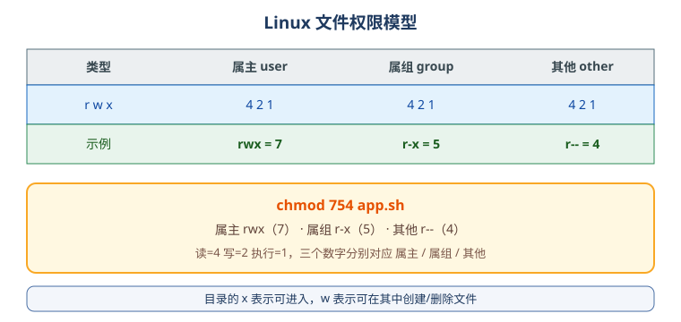

# Linux 权限与用户

## 用户与组

Linux 是多用户系统，文件和进程都归属于某个**用户（user）**和**组（group）**。

| 文件 | 作用 |
| --- | --- |
| `/etc/passwd` | 用户账号信息 |
| `/etc/shadow` | 用户密码（加密） |
| `/etc/group` | 用户组信息 |

常用命令：

```shell
whoami                    # 当前用户
id                        # 用户与组信息
useradd zhangsan          # 新建用户
passwd zhangsan           # 设置/修改密码
usermod -aG docker zhangsan   # 把用户加入 docker 组
userdel -r zhangsan       # 删除用户及家目录
groupadd devops           # 新建组
```

## 权限模型

每个文件有三组权限：**属主（user）**、**属组（group）**、**其他用户（other）**，每组有读（r）、写（w）、执行（x）。



```shell
ls -l
# -rwxr-xr-- 1 root root 1024 Jan 1 12:00 app.sh
#  ^^^ ^^^ ^^^
#  属主 属组 其他
```

## 数字权限

| 权限 | 数字 |
| --- | --- |
| 读 r | 4 |
| 写 w | 2 |
| 执行 x | 1 |

`rwx = 7`、`r-x = 5`、`r-- = 4`。

```shell
chmod 755 app.sh       # 属主 rwx，属组 r-x，其他 r-x
chmod 644 app.conf     # 属主 rw-，属组 r--，其他 r--
chmod +x app.sh        # 给所有用户加执行权限
chmod -R 755 /data     # 递归修改
```

## 修改属主与属组

```shell
chown zhangsan app.sh          # 修改属主
chown zhangsan:devops app.sh   # 同时修改属主和属组
chown -R www-data:www-data /var/www
chgrp devops app.sh            # 只改属组
```

## 目录权限的特殊性

| 目录权限 | 含义 |
| --- | --- |
| r | 可以列出目录内容 |
| w | 可以在目录中创建/删除文件 |
| x | 可以进入目录（cd） |

::: danger 注意
1. 目录只有 r 没有 x 时，`ls` 能看到名字但无法进入和访问文件。
2. 删除文件取决于**所在目录**的写权限，而不是文件本身的权限。
3. 普通文件默认没有 x 权限，脚本需要 `chmod +x` 才能直接执行。
:::

## sudo 提权

普通用户通过 `sudo` 执行管理员命令：

```shell
sudo apt update
sudo systemctl restart nginx
```

把用户加入 sudo 组（Debian/Ubuntu）：

```shell
usermod -aG sudo zhangsan
```

Red Hat 系：

```shell
usermod -aG wheel zhangsan
```

::: tip
生产环境避免直接使用 root 登录，使用普通用户 + `sudo`，并通过 `sudoers` 精确授权。
:::

## 验证方式

```shell
touch /tmp/test.sh
chmod 755 /tmp/test.sh
ls -l /tmp/test.sh        # -rwxr-xr-x
chown $(whoami):$(id -gn) /tmp/test.sh
id
```

确认权限位与属主符合预期。
