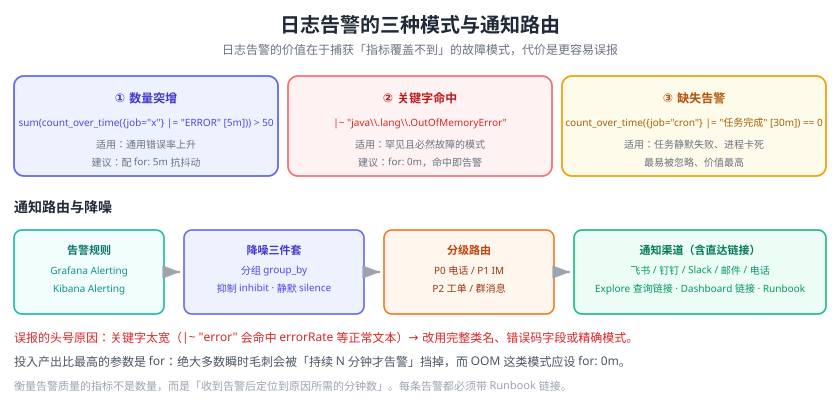

# 日志告警与联动

日志告警解决的是「**指标看不出来的问题**」：指标告诉你“5xx 变多了”，日志告警告诉你“出现了 `OutOfMemoryError`”。它的价值在于**捕获那些没有对应指标、但一定意味着故障的日志模式**——异常堆栈、致命关键字、错误数量突增。

本页讲清楚日志告警的三种模式、两套主流实现（Grafana Alerting / Kibana Alerting）、告警降噪与分级，并给出可落地的配置示例。



## 日志告警 vs 指标告警

| 维度 | 指标告警 | 日志告警 |
| --- | --- | --- |
| 数据来源 | 数值时间序列 | 日志行 / 日志计数 |
| 发现能力 | 已知故障模式（阈值、趋势） | **未知故障模式**（关键字、异常类型） |
| 实时性 | 高（15s~1m） | 中（取决于采集与评估间隔） |
| 误报风险 | 低 | **高**（关键字容易误命中） |
| 成本 | 低 | 高（每次评估都要扫日志） |
| 典型场景 | CPU、RT、QPS、错误率 | OOM、死锁、磁盘满、连接池耗尽、特定业务异常 |

::: tip 分工原则
**指标管“有没有问题”，日志管“问题是什么”。** 优先用指标告警做第一层；日志告警只覆盖“指标覆盖不到但必须立刻处理”的模式，避免把日志平台变成告警风暴的源头。
:::

## 三种日志告警模式

| 模式 | 逻辑 | 示例 | 适用 |
| --- | --- | --- | --- |
| **① 数量突增** | 单位时间内匹配到的日志条数超阈值 | 5 分钟内 ERROR > 50 条 | 通用，最常用 |
| **② 关键字命中** | 出现特定致命模式即告警 | 命中 `OutOfMemoryError` / `Deadlock` / `Disk quota exceeded` | 严重且罕见的问题 |
| **③ 缺失告警** | 预期该出现的日志没出现 | 30 分钟没有 “定时任务执行成功” 日志 | 静默失败、任务卡死 |

```text
① 数量突增  →  sum(count_over_time({job="order"} |= "ERROR" [5m])) > 50
② 关键字命中 →  {env="prod"} |~ "OutOfMemoryError|Deadlock|No space left on device"
③ 缺失告警  →  sum(count_over_time({job="job-scheduler"} |= "任务完成" [30m])) == 0
```

::: warning 第三种最容易被忽略，却最有价值
“任务静默失败”是运维事故的常见形态：进程还活着，但定时任务不再执行，指标看起来一切正常（CPU 低、内存低、无错误）。**只有“缺失告警”能发现它。**
:::

## Grafana Alerting（消费 Loki）

Grafana 的统一告警（Unified Alerting）可以直接把 Loki（以及 Prometheus、Tempo）当作数据源，一套规则引擎覆盖三类信号。

### 配置步骤

1. **配置 Loki 数据源**：Connections → Data sources → Loki，URL 填 `http://loki:3100`。
2. **创建告警规则**：Alerting → Alert rules → New alert rule。
3. **配置联系点（Contact point）**：Alerting → Contact points，添加飞书/钉钉 Webhook、邮件、Slack。
4. **配置通知策略（Notification policy）**：决定哪类告警发到哪个联系点。

### 告警规则示例（ERROR 数量突增）

```yaml [Grafana 告警规则（Provisioning 格式）]
apiVersion: 1
groups:
  - orgId: 1
    name: log-alerts
    folder: Ops
    interval: 1m
    rules:
      - uid: log-error-spike
        title: "[P1] 订单服务 ERROR 日志突增"
        condition: C
        for: 5m
        annotations:
          summary: "order-service 近 5 分钟 ERROR 日志 {{ $values.B }} 条，超过阈值 50"
          runbook_url: "https://wiki.example.com/runbook/order-service"
          dashboard_url: "https://grafana.example.com/d/order-service"
        labels:
          severity: P1
          team: order
          signal: logs
        data:
          - refId: A            # 查询 Loki
            relativeTimeRange: { from: 600, to: 0 }
            datasourceUid: loki
            model:
              expr: 'sum(count_over_time({job="order-service"} | json | level="ERROR" [5m]))'
              queryType: range
          - refId: B            # 归约：取最后一个值
            datasourceUid: __expr__
            model: { type: reduce, expression: A, reducer: last, settings: { mode: dropNN } }
          - refId: C            # 阈值判断
            datasourceUid: __expr__
            model: { type: threshold, expression: B, conditions: [{ evaluator: { type: gt, params: [50] } }] }
```

### 关键字命中告警（更贴近“日志特性”）

```text
# 规则表达式（LogQL）
sum(count_over_time({env="prod"} |~ "OutOfMemoryError|java.lang.OutOfMemory|No space left on device|Deadlock found" [5m])) > 0

# 评估间隔 1m，持续 0m（命中即告警）
```

::: tip 关键字正则要“窄而准”
`|~ "error"` 这种写法会匹配到 `errorRate`、`errorMessage`、甚至“无 error”这样的文本。建议：
1. 用**完整类名或错误码**（`java.lang.OutOfMemoryError`、`SQLSTATE[HY000]`）；
2. 用**精确的错误码字段**而非正文（`| json | errorCode="E5001"`）；
3. 维护一份“致命关键字清单”，并定期用历史日志回归验证误报率。
:::

### 通知策略与路由

```yaml
# 按 severity 路由到不同联系点
route:
  receiver: default-email
  group_by: [alertname, service, severity]     # 同一次故障聚合成一条
  group_wait: 30s                              # 首次等待，凑齐同一组
  group_interval: 5m                           # 同组新告警的发送间隔
  repeat_interval: 4h                          # 未恢复的重复提醒间隔
  routes:
    - matchers: [severity = P0]
      receiver: phone-call
      repeat_interval: 30m
      continue: true
    - matchers: [severity = P1]
      receiver: feishu-oncall
    - matchers: [severity = P2]
      receiver: feishu-team
```

| 参数 | 作用 | 建议 |
| --- | --- | --- |
| `group_by` | 把相关告警合并成一条通知 | 至少含 `alertname` + `service` |
| `group_wait` | 第一次发送前的等待 | 30s~1m，给同组告警凑齐的时间 |
| `group_interval` | 同一组新告警的发送间隔 | 5m |
| `repeat_interval` | 未恢复时的重复提醒 | P0 30m，P1 4h，P2 24h |
| `silence` | 维护期静默 | 变更窗口期必须静默，避免误报打扰 |
| `mute timing` | 周期性静默（如每夜批处理时段） | 适合已知的规律性报错 |

## Kibana Alerting（Elastic 生态）

Kibana 提供多种规则类型，日志相关的主要是三种：

| 规则类型 | 用途 | 表达式 |
| --- | --- | --- |
| **Log threshold**（Observability） | 对日志做计数/比例判断 | 按 KQL 过滤后统计条数 |
| **Elasticsearch query** | 用 KQL/Lucene 或 DSL 匹配文档 | 命中即告警 |
| **Index threshold** | 对索引数据做聚合阈值 | 基于索引文档数/字段聚合 |

配置要点（以 Log threshold 为例）：

```text
① Rule type: Log threshold
② Logs source: logs-*
③ Threshold: 计数 > 50
④ Filter query: log.level: "ERROR" and service: "order-service"
⑤ Group by: service.name（按服务分别告警，避免全量合并成一条）
⑥ Check every: 1 minute（评估间隔）
⑦ 触发器：Severity = Critical，超过阈值；同时可配 Warning 阈值
⑧ Action: 连接器（邮件 / Slack / Webhook / 飞书）
```

::: danger Kibana 日志告警的三个成本陷阱
1. **评估间隔太短 + 时间范围太大**：每 30 秒扫 24 小时日志，ES 集群被自己的告警规则拖垮。
2. **不带 `group by`**：100 个服务的错误合并成一条通知，无法定位谁出问题。
3. **阈值卡在噪声线上**：把正常业务波动当异常，天天报警，团队最终免疫（告警疲劳）。
:::

## 降噪：比“能报警”更重要的事

告警的价值不在数量，而在**信噪比**。常见手段：

| 手段 | 说明 | 实现位置 |
| --- | --- | --- |
| 分组（Grouping） | 同一次故障只发一条 | Grafana `group_by` / Alertmanager |
| 抑制（Inhibition） | 根因告警出现时，抑制衍生告警 | Alertmanager `inhibit_rules` |
| 静默（Silence） | 指定时间段不发送 | 维护窗口、已知问题 |
| 去重（Dedup） | 相同指纹的告警只保留一条 | 告警引擎内置 |
| 冷却（Cooldown） | 恢复后一段时间内不重复触发 | `repeat_interval` / `for` |
| 白名单排除 | 已知无害的错误不告警 | 在查询里加 `!= "已知无害日志"` |
| 分位数代替均值 | 用 P99 而非均值判断，避免被平均掩盖 | 查询表达式 |

::: tip 用 `for` 抑制瞬时抖动
`for: 5m` 表示“条件持续满足 5 分钟才真正告警”。绝大多数瞬时毛刺会被这一条挡掉，**是投入产出比最高的降噪参数**。反过来，对 OOM 这类“命中即故障”的模式，`for: 0m` 才是正确的。
:::

## 告警内容要素（写给“半夜被叫起来的人”）

一条合格的告警通知必须能让人**不打开电脑就知道发生了什么**：

| 要素 | 示例 |
| --- | --- |
| 严重级别 | `[P1]` |
| 现象 | 订单服务 ERROR 日志突增 |
| 数值与阈值 | 近 5 分钟 187 条（阈值 50） |
| 影响范围 | service=order-service, cluster=prod-shanghai |
| 起始时间 | 2026-09-13 10:03:12 +08:00 |
| 直达链接 | Dashboard / Explore 查询 / Runbook |
| 建议动作 | 检查库存服务连接、查看 Runbook 第 3 节 |

```text
[P1] 订单服务 ERROR 日志突增
近 5 分钟 ERROR 日志 187 条（阈值 50）
范围：service=order-service cluster=prod-shanghai
开始：2026-09-13 10:03:12 +08:00
日志：https://grafana.example.com/explore?query={job="order-service"}+|=+"ERROR"
手册：https://wiki.example.com/runbook/order-service
```

## 与指标、链路联动

日志告警最容易被浪费的地方是“只报不链接”。三个必备联动：

| 联动 | 做法 | 效果 |
| --- | --- | --- |
| 告警 → 日志 | 通知里带 Grafana Explore / Kibana Discover 链接 | 点开就看到原始日志 |
| 日志 → 链路 | Loki 数据源配 `derivedFields` 抽取 traceId | 从日志行跳到完整调用链 |
| 告警 → 指标看板 | 通知里带 Dashboard 链接（含时间范围变量） | 一眼看到指标趋势 |

```text
# 日志 → 链路（Grafana Loki 数据源的 jsonData.derivedFields）
- name: traceId
  matcherRegex: '"traceId":"(\w+)"'
  url: '$${__value.raw}'
  datasourceUid: tempo
```

## 实战：配一条“告警→日志→链路”闭环

目标：当 `order-service` 出现 `OutOfMemoryError` 或 ERROR 突增时，5 分钟内通知到人，并能一键跳到日志与链路。

**步骤 1：确认日志里有 traceId**

```shell
grep -c '"traceId"' /var/log/app/order-service.log
```

**步骤 2：在 Grafana 配置 Loki 数据源与派生字段**

```yaml
# Grafana Loki 数据源 jsonData
derivedFields:
  - name: traceId
    matcherRegex: '"traceId":"(\w+)"'
    url: '$${__value.raw}'
    datasourceUid: tempo
```

**步骤 3：创建两条告警规则**

``` text
# 规则 A：致命关键字（命中即告警，for = 0m）
sum(count_over_time({job="order-service"} |~ "java\\.lang\\.OutOfMemoryError" [5m])) > 0

# 规则 B：ERROR 突增（持续 5 分钟才告警）
sum(count_over_time({job="order-service"} | json | level="ERROR" [5m])) > 50
```

**步骤 4：配置通知策略**

```text
severity=P0（规则 A） → 电话 + 飞书值班群，repeat_interval 30m
severity=P1（规则 B） → 飞书值班群，repeat_interval 4h
```

**步骤 5：验证**

1. 用脚本持续写入匹配的日志：
   ```shell
   for i in $(seq 1 60); do
     echo '{"level":"ERROR","service":"order-service","message":"java.lang.OutOfMemoryError: Java heap space"}' >> /var/log/app/order-service.log
   done
   ```
2. 等待评估周期（1 分钟）+ `for` 时长（5 分钟）。
3. 确认收到通知，且通知里的 Explore 链接可以直接打开对应日志。
4. 点击日志行中的 traceId，确认能跳转到链路视图。

::: tip 验证的关键不是“收到了告警”
而是**“收到告警后能在 1 分钟内定位到原因”**。如果做不到，说明通知里缺了链接、缺了 traceId，或者规则太宽泛。把“定位耗时”当成告警质量的指标。
:::

## 易错点与最佳实践

::: danger 常见错误
1. **关键字太宽**：`|~ "error"` 把正常日志也匹配上，误报不断。
2. **不设 `for`**：瞬时抖动触发告警，半夜被叫醒发现已经自愈。
3. **阈值拍脑袋**：不做历史数据分析就设阈值，要么永不触发要么天天触发。
4. **告警风暴**：一个根因引发几百条衍生告警，值班人被淹没。用 `group_by` + 抑制解决。
5. **告警没有责任人**：发到一个没人看的群，等于没告警。
6. **没有 Runbook**：收到告警不知道下一步做什么。
7. **评估频率过高**：每 10 秒扫一次大范围日志，日志平台被自己的告警拖垮。
8. **维护窗口不静默**：发布期间告警轰炸，最后全员关闭通知。
:::

::: tip 最佳实践
1. **告警分级**：只有 P0 走电话/短信，其余走 IM；级别决定打扰方式。
2. **每条告警配 Runbook 链接**。
3. **定期复盘**：每月统计告警触发次数、误报率、平均定位时间，删掉长期无用的规则。
4. **告警即代码**：规则用 Provisioning / Terraform 管理，进 Git 评审，避免手工改动。
5. **先看板后告警**：规则上线前先在 Dashboard 里观察一周曲线，确认阈值合理。
6. **关键字清单版本化**：维护 `fatal-keywords.txt`，新增一条就做一次误报回归。
:::

## 验证方式

1. **规则生效**：Grafana → Alerting → Alert rules，确认规则状态为 `Normal`，且 `Last evaluation` 时间在更新。
2. **触发链路**：人为制造错误日志，确认告警状态从 `Normal` → `Pending` → `Firing`，并在 `for` 时长后收到通知。
3. **恢复通知**：停止错误日志，确认告警恢复（`Resolved`）并收到恢复通知（若配置）。
4. **Silence 生效**：创建一个 5 分钟的 Silence，确认期间不发送通知。
5. **降噪生效**：同时让 3 个服务报错，确认 `group_by` 把它们合并成一条通知而非三条。
6. **链接可用**：点击通知中的 Explore/Dashboard 链接，确认能打开正确的服务与时间范围。

## 相关专题

- [日志体系概述](../Overview/index.md)：日志规范与字段设计（traceId 等）
- [日志查询与分析](../QueryAnalysis/index.md)：告警表达式的语法基础
- [Grafana Loki](../Loki/index.md)：Loki 数据源与 LogQL 指标查询
- [Elastic Stack（ELK）](../ElasticStack/index.md)：Kibana 告警规则
- [告警规则与 Alertmanager](../../Monitoring/Alerting/index.md)：指标告警与告警治理基础
- [监控体系与可观测性](../../Monitoring/Overview/index.md)：告警设计原则
- [监控告警实战](../../Monitoring/Practice/index.md)：告警在真实环境中的落地

## 参考资料

- Grafana Alerting 文档：https://grafana.com/docs/grafana/latest/alerting/
- Grafana 通知策略：https://grafana.com/docs/grafana/latest/alerting/fundamentals/notification-policies/
- LogQL 指标查询（告警表达式基础）：https://grafana.com/docs/loki/latest/query/metric_queries/
- Kibana 告警规则：https://www.elastic.co/guide/en/kibana/current/alerting-getting-started.html
- Elastic Observability 日志阈值规则：https://www.elastic.co/guide/en/observability/current/logs-threshold-alert.html
- Google SRE 告警章节：https://sre.google/sre-book/monitoring-distributed-systems/
