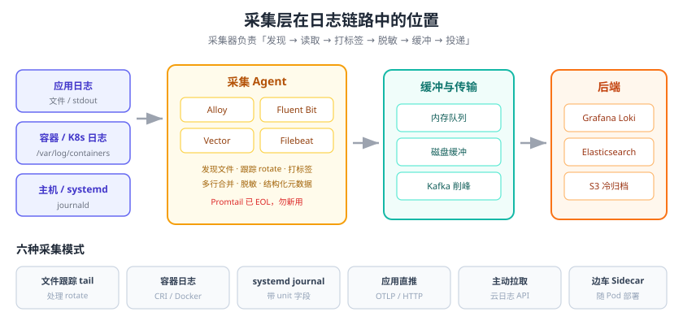

# 日志采集与传输

采集（Collection）是日志体系的第一公里：把业务机器上产生的日志**可靠地**搬到后端存储之前。这一层决定了日志平台的上限——采集丢数据、采集端打满 CPU、后端抖动导致日志雪崩，都是这一层的典型故障。

本页覆盖主流采集器对比、采集模式、K8s 采集、多行合并、背压缓冲与采集端脱敏。



## 采集器选型

| 采集器 | 语言 | 资源占用 | 配置格式 | 核心优势 | 典型场景 |
| --- | --- | --- | --- | --- | --- |
| **Grafana Alloy** | Go | 中 | Alloy 语法（HCL 风格） | Loki 官方主线，Promtail 迁移目标；同时支持指标/日志/链路 | Grafana 生态、替代 Promtail |
| **Fluent Bit** | C | **极低**（约 450KB 镜像） | INI / YAML | 轻量、插件多（100+）、K8s 事实标准 | 边缘、K8s DaemonSet、成本敏感 |
| **Fluentd** | Ruby + C | 高 | Ruby DSL | 插件生态最老最全 | 存量环境、复杂路由 |
| **Vector** | Rust | 低 | YAML / TOML | VRL 转换语言强、性能高、多后端路由 | 采集与转换一体化、多后端分流 |
| **Elastic Agent / Filebeat** | Go | 低 | YAML | 与 Elastic 一体、模块化（modules）开箱即用 | Elastic Stack 环境 |
| **Logstash** | JVM | 很高 | 配置文件 DSL | 过滤器最丰富（grok、geoip、translate） | 中心化解析层（不放边缘） |
| **OTel Collector** | Go | 中 | YAML | 厂商中立、OTLP 统一协议、与链路同源 | 已有 OpenTelemetry 体系 |
| **Promtail** | Go | 低 | YAML | —— | **已 EOL，禁止新用** |

::: danger 关于 Promtail 的重要变更
Promtail 已于 **2026-03-02 EOL**，并从 Loki **3.7.3** 起彻底移除（代码并入 Grafana Alloy）。存量环境请按下面步骤迁移：

```shell
# 1. 安装 Grafana Alloy（以 Debian/Ubuntu 为例）
curl -fsSL https://apt.grafana.com/gpg.key | sudo gpg --dearmor -o /etc/apt/keyrings/grafana.gpg
echo "deb [signed-by=/etc/apt/keyrings/grafana.gpg] https://apt.grafana.com stable main" | sudo tee /etc/apt/sources.list.d/grafana.list
sudo apt-get update && sudo apt-get install -y alloy

# 2. 用内置转换器把 Promtail 配置转成 Alloy 配置
sudo alloy convert --source-format=promtail \
  --output=/etc/alloy/config.alloy \
  /etc/promtail/config.yml

# 3. 生成诊断报告，确认没有无法转换的项
sudo alloy convert --source-format=promtail \
  --report=/tmp/promtail-migration-report.txt \
  --output=/etc/alloy/config.alloy \
  /etc/promtail/config.yml
```

转换器明确会提示两类**不会自动迁移**的内容：Promtail 自身的 tracing 配置，以及 Promtail 导出的指标名（Alloy 的指标名不同，依赖 Promtail 指标做告警/看板的必须同步改）。
:::

## 采集模式

| 模式 | 说明 | 代表实现 |
| --- | --- | --- |
| 文件跟踪（tail） | 跟踪文件句柄，处理 rotate | `tail`（Fluent Bit）、`file`（Filebeat）、`local.file_match`（Alloy） |
| 容器日志 | 读 `/var/lib/docker/containers/*/*-json.log` 或 CRI 日志 | `docker_logs`、`kubernetes_logs`、`container` |
| systemd journal | 直接读 journald 二进制日志，带 unit/priority 字段 | `journald`、`loki.source.journal` |
| 应用直推 | 应用通过 SDK / HTTP 推给采集器 | OTLP receiver、Loki push API |
| 拉取（pull） | 采集器主动从目标 API 拉 | CloudWatch、云日志服务、S3 |
| 边车代理 | Agent 作为 Sidecar 容器随业务 Pod 部署 | Fluent Bit Sidecar、OTel Collector Sidecar |

::: tip 选文件还是选 journald？
- 业务容器化：**读 stdout/日志文件**（应用只管输出，采集与业务解耦）。
- 传统主机服务：优先 **journald**，能自动带上 unit、PID、priority 等结构化字段，比 `grep /var/log/messages` 强得多。
:::

## 采集端配置示例

### Grafana Alloy（Loki 官方主线）

```hcl [config.alloy]
// 1) 发现本节点上所有容器日志
discovery.docker "containers" {
  host = "unix:///var/run/docker.sock"
}

// 2) 从发现的容器读日志
loki.source.docker "containers" {
  host       = "unix:///var/run/docker.sock"
  targets    = discovery.docker.containers.targets
  forward_to = [loki.process.parse.receiver]
  labels     = { job = "docker" }
}

// 3) 解析 JSON、抽取 level、并做脱敏
loki.process "parse" {
  forward_to = [loki.write.default.receiver]

  stage.json {
    expressions = { level = "level", service = "service", trace_id = "traceId" }
  }
  stage.labels {
    values = { level = "", service = "" }
  }
  // 结构化元数据放 trace_id，避免标签高基数
  stage.structured_metadata {
    values = { trace_id = "" }
  }
  // 采集端脱敏
  stage.replace {
    expression = "(?i)(password|token|idcard)\\s*[=:]\\s*\\S+"
    replace    = "$1=***"
  }
}

loki.write "default" {
  endpoint {
    url = "http://loki:3100/loki/api/v1/push"
  }
}
```

### Fluent Bit（极简 + 高性能）

```ini [fluent-bit.conf]
[INPUT]
    Name              tail
    Path              /var/log/app/*.log
    Tag               app.*
    DB                /var/lib/fluent-bit/tail.db
    Read_from_Head    false
    Rotate_Wait       30

[SERVICE]
    Flush             5
    Log_Level         info
    Storage.path      /var/lib/fluent-bit/buffer
    Storage.type      filesystem      # 文件系统缓冲，抗后端抖动

[FILTER]
    Name              multiline
    Match             app.*
    multiline.key_content log
    multiline.parser  java
```

### Vector（用 VRL 做转换）

```yaml [vector.yaml]
sources:
  app_logs:
    type: file
    include: ["/var/log/app/*.log"]
    read_from: beginning

transforms:
  parse_json:
    type: remap
    inputs: [app_logs]
    source: |
      . = parse_json!(.message)
      .env = "prod"
      # 脱敏：手机号中间四位打码
      if exists(.phone) { .phone = replace(string!(.phone), r'(\d{3})\d{4}(\d{4})', "$1****$2") }

sinks:
  loki:
    type: loki
    inputs: [parse_json]
    endpoint: http://loki:3100
    encoding:
      codec: json
    labels:
      service: "{{ service }}"
      level: "{{ level }}"
```

### Filebeat / Elastic Agent（Elastic 生态）

```yaml [filebeat.yml]
filebeat.inputs:
  - type: filestream
    id: order-service
    paths:
      - /var/log/order-service/*.log
    parsers:
      - ndjson:
          target: ""
          add_error_key: true
      - multiline:
          type: pattern
          pattern: '^\d{4}-\d{2}-\d{2}'
          negate: true
          match: after
    fields:
      service: order-service
    fields_under_root: true

output.elasticsearch:
  hosts: ["https://es:9200"]
  data_stream: "logs-order-service-default"

queue.mem:
  events: 8192
  flush.min_events: 512
```

## 多行日志合并（堆栈必须处理）

Java / Python 的异常堆栈是多行文本，逐行采集会把它拆成几十条独立日志，**完全无法阅读**。必须在采集端合并：

```text
# 原始日志（逐行采集的错误结果）
2026-09-13 10:00:00 ERROR 扣减库存失败
    at com.demo.OrderService.deduct(OrderService.java:88)
    at com.demo.OrderController.create(OrderController.java:41)
Caused by: java.lang.IllegalStateException: stock not enough
```

方式对比：

| 方式 | 配置位置 | 说明 |
| --- | --- | --- |
| 正则多行 | Filebeat `multiline`、Fluent Bit `multiline` | 通用，按“行首是否为时间戳/日志头”判断 |
| JSON 单行 | 应用侧直接输出单行 JSON | **最推荐**：从源头消灭多行问题 |
| 堆栈字段化 | 应用把堆栈作为 `error.stack` 字段写进 JSON | 最佳实践，但需框架支持 |

::: tip 最优解是从源头解决
让日志框架把堆栈转义进 JSON 的单个字段（如 Logback 的 `JsonLayout`、Log4j2 的 `JsonTemplateLayout`、Go 的 `zap` + `stacktrace`），采集端就不需要任何多行处理逻辑，也不会因为正则误判而错行。
:::

## Kubernetes 采集

K8s 场景有两条主流路径：

### 方案 A：DaemonSet + 容器日志文件（推荐）

```yaml [fluent-bit-daemonset.yaml]
apiVersion: v1
kind: ConfigMap
metadata:
  name: fluent-bit-config
  namespace: logging
data:
  fluent-bit.conf: |
    [INPUT]
        Name              tail
        Path              /var/log/containers/*.log
        Parser            cri
        Tag               kube.*
        DB                /var/lib/fluent-bit/tail.db
    [FILTER]
        Name              kubernetes
        Match             kube.*
        Kube_URL          https://kubernetes.default.svc:443
        Merge_Log         On
        K8S-Logging.Parser On
    [OUTPUT]
        Name              loki
        Match             kube.*
        Host              loki.logging.svc.cluster.local
        Port              3100
        Labels            job=fluent-bit, namespace=$kubernetes['namespace_name'], pod=$kubernetes['pod_name']
---
apiVersion: apps/v1
kind: DaemonSet
metadata:
  name: fluent-bit
  namespace: logging
spec:
  selector:
    matchLabels: { app: fluent-bit }
  template:
    metadata:
      labels: { app: fluent-bit }
    spec:
      serviceAccountName: fluent-bit
      tolerations:
        - operator: Exists          # 容忍所有污点：master 节点日志也要采
      containers:
        - name: fluent-bit
          image: cr.fluentbit.io/fluent/fluent-bit:5.1.1
          resources:
            requests: { cpu: 100m, memory: 128Mi }
            limits:   { cpu: 500m, memory: 512Mi }
          volumeMounts:
            - { name: varlog, mountPath: /var/log }
            - { name: config, mountPath: /fluent-bit/etc }
      volumes:
        - { name: varlog, hostPath: { path: /var/log } }
        - { name: config, configMap: { name: fluent-bit-config } }
```

### 方案 B：Grafana Alloy + Helm（Grafana 官方推荐）

```shell
# Loki 的 Helm Chart 自 2026-03-16 起迁移到 grafana-community/helm-charts 维护
helm repo add grafana-community https://grafana-community.github.io/helm-charts
helm repo update

# 安装 Loki（单机模式，生产建议用 microservices 模式 + 对象存储）
helm install loki grafana-community/loki -n logging --create-namespace \
  --set deploymentMode=SingleBinary \
  --set loki.auth_enabled=false \
  --set loki.commonConfig.replication_factor=1 \
  --set loki.storage.type=filesystem

# Loki 3.7+ 已不再自带采集器，采集需单独部署 Alloy
helm install alloy grafana/alloy -n logging --create-namespace \
  --set 'alloy.configMap.content=...'
```

::: danger K8s 采集的四个坑
1. **只采 `/var/log/pods` 不采 `/var/log/containers`**：`/var/log/containers/*.log` 是指向 pods 的软链，带 Pod 名信息，采集更省事。
2. **忘记 `tolerations`**：DaemonSet 不调度到 master/有污点的节点，这些节点日志全丢。
3. **没设 `resources.limits`**：日志暴涨时采集器把节点内存吃光，触发 Pod 被驱逐，连锁故障。
4. **标签用了 Pod 名以外的动态值**：把 `container_id`、`traceId` 打进 Loki 标签，索引基数爆炸。
:::

## 背压、缓冲与可靠性

采集层最重要的可靠性保障是**缓冲**：

| 缓冲方式 | 位置 | 抗故障能力 | 说明 |
| --- | --- | --- | --- |
| 内存队列 | 采集进程内 | 弱 | 进程重启即丢，只适合低价值日志 |
| 磁盘队列 | 采集端本地文件 | 中 | 后端宕机时可积压数小时，推荐默认开启 |
| 消息队列 | Kafka / Pulsar | 强 | 支持重放、多消费、削峰 |
| 落对象存储 | S3 / MinIO | 最强 | 先落盘再离线入仓，成本最低 |

```ini [Fluent Bit 磁盘缓冲关键项]
[SERVICE]
    Storage.path          /var/lib/fluent-bit/buffer
    Storage.type          filesystem
    Storage.max_chunks_up 128
    Storage.sync          normal

[OUTPUT]
    Name                  loki
    Match                 *
    Host                  loki
    Port                  3100
    Retry_Limit           False      # 不限制重试次数，避免后端抖动时丢日志
    storage.total_limit_size 5G       # 磁盘缓冲上限，防止写满本地盘
```

::: danger 没有背压保护的后果
后端（Loki/ES）升级或抖动 → 采集器发送失败 → 内存队列堆积 → 采集器 OOM 被杀 → **日志大面积丢失，恰好发生在故障期间**。这就是“最需要日志的时候没有日志”。
:::

## 采集端脱敏

合规要求下，敏感字段要在**离开业务机器之前**处理掉。常见脱敏手段：

| 手段 | 实现 | 说明 |
| --- | --- | --- |
| 正则替换 | Vector VRL `replace`、Alloy `stage.replace` | 通用，适合手机号/身份证 |
| 字段丢弃 | `del(.password)`、`stage.drop` | 直接删除整字段，最安全 |
| 哈希 | 对 userId 做 HMAC | 保留可关联性但不泄露原值 |
| 白名单 | 只保留允许的字段 | 最严格，但容易漏掉排障必需字段 |

```javascript [Vector VRL：字段级脱敏]
# 删除明显敏感的字段
del(.password)
del(.headers.authorization)
del(.card_no)

# 正则脱敏身份证 / 手机号
if exists(.id_card) {
  .id_card = replace(string!(.id_card), r'(\d{6})\d{8}(\d{4})', "$1********$2")
}
if exists(.phone) {
  .phone = replace(string!(.phone), r'(\d{3})\d{4}(\d{4})', "$1****$2")
}
```

## 易错点与最佳实践

::: danger 常见错误
1. **采集器无磁盘缓冲**：后端重启一次，日志丢一大段，且恰好是故障时段。
2. **文件旋转后漏采**：没配 `Rotate_Wait` 或 `close_*` 参数，rotate 瞬间的日志落入空档。
3. **多行正则写得太宽**：把所有不以时间戳开头的行都并入上一条，结果把两条无关日志拼到一起。
4. **同一份日志被采两遍**：DaemonSet 和 Sidecar 同时采集，日志重复、成本翻倍。
5. **`Read_from_Head true` 上线就刷爆后端**：首次部署把历史文件全量重发，直接把后端打挂。
6. **采集器版本与后端不匹配**：Loki 3.7 已移除 Promtail，仍用旧配置会启动失败。
7. **不限制磁盘缓冲上限**：`storage.total_limit_size` 没设置，缓冲写满根分区导致节点故障。
8. **在采集端做重计算**：grok 大正则解析放在每个节点的采集器上，CPU 被日志吃光。
:::

::: tip 最佳实践
1. **采集轻、解析重**：边缘只做轻量标签与脱敏，复杂解析后移到 Kafka 消费者或后端 Ingest Pipeline。
2. **统一配置管理**：采集配置进 Git，用 Helm/Ansible 下发，禁止手工改机器上的配置文件。
3. **给采集器配额**：显式设置 CPU/内存 limit 与 request，纳入节点资源规划。
4. **监控采集器自身**：`fluentbit_output_retries_total`、`fluentbit_output_dropped_records_total`、Alloy 的 `loki_write_dropped_entries_total` 必须进监控。
5. **灰度接入**：新采集规则先在一个 namespace 上线，观察 24 小时再全量。
6. **保留原始日志一段时间**：解析失败时可回溯原始文本，通常用对象存储冷存 7 天。
:::

## 验证方式

1. **链路连通**：`curl -s http://loki:3100/ready` 返回 `ready`；`curl -s http://es:9200/_cluster/health?pretty` 返回 `status` 为 `green`/`yellow`。
2. **数据到达**：向后端检索最近 1 分钟、当前 Pod 的日志，`{namespace="default"} |= "test-marker"` 能命中。
3. **多行合并**：抛一个带堆栈的异常，确认后端里是**一条**日志而不是 N 条。
4. **缓冲生效**：停掉后端 2 分钟，期间持续产生日志，恢复后确认这 2 分钟的日志**补齐**。
5. **采集器健康**：`kubectl -n logging top pod` 查看采集器资源占用，确认单节点 CPU 使用率在预期范围内（通常 < 0.5 核 / 5 万行每秒）。
6. **无重复**：用同一条日志的 `traceId` 在 Loki 中统计条数，确认与业务实际打印次数一致。

## 相关专题

- [日志体系概述](../Overview/index.md)：整体框架与选型
- [Grafana Loki](../Loki/index.md)：Alloy 的目标后端与 LogQL 查询
- [Elastic Stack（ELK）](../ElasticStack/index.md)：Filebeat / Logstash 的下游
- [Docker 容器监控](../../Docker/Monitor/index.md)：容器日志驱动与落盘位置
- [Kubernetes 监控与运维](../../Kubernetes/Monitoring/index.md)：DaemonSet 调度与资源配额

## 参考资料

- Grafana Alloy 文档：https://grafana.com/docs/alloy/latest/
- Promtail → Alloy 迁移指南：https://grafana.com/docs/alloy/latest/set-up/migrate/from-promtail/
- Fluent Bit 文档：https://docs.fluentbit.io/manual
- Fluent Bit v5.1.0 发布说明：https://fluentbit.io/announcements/v5.1.0
- Vector 文档与 VRL 参考：https://vector.dev/docs/reference/vrl/
- Filebeat filestream 输入：https://www.elastic.co/guide/en/beats/filebeat/current/filebeat-input-filestream.html
- OpenTelemetry Collector 文档：https://opentelemetry.io/docs/collector/
- 安全审计日志的采集与留存（auditd、K8s API Server 审计）：[安全加固 · 审计与检测](../../SecurityHardening/AuditDetection/index.md)
