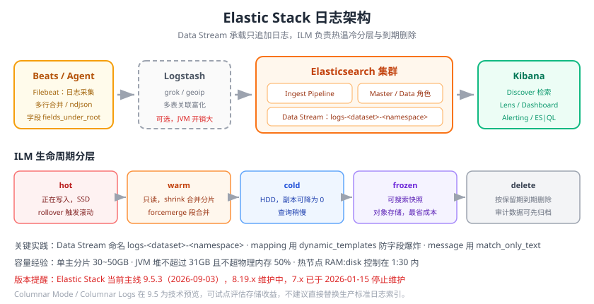

# Elastic Stack（ELK）

Elastic Stack（旧称 ELK Stack）是搜索与日志分析领域最成熟的方案：**Elasticsearch** 负责存储与检索，**Logstash** 负责解析与转换，**Kibana** 负责可视化与告警，**Beats / Elastic Agent** 负责采集。它的最大优势是**全文检索 + 任意字段聚合 + 安全分析**能力，代价是索引与存储成本较高、JVM 调优有门槛。

本页从「日志后端」的视角讲清楚：组件分工、版本与许可现状、索引与生命周期设计、写入优化、以及一套可运行的落地示例。



## 组件分工

| 组件 | 角色 | 在日志链路中的位置 | 备注 |
| --- | --- | --- | --- |
| **Elasticsearch** | 分布式搜索与分析引擎 | 存储 + 检索 | JVM 应用，基于 Lucene，倒排索引 |
| **Logstash** | 服务端数据处理管道 | 解析 + 富化 + 输出 | JVM，资源占用高，**不要放边缘节点** |
| **Kibana** | 可视化与运维界面 | 查询 + 看板 + 告警 | 提供 Discover、Lens、Alerting、ES\|QL |
| **Beats**（Filebeat/Metricbeat…） | 轻量采集器 | 采集 | Go 编写，Filebeat 负责日志 |
| **Elastic Agent** | 统一采集代理 | 采集 + 集成管理 | 替代独立 Beats 的新一代方案，可被 Fleet 集中管理 |

::: info 为什么不叫 ELK 了
严格说 ELK = Elasticsearch + Logstash + Kibana，但实际生产里往往不用 Logstash（用 Beats 直接写 ES），还会搭配 X-Pack（安全、告警、监控）等商业组件。Elastic 官方统一用 **Elastic Stack** 指代整个家族，版本号全线拉齐（ES 9.5.3 对应的 Kibana、Logstash、Beats 都是 9.5.3）。
:::

## 数据流

```text
应用 stdout / 日志文件
    │
    ├─(Filebeat / Elastic Agent)──► Elasticsearch（直连，轻解析）
    │
    └─(Filebeat)──► Logstash（grok / geoip / translate）──► Elasticsearch
                                                                │
                                            Data Stream ◄───────┘
                                                │
                                          ILM: hot → warm → cold → frozen → delete
                                                │
                                             Kibana（Discover / Dashboard / Alerting）
```

两条主流路径：

| 路径 | 结构 | 优点 | 缺点 |
| --- | --- | --- | --- |
| 直连 | Filebeat → ES（Ingest Pipeline 解析） | 少一跳、延迟低、运维简单 | 解析能力弱于 Logstash |
| 中转 | Filebeat → Logstash → ES | 解析/富化能力最强 | 多一跳、Logstash 是资源瓶颈与单点风险 |

::: tip 选型建议
**能用 Ingest Pipeline 解决的就别上 Logstash**。Logstash 适合需要复杂富化（多表关联、GeoIP、外部 API 查询）的场景；纯 grok/dissect 解析，Elasticsearch 的 Ingest Pipeline 完全够用，还能省掉一层 JVM。
:::

## 版本与许可现状（2026-09 核对）

| 版本 | 状态 | 说明 |
| --- | --- | --- |
| **9.5.3**（2026-09-03） | 当前主线 | 9.5 于 2026-08-04 GA，含 Columnar Mode、原生 PromQL GA、VectorDB 索引模式 |
| 9.4.6（2026-09-01） | 维护中 | 上一个 minor |
| 8.19.21（2026-09-01） | 维护中 | 8.x 末班车，升级 9.x 的推荐跳板 |
| 7.17.29（2025-06-24） | **已停止维护**（2026-01-15） | 仅存量环境使用，需尽快升级 |

许可说明：Elasticsearch 与 Kibana 从 **8.16.0（2024-08）** 起新增 **AGPLv3** 作为第三个许可选项，与 Elastic License 2.0、SSPL 1.0 并行。注意官方下载的默认分发包仍遵循 Elastic License，AGPLv3 覆盖的是源代码中的“free portions”。**Logstash 与各语言客户端始终是 Apache 2.0。**

## 9.5 与日志相关的重点特性

| 特性 | 状态 | 对日志场景的意义 |
| --- | --- | --- |
| **Columnar Mode** | 技术预览 | 字段只存列存、默认不建倒排索引，存储占用显著下降，适合分析与长保留 |
| **Columnar Logs** | 技术预览 | 基于 Columnar Mode 的日志专用 profile：仅对 `message` 字段保留倒排索引，其余全列存，在保留全文检索体验的前提下降低存储 |
| **原生 PromQL 支持** | GA（9.5） | 可直接把 Grafana / Prometheus 的查询与看板对准 Elastic |
| **ES\|QL** | GA | 管道式查询语言，适合日志的探索式分析 |
| Dashboard 迁移工具 | GA | 从 Grafana / Datadog 迁入 Kibana 看板与告警 |

::: warning 技术预览 ≠ 生产可用
Columnar Mode 与 Columnar Logs 在 9.5 中是 **technical preview**，API 与行为可能变化。可以在日志量最大的索引上试点评估存储收益，但不要直接替换生产的标准日志索引。
:::

## 索引设计：Data Stream + ILM

### 为什么用 Data Stream

日志是**只追加**的时间序列数据，天然适合 **Data Stream**（数据流）：

- 自动按时间滚动创建后备索引（backing index），避免单个索引无限增大。
- 写入时自动路由到最新索引，查询时可以指定时间范围跳过旧索引。
- 与 **ILM**（Index Lifecycle Management，索引生命周期管理）绑定，自动做 hot → warm → cold → frozen → delete。

```text
logs-order-service-default
├── .ds-logs-order-service-default-2026.09.13-000001   ← 当前写入（hot）
├── .ds-logs-order-service-default-2026.09.06-000002   ← 已 rollover（warm）
└── .ds-logs-order-service-default-2026.08.30-000003   ← 已降冷 / 待删除
```

命名规范：`logs-<dataset>-<namespace>`，例如 `logs-order-service-prod`、`logs-nginx-access-prod`。

### ILM 策略示例

```json [ilm-logs-30d.json]
{
  "policy": {
    "phases": {
      "hot": {
        "min_age": "0ms",
        "actions": {
          "rollover": { "max_primary_shard_size": "40gb", "max_age": "1d" },
          "set_priority": { "priority": 100 }
        }
      },
      "warm": {
        "min_age": "3d",
        "actions": {
          "shrink": { "number_of_shards": 1 },
          "forcemerge": { "max_num_segments": 1 },
          "set_priority": { "priority": 50 }
        }
      },
      "cold": {
        "min_age": "15d",
        "actions": { "set_priority": { "priority": 0 } }
      },
      "delete": {
        "min_age": "30d",
        "actions": { "delete": {} }
      }
    }
  }
}
```

创建并挂载：

```shell
# 创建策略
curl -u elastic:$PASS -XPUT "https://es:9200/_ilm/policy/logs-30d" \
  -H 'Content-Type: application/json' -d @ilm-logs-30d.json

# 创建索引模板，把 Data Stream 绑到策略上
curl -u elastic:$PASS -XPUT "https://es:9200/_index_template/logs-order-service" \
  -H 'Content-Type: application/json' -d '{
  "index_patterns": ["logs-order-service-*"],
  "data_stream": {},
  "template": {
    "settings": { "index.lifecycle.name": "logs-30d",
                  "index.number_of_shards": 3,
                  "index.number_of_replicas": 1 }
  }
}'

# 验证 Data Stream 已绑定策略
curl -u elastic:$PASS "https://es:9200/_data_stream/logs-order-service-default?pretty"
```

### Mapping 设计要点

| 要点 | 做法 | 原因 |
| --- | --- | --- |
| `message` 用 `match_only_text` | 只索引必要内容 | 比 `text` 省存储与 CPU |
| 时间字段用 `date` + `format` | 明确 `strict_date_optional_time` | 避免被推断成 text |
| 需要聚合的字段显式 `keyword` | `service`、`level`、`env` | 避免 `text` 无法聚合 |
| 禁用不用的字段索引 | `"index": false`、`"doc_values": false` | 减少索引膨胀 |
| 限制字段总数 | `index.mapping.total_fields.limit`（默认 1000） | 防止应用多打字段导致 mapping 爆炸 |
| 动态模板防脏字段 | `dynamic_templates` 把未知字符串设为 `keyword` + `ignore_above` | 防止字段爆炸 |

```json [动态模板示例]
{
  "dynamic_templates": [
    {
      "strings_as_keyword": {
        "match_mapping_type": "string",
        "mapping": { "type": "keyword", "ignore_above": 1024 }
      }
    }
  ]
}
```

::: danger mapping 爆炸是最常见的 ES 日志故障
业务代码给日志加了一个“上下文对象”，把整个请求体序列化进日志 → ES 自动映射出成百上千个字段 → 集群 master 内存飙升 → **集群进入 red/yellow、写入被拒**。
正确做法：① 设置 `dynamic_templates` 只保留 `keyword`；② 开启 `dynamic: false` 或 `strict` 的字段级控制；③ 日志里只放排障必需的字段。
:::

## 解析：Ingest Pipeline

比 Logstash 更轻的解析方式是在 ES 侧用 Ingest Pipeline：

```shell
curl -u elastic:$PASS -XPUT "https://es:9200/_ingest/pipeline/logs-order-service" \
  -H 'Content-Type: application/json' -d '{
  "description": "解析 order-service 的 JSON 日志",
  "processors": [
    { "json": { "field": "message", "target_field": "log", "ignore_failure": true } },
    { "date": { "field": "log.time", "formats": ["ISO8601"], "target_field": "@timestamp" } },
    { "remove": { "field": ["log.password", "log.token"], "ignore_missing": true } },
    { "geoip": { "field": "clientIp", "target_field": "geo", "ignore_missing": true } },
    { "set": { "field": "env", "value": "prod" } }
  ]
}'
```

| 处理器 | 用途 | 备注 |
| --- | --- | --- |
| `grok` | 从非结构化文本抽取字段 | 性能较差，**优先用 `dissect`**（无正则，快得多） |
| `dissect` | 按分隔符切分固定格式 | 格式稳定时首选 |
| `json` | 解析 JSON 字符串字段 | 结构化日志必备 |
| `date` | 解析时间戳为 `@timestamp` | 不用它则时间会被写成入库时间 |
| `geoip` | IP → 地理位置 | 需要 GeoIP 数据库 |
| `user_agent` | UA → 浏览器/OS | 访问日志常用 |
| `remove` / `set` | 删除敏感字段 / 补默认值 | 脱敏主力 |

## 写入优化

| 参数 | 默认 | 日志场景建议 | 效果 |
| --- | --- | --- | --- |
| `refresh_interval` | `1s` | 日志索引可放宽到 `30s` | 减少段合并压力，吞吐明显提升 |
| `number_of_replicas` | `1` | 热节点 `1`，冷节点可 `0` | 副本是成本主要来源之一 |
| `translog.durability` | `request` | 可改 `async` | 吞吐提升，极端情况下可能丢少量数据 |
| 批量写入 | —— | 用 Bulk API，每批 5~15MB | 单条写入性能极差 |
| 分片大小 | —— | 单个主分片 **30~50GB** | 过大影响恢复速度，过小增加开销 |
| 堆内存 | —— | **不超过 31GB**（压缩指针上限），且 ≤ 物理内存 50% | 超过 31GB 收益反而下降 |
| 磁盘 | —— | 热节点 SSD；RAM:disk 建议 1:30 以内 | 防止查询打满 IO |

::: danger JVM 堆配置的两个经典误区
1. **堆设得越大越好**：超过 **31GB** 就失去压缩普通对象指针（compressed oops）的优化，实际可用内存反而下降。通常 JVM 堆建议 ≤ 物理内存的 50%，剩下留给 Lucene 的文件系统缓存。
2. **Xms 与 Xmx 不一致**：会导致运行时堆扩容抖动，必须写成相同值，例如 `-Xms16g -Xmx16g`。
:::

## Kibana 使用要点

| 功能 | 用途 | 日志场景 |
| --- | --- | --- |
| **Discover** | 交互式检索 | 按 `service`/`level` 过滤，看原始日志 |
| **Lens / Visualize** | 图表 | ERROR 数量按服务分组的时间曲线 |
| **Dashboard** | 看板 | 把请求量、错误率、Top 报错聚类放一屏 |
| **Alerting** | 告警规则 | 日志条目数阈值、字段命中告警 |
| **ES\|QL** | 管道查询语言 | 探索式分析，语法接近 SQL |
| **Logs / Observability** | 日志专用视图 | 内置流式查看、字段统计、上下文 |

ES|QL 示例（查找近 15 分钟错误数 Top 5 的服务）：

```sql
FROM logs-*
| WHERE @timestamp > NOW() - 15 minutes AND log.level == "ERROR"
| STATS errors = COUNT(*) BY service = log.service
| SORT errors DESC
| LIMIT 5
```

## 实战：单机三件套（ES + Kibana + Filebeat）

下面的 Compose 文件可以在本机跑起一套可用的 ELK：

```yaml [docker-compose.yml]
services:
  es:
    image: docker.elastic.co/elasticsearch/elasticsearch:9.5.3
    container_name: es
    environment:
      - discovery.type=single-node
      - ES_JAVA_OPTS=-Xms2g -Xmx2g
      - xpack.security.enabled=false
      - xpack.license.self_generated.type=basic
    ports: ["9200:9200"]
    volumes: ["es-data:/usr/share/elasticsearch/data"]
    healthcheck:
      test: ["CMD-SHELL", "curl -fs http://localhost:9200/_cluster/health || exit 1"]
      interval: 10s
      retries: 12

  kibana:
    image: docker.elastic.co/kibana/kibana:9.5.3
    container_name: kibana
    environment:
      - ELASTICSEARCH_HOSTS=http://es:9200
    ports: ["5601:5601"]
    depends_on:
      es: { condition: service_healthy }

  filebeat:
    image: docker.elastic.co/beats/filebeat:9.5.3
    container_name: filebeat
    user: root
    command: ["filebeat", "-e", "-strict.perms=false"]
    volumes:
      - ./filebeat.yml:/usr/share/filebeat/filebeat.yml:ro
      - ./logs:/var/log/app:ro
    depends_on:
      es: { condition: service_healthy }

volumes:
  es-data: {}
```

```yaml [filebeat.yml]
filebeat.inputs:
  - type: filestream
    id: app
    paths: ["/var/log/app/*.log"]
    parsers:
      - ndjson:
          target: ""
          add_error_key: true
    fields: { service: order-service }
    fields_under_root: true

output.elasticsearch:
  hosts: ["http://es:9200"]
  index: "logs-order-service"
  bulk_max_size: 1024

setup.ilm.enabled: false     # 演示用简化，生产应由 ES 侧 ILM 策略接管
logging.level: info
```

启动与验证：

```shell
docker compose up -d

# 1. 集群健康（预期 status 为 green 或 yellow）
curl -s "http://localhost:9200/_cluster/health?pretty"

# 2. 制造一条日志
echo '{"time":"2026-09-13T10:00:00+08:00","level":"ERROR","service":"order-service","message":"库存不足","orderNo":"SO1"}' >> ./logs/app.log
sleep 12

# 3. 确认已入库
curl -s "http://localhost:9200/logs-order-service/_search?pretty&size=1"

# 4. 打开 Kibana 查看
#    浏览器访问 http://localhost:5601 → Discover → 创建数据视图 logs-order-service → 看到刚才那条日志
```

::: tip 验证成功的标志
第 3 步返回的 JSON 中 `hits.total.value >= 1`，且 `_source` 里能看到 `level`、`service`、`orderNo` 已被解析成独立字段（而不是全挤在 `message` 里）。这说明 **ndjson 解析 + 字段映射都生效了**。
:::

## 容量规划经验值

| 规模 | 日志量 | 建议架构 |
| --- | --- | --- |
| 开发/测试 | < 5GB/天 | 单节点，`discovery.type=single-node`，副本 0 |
| 中小生产 | 5~50GB/天 | 3 节点（1 master + 2 data），热 7 天 + 冷 30 天 |
| 中大型 | 50~500GB/天 | 专用 master 3 台 + data 若干（hot/warm 分层）+ Kibana 独立 + 前置 Kafka |
| 大型 | > 500GB/天 | 独立 master + 多 tier（hot/warm/cold/frozen，frozen 接可搜索快照）+ Kafka 削峰 + 采集端采样 |

## 易错点与最佳实践

::: danger 常见错误
1. **单索引不 rollover**：直接往一个大索引写半年，分片几十 GB 且无法删除历史数据。
2. **副本数设太高**：日志索引副本 3 份，存储成本翻 3 倍，排查日志根本不需要这么高可用。
3. **`message` 字段全量 `text` 索引**：每个词都建倒排，存储与写入成本双高。建议 `match_only_text`。
4. **mapping 爆炸**：动态字段无上限，日志里带一个“上下文对象”就把集群搞挂。
5. **不做 ILM**：日志保留 1 年，磁盘打满后集群只读，写入全部失败。
6. **把 Logstash 放在业务机器上**：JVM 抢走业务 CPU，本末倒置。
7. **堆内存超过 31GB**：性能反而下降。
8. **所有查询都不带时间范围**：全量扫描所有后备索引，把集群查挂。
:::

::: tip 最佳实践
1. **Data Stream + ILM 是标配**，不要手建普通索引存日志。
2. **按数据集拆 Data Stream**：`logs-<service>-<env>`，方便单独设保留期与权限。
3. **查询必须带时间范围**：Kibana 默认 15 分钟就是这个道理。
4. **先直连，需要富化再上 Logstash**。
5. **冷热分层用不同硬件**：热节点 SSD + 高配，冷节点大容量 HDD。
6. **监控 ES 自身**：`_cluster/health`、写入拒绝数、JVM 堆使用率、段合并耗时必须进监控。
7. **升级前先看兼容性矩阵**：7.x → 8.x → 9.x 不要跨大版本直跳。
:::

## 验证方式

1. `curl -s localhost:9200/_cluster/health` → `status` 为 `green` 或 `yellow`，`number_of_nodes >= 1`。
2. `curl -s "localhost:9200/_data_stream/logs-order-service-default"` → 返回 Data Stream 与后备索引列表。
3. `curl -s "localhost:9200/logs-order-service/_ilm/explain?pretty"`（或对后备索引查询 `_ilm/explain`）→ 确认 `policy` 已挂载、`phase` 正确。
4. Kibana → Discover 中按 `level: ERROR` 过滤，确认只返回错误日志。
5. 写入压测：`esrally` 或简单脚本用 Bulk API 灌 10 万条，观察 `_nodes/stats` 的 `indexing.index_total` 与 `indexing.index_time_in_millis`。

## 相关专题

- [Elasticsearch 专题](../../../DB/NoRelational/Elasticsearch/index.md)：索引、映射、查询 DSL、聚合的完整基础
- [Grafana Loki](../Loki/index.md)：轻量替代方案对比
- [日志采集与传输](../Collection/index.md)：Filebeat / Elastic Agent 的采集侧配置
- [日志查询与分析](../QueryAnalysis/index.md)：KQL、Lucene、ES|QL 用法
- [SQL 优化](../../../DB/Relational/SQLOptimization/index.md)：慢查询与执行计划的通用分析方法

## 参考资料

- Elastic 官方文档：https://www.elastic.co/guide/index.html
- Elasticsearch 9.5 新特性：https://www.elastic.co/blog/whats-new-elastic-9-5-0
- Elastic Stack 版本发布：https://www.elastic.co/blog/category/releases
- Data Stream 文档：https://www.elastic.co/guide/en/elasticsearch/reference/current/data-streams.html
- ILM 文档：https://www.elastic.co/guide/en/elasticsearch/reference/current/index-lifecycle-management.html
- Ingest Pipeline 处理器参考：https://www.elastic.co/guide/en/elasticsearch/reference/current/processors.html
- ES|QL 参考：https://www.elastic.co/guide/en/elasticsearch/reference/current/esql.html
- Elasticsearch 许可 FAQ：https://www.elastic.co/pricing/faq/licensing
