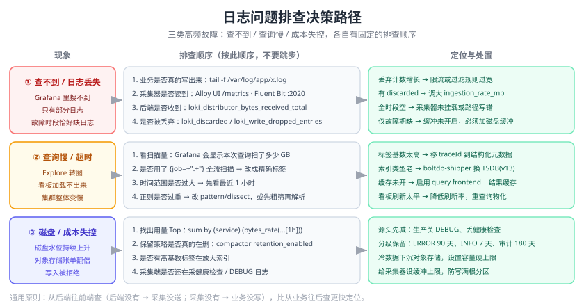

# 常见问题与最佳实践

本页汇总日志体系落地过程中最高频的问题：选型决策、采集丢失与重复、存储膨胀、查询变慢、告警误报、版本迁移。每个问题给出**判断依据 + 排查命令 + 解决方式**，可直接当排障手册用。



## 选型与架构

### Q1：Loki 和 ELK 到底怎么选？

按查询模式决策，而不是按“谁更流行”：

```text
需要「任意字段全文检索 / 安全分析 / 字段级聚合 / 机器学习」？
    是 → Elastic Stack
    否 → 继续

已有 Grafana + Prometheus，团队熟悉 PromQL？
    是 → Loki（LogQL 与 PromQL 同源，学习成本几乎为零）
    否 → 继续

日志量大（>500GB/天）且团队熟悉 SQL / 已有 ClickHouse？
    是 → ClickHouse / VictoriaLogs
    否 → Loki 或云日志服务
```

| 判断维度 | 倾向 ELK | 倾向 Loki |
| --- | --- | --- |
| 主要用途 | 安全审计、合规检索 | 排障、错误定位 |
| 查询特征 | 未知字段探索、正则全文 | 已知标签 + 关键字 |
| 成本敏感度 | 低 | 高 |
| 团队栈 | 独立日志团队 | 已有 Grafana 栈 |

### Q2：日志量不大，直接用云厂商日志服务行吗？

可以，而且往往是最优解。判断标准：

| 场景 | 建议 |
| --- | --- |
| 日志量 < 20GB/天，团队 < 10 人 | **用云服务**（阿里云 SLS / 腾讯云 CLS / AWS CloudWatch Logs） |
| 日志量中等，已有 Grafana | 自建 Loki |
| 有合规要求必须数据不出内网 | 自建（Loki 或 ELK） |
| 有专职运维团队 | 自建 ELK/Loki，成本可控 |

::: tip 反对“为了自建而自建”
自建日志平台的隐性成本（人天、故障处理、版本升级）常常超过云服务账单。**先用云服务跑通流程，量大了再评估自建**，是更稳妥的路径。
:::

### Q3：要不要在采集和后端之间加 Kafka？

| 情况 | 是否需要 Kafka |
| --- | --- |
| 单团队、日志量 < 100GB/天、允许分钟级延迟 | 不需要，采集器磁盘缓冲足够 |
| 多消费者（同时要 ES + Loki + 归档到 S3） | **需要** |
| 后端需要频繁升级/重建，不能丢日志 | **需要**（可重放） |
| 有突发流量峰会打爆后端 | **需要**（削峰） |
| 团队没有 Kafka 运维能力 | 谨慎，会成为新的故障点 |

## 采集问题

### Q4：日志丢了一些，怎么排查？

按链路自后向前排查（**反向定位最快**）：

```shell
# ① 业务有没有真的写出来
tail -f /var/log/app/order-service.log | grep -c "ERROR"

# ② 采集器有没有读（Fluent Bit）
curl -s localhost:2020/api/v1/metrics | grep -E 'input|records'
# Alloy：打开 UI 看组件健康
#   http://localhost:12345 → Component detail

# ③ 后端有没有收到
curl -s http://loki:3100/metrics | grep -E 'loki_distributor_(bytes|lines)_received_total'

# ④ 有没有被丢弃
curl -s http://loki:3100/metrics | grep -E 'loki_discarded|loki_process_dropped'
```

高频原因：

| 原因 | 现象 | 解决 |
| --- | --- | --- |
| 采集器被限流 | 有 `discarded` 计数 | 调大 `ingestion_rate_mb` / `per_stream_rate_limit` |
| 采集端过滤规则过宽 | 有 `dropped` 计数 | 收紧 `stage.drop` 表达式 |
| 文件 rotate 后漏采 | 日志时段有空洞 | 配 `Rotate_Wait` / `close_inactive` |
| 采集器入内存队列后被打断 | 后端故障期日志缺失 | 开启磁盘缓冲 |
| 时间戳被后端拒绝 | 有 `reject_old_samples` 计数 | 校准采集端与业务端时钟 |

### Q5：日志出现重复条目，为什么？

| 原因 | 排查方式 | 解决 |
| --- | --- | --- |
| DaemonSet 与 Sidecar 同时采集 | 检查是否两套采集器都在跑 | 只保留一套 |
| 采集器重启后从头读 | 看 `Read_from_Head`/`read_from` 配置 | 置为 `false` |
| 文件位置记录（DB/positions）丢失 | 检查采集器的 `DB`/`storage.path` 是否落盘 | 挂持久卷 |
| 客户端重复发送 | 校验日志文件的唯一键 | 应用侧重试逻辑修正 |

### Q6：多行堆栈被拆散了怎么办？

**最优解是从源头解决**：让应用输出单行 JSON，把堆栈转义进字段。这比任何采集端正则都可靠。

如果暂时改不了应用，用采集端多行合并：

```ini [Fluent Bit]
[FILTER]
    Name              multiline
    Match             app.*
    multiline.key_content log
    multiline.parser  java
```

```yaml [Filebeat]
parsers:
  - multiline:
      type: pattern
      pattern: '^\d{4}-\d{2}-\d{2}'
      negate: true
      match: after
```

::: danger 多行正则写得过宽
`negate: true` 的含义是“不以时间戳开头的行都算上一条的延续”。如果某条日志的**正文换行**也以非时间戳开头，就会被错误合并到上一条里，导致两条无关日志粘连。上线前必须用真实日志样本回归验证。
:::

### Q7：容器日志在宿主机上的哪个位置？

| 运行时 | 路径 |
| --- | --- |
| Docker（JSON 日志驱动） | `/var/lib/docker/containers/<id>/<id>-json.log` |
| 含软链的统一路径 | `/var/log/containers/<pod>_<ns>_<container>-<id>.log`（指向 pods 目录） |
| containerd / CRI | `/var/log/pods/<ns>_<pod>_<uid>/<container>/*.log` |

::: tip 优先采集 `/var/log/containers/*.log`
这个目录是软链集合，**文件名里自带 Pod 名、namespace、容器名**，采集器可以直接从文件名拿标签，比读 `containers/<id>/*.log` 再反查元数据简单得多。
:::

### Q8：采集器读不到 rotate 后的新文件？

| 采集器 | 关键参数 |
| --- | --- |
| Filebeat | `close_inactive`、`close_renamed`、`close_removed`、`clean_removed` |
| Fluent Bit | `Rotate_Wait`（rotate 后等待时间，默认 5s，建议 30s）、`Path_Key` |
| Alloy | `local.file_match` + `loki.source.file` 自动处理；注意 `poll_frequency` |

典型配置：

```ini [Fluent Bit 抗 rotate]
[INPUT]
    Name          tail
    Path          /var/log/app/*.log
    DB            /var/lib/fluent-bit/tail.db
    Rotate_Wait   30
    Refresh_Interval 10
    Read_from_Head false
```

## 存储与容量

### Q9：磁盘被日志写满导致服务挂了，怎么救急和预防？

**救急**（按风险从低到高）：

```shell
# 1) 找出大文件
du -sh /var/log/* | sort -rh | head -20

# 2) 清空正在被写入的日志文件（不要 rm，否则句柄不释放、空间不回收）
: > /var/log/app/most-hungry.log

# 3) 用 logrotate 立即轮转一次
logrotate -f /etc/logrotate.d/app

# 4) 删除已轮转的旧文件（确认不需要后再执行）
find /var/log/app -name '*.log.*.gz' -mtime +3 -delete
```

**预防**：

| 措施 | 说明 |
| --- | --- |
| 应用侧日志轮转 | logrotate / Logback `RollingFileAppender` 配 `maxHistory` |
| 采集器磁盘缓冲设上限 | Fluent Bit `storage.total_limit_size 5G`；Alloy 限制 `--storage.path` 所在卷 |
| 分区隔离 | 日志目录独立分区或独立盘，写满不影响系统盘 |
| 磁盘水位告警 | 使用率 > 80% 告警（提前量要留足，日志写入速度可能很快） |
| 容器日志限制 | Docker `--log-opt max-size=100m --log-opt max-file=5` |

### Q10：ES 的字段数爆炸（mapping explosion）怎么办？

**现象**：`Limit of total fields [1000] has been exceeded`，或 master 节点内存飙升、集群变红。

**处置**：

```shell
# 1) 找出字段最多的索引
curl -s "localhost:9200/_cat/indices?v&s=docs.count:desc"

# 2) 查看某个索引的 mapping 字段数
curl -s "localhost:9200/logs-order-service-default/_mapping" | grep -o '"[a-zA-Z0-9_]*":{' | wc -l
```

**根治**（新建模板时配置）：

```json
{
  "template": {
    "mappings": {
      "dynamic": "strict",
      "dynamic_templates": [
        { "strings_as_keyword": {
            "match_mapping_type": "string",
            "mapping": { "type": "keyword", "ignore_above": 1024 }
        } }
      ]
    }
  }
}
```

**同时**在应用侧把“上下文对象”从日志里去掉——只保留排障必需的字段。字段数控制在 100 以内是健康区间。

### Q11：Loki 的 stream（流）数量暴涨怎么办？

```shell
# 观察活跃流数量
curl -s http://loki:3100/metrics | grep loki_ingester_memory_streams

# 找出高基数的标签
curl -s http://loki:3100/loki/api/v1/labels
curl -s "http://loki:3100/loki/api/v1/label/<可疑标签>/values"
```

如果某个标签的取值数量达到**几十万**，它就是元凶。典型误用与修正：

| 误用标签 | 修正方式 |
| --- | --- |
| `traceId` / `requestId` | 移到**结构化元数据**或留在正文，用 `\| trace_id="..."` 过滤 |
| `orderNo` / `userId` | 同上，绝不做标签 |
| `url`（含 ID） | 正则归一化（`/order/123` → `/order/:id`）后再做标签 |
| `clientIp` | 只保留网段（`10.0.3.0/24`）或直接不放标签 |
| `hostname` / `pod` | 可以接受，但要注意 Pod 频繁重建会让流数增长 |

::: danger Loki 的 429 几乎都源于高基数标签
`too many outstanding requests` 或 `maximum active streams` 报错时，**第一件事就是查标签基数**，而不是去调大限流参数。调参数只是把爆炸推迟，标签设计错了迟早还会炸。
:::

### Q12：怎么估算日志容量？

```text
日增量 = 原始体积/天 × 索引膨胀系数 ÷ 压缩比 × (1 + 副本数)
总容量 = 日增量 × 保留天数 × 1.3（安全余量）
```

对照表：

| 方案 | 索引膨胀 | 压缩比 | 副本 |
| --- | --- | --- | --- |
| Elasticsearch | 1.1 ~ 1.5 | 3:1 ~ 6:1 | 通常 1（占用 ×2） |
| Loki | 1.01 ~ 1.03 | 5:1 ~ 10:1 | 无须额外副本 |
| ClickHouse | 1.05 ~ 1.2 | 6:1 ~ 15:1 | 通常 1 ~ 2 |

**校验方法**：上线后用实际数据反推系数，而不是一直用经验值。

``` text
# 实际日志字节速率（Loki）
sum(bytes_rate({env="prod"}[1h]))
```

## 查询

### Q13：查询很慢或超时怎么办？

| 原因 | 判断依据 | 解决 |
| --- | --- | --- |
| 时间范围过大 | Grafana 显示扫描量巨大 | 缩短范围，先看最近 1 小时 |
| 标签过滤不精确 | 用了 `{job=~".+"}` | 改成精确标签 |
| 全文正则过重 | `\|~` 复杂正则 | 先用 `\|=` 粗筛，再解析；或改 `pattern` |
| ES 命中太多分片 | `_search` 返回 `_shards.total` 很大 | 带时间范围剪枝；合理设置分片数 |
| 看板刷新太频繁 | 多用户同时打开 | 降低刷新频率，启用结果缓存 |
| 缓存未启用 | —— | Loki 启用 query frontend + 缓存；ES 启用 request cache |

```shell
# 找出最慢的查询（Loki）
curl -s http://loki:3100/metrics | grep loki_request_duration_seconds

# ES 慢查询日志
# elasticsearch.yml
# index.search.slowlog.threshold.query.warn: 5s
```

### Q14：日志时间戳不对（差了 8 小时）怎么办？

**根因**：日志写的是本地时间（`2026-09-13 10:00:00`），后端按 UTC 解析；或者容器内时区是 UTC 而业务按东八区记录。

排查与修正：

```shell
# 1) 确认容器时区
docker exec -it app date

# 2) 确认采集到的日志原文里的时间
#    Grafana Explore → 看 _time 字段 vs message 里的时间

# 3) 让日志带时区（推荐）
#    Java: -Duser.timezone=Asia/Shanghai，日志格式用 ISO8601 带偏移
#    Node: new Date().toISOString()（UTC）或手动带 +08:00
```

| 修正位置 | 做法 |
| --- | --- |
| 应用 | 统一输出 RFC 3339 带时区时间戳 |
| 解析 | Ingest Pipeline 的 `date` 处理器显式指定 `formats` 与 `timezone` |
| 展示 | Grafana/Kibana 统一设置浏览器时区 |
| 容器 | 挂载 `/etc/localtime` 或设置 `TZ=Asia/Shanghai` |

## 告警

### Q15：日志告警天天误报怎么办？

按下面顺序处理：

1. **收窄匹配条件**：把 `|~ "error"` 换成精确的错误码或完整类名。
2. **加 `for` 抖动量**：`for: 5m` 能挡掉绝大多数瞬时毛刺。
3. **建立白名单**：把已知无害的日志模式加入排除条件。
   ``` text
   {job="order-service"} | json | level="ERROR" != "已知无害的第三方超时"
   ```
4. **按服务分组**：`group_by: [service]`，避免一条通知覆盖所有服务。
5. **分级与路由**：只有 P0 走电话，其余进 IM，降低打扰。
6. **每月复盘**：统计每条规则的触发次数与“真实故障占比”，长期无效的直接下线。

### Q16：怎么避免告警风暴？

| 手段 | 实现 |
| --- | --- |
| 分组 | Grafana `group_by` / Alertmanager `group_by` |
| 抑制 | 根因告警触发时抑制衍生告警（Alertmanager `inhibit_rules`） |
| 静默 | 变更窗口提前创建 Silence |
| 去重 | 相同指纹只保留一条 |
| 冷却 | 拉长 `repeat_interval` |
| 依赖关系 | 上游服务故障时，下游告警视为“已知衍生” |

## 版本与迁移

### Q17：Promtail 还能用吗？

**不能用于新项目**。Promtail 已于 **2026-03-02 EOL**，并在 Loki **3.7.3** 中被移除。迁移到 Grafana Alloy：

```shell
# 转换配置
alloy convert --source-format=promtail \
  --output=/etc/alloy/config.alloy \
  /etc/promtail/config.yml

# 生成诊断报告，查看哪些项无法自动迁移
alloy convert --source-format=promtail \
  --report=/tmp/report.txt \
  --output=/etc/alloy/config.alloy \
  /etc/promtail/config.yml
```

::: danger 迁移时两个必查项
1. **指标名变了**：Promtail 导出的指标与 Alloy 不同，依赖 Promtail 指标做的告警与看板**必须同步修改**，否则迁移后监控变瞎。
2. **tracing 配置不会自动迁移**：需要手工在 Alloy 里重新配置。
:::

### Q18：升级 Loki / Elasticsearch 要注意什么？

**Loki**：

| 检查项 | 说明 |
| --- | --- |
| 索引类型 | 从 `boltdb-shipper` 迁到 TSDB（schema v13）；旧配置仍可读但**禁止用于新集群**，Loki 4.0 将移除 |
| Helm Chart 源 | 2026-03-16 起 Loki Chart 迁移到 `grafana-community/helm-charts`，旧 repo 地址会失效 |
| 采集器 | 3.7.3 起不再包含 Promtail，确保已切换到 Alloy |
| 配置项废弃 | 每次升级前读升级指南的 deprecations 章节 |

**Elasticsearch**：

| 检查项 | 说明 |
| --- | --- |
| 升级路径 | 7.x → 8.x → 9.x，**不要跨大版本直跳** |
| 7.x 已 EOL | 维护已于 2026-01-15 结束，需尽快升级 |
| 插件与客户端 | 升级前确认客户端库与插件兼容（8.x 客户端可连 9.x 但需核对兼容矩阵） |
| 索引兼容 | 用 `_migration/deprecations` API 提前发现阻塞项 |
| 快照备份 | 升级前必须先做快照并验证可恢复 |

### Q19：日志平台要不要做高可用？

| 组件 | 是否必须 HA | 理由 |
| --- | --- | --- |
| 采集器 | 是（多副本/DaemonSet） | 单点挂了日志直接断流 |
| 存储（Loki/ES） | 生产必须 | 单点故障导致日志平台整体不可用 |
| 查询/可视化 | 建议 | Grafana 挂了不影响写入，但影响排障 |
| 告警引擎 | 必须 | 告警发不出去等于没监控 |
| 缓冲（Kafka） | 视规模 | 有缓冲时后端可安全升级 |

::: tip 最小的可用 HA 方案
**3 节点 Loki（Simple Scalable）+ 2 副本 Grafana + DaemonSet 采集**，配合对象存储，即可满足绝大多数中小规模的生产要求。
:::

## 安全

### Q20：怎么确认日志里没有敏感信息？

三步走：

```shell
# 1) 静态扫描历史日志
grep -rEn '(password|passwd|token|secret|api[_-]?key|idcard|身份证)' /var/log/app/ | head -20

# 2) 模式匹配（手机号/身份证/银行卡）
grep -rEn '1[3-9][0-9]{9}|[0-9]{17}[0-9Xx]' /var/log/app/ | head -20

# 3) 确认采集端脱敏规则生效（应返回空）
{env="prod"} |~ "(?i)password=|token="
```

| 防线 | 做法 |
| --- | --- |
| 应用侧 | 打印前脱敏（禁止 `log.info(request.toString())`） |
| 采集侧 | Alloy `stage.replace` / Vector VRL `replace` / Fluent Bit `Lua` 过滤 |
| 存储侧 | Ingest Pipeline `remove` 处理器兜底 |
| 权限侧 | 日志平台按团队/环境做 RBAC，审计日志只读 |
| 巡检侧 | 每周用正则扫描新入库日志，发现泄漏即修 |

::: danger 最常见的泄漏源
**打印整个请求体/响应体**。`log.info("请求参数: {}", JSON.toJSONString(request))` 会把密码、Token、身份证一次性写进日志。正确做法是显式列出要打印的字段。
:::

## 速查清单

### 上线前检查

- [ ] 日志格式统一为结构化 JSON，字段约定写入团队规范
- [ ] 每个请求带 `traceId`，且链路追踪可跳转
- [ ] 生产环境关闭 DEBUG
- [ ] 采集端配置脱敏规则，并验证生效
- [ ] 采集器开启磁盘缓冲，设置上限
- [ ] 采集器设置 CPU/内存 limits
- [ ] 存储配置保留策略，且删除机制（compactor / ILM）已开启
- [ ] 标签基数受控（Loki），mapping 字段数受控（ES）
- [ ] 告警规则配 `for`，通知分级别路由，每条带 Runbook 链接
- [ ] 日志平台自身指标接入监控
- [ ] 升级路径与备份方案已确认

### 日常巡检

| 周期 | 项目 |
| --- | --- |
| 每天 | 采集器健康、写入失败数、磁盘水位 |
| 每周 | 日志量 Top 服务、告警误报统计、敏感信息扫描 |
| 每月 | 保留策略有效性、容量趋势、告警规则复盘 |
| 每季度 | 版本升级评估、故障演练、成本复盘 |

## 相关专题

- [日志体系概述](../Overview/index.md)
- [日志采集与传输](../Collection/index.md)
- [Elastic Stack（ELK）](../ElasticStack/index.md)
- [Grafana Loki](../Loki/index.md)
- [日志查询与分析](../QueryAnalysis/index.md)
- [日志告警与联动](../Alerting/index.md)
- [存储、保留与成本优化](../Retention/index.md)
- [实战：搭建集中式日志平台](../Practice/index.md)
- [监控告警常见问题](../../Monitoring/FAQ/index.md)
- [Linux 常见问题与最佳实践](../../Linux/FAQ/index.md)

## 参考资料

- Elastic 官方文档：https://www.elastic.co/guide/index.html
- Grafana Loki 文档：https://grafana.com/docs/loki/latest/
- Loki 保留与压缩：https://grafana.com/docs/loki/latest/operations/retention/
- Grafana Alloy 与 Promtail 迁移：https://grafana.com/docs/alloy/latest/set-up/migrate/from-promtail/
- Fluent Bit 文档：https://docs.fluentbit.io/manual
- Vector 文档：https://vector.dev/docs/
- OpenTelemetry 日志规范：https://opentelemetry.io/docs/specs/otel/logs/
