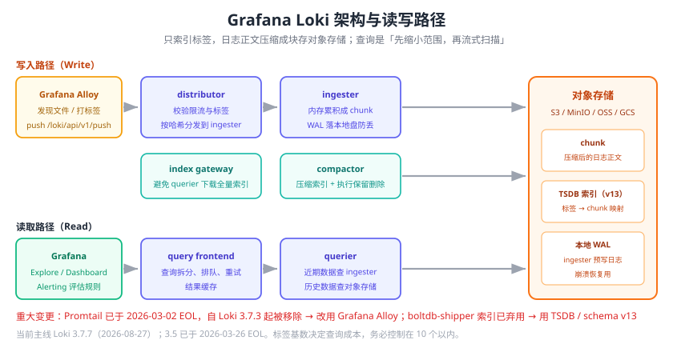

# Grafana Loki

Grafana Loki 是“**日志界的 Prometheus**”：只对**标签（Label）**建索引，日志正文压缩成块（chunk）存对象存储。换来的是极低的存储成本与自然的 Grafana 一体化——同一个 Grafana 里，指标曲线和日志可以直接同屏下钻。

如果团队已经在用 Prometheus + Grafana，Loki 几乎是零学习成本的选择；代价是它**不擅长任意字段的全文检索与聚合**（那正是 Elasticsearch 的强项）。



## 设计哲学：只索引标签

| 维度 | Elasticsearch | Loki |
| --- | --- | --- |
| 索引对象 | 文档的每个可索引字段 | **只有标签** |
| 日志正文 | 分词建倒排索引 | 压缩块存储，不解索引 |
| 存储成本 | 高 | 低（官方给出的经验值通常为 ELK 的 1/3~1/10） |
| 查询方式 | 先查索引定位文档，再取原文 | 先用标签**收窄到极小范围**，再在块上做流式过滤 |
| 查询代价 | 取决于索引命中 | 取决于**扫描的日志量** |

::: tip 一句话理解
Loki 的查询是“**先缩小范围，再暴力扫描**”。所以 **标签设计得好不好，直接决定 Loki 能不能用**——标签选错，一次查询要扫几百 GB。
:::

## 组件与部署模式

| 组件 | 职责 |
| --- | --- |
| **distributor** | 接收写入请求，校验限流与标签，按哈希把日志分发给 ingester |
| **ingester** | 在内存中累积日志块，达到阈值后落盘/推对象存储；提供近期数据的查询 |
| **querier** | 执行 LogQL：查 ingester（近期）+ 查对象存储（历史） |
| **query frontend** | 查询队列、拆分与重试、结果缓存（配 `query-scheduler` 使用） |
| **compactor** | 压缩索引、合并小块、执行保留策略（删除过期数据） |
| **index gateway** | 让 querier 不必下载整个索引；大规模部署必备 |
| **ruler** | 在 Loki 内评估告警与记录规则（也可用 Grafana Alerting 替代） |

三种部署模式：

| 模式 | 结构 | 适用规模 |
| --- | --- | --- |
| **Monolithic / SingleBinary** | 全部组件打在一个进程里 | 开发、小规模（< 50GB/天） |
| **Simple Scalable** | 拆成 `read` / `write` / `backend` 三组（可独立扩缩） | 中等规模，官方推荐生产起点 |
| **Microservices** | 每个组件独立部署与伸缩 | 大规模（> 500GB/天），运维成本最高 |

## 存储：chunk + index

```text
写入路径：
日志流 → distributor → ingester(内存累积)
                          │  达到 chunk 阈值
                          ▼
                    chunk(压缩) → 对象存储（S3/MinIO/GCS）
                    索引(TSDB) → 对象存储

读取路径：
LogQL → query frontend → querier
                          ├─ ingester（近 1~2 小时，内存）
                          └─ 对象存储（历史 chunk + TSDB 索引）
```

| 存储项 | 内容 | 位置 |
| --- | --- | --- |
| Chunk | 压缩后的日志正文 | 对象存储（S3/MinIO/GCS/Azure Blob）或本地文件系统 |
| Index | 标签 → chunk 的映射（TSDB） | 对象存储 |
| WAL | ingester 的预写日志 | 本地磁盘 |

::: danger 索引类型的重大变更
1. **`boltdb-shipper` 已弃用**。Loki 3.x 的默认索引是 **TSDB（schema v13）**，`boltdb-shipper` 仍可读但**禁止用于新集群**，官方计划在 Loki 4.0 中彻底移除。
2. **Promtail 已 EOL（2026-03-02）**，自 Loki **3.7.3** 起从 Loki 中移除。新部署请用 **Grafana Alloy**。
3. **Loki 的 Helm Chart** 自 2026-03-16 起迁移到 `grafana-community/helm-charts` 维护，旧 repo 地址会失效。
:::

正确的新建配置（schema v13）：

```yaml [loki-config.yaml 片段]
schema_config:
  configs:
    - from: 2026-01-01
      store: tsdb
      object_store: s3
      schema: v13
      index:
        prefix: loki_index_
        period: 24h

storage_config:
  tsdb_shipper:
    active_index_directory: /loki/tsdb-index
    cache_location: /loki/tsdb-cache
  aws:
    s3: s3://<access>/<secret>@region/endpoint/bucket
    s3forcepathstyle: true
```

## 标签设计（决定成败）

标签会被**索引**，所以基数必须低。

| 好标签（低基数） | 坏标签（高基数） |
| --- | --- |
| `cluster`、`namespace`、`pod`、`container` | `traceId`、`requestId` |
| `service`、`app`、`job` | `userId`、`orderNo` |
| `env`（dev/test/prod）、`region` | `url`（带 ID 的路径）、`clientIp` |
| `level`（INFO/WARN/ERROR）—— 可接受 | `timestamp`、`sessionId` |

::: danger 高基数标签是 Loki 的头号杀手
把 `traceId` 当标签 → 每个请求产生一条新“流”（stream）→ ingester 内存与索引条目爆炸 → distributor 返回 `429 too many outstanding requests` / `maximum number of active streams`，**整个写入链路瘫痪**。

正确做法：把 `traceId` 放进 **结构化元数据（Structured Metadata）** 或直接留在日志正文里，用 LogQL 的 `| trace_id="xxx"` 过滤：

```text
# ✗ 错误：高基数标签
{job="order-service", traceId="4bf92f35..."} |= "库存不足"

# ✓ 正确：低基数标签 + 正文/结构化元数据过滤
{job="order-service"} |= "库存不足" | trace_id="4bf92f35..."
```
:::

## 部署实战：Loki + Alloy + Grafana

```yaml [docker-compose.yml]
services:
  loki:
    image: grafana/loki:3.7.7
    container_name: loki
    ports: ["3100:3100"]
    command: -config.file=/etc/loki/local-config.yaml
    volumes: ["./loki-config.yaml:/etc/loki/local-config.yaml:ro", "loki-data:/loki"]
    healthcheck:
      test: ["CMD-SHELL", "wget -qO- http://localhost:3100/ready || exit 1"]
      interval: 10s
      retries: 12

  alloy:
    image: grafana/alloy:latest
    container_name: alloy
    command:
      - run
      - /etc/alloy/config.alloy
      - --server.http.listen-addr=0.0.0.0:12345
      - --storage.path=/var/lib/alloy/data
    ports: ["12345:12345"]
    volumes:
      - ./config.alloy:/etc/alloy/config.alloy:ro
      - ./logs:/var/log/app:ro
      - alloy-data:/var/lib/alloy/data
    depends_on:
      loki: { condition: service_healthy }

  grafana:
    image: grafana/grafana:13.2.1
    container_name: grafana
    ports: ["3000:3000"]
    environment:
      - GF_SECURITY_ADMIN_USER=admin
      - GF_SECURITY_ADMIN_PASSWORD=admin
      - GF_FEATURE_TOGGLES_ENABLE=logsExplore
    volumes: ["grafana-data:/var/lib/grafana"]
    depends_on: [loki]

volumes:
  loki-data: {}
  alloy-data: {}
  grafana-data: {}
```

```hcl [config.alloy]
// 读取本地日志文件
local.file_match "app" {
  path_targets = [{ __path__ = "/var/log/app/*.log", job = "order-service" }]
}

loki.source.file "app" {
  targets    = local.file_match.app.targets
  forward_to = [loki.process.parse.receiver]
}

// 解析 JSON，抽 level 作标签、trace_id 作结构化元数据
loki.process "parse" {
  forward_to = [loki.write.default.receiver]

  stage.json {
    expressions = { level = "level", service = "service", trace_id = "traceId" }
  }
  stage.labels {
    values = { level = "", service = "" }
  }
  stage.structured_metadata {
    values = { trace_id = "" }
  }
}

loki.write "default" {
  endpoint { url = "http://loki:3100/loki/api/v1/push" }
}
```

```yaml [loki-config.yaml（单机最小可用）]
auth_enabled: false
server:
  http_listen_port: 3100

common:
  path_prefix: /loki
  storage:
    filesystem:
      chunks_directory: /loki/chunks
      rules_directory: /loki/rules
  replication_factor: 1
  ring:
    kvstore: { store: inmemory }

schema_config:
  configs:
    - from: 2026-01-01
      store: tsdb
      object_store: filesystem
      schema: v13
      index: { prefix: index_, period: 24h }

limits_config:
  retention_period: 168h            # 7 天
  ingestion_rate_mb: 16
  ingestion_burst_size_mb: 32
  max_query_series: 5000
  max_query_parallelism: 32
  reject_old_samples: true
  reject_old_samples_max_age: 168h
  allow_structured_metadata: true

compactor:
  working_directory: /loki/compactor
  retention_enabled: true
  delete_request_store: filesystem

ruler:
  storage: { type: local, local: { directory: /loki/rules } }

analytics:
  reporting_enabled: false
```

启动与验证：

```shell
docker compose up -d

# 1. Loki 就绪
curl -s http://localhost:3100/ready           # 期望输出 ready

# 2. 造一条日志
echo '{"time":"2026-09-13T10:00:00+08:00","level":"ERROR","service":"order-service","traceId":"abc123","message":"库存不足"}' >> ./logs/app.log
sleep 8

# 3. 用 LogQL 查询（注意时间范围要覆盖刚才那条日志）
curl -sG http://localhost:3100/loki/api/v1/query_range \
  --data-urlencode 'query={job="order-service"} |= "库存不足"' \
  --data-urlencode 'limit=5' | head -c 600

# 4. Grafana：访问 http://localhost:3000 (admin/admin)
#    Connections → Data sources → 添加 Loki，URL 填 http://loki:3100
#    Explore → 选择 Loki → 输入 {job="order-service"} 查看日志
```

::: tip 验证成功的标志
第 3 步返回的 JSON 中 `data.result` 非空，且 `values` 数组里能看到那条 `库存不足` 的日志行；第 4 步 Grafana Explore 中同一条查询能出结果，说明**采集 → 写入 → 索引 → 查询**整条链路通了。
:::

## 保留策略与成本控制

Loki 的保留有两条路径：

1. **全局保留**：`limits_config.retention_period` + 开启 compactor 的 `retention_enabled: true`。
2. **按流单独保留**：`retention_stream` 针对特定标签设置不同保留期，并可指定不同存储桶。

```yaml [按级别分级保留]
limits_config:
  retention_period: 360h            # 默认 15 天
  retention_stream:
    - selector: '{level="ERROR"}'
      priority: 10
      period: 2160h                 # ERROR 保留 90 天
    - selector: '{job="audit"}'
      priority: 20
      period: 4320h                 # 审计日志保留 180 天

compactor:
  retention_enabled: true
  retention_delete_delay: 2h
  delete_request_store: s3
```

降本手段（按收益从高到低）：

| 手段 | 收益 | 代价 |
| --- | --- | --- |
| 降低标签基数 | 显著（减少流与索引） | 需要改采集配置与日志规范 |
| 按级别分级保留 | 高 | 需设计 `retention_stream` 规则 |
| 采集端丢弃 DEBUG/健康检查日志 | 高 | 排查时可能缺信息 |
| 冷数据放对象存储 | 高 | 查询变慢 |
| 提高压缩比（如启用更高压缩等级的块编码） | 中 | 写入 CPU 略升 |
| 降低 `max_query_*` 限制、减少查询并发 | 低 | 影响查询体验 |

## 与 Grafana 联动

Loki 最大的杀手锏是**在 Grafana 里和指标、链路同屏**：

```yaml [Grafana 数据源派生字段：日志 → 链路]
# Grafana 中 Loki 数据源的 jsonData.derivedFields
- name: traceId
  matcherRegex: '"traceId":"(\\w+)"'
  url: '$${__value.raw}'
  datasourceUid: tempo      # 点击直接跳到 Tempo/SkyWalking 的链路视图
```

三个常用联动：

| 联动 | 配置 | 效果 |
| --- | --- | --- |
| 日志 → 链路 | `derivedFields` + traceId | 点日志行跳到完整调用链 |
| 指标 → 日志 | Dashboard 面板变量 + Loki 面板 | 看到异常时段直接下钻日志 |
| 日志 → 指标 | LogQL 的 `count_over_time` | 日志数量本身作为告警指标 |

## 性能与规模

| 场景 | 优化手段 |
| --- | --- |
| 写入瓶颈 | 增加 distributor/ingester；调大 `ingestion_rate_mb`；启用 Kafka 缓冲 |
| 查询慢 | **先在 LogQL 里加标签过滤**（最重要）；缩短时间范围；启用 query frontend 与结果缓存 |
| ingester 内存高 | 检查是否有高基数标签；调小 `chunk_target_size`；提高 flush 频率 |
| 索引查询慢 | 部署 index gateway；启用 `tsdb` 索引；避免跨月大范围查询 |
| 对象存储请求多 | 启用 chunks cache（redis/memcached）与 `embedded_cache` |

## 易错点与最佳实践

::: danger 常见错误
1. **用高基数标签**（`traceId`/`orderNo`/`userId`）→ 索引与流爆炸。
2. **还配 `boltdb-shipper`** → 已弃用，新集群必须用 TSDB / schema v13。
3. **还在用 Promtail** → 已 EOL 并从 Loki 3.7.3 移除。
4. **查询不带标签，直接全文搜**：`{job=~".+"} |= "timeout"` 会扫描全部日志，集群被拖垮。
5. **不开 compactor 的 retention**：配了 `retention_period` 也不会删数据。
6. **单机模式上生产**：数据量上来后 ingester OOM，写不进去。
7. **对象存储与计算在同一台机器**：chunk 大量读写把本地磁盘打满。
8. **`reject_old_samples` 不设**：客户端时间错乱写入历史数据，打乱保留策略。
:::

::: tip 最佳实践
1. **标签控制在 10 个以内**，其余字段走结构化元数据或正文过滤。
2. **`level` 做标签要谨慎**：级别种类少（5 个左右）时可以接受，能显著加速错误日志查询。
3. **生产用 Simple Scalable 模式**，读写分离，按需扩缩。
4. **日志规范和 Loki 一起设计**：结构化 JSON + 低基数标签，是 Loki 能跑好的前提。
5. **查询先在 Explore 里验证成本**：Grafana 会显示扫描量与耗时，避免把慢查询写进看板。
6. **给 Loki 自身做监控**：`loki_distributor_ingester_append_failures_total`、`loki_request_duration_seconds`、`loki_ingester_memory_streams` 是核心指标。
:::

## 验证方式

1. `curl -s http://localhost:3100/ready` 返回 `ready`。
2. `curl -s http://localhost:3100/metrics | grep loki_ingester_memory_streams` 能看到流数量，且**不随时间线性增长**（增长失控说明有高基数标签）。
3. 查询近 5 分钟日志能命中；把查询时间范围缩短后扫描量明显下降。
4. 配置 `retention_stream` 后，用 `logcli` 验证过期数据已被删除：
   ```shell
   logcli --addr=http://localhost:3100 series --since=30d '{level="DEBUG"}'
   ```
5. Grafana Explore 中点击带 traceId 的日志行，确认能跳转到链路视图（需先配好 `derivedFields`）。

## 相关专题

- [日志体系概述](../Overview/index.md)：Loki 在整体选型中的位置
- [日志采集与传输](../Collection/index.md)：Grafana Alloy 的完整配置与 Promtail 迁移
- [日志查询与分析](../QueryAnalysis/index.md)：LogQL 语法详解
- [日志告警与联动](../Alerting/index.md)：Grafana Alerting 消费 Loki
- [Elastic Stack（ELK）](../ElasticStack/index.md)：全文检索能力更强的替代方案
- [Grafana 可视化](../../Monitoring/Grafana/index.md)：看板与数据源配置基础
- [监控体系与可观测性](../../Monitoring/Overview/index.md)：三支柱框架

## 参考资料

- Loki 官方文档：https://grafana.com/docs/loki/latest/
- LogQL 参考：https://grafana.com/docs/loki/latest/query/
- Loki 存储与 schema：https://grafana.com/docs/loki/latest/configure/storage/
- Loki 保留策略：https://grafana.com/docs/loki/latest/operations/retention/
- Grafana Alloy 文档：https://grafana.com/docs/alloy/latest/
- Loki 版本与 EOL：https://endoflife.date/grafana-loki
