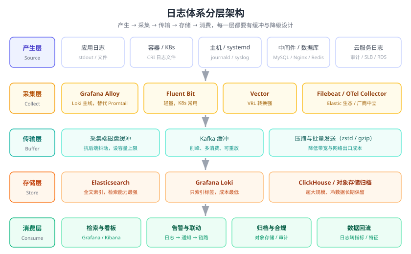
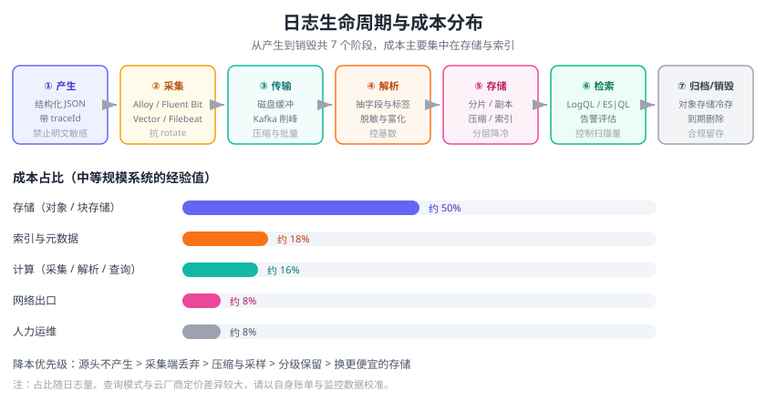

# 日志体系概述

日志（Log）是系统运行过程中产生的**按时间排序的事件记录**。如果说指标告诉你“系统坏了”，那日志告诉你“**为什么坏了**”。日志体系要解决的问题是：把散落在成百上千台机器上的文本，变成**可采集、可存储、可检索、可告警、可关联**的统一资产。

本页建立日志体系的整体框架：日志在可观测性中的定位、日志的分类与生命周期、技术选型与版本现状、日志规范，以及常见部署形态。



## 为什么要建统一日志平台

单机时代 `tail -f` 就够了，微服务与容器时代彻底不够：

1. **日志散落**：一个请求经过网关、订单、库存、支付 4 个服务、12 个 Pod，出问题要一台台 SSH 上去 `grep`。
2. **容器即焚**：容器删除后日志文件随之消失，故障现场无法复原。
3. **磁盘写满**：日志无限增长把磁盘写爆，导致应用崩溃（磁盘满是最常见的“疑难杂症”之一）。
4. **无法串联**：跨服务的同一次调用无法关联（缺少统一 traceId）。
5. **成本失控**：日志量通常是指标量的几十倍，不做分层保留，存储账单会失控。
6. **合规要求**：金融、医疗等行业要求日志留存 6 个月以上并防篡改。

统一日志平台把这些诉求一次解决：**采集 → 传输 → 解析 → 存储 → 检索 → 告警 → 归档**。

## 日志在可观测性中的位置

| 支柱 | 数据形态 | 回答的问题 | 特点 | 代表工具 |
| --- | --- | --- | --- | --- |
| 指标 Metrics | 数值时间序列 | 现在健康吗 | 体量小、聚合快、成本低 | Prometheus、VictoriaMetrics |
| 日志 Logs | 文本/结构化事件 | 具体错在哪 | 信息最全、体量最大、有明细 | Elasticsearch、Loki |
| 链路 Traces | 调用链 Span | 慢在哪个环节 | 跨服务串行关系 | SkyWalking、Tempo |
| 剖析 Profiles（第四信号） | 火焰图采样 | 热点在哪 | 代码级定位 | Pyroscope、Parca |

三者的协作顺序：**指标告警 → 日志定位 → 链路追因**。

```text
① 指标异常：checkout 服务 P99 从 400ms 涨到 3s   → Prometheus 告警
② 打开日志：按 traceId 过滤，发现 "库存查询超时" → Loki / Kibana
③ 顺着链路：MySQL 的 Span 占了 2.8s             → SkyWalking
④ 回归日志：慢 SQL 缺少索引，全表扫描           → 结论
```

::: tip 一句话理解
**指标是仪表盘，日志是行车记录仪，链路是 GPS 轨迹。** 只看仪表盘只能知道“车不对劲”，看行车记录仪才知道“哪里撞了”。
:::

## 日志的分类

| 类别 | 典型来源 | 典型内容 | 采集重点 |
| --- | --- | --- | --- |
| 系统日志 | journald、`/var/log/messages`、`syslog` | 内核、systemd、登录、OOM | 主机级 DaemonSet / Agent |
| 应用日志 | 业务服务 stdout / 文件 | 请求流水、异常堆栈、业务埋点 | 结构化 JSON + traceId |
| 访问日志 | Nginx、网关、LB | 客户端 IP、状态码、RT、UA | 高吞吐、可采样、注意脱敏 |
| 审计日志 | 数据库、堡垒机、K8s apiserver | 谁在什么时候改了什么 | **不可篡改**、长期留存 |
| 中间件日志 | MySQL 慢查询、Redis、Kafka、ES | 慢查询、积压、GC | 按组件特性单独解析 |
| 容器/编排日志 | Docker stdout、K8s events | 容器启停、探针失败、驱逐 | 与 Pod 生命周期绑定 |
| 云服务日志 | 云厂商审计、SLB、RDS | 平台侧事件 | 通过云日志服务转储 |

## 日志的生命周期

一条日志从产生到销毁会经过 7 个阶段，**每个阶段都有对应的成本与风险**：

| 阶段 | 要做的事 | 常见手段 | 容易踩的坑 |
| --- | --- | --- | --- |
| ① 产生 | 输出结构化、带上下文 | JSON 日志框架（Logback/Log4j2/zap） | 明文打印密码、Token |
| ② 采集 | 从文件/stdout/journald 收上来 | Filebeat、Fluent Bit、Alloy、Vector | 漏采旋转后的文件 |
| ③ 传输 | 缓冲、压缩、批量发送 | Kafka、磁盘缓冲、gzip/zstd | 无缓冲 → 后端抖动时丢日志 |
| ④ 解析 | 解析为结构化字段、抽取标签 | Ingest Pipeline、Alloy `loki.process` | 标签高基数 |
| ⑤ 存储 | 分片、副本、压缩、索引 | ES Data Stream + ILM、Loki chunk + 对象存储 | 无限期保留 |
| ⑥ 检索 | 按标签/全文/字段查询 | KQL/Lucene/ES\|QL、LogQL | 查询范围过大拖垮集群 |
| ⑦ 归档/销毁 | 分级降冷、到期删除 | 冷热分层、S3/MinIO、生命周期策略 | 合规要求被忽略 |



::: warning 成本分布的经验值
在一个典型的中等规模系统里，**存储与索引成本通常占整个日志平台成本的 60%~80%**，采集与传输只占很小一部分。因此“日志贵”几乎等价于“保留策略没做好”。
:::

## 技术选型

### 三大主流方案对比

| 维度 | Elastic Stack（ELK） | Grafana Loki | ClickHouse / VictoriaLogs |
| --- | --- | --- | --- |
| 索引模型 | 全文倒排索引（每字段可索引） | 仅索引标签，内容压缩块存储 | 列式存储 + 跳数索引 |
| 查询语言 | KQL / Lucene / ES\|QL | LogQL | SQL |
| 存储成本 | 高（索引 + 副本） | 低（压缩 + 对象存储，通常为 ELK 的 1/3~1/10） | 低（列存压缩比高） |
| 查询能力 | 最强：任意字段聚合、全文、机器学习 | 中：标签过滤 + 管道解析后聚合 | 强：SQL 聚合，全文能力弱于 ES |
| 典型场景 | 安全分析（SIEM）、复杂全文检索、合规 | 云原生日志、Grafana 一体化、成本敏感 | 超大规模日志、已有 ClickHouse 栈 |
| 运维复杂度 | 高（JVM 堆、分片、分片再平衡） | 中（微服务模式组件多） | 中高 |
| 与指标/链路集成 | Kibana / Elastic Observability | Grafana 原生同屏（指标+日志+链路） | 需自建可视化 |

### 选型决策

```text
Q1：已有 Grafana 栈，且主要在 Grafana 里看指标？
    是 → Loki（同屏切换成本最低）
Q2：需要复杂全文检索、安全分析、字段级聚合、机器学习？
    是 → Elastic Stack
Q3：日志量极大（TB/天级），且团队熟悉 SQL / 已有 ClickHouse？
    是 → ClickHouse 或 VictoriaLogs
Q4：规模小（< 50GB/天），只想少运维？
    → 云厂商日志服务（阿里云 SLS、腾讯云 CLS、AWS CloudWatch Logs）
```

::: tip 混合不是浪费
常见做法是 **Loki 存全量热日志（7~15 天）+ Elasticsearch 存关键字段/错误日志（长期）**；或者用 Vector / Alloy 做统一采集层，把同一份数据同时路由到两个后端。
:::

### 版本现状（2026-09 核对）

| 组件 | 当前主线 | 状态说明 |
| --- | --- | --- |
| Elastic Stack（ES / Kibana / Logstash / Beats） | **9.5.3**（2026-09-03） | 9.5 于 2026-08-04 GA；8.19.21（2026-09-01）仍在维护；7.x 维护已于 2026-01-15 结束 |
| Grafana Loki | **3.7.7**（2026-08-27） | 3.6.16 同批维护；3.5 于 2026-03-26 EOL；默认索引为 TSDB（schema v13） |
| Grafana Alloy | **1.19.x** | Loki 官方推荐的采集器，替代已 EOL 的 Promtail |
| Promtail | 已 EOL（2026-03-02） | 自 Loki **3.7.3** 起从 Loki 中移除，代码并入 Alloy，**仅存量环境使用** |
| Fluent Bit | **5.1.1**（2026-08-16） | 5.0 支持期至 2026-11-06，需排期升级 |
| Vector | **0.57.x**（2026-07-14） | 0.57 起配置文件默认禁用 `${VAR}` 插值 |
| OpenTelemetry Collector | **v0.160.0**（2026-09-02） | 按月发布，SIG 版本号 1.x + 0.x 并行 |
| Grafana | **13.x** | 日志/指标/链路统一可视化与告警入口 |

::: danger 最容易过期的三条事实
1. **Promtail 已经彻底退役**（2026-03-02 EOL，Loki 3.7.3 起移除）。新项目不要再用 Promtail，直接用 **Grafana Alloy**；存量 Promtail 用 `alloy convert --source-format=promtail` 迁移。
2. **Loki 的 `boltdb-shipper` 索引已弃用**，默认是 TSDB（schema v13），官方计划在 Loki 4.0 中彻底移除，新集群不要再配 `boltdb-shipper`。
3. **Elasticsearch 的 7.x 已停止维护**（2026-01-15），还在用 7.x 的集群需要升级到 8.19.x 或 9.x。
:::

## 日志规范（先立规矩，再谈平台）

### 结构化日志

**文本日志是给人看的，结构化日志是给机器看的。** 统一输出 JSON：

```json [order-service 日志样例]
{
  "time": "2026-09-13T10:00:00.123+08:00",
  "level": "ERROR",
  "service": "order-service",
  "instance": "10.0.3.21:8080",
  "traceId": "4bf92f3577b34da6a3ce929d0e0e4736",
  "spanId": "00f067aa0ba902b7",
  "env": "prod",
  "message": "扣减库存失败，剩余库存不足",
  "orderNo": "SO20260913001",
  "skuId": 88123,
  "cause": "java.lang.IllegalStateException: stock not enough"
}
```

字段约定（建议写进团队规范）：

| 字段 | 是否必需 | 说明 |
| --- | --- | --- |
| `time` | 必需 | RFC 3339 格式，带时区；不要用本地时间字符串 |
| `level` | 必需 | `DEBUG`/`INFO`/`WARN`/`ERROR`/`FATAL` 固定枚举 |
| `service` | 必需 | 服务名，与注册中心一致 |
| `traceId` / `spanId` | 强烈建议 | 与链路追踪联动，是排障效率的分水岭 |
| `env` | 建议 | `dev`/`test`/`pre`/`prod` |
| `message` | 必需 | 人能读懂的一句话 |
| 业务字段 | 按需 | 订单号、用户 ID、SKU 等，用于精确检索 |

### 日志级别使用规范

| 级别 | 使用场景 | 生产是否开启 |
| --- | --- | --- |
| `DEBUG` | 开发调试、详细入参出参 | **否**（如需排查，用动态日志级别临时打开） |
| `INFO` | 关键业务节点（下单成功、支付回调） | 是 |
| `WARN` | 可自愈但需关注的异常（重试成功、降级） | 是 |
| `ERROR` | 需要人介入的故障 | 是，且**必须可操作** |
| `FATAL` | 进程无法继续运行 | 是 |

::: danger ERROR 日志最常见的三个错误
1. **`ERROR: 系统异常`** —— 没有任何上下文，等于没打日志。正确写法：带上业务主键、失败原因、堆栈。
2. **只打 `e.getMessage()`** —— 丢失堆栈，无法定位代码行。正确写法：`log.error("扣减库存失败, orderNo={}", orderNo, e)`（异常对象作为最后一个参数）。
3. **循环里打 ERROR** —— 一次批量任务刷出 10 万条错误日志，日志平台被打挂。正确写法：聚合计数后打印一条，或加限流采样。
:::

## 常见部署形态

| 形态 | 结构 | 适用 | 优点 | 缺点 |
| --- | --- | --- | --- | --- |
| 直写 | 应用直接 SDK 写后端 | 单体、量小 | 无中间层 | 业务与日志耦合、后端抖动阻塞业务 |
| Agent 边车（Sidecar） | 每个 Pod 一个采集容器 | K8s 小规模 | 隔离性好、可独立配置 | 资源开销按 Pod 线性增长 |
| Agent 守护（DaemonSet） | 每节点一个采集器读容器日志文件 | K8s 主流方案 | 资源开销固定、与 Pod 解耦 | 需要固定日志落盘路径 |
| 网关聚合 | Agent → Kafka → 消费者 → 后端 | 大规模、多后端 | 削峰、可多路由、可重放 | 多一层运维成本 |
| Serverless 采集 | 云函数拉日志 | 云原生、波动大 | 免运维 | 冷启动延迟、成本不可控 |

大规模场景的推荐链路：

```text
业务 Pod(stdout) → 节点 DaemonSet(Alloy/Fluent Bit/Vector)
                 → Kafka（缓冲 + 多路复用）
                 → 消费者（Loki / Elasticsearch）
                 → Grafana / Kibana（检索 + 告警）
```

## 实战：从零规划一个日志平台

以一个中型业务为例（20 个微服务、50 个 Pod、日志量约 100GB/天）给出规划表：

| 决策点 | 选择 | 理由 |
| --- | --- | --- |
| 采集器 | Grafana Alloy（K8s DaemonSet） | 官方主线、支持 Promtail 配置迁移 |
| 缓冲层 | 有（Kafka 或 Alloy 磁盘缓冲） | 后端升级/故障时不丢日志 |
| 存储 | Loki（热 15 天）+ 对象存储（冷 90 天） | 成本与排查能力平衡 |
| 索引标签 | `cluster` / `namespace` / `pod` / `container` / `level` | 低基数，控制在 10 个以内 |
| 保留策略 | INFO 15 天、ERROR 90 天、审计 180 天 | 分级保留 |
| 告警 | ERROR 数量突增 + 关键字命中（OOM/Timeout/Deadlock） | 与指标告警互补 |
| 脱敏 | 采集端用 VRL / 管道规则过滤手机号、身份证、Token | 合规底线 |

## 易错点与最佳实践

::: danger 常见错误
1. **把日志当数据库存全量**：把访问日志每条都当审计日志保留一年，账单爆炸。
2. **标签高基数**：把 `traceId`、`orderNo`、`userId` 当 Loki 标签或 ES 的 keyword 索引，索引膨胀、写入变慢。
3. **没有统一 traceId**：跨服务日志无法串联，排障效率回到“石器时代”。
4. **生产开 DEBUG**：日志量放大 10 倍以上，磁盘与网络同时被打满。
5. **敏感信息入日志**：密码、身份证、银行卡号直接落盘，安全审计不通过。
6. **日志平台自身无高可用**：采集器单点、存储单节点，日志平台先挂，故障期间“瞎眼”。
7. **不做保留策略**：默认永久保留，一年后磁盘 100% 占用。
8. **日志级别泛滥**：把业务异常打成 ERROR，导致 ERROR 告警天天响，最后无人看。
:::

::: tip 最佳实践
1. **结构化优先**：JSON + 固定字段，日志即数据。
2. **统一上下文**：每个请求注入 traceId，日志和链路互相跳转。
3. **分级保留**：热、温、冷三层，按级别与合规要求设置期限。
4. **先规范后平台**：日志格式不统一，再好的平台也查不出东西。
5. **告警少而准**：日志类告警只覆盖“需要人介入”的模式，其余交给指标。
6. **采集端脱敏**：敏感字段在离开业务机器前就被过滤。
7. **压测日志链路**：日志量同样需要容量规划，采集器的 CPU/内存要纳入资源配额。
:::

## 验证方式

1. 在业务日志中确认存在 `traceId` 字段：`grep -o '"traceId":"[^"]*"' app.log | head`。
2. 采集器启动后，在后端检索一条最近 5 分钟的日志，确认条数与 `wc -l` 大致吻合（允许少量采样差异）。
3. 停掉一个采集 Pod，确认日志在采集器恢复后**没有出现时间空洞**（验证磁盘缓冲生效）。
4. 用错误关键字（如 `OutOfMemory`）配置一条告警规则，人为触发后确认在预期时间内收到通知。
5. 检查保留策略：确认存在按级别分级的 ILM / 保留配置，而不是默认无限期。

## 相关专题

- [监控体系与可观测性](../../Monitoring/Overview/index.md)：指标、日志、链路三支柱的整体框架
- [日志监控](../../Monitoring/LogMonitoring/index.md)：从监控视角看日志的采集与告警（速览版）
- [Kubernetes 监控与运维](../../Kubernetes/Monitoring/index.md)：集群内日志采集的资源与调度基础
- [Docker 容器监控](../../Docker/Monitor/index.md)：容器日志驱动与落盘路径
- [网络排查方法论](../../Network/Troubleshoot/index.md)：日志之外的链路层排障手段
- [Elasticsearch 专题](../../../DB/NoRelational/Elasticsearch/index.md)：作为日志后端时的索引与查询基础

## 参考资料

- Elastic 官方文档（Elastic Stack 9.5）：https://www.elastic.co/guide/index.html
- Elastic Stack 版本发布日志：https://www.elastic.co/blog/category/releases
- Grafana Loki 官方文档：https://grafana.com/docs/loki/latest/
- Grafana Alloy 官方文档：https://grafana.com/docs/alloy/latest/
- Promtail 迁移到 Alloy：https://grafana.com/docs/alloy/latest/set-up/migrate/from-promtail/
- Fluent Bit 官方文档：https://docs.fluentbit.io/manual
- Vector 官方文档：https://vector.dev/docs/
- OpenTelemetry Collector 文档：https://opentelemetry.io/docs/collector/
- OpenTelemetry 日志规范：https://opentelemetry.io/docs/specs/otel/logs/
