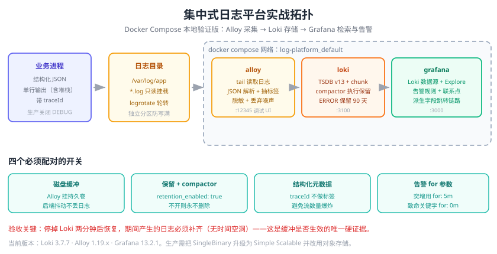

# 实战：搭建集中式日志平台

本页把前面的知识串成一条可执行的流水线：从**本地 Docker Compose 起步**，到**生产化增强**，最终交付一套「采集 → 存储 → 检索 → 告警」闭环可用的日志平台。

技术栈选择 **Grafana Alloy + Loki + Grafana**（成本低、与指标同屏、配置量小）。文末给出切换到 Elastic Stack 的对照说明。



## 目标与验收标准

| 维度 | 目标 |
| --- | --- |
| 采集 | 采集本机 `/var/log/app/*.log`，支持 JSON 解析、多行合并、噪声丢弃 |
| 存储 | Loki 单机模式，文件系统存储，保留 7 天（ERROR 90 天） |
| 检索 | Grafana Explore 中可用 LogQL 查到日志，可按 `level`/`service` 过滤 |
| 告警 | ERROR 突增（`for: 5m`）与致命关键字（`for: 0m`）两条规则，通知到飞书/邮件 |
| 联动 | 日志中的 `traceId` 可一键跳转链路追踪 |
| 验证 | 停掉 Loki 2 分钟后恢复，日志补齐、无时间空洞 |

::: info 本实战使用的版本（2026-09）
- Grafana Loki **3.7.7**
- Grafana Alloy **1.19.x**（`grafana/alloy:latest`）
- Grafana **13.2.1**
- Docker Engine 24+ / Docker Compose v2
:::

## 一、架构设计

```text
宿主机业务进程
   │ 写日志
   ▼
/var/log/app/*.log
   │
   │ tail（Alloy：解析 JSON、抽标签、脱敏、丢弃噪声）
   ▼
Grafana Alloy ──► Loki(loki:3100) ──► /loki（chunks + TSDB 索引）
                        │
                        ▼
                Grafana(grafana:3000) ──► Explore 检索
                                       └─► Alerting 告警 ──► 飞书/邮件
```

## 二、准备工作目录

```shell
mkdir -p ~/log-platform/{logs,loki-data,grafana-data,alloy-data}
cd ~/log-platform
```

目录结构：

```text
log-platform/
├── docker-compose.yml
├── loki-config.yaml
├── config.alloy
├── logs/                      # 被采集的日志目录（模拟业务日志）
├── loki-data/                 # Loki 数据（chunks + 索引）
├── grafana-data/              # Grafana 数据（看板、告警规则）
└── alloy-data/                # Alloy 运行数据（文件位置记录）
```

## 三、编写配置

### 1）Loki 配置

```yaml [loki-config.yaml]
auth_enabled: false

server:
  http_listen_port: 3100
  grpc_listen_port: 9096
  log_level: info

common:
  path_prefix: /loki
  storage:
    filesystem:
      chunks_directory: /loki/chunks
      rules_directory: /loki/rules
  replication_factor: 1
  ring:
    kvstore: { store: inmemory }

# 单机模式用 inmemory ring；生产用 memberlist 或 consul
schema_config:
  configs:
    - from: 2026-01-01
      store: tsdb                 # 3.x 默认索引类型，勿再用 boltdb-shipper
      object_store: filesystem
      schema: v13
      index: { prefix: index_, period: 24h }

storage_config:
  tsdb_shipper:
    active_index_directory: /loki/tsdb-index
    cache_location: /loki/tsdb-cache
  filesystem:
    directory: /loki/chunks

limits_config:
  retention_period: 168h            # 默认保留 7 天
  retention_stream:
    - selector: '{level="ERROR"}'
      priority: 10
      period: 2160h                 # ERROR 保留 90 天
  ingestion_rate_mb: 16
  ingestion_burst_size_mb: 32
  max_query_series: 5000
  max_query_parallelism: 32
  reject_old_samples: true
  reject_old_samples_max_age: 168h
  allow_structured_metadata: true   # 让 traceId 走结构化元数据，避免标签高基数

compactor:
  working_directory: /loki/compactor
  retention_enabled: true           # 必须开启，否则 retention_period 不会真正删数据
  retention_delete_delay: 2h
  delete_request_store: filesystem

ruler:
  storage: { type: local, local: { directory: /loki/rules } }
  rule_path: /loki/rules-temp
  alertmanager_url: http://localhost:9093

analytics:
  reporting_enabled: false
```

### 2）Alloy 配置

```hcl [config.alloy]
// ---------- 采集 ----------
local.file_match "app" {
  path_targets = [{
    __path__ = "/var/log/app/*.log",
    job      = "order-service",
    env      = "prod",
  }]
}

loki.source.file "app" {
  targets    = local.file_match.app.targets
  forward_to = [loki.process.pipeline.receiver]
}

// ---------- 处理管道 ----------
loki.process "pipeline" {
  forward_to = [loki.write.default.receiver]

  // 1) 先丢弃噪声，降低体积（越早丢越省）
  stage.drop {
    expression          = "(?i)(healthcheck|/actuator/health|readiness|liveness)"
    drop_counter_reason = "health_check"
  }

  // 2) 解析 JSON 日志
  stage.json {
    expressions = {
      level    = "level",
      service  = "service",
      trace_id = "traceId",
      message  = "message",
    }
  }

  // 3) 抽取低基数标签（会进索引，务必克制）
  stage.labels {
    values = { level = "", service = "" }
  }

  // 4) traceId 放结构化元数据（不进索引，可用 | trace_id="..." 过滤）
  stage.structured_metadata {
    values = { trace_id = "" }
  }

  // 5) 采集端脱敏
  stage.replace {
    expression = "(?i)(password|passwd|token|secret|idcard)\\s*[=:]\\s*\\S+"
    replace    = "$1=***"
  }

  // 6) 记录丢弃计数，便于监控
  stage.metrics {
    metric_namespace = "logs"
    stage.drop {
      prefix = "loki_process"
    }
  }
}

// ---------- 写入 ----------
loki.write "default" {
  endpoint {
    url = "http://loki:3100/loki/api/v1/push"
  }
  external_labels = { cluster = "local", agent = "alloy" }
}

// Alloy 自身的 HTTP 服务（含 /metrics 与调试 UI）
logging {
  level  = "info"
  format = "logfmt"
}
```

### 3）编排文件

```yaml [docker-compose.yml]
services:
  loki:
    image: grafana/loki:3.7.7
    container_name: loki
    command: -config.file=/etc/loki/local-config.yaml
    ports: ["3100:3100"]
    volumes:
      - ./loki-config.yaml:/etc/loki/local-config.yaml:ro
      - ./loki-data:/loki
    healthcheck:
      test: ["CMD-SHELL", "wget -qO- http://localhost:3100/ready || exit 1"]
      interval: 10s
      timeout: 3s
      retries: 12

  alloy:
    image: grafana/alloy:latest
    container_name: alloy
    command:
      - run
      - /etc/alloy/config.alloy
      - --server.http.listen-addr=0.0.0.0:12345
      - --storage.path=/var/lib/alloy/data
    ports: ["12345:12345"]
    volumes:
      - ./config.alloy:/etc/alloy/config.alloy:ro
      - ./logs:/var/log/app:ro
      - ./alloy-data:/var/lib/alloy/data
    depends_on:
      loki: { condition: service_healthy }

  grafana:
    image: grafana/grafana:13.2.1
    container_name: grafana
    ports: ["3000:3000"]
    environment:
      GF_SECURITY_ADMIN_USER: admin
      GF_SECURITY_ADMIN_PASSWORD: admin
      GF_USERS_ALLOW_SIGN_UP: "false"
      GF_LOG_LEVEL: warn
    volumes: ["./grafana-data:/var/lib/grafana"]
    depends_on: [loki]
```

## 四、启动与验证

```shell
cd ~/log-platform
docker compose up -d
docker compose ps
```

预期 `loki`、`alloy`、`grafana` 三个容器都是 `Up`（`loki` 为 `Up (healthy)`）。

### 验证 1：Loki 就绪

```shell
curl -s http://localhost:3100/ready
# 预期输出：ready
```

### 验证 2：造一条日志并确认入库

```shell
cat >> ./logs/app.log <<'EOF'
{"time":"2026-09-13T10:00:00+08:00","level":"INFO","service":"order-service","traceId":"abc123","message":"订单创建成功","orderNo":"SO20260913001"}
EOF

sleep 8

curl -sG http://localhost:3100/loki/api/v1/query_range \
  --data-urlencode 'query={job="order-service"}' \
  --data-urlencode 'limit=5'
```

预期：返回 JSON 中 `data.result` 非空，`values` 里能看到 `订单创建成功`。

### 验证 3：解析与标签生效

```shell
# 按 level 标签过滤（说明 stage.labels 生效）
curl -sG http://localhost:3100/loki/api/v1/query_range \
  --data-urlencode 'query={job="order-service", level="INFO"}' \
  --data-urlencode 'limit=5'

# 全部标签（确认标签基数很低：只有 job/level/service/env/cluster/agent）
curl -s http://localhost:3100/loki/api/v1/labels
```

### 验证 4：Grafana 中检索

1. 浏览器打开 http://localhost:3000，用 `admin/admin` 登录（首次会要求改密码）。
2. **Connections → Data sources → Add data source → Loki**，URL 填 `http://loki:3100`，保存并点 **Save & test**，看到 `Data source connected`。
3. **Explore → 选择 Loki → 输入查询**：

```logql
{job="order-service"} |= "订单创建成功"
```

4. 确认看到日志行，右侧字段面板中 `level`、`service` 已被解析成字段。

### 验证 5：多行堆栈合并且不散乱

```shell
cat >> ./logs/app.log <<'EOF'
{"time":"2026-09-13T10:01:00+08:00","level":"ERROR","service":"order-service","traceId":"def456","message":"扣减库存失败","cause":"java.lang.IllegalStateException: stock not enough\n\tat com.demo.OrderService.deduct(OrderService.java:88)\n\tat com.demo.OrderController.create(OrderController.java:41)"}
EOF
```

因为堆栈被写进了 JSON 的**单个字段**（`\n` 转义），采集后仍是**一条**日志——这就是「让应用输出单行 JSON」的价值。在 Grafana 中查询 `{job="order-service", level="ERROR"}` 验证。

### 验证 6：缓冲生效（抗后端抖动）

```shell
# 1) 停掉 Loki
docker compose stop loki

# 2) 持续写入日志
for i in $(seq 1 20); do
  echo "{\"time\":\"2026-09-13T10:0$((i%10)):00+08:00\",\"level\":\"ERROR\",\"service\":\"order-service\",\"message\":\"缓冲测试 $i\"}" >> ./logs/app.log
done

# 3) 等 2 分钟后恢复
sleep 120
docker compose start loki
sleep 30

# 4) 确认日志补齐
curl -sG http://localhost:3100/loki/api/v1/query_range \
  --data-urlencode 'query={job="order-service"} |= "缓冲测试"' \
  --data-urlencode 'limit=50' | grep -c '缓冲测试'
```

预期：能查到全部 20 条（或绝大多数），说明 Alloy 的本地缓冲（`--storage.path`）在 Loki 不可用期间保住了数据。

## 五、配置告警

### 1）添加联系点（以飞书 Webhook 为例）

Grafana → **Alerting → Contact points → Add contact point**：

```text
Name: feishu-oncall
Integration: Webhook
URL: https://open.feishu.cn/open-apis/bot/v2/hook/xxxxxxxx
```

### 2）创建告警规则

**规则 A：致命关键字（命中即告警）**

```logql
sum(count_over_time({job="order-service"} |~ "java\\.lang\\.OutOfMemoryError|No space left on device" [5m])) > 0
```

| 参数 | 值 |
| --- | --- |
| Evaluate every | `1m` |
| Pending period (`for`) | `0m` |
| Labels | `severity=P0`, `team=order` |
| Summary | `订单服务命中致命日志，请立即处理` |

**规则 B：ERROR 数量突增**

```logql
sum(count_over_time({job="order-service"} | json | level="ERROR" [5m])) > 50
```

| 参数 | 值 |
| --- | --- |
| Evaluate every | `1m` |
| Pending period (`for`) | `5m` |
| Labels | `severity=P1`, `team=order` |

### 3）配置通知策略

Grafana → **Alerting → Notification policies**：

```text
默认：receiver = feishu-oncall
group_by: [alertname, service, severity]
group_wait: 30s
group_interval: 5m
repeat_interval: 4h

子策略 severity=P0 → receiver = feishu-oncall，repeat_interval 30m
```

### 4）验证告警

```shell
# 制造 60 条 ERROR，触发规则 B
for i in $(seq 1 60); do
  echo "{\"time\":\"2026-09-13T11:00:00+08:00\",\"level\":\"ERROR\",\"service\":\"order-service\",\"message\":\"压测错误 $i\"}" >> ./logs/app.log
done
```

等待 `1m` 评估 + `5m` 持续 → 应在飞书收到告警，且内容包含服务名、数量与时间。

## 六、日志与链路联动

给 Loki 数据源加上派生字段，日志里的 `traceId` 就能直接点击跳转：

```yaml
# Grafana Loki 数据源 → JSON 模式，追加 jsonData.derivedFields
jsonData:
  derivedFields:
    - name: traceId
      matcherRegex: '"traceId":"(\w+)"'
      url: '$${__value.raw}'
      datasourceUid: tempo      # 换成你实际的 Tempo / SkyWalking 数据源 UID
```

验证：在 Explore 中展开一条带 `traceId` 的日志，右侧应出现可点击的 `traceId` 链接。

## 七、生产化增强

本地 Compose 只适合验证。上生产需要补齐以下六项：

| 项 | 做法 |
| --- | --- |
| **存储** | Loki 改用对象存储（S3 / MinIO / OSS），本地只留 WAL 与缓存 |
| **部署模式** | 从 SingleBinary 升级为 **Simple Scalable**（read/write/backend 分离） |
| **高可用** | 各组件多副本；ingester 至少 3 副本并配置 replication_factor ≥ 2 |
| **采集** | K8s 用 Alloy/Alloy 的 DaemonSet（Helm Chart：`grafana/alloy`），配置进 Git |
| **缓冲** | 前置 Kafka 或启用 Alloy 磁盘缓冲上限，抗后端升级抖动 |
| **自身监控** | 采集 Alloy 与 Loki 的 `/metrics`，对写入失败率、丢弃数、查询延迟做告警 |

K8s 部署骨架：

```shell
# Loki：Helm Chart 自 2026-03-16 起由 grafana-community 维护
helm repo add grafana-community https://grafana-community.github.io/helm-charts
helm repo update

helm upgrade --install loki grafana-community/loki -n logging --create-namespace \
  --set deploymentMode=SimpleScalable \
  --set loki.auth_enabled=false \
  --set loki.commonConfig.replication_factor=2 \
  --set loki.storage.type=s3 \
  --set loki.storage.bucketNames.chunks=loki-chunks \
  --set loki.storage.s3.endpoint=s3.ap-east-1.amazonaws.com
```

### 必配的自身监控指标

| 指标 | 含义 | 告警建议 |
| --- | --- | --- |
| `loki_distributor_ingester_append_failures_total` | 写入失败 | 5 分钟内有增长即告警 |
| `loki_ingester_memory_streams` | 活跃流数量 | 持续快速增长 → 检查高基数标签 |
| `loki_request_duration_seconds` | 请求延迟 P99 | P99 > 5s 告警 |
| `loki_compactor_runs_failed_total` | compactor 失败 | 有增长即关注 |
| `loki_process_dropped_lines_total`（Alloy 侧） | 采集端丢弃行数 | 突增说明过滤规则过宽或因背压丢数据 |
| `loki_write_dropped_entries_total`（Alloy 侧） | 写入丢弃条目 | **必须为 0**，非 0 即告警 |

## 八、排障手册

| 现象 | 排查顺序 | 命令 |
| --- | --- | --- |
| Grafana 里查不到日志 | ① 日志文件有没有写入 ② Alloy 是否采集 ③ Loki 是否收到 | `tail -f logs/app.log` → Alloy UI `http://localhost:12345` → `curl localhost:3100/metrics \| grep loki_distributor_bytes_received_total` |
| 只有部分日志 | 时间范围、标签过滤、丢弃规则 | 去掉 `|=` 过滤条件重查；检查 Alloy `stage.drop` 表达式 |
| 写入 429 | 触发了限流 | `curl localhost:3100/metrics \| grep loki_discarded_samples_total`，调大 `ingestion_rate_mb` |
| 查询超时 | 时间范围太大 / 无标签过滤 | 缩短范围，加 `{job="..."}` 精确标签 |
| 索引/流数量暴涨 | 高基数标签 | `curl localhost:3100/metrics \| grep loki_ingester_memory_streams`，检查是否误把 traceId 当标签 |
| 磁盘不断增长 | 保留策略未生效 | 确认 `compactor.retention_enabled: true` 且 compactor 在运行 |
| Alloy 报配置错误 | 配置语法 | `docker compose logs alloy --tail=100`；本地校验：`docker run --rm -v $PWD/config.alloy:/c.alloy grafana/alloy:latest fmt /c.alloy` |

## 九、切换到 Elastic Stack 的对照

如果最终选了 ELK，把本实战的存储与可视化层替换即可，采集与规范部分完全复用：

| 环节 | Loki 方案 | ELK 方案 |
| --- | --- | --- |
| 采集 | Grafana Alloy | Filebeat / Elastic Agent |
| 存储 | Loki + 对象存储 | Elasticsearch（Data Stream + ILM） |
| 可视化 | Grafana | Kibana |
| 查询 | LogQL | KQL / ES\|QL |
| 告警 | Grafana Alerting | Kibana Alerting |
| 保留 | `retention_stream` | ILM 策略 |
| 参考页 | [Grafana Loki](../Loki/index.md) | [Elastic Stack（ELK）](../ElasticStack/index.md) |

## 验收清单

全部通过即视为本实战完成：

- [ ] `docker compose ps` 三个容器均为 Up，Loki 为 healthy
- [ ] `curl http://localhost:3100/ready` 返回 `ready`
- [ ] Grafana 中 Loki 数据源 `Save & test` 通过
- [ ] Explore 中能按 `{job="order-service", level="ERROR"}` 检索到日志
- [ ] 带堆栈的异常日志在后端中是**一条**记录
- [ ] 停 Loki 2 分钟后恢复，日志**无空洞**
- [ ] 两条告警规则状态为 Normal，人为触发后能收到通知
- [ ] 日志中的 traceId 可点击跳转链路视图
- [ ] Loki `/metrics` 中 `loki_ingester_memory_streams` 不随时间线性增长
- [ ] 保留策略生效（超期数据查询为空）

## 相关专题

- [日志体系概述](../Overview/index.md)：选型与整体框架
- [日志采集与传输](../Collection/index.md)：Alloy / Fluent Bit / Vector 详细配置
- [Grafana Loki](../Loki/index.md)：架构、标签设计与生产部署
- [Elastic Stack（ELK）](../ElasticStack/index.md)：作为替代后端
- [日志查询与分析](../QueryAnalysis/index.md)：LogQL 与分析方法论
- [日志告警与联动](../Alerting/index.md)：告警规则与降噪
- [存储、保留与成本优化](../Retention/index.md)：容量规划与保留策略
- [Docker Compose 进阶](../../Docker/ComposeAdvanced/index.md)：Compose 生产化要点
- [监控体系与可观测性](../../Monitoring/Overview/index.md)：指标侧的配套建设
- [监控告警实战](../../Monitoring/Practice/index.md)：把指标与日志告警统一治理

## 参考资料

- Loki 官方文档：https://grafana.com/docs/loki/latest/
- Loki 单机模式配置示例：https://grafana.com/docs/loki/latest/configure/examples/
- Grafana Alloy 文档：https://grafana.com/docs/alloy/latest/
- Grafana Provisioning（告警即代码）：https://grafana.com/docs/grafana/latest/alerting/set-up/provision-alerting-resources/
- Grafana Loki 数据源派生字段：https://grafana.com/docs/grafana/latest/datasources/loki/
- Loki Helm Chart：https://github.com/grafana-community/helm-charts
