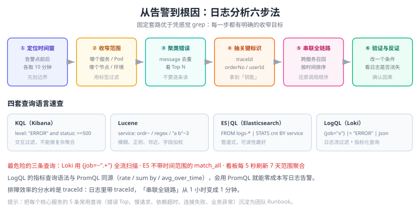

# 日志查询与分析

日志存进来只是第一步，**查得到、查得快、查得准**才是价值所在。日志平台的查询语言各有侧重：Kibana 用 KQL/Lucene，Elasticsearch 9.x 引入管道式的 ES|QL，Loki 用 LogQL。本页把四套查询语言讲清楚，并给出一套**从现象到根因**的日志分析方法论。



## 查询语言总览

| 语言 | 所属 | 风格 | 强项 | 弱项 |
| --- | --- | --- | --- | --- |
| **KQL** | Kibana | 类 Lucene，友好 | 交互式过滤、速度快 | 不能做复杂聚合 |
| **Lucene** | Elasticsearch | 查询串 | 通配符、模糊、正则、字段加权 | 语法冗长易错 |
| **ES\|QL** | Elasticsearch 9.x | 管道式（类 SQL） | 聚合、探索式分析、可读性好 | 不覆盖全部检索能力 |
| **LogQL** | Loki | 标签选择 + 管道 | 日志流过滤与指标化 | 依赖标签，无索引加速 |
| **SQL** | ClickHouse / ClickHouse 系 | SQL | 任意聚合、关联分析 | 需自己处理日志解析 |

::: tip 选哪套
**结论先行：**
- Loki 环境 → 只用 **LogQL**。
- Elasticsearch 环境 → **筛选看用 KQL，分析看用 ES|QL**，KQL 表达不了的复杂匹配再退回 Lucene。
- ClickHouse 环境 → SQL，把 `message` 用 `JSONExtractString` 之类函数解析。
:::

## Kibana：KQL 与 Lucene

### KQL（推荐日常使用）

```text
# 1. 字段等值
level: "ERROR"
service: "order-service"

# 2. 布尔组合（AND 可省略，OR/NOT 必须大写）
level: "ERROR" and service: "order-service" and not env: "dev"

# 3. 通配符（* 匹配任意字符，? 匹配单字符）
message: "stock*"
url: "/api/order/*"

# 4. 数值/时间范围
status: >=500
durationMs: >1000
@timestamp >= "2026-09-13T10:00:00.000+08:00"

# 5. 字段存在性
traceId: *

# 6. 嵌套字段与短语（用引号）
http.request.headers.user_agent: "curl*"
message: "connection refused"
```

### Lucene（KQL 表达不了时使用）

```text
# 模糊匹配（编辑距离 1）
service: ordr-service~

# 正则（性能差，慎用）
message: /time(o|e)ut/

# 邻近搜索（"out of memory" 两词相距不超过 3）
message: "out memory"~3

# 字段加权
message: timeout^3 OR exception

# 范围
status: [500 TO 599]
```

| 需求 | KQL | Lucene |
| --- | --- | --- |
| 模糊搜索 | 不支持 | `term~1` |
| 正则 | 不支持 | `/regex/` |
| 邻近搜索 | 不支持 | `"a b"~3` |
| 字段加权 | 不支持 | `field:value^3` |
| 输入体验 | 自动补全友好 | 需手写 |

::: warning KQL 与 Lucene 不能混用
Kibana 的搜索框只能选一种语言（可在 UI 切换）。把 Lucene 语法粘进 KQL 模式会解析失败并返回 0 条结果——**这常常被误认为是“日志没进来”**。
:::

## Elasticsearch：ES|QL

ES|QL 是管道式查询语言，用 `|` 串联处理步骤，可读性远好于 DSL：

```sql
-- 1. 基础过滤 + 字段裁剪
FROM logs-*
| WHERE @timestamp > NOW() - 1 hour AND log.level == "ERROR"
| KEEP @timestamp, service, message, trace_id
| SORT @timestamp DESC
| LIMIT 20

-- 2. 按服务统计错误数并排序
FROM logs-*
| WHERE @timestamp > NOW() - 24 hours AND log.level == "ERROR"
| STATS errors = COUNT(*) BY service = log.service
| SORT errors DESC

-- 3. 从非结构化消息里抽取字段（DISSECT 比 GROK 快）
FROM logs-nginx-*
| DISSECT message "%{client_ip} - - [%{ts}] \"%{method} %{path} HTTP/%{ver}\" %{status} %{bytes}"
| WHERE status == "500"
| STATS cnt = COUNT(*) BY path
| SORT cnt DESC
| LIMIT 10

-- 4. 时间桶统计（观察错误是否突增）
FROM logs-*
| WHERE log.level == "ERROR"
| STATS errors = COUNT(*) BY bucket = BUCKET(@timestamp, 5 minutes)
| SORT bucket ASC
```

| 命令 | 作用 | 类比 SQL |
| --- | --- | --- |
| `FROM` | 指定数据源（支持通配） | `FROM` |
| `WHERE` | 过滤 | `WHERE` |
| `STATS ... BY` | 聚合 | `GROUP BY` + 聚合函数 |
| `SORT` | 排序 | `ORDER BY` |
| `LIMIT` | 限制行数 | `LIMIT` |
| `KEEP` / `DROP` | 保留/丢弃列 | `SELECT` / 反选 |
| `EVAL` | 新增计算列 | 计算字段 |
| `DISSECT` / `GROK` | 解析文本 | 无 |
| `ENRICH` | 关联富化表 | `JOIN`（受限） |
| `BUCKET` | 时间分桶 | `date_trunc` |

## Loki：LogQL

LogQL 分两类查询：**日志查询**（返回日志行）和**指标查询**（返回数值序列）。

### 日志查询：三步走

```logql
# 第 1 步：流选择器（Stream Selector）——必须存在，决定扫描范围
{job="order-service", env="prod"}

# 正则匹配标签值（不要用 .+ 全匹配，等于全表扫描）
{job=~"order-service|stock-service"}

# 第 2 步：行过滤器（Line Filter）——在正文上做快速匹配
{job="order-service"} |= "库存不足"          # 包含
{job="order-service"} != "DEBUG"             # 不包含
{job="order-service"} |~ "timeout|refused"   # 正则匹配
{job="order-service"} !~ "健康检查"           # 正则排除

# 第 3 步：解析器 + 标签过滤器（Parser + Label Filter）
{job="order-service"} | json | level="ERROR" | line_format "{{.message}} {{.orderNo}}"
{job="order-service"} | logfmt | duration > 1000ms
{job="order-service"} | pattern `<_> level=<level> msg=<msg>`
```

### 解析器与管道

| 管道 | 作用 | 示例 |
| --- | --- | --- |
| `\| json` | 解析 JSON 日志 | `\| json level="lvl"` 可重命名字段 |
| `\| logfmt` | 解析 `k=v` 格式 | `\| logfmt` |
| `\| regexp` | 正则抽取命名组 | `\| regexp "(?P<ip>\\S+) (?P<status>\\d+)"` |
| `\| pattern` | 位置化模板抽取（性能好） | `` \| pattern `<ip> - <status> <_>` `` |
| `\| line_format` | 重排/裁剪输出行（用模板占位符重排输出列） | 见下方示例 |
| `\| label_format` | 生成新标签 | `\| label_format svc=order` |
| `\| unwrap` | 把字段转成数值用于指标查询 | `\| json \| unwrap durationMs` |
| `\| drop` / `\| keep` | 丢弃/保留指定标签 | `\| drop level, host` |
| `\| ip("10.0.0.0/8")` | IP 段匹配 | `{job="nginx"} \| ip("10.0.0.0/8")` |

`line_format` 与 `label_format` 使用 Go 模板语法，用双花括号占位符引用解析出来的字段：

```logql
# 只保留 level 与 message 两列，输出更干净
{job="order-service"} | json | line_format "{{.level}} {{.message}}"

# 把 JSON 字段提升为标签
{job="order-service"} | json | label_format svc={{.service}}
```

### 指标查询：把日志变成指标

这是 Loki 最实用的能力——**不需要改代码，就能从日志得到监控指标**：

```logql
# 错误日志速率（每秒条数）
sum(rate({job="order-service"} |= "ERROR" [5m]))

# 按服务拆分错误数（5 分钟内的总条数）
sum by (service) (count_over_time({env="prod"} | json | level="ERROR" [5m]))

# 平均响应耗时（需要对数字段 unwrap）
avg_over_time({job="gateway"} | json | unwrap latencyMs [5m])

# P99 响应耗时
quantile_over_time(0.99, {job="gateway"} | json | unwrap latencyMs [5m])

# 日志字节速率（估算写入量，用于容量规划）
sum(bytes_rate({env="prod"}[5m]))
```

| 函数 | 返回 | 说明 |
| --- | --- | --- |
| `rate(log-range)` | 每秒日志条数 | 等价于 `count_over_time / 秒数` |
| `count_over_time(log-range)` | 区间条数 | 最常用的计数 |
| `bytes_rate` / `bytes_over_time` | 字节速率/字节数 | 容量与成本分析 |
| `avg_over_time` | 数值平均值 | 需先 `unwrap` |
| `quantile_over_time` | 分位数 | 需先 `unwrap`，P95/P99 常用 |
| `stddev_over_time` | 标准差 | 观察抖动 |
| `sum by (...) (...)` | 按标签聚合 | 与 PromQL 一致 |

::: tip LogQL → Prometheus 的无痛过渡
LogQL 的指标查询语法与 PromQL **高度一致**（`rate`、`sum by`、`avg_over_time` 都是同名同义），只是数据源从“时间序列”换成了“日志流”。会用 PromQL 就能立刻用 LogQL 做告警。
:::

## 分析方法论：从现象到根因

固定套路，避免“凭感觉 grep”：

```text
① 定位时间窗口    → 告警时间点前后各 10 分钟
② 收窄服务/实例    → 哪个服务、哪个 Pod、哪个节点
③ 聚类错误类型    → message 去重看 Top N（不要逐条读）
④ 抽取关键标识    → traceId / orderNo / userId
⑤ 串联全链路      → 用标识把所有相关服务的日志拉到一起
⑥ 验证与反证      → 改一个条件，看日志是否消失（确认因果而非相关）
```

### 关键查询模板

```text
# 模板 1：错误类型 Top N（Loki 用 LogQL + Grafana 表格）
topk(10, sum by (message) (count_over_time({job="order-service"} | json | level="ERROR" [10m])))

# 模板 2：追踪一次请求的全部日志（Loki）
{env="prod"} |= "traceId=4bf92f3577b34da6"

# 模板 3：某接口 5xx 的时间分布（ES|QL）
FROM logs-nginx-*
| DISSECT message "%{ip} - - [%{ts}] \"%{method} %{path} HTTP/%{ver}\" %{status}"
| WHERE status >= "500"
| STATS cnt = COUNT(*) BY bucket = BUCKET(@timestamp, 1 minute), path
| SORT bucket ASC

# 模板 4：错误率突变对比（Loki）
sum(rate({job="order-service"} | json | level="ERROR" [5m]))
  / sum(rate({job="order-service"} [5m]))
```

## 实战：一次“下单偶发失败”的排查

**现象**：监控告警 —— `order-service` 的 5xx 比例在 10:03 从 0.2% 突增到 6%。

**第 1 步：确认时间窗口与范围**

```logql
sum by (pod) (rate({job="order-service"} | json | level="ERROR" [1m]))
```

结果：`order-service-7d9f-abc12` 这个 Pod 贡献了 95% 的错误，**问题不是全局的，而是单实例**。

**第 2 步：看错误类型分布**

```logql
topk(5, sum by (message) (count_over_time({pod="order-service-7d9f-abc12"} | json | level="ERROR" [10m])))
```

结果：`扣减库存失败：connection reset by peer`。

**第 3 步：抽一条完整日志拿 traceId**

```logql
{pod="order-service-7d9f-abc12"} |= "扣减库存失败" | json | line_format "{{.traceId}} {{.message}}"
```

拿到 `traceId = 4bf92f3577b34da6`。

**第 4 步：全链路串联**

```logql
{env="prod"} |= "4bf92f3577b34da6"
```

日志按时间排序后显示：`order-service` 调 `stock-service` 时，目标 IP 是 `10.0.3.77`；而 `stock-service` 只有 2 个实例在运行，`10.0.3.77` 不在其中——**这是一个已经下线的旧实例，还留在服务注册表里**。

**第 5 步：反证**

```logql
sum(rate({job="order-service"} |= "10.0.3.77" [5m]))
```

把前端的注册表缓存清掉后，这条曲线归零，5xx 比例也随之回落到 0.2%。**因果确认。**

::: tip 这次排查为什么快
关键在**第 3 步的 traceId**。如果日志里没有 traceId，第 4 步就只能靠“时间相近 + 订单号”去猜，排查时间会从 5 分钟变成 1 小时。这也解释了为什么日志规范里把 traceId 列为“强烈建议”。
:::

## 查询性能优化

| 查询变慢的原因 | 优化手段 |
| --- | --- |
| 流选择器用了 `{job=~".+"}` | 改成精确标签，缩小扫描集 |
| 时间范围过大（如 30 天） | 先看最近 1 小时，需要历史再缩小字段范围 |
| 大量正则匹配 | 用 `pattern` 或 `dissect` 替代正则；先做行过滤再做解析 |
| Kibana 里没有时间过滤 | 一定带上 `@timestamp` 范围 |
| ES 查询命中大量分片 | 用 Data Stream + 时间范围剪枝，避免跨月查询 |
| 高并发看板拖慢集群 | 结果缓存、降低刷新频率、把重查询改为定时物化 |

::: danger 三条会打挂集群的查询
1. **Loki：`{job=~".+"} |= "error"`** —— 全流扫描，扫描量等于整个保留期的数据量。
2. **Elasticsearch：不带时间范围的 `match_all` + 大 `size`** —— 分片全量读取并排序，堆内存瞬间打满。
3. **Kibana 看板：每 5 秒刷新一个 7 天范围的聚合** —— 多个用户同时打开时，查询队列被打满，正常查询全部超时。
:::

## 易错点与最佳实践

::: danger 常见错误
1. **KQL/Lucene 语法混用**：解析失败返回 0 条，误判为“日志丢失”。
2. **逐条读日志**：几十万条错误里肉眼找规律，正确做法是先聚类看 Top N。
3. **只搜关键字不限定服务**：同名错误在多个服务里都有，定位到错误的对象。
4. **把正则当万能**：grok/regexp 在大数据量下是性能杀手。
5. **查询结果直接截图当证据**：不记录查询语句与时间范围，无法复现。
6. **忽略时区**：日志时间戳带时区、查询用 UTC，导致“日志不在这个时间段”的误判。
:::

::: tip 最佳实践
1. **把常用查询保存下来**：Grafana 的 Explore 查询可存为 Dashboard 面板；Kibana 的搜索可保存为 Saved Search。
2. **建立“故障排查手册”**：每个核心服务预置 5 条查询（错误 Top、慢请求、依赖超时、连接失败、业务异常），故障时直接套用。
3. **日志聚类优先**：先用 `topk`/`STATS BY message` 聚类，再下钻。
4. **永远优先用标签/字段过滤**，把全文匹配放到最后一步。
5. **记录查询与结论**：把查询语句、时间窗口、结论写进故障复盘，形成团队资产。
6. **给查询也做监控**：慢查询日志（Loki 的 `loki_request_duration_seconds`、ES 的 slowlog）要定期巡检。
:::

## 验证方式

1. **KQL**：在 Kibana Discover 输入 `level: "ERROR"`，确认返回条数 > 0 且全部为 ERROR。
2. **ES|QL**：在 Kibana 的 ES|QL 编辑器执行 `FROM logs-* | LIMIT 5`，确认能返回 5 行。
3. **LogQL 日志查询**：`curl -sG http://localhost:3100/loki/api/v1/query_range --data-urlencode 'query={job="order-service"} |= "ERROR"' --data-urlencode 'limit=5'` 返回非空 `data.result`。
4. **LogQL 指标查询**：
   ```shell
   curl -sG http://localhost:3100/loki/api/v1/query \
     --data-urlencode 'query=sum(rate({job="order-service"} |= "ERROR" [5m]))'
   ```
   返回一个数值型 `result`，说明日志已能被当作指标使用。
5. **traceId 串联**：用一条日志的 traceId 在全部服务范围内查询，确认能召回 ≥ 2 个服务的日志（说明链路标识已贯通）。

## 相关专题

- [日志体系概述](../Overview/index.md)：日志规范与字段设计
- [Grafana Loki](../Loki/index.md)：LogQL 所在平台的架构与配置
- [Elastic Stack（ELK）](../ElasticStack/index.md)：KQL / ES|QL 所在平台的架构与配置
- [Elasticsearch 专题](../../../DB/NoRelational/Elasticsearch/index.md)：查询 DSL 与聚合的完整基础
- [SQL 优化](../../../DB/Relational/SQLOptimization/index.md)：执行计划与慢查询分析方法
- [网络排查方法论](../../Network/Troubleshoot/index.md)：日志之外的链路层排障手段

## 参考资料

- KQL 语法参考：https://www.elastic.co/guide/en/kibana/current/kuery-query.html
- Lucene 查询语法：https://lucene.apache.org/core/9_0_0/queryparser/org/apache/lucene/queryparser/classic/package-summary.html
- ES|QL 参考：https://www.elastic.co/guide/en/elasticsearch/reference/current/esql.html
- LogQL 官方文档：https://grafana.com/docs/loki/latest/query/
- LogQL 指标查询：https://grafana.com/docs/loki/latest/query/metric_queries/
- Grafana Explore 文档：https://grafana.com/docs/grafana/latest/explore/
